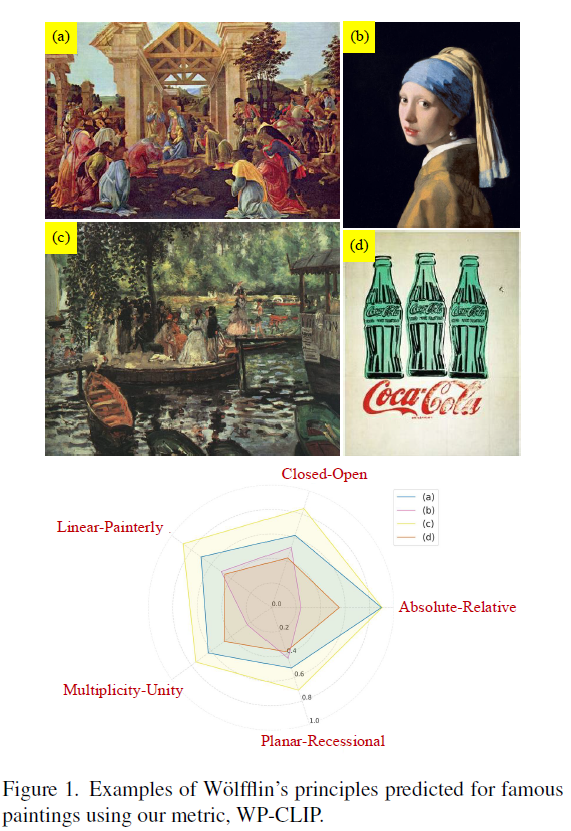
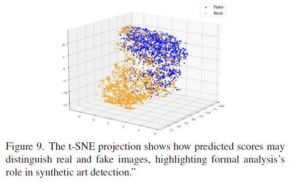

# WP-CLIP: Leveraging CLIP to Predict Wölfflin’s Principles in Visual Art

**著者**: Abhijay Ghildyal, Li-Yun Wang, Feng Liu  
**所属**: Portland State University  
**出版**: ICCV Workshop 2025  

---

## 1. 論文の目的または目標は何ですか？

 
  

本論文の目的は，**美術史・形式分析で重要な Wölfflin（ヴェルフリン）の5原理を，絵画画像から自動的に予測するモデルを構築すること**である．

Wölfflinの5原理とは，絵画の様式や構成を記述する以下の5つの対概念である．

* **Linear vs. Painterly（線的 vs. 絵画的）**
* **Closed vs. Open（閉鎖的 vs. 開放的）**
* **Planar vs. Recessional（平面的 vs. 奥行的）**
* **Multiplicity vs. Unity（多様性 vs. 統一性）**
* **Absolute vs. Relative Clarity（絶対的明瞭性 vs. 相対的明瞭性）**

これらはルネサンスからバロックへの様式変化を分析する古典的枠組みとして知られるが，現在でも**構図，輪郭，色彩の混ざり方，奥行き，統一感**といった絵画の形式的特徴を読み解く上で有効な理論である．著者らは，このような本来人文学・美術史の概念であったものを，**視覚言語モデル（VLM）を用いて定量化し，計算的に扱えるようにする**ことを狙っている．

本研究の問題意識は明確で，従来は

* 筆致
* 色彩特徴
* 感情
* スタイル分類

のような比較的局所的・個別的な特徴に基づく美術分析は行われてきた一方で，**Wölfflinの5原理のような高次で抽象的な形式概念を，1つの統一的な指標として予測する手法が存在しなかった**点にある．特に著者らは，既存研究では各原理ごとに別々のモデルを学習することが多かったのに対し，**1つのCLIPベースモデルで5原理すべてを同時に扱う**ことに新規性を置いている．

要するにこの論文の目標は，単なる「絵画分類モデル」を作ることではなく，**美術史の形式分析概念をVLMに学習させ，芸術理解のための計算的指標を作ること**にある．

---

## 2. トピックを探求するために使用された方法またはアプローチは何ですか？

### 全体方針

著者らは，CLIPが元々持っている画像・言語対応能力を利用しつつ，Wölfflinの原理を予測できるように**CLIP-ViT-B/32をファインチューニング**した．提案手法の名称は **WP-CLIP** である．

研究は大きく次の流れで進められている．

1. まず，**素のCLIPやCLIP-IQAがWölfflinの原理を理解しているか**を検証
2. そのままでは十分でないことを確認
3. 注釈付き芸術画像データセットでCLIPをファインチューニング
4. 生成画像・芸術運動データ・写真スタイル・合成画像判別・画像生成にまで応用して性能を確認

### Wölfflinの原理の扱い方

本研究の重要な工夫は，各原理を

* Linear / Painterly
* Closed / Open
* Planar / Recessional
* Multiplicity / Unity
* Absolute / Relative

のような**反意語ペア（antonym pairs）**として扱った点にある．著者らはCLIP-IQAの発想を参考に，画像特徴と各語のテキスト特徴との類似度を用いてスコアを計算している．

具体的には，画像埋め込み (f_I) と，各語のテキスト埋め込み (f_{wpt1}, f_{wpt2}) の内積を取り，2語の相対的な類似度からその原理のスコアを算出する．式としては，各対概念に対して

* 画像と語1の類似度
* 画像と語2の類似度

を求め，その比率から ([0,1]) のスコアを出す設計になっている．スコアが1に近いほどペアの後者側，たとえば Linear–Painterly なら **Painterly寄り** を意味する．

### 学習データ

学習には，Jha ら [22] による**実在の絵画1000枚に対するWölfflin原理注釈データ**が用いられている．これらの作品は1400年代から2000年代までの各時代から幅広く選ばれており，年代的にも様式的にも多様である．

またテストには，同じ研究で用意された**生成芸術画像800枚**が使われている．内訳は

* 400枚が StyleGAN2
* 400枚が StyleCAN

による生成画像である．つまり著者らは，**実在絵画で学習し，生成絵画で評価する**という設定を取っており，分布の異なるデータに対する一般化性能も検証している．

### 損失関数

各原理について，モデルの予測スコアと人手注釈された正解スコアとの間の**平均二乗誤差（MSE）**を損失とし，それを5原理分足し合わせて全体損失としている．つまり回帰問題として学習している．

### 評価方法

著者らはWP-CLIPを単なる回帰精度だけでなく，多面的に評価している．主な評価は次の通り．

* **MSE** による各原理スコアの回帰精度評価
* **Spearman順位相関** によるランキング妥当性の評価
* **Gemini-2.5-pro との比較**
* **Pandora-18K** を使った芸術運動分析
* **t-SNE** による，合成芸術と実在芸術の分離可能性の可視化
* **AVA写真データセット**での写真スタイル分析
* **Disco Diffusion** へのガイダンスとして用いた生成実験

このように，1つのベンチマークだけでなく，**分析・識別・生成**の三方向に応用しているのが本論文の特徴である．

---

## 3. 主要な結果または発見は何でしたか？

### ① 素のCLIPやCLIP-IQAはWölfflinの原理をほとんど捉えていない

最初の重要な発見は，**そのままのCLIPではWölfflinの原理は理解できない**という点である．著者らはCLIPおよびCLIP-IQAのゼロショット的な適用を試したが，各原理に対する順位相関はゼロ近傍，あるいは負になることもあり，十分な対応関係は見られなかった．

表2によると，たとえば Spearman順位相関は以下の通りである．

* Absolute-Relative: CLIP -0.06, CLIP-IQA -0.02
* Closed-Open: CLIP -0.04, CLIP-IQA -0.04
* Linear-Painterly: CLIP 0.05, CLIP-IQA -0.10
* Multiplicity-Unity: CLIP 0.06, CLIP-IQA -0.04
* Planar-Recessional: CLIP 0.06, CLIP-IQA 0.06

これは，CLIPが一般画像と自然言語の対応を学んでいても，**美術史の形式概念のような精妙なスタイル差異までは自然には保持していない**ことを意味する．

### ② WP-CLIPは5原理すべてで安定して予測可能になった

ファインチューニング後のWP-CLIPは，5原理すべてで低いMSEを達成した．表1の結果は以下の通りである．

* Absolute-Relative: **0.0269**
* Closed-Open: **0.0178**
* Linear-Painterly: **0.0151**
* Multiplicity-Unity: **0.0248**
* Planar-Recessional: **0.0182**
* 平均: **0.0206**

特に **Linear-Painterly** が最も誤差が低く，モデルが比較的捉えやすい原理であることが示された．一方で **Multiplicity-Unity** や **Absolute-Relative** はやや難しく，より抽象度が高く曖昧な概念であることがうかがえる．

順位相関でもWP-CLIPは全項目で正の値を示し，

* Absolute-Relative: **0.54**
* Closed-Open: **0.39**
* Linear-Painterly: **0.57**
* Multiplicity-Unity: **0.30**
* Planar-Recessional: **0.33**

となった．完全に高い相関とは言えないが，少なくとも**ランダムやゼロショットCLIPとは明確に異なり，形式原理に沿った序列をある程度回復できている**．

### ③ Gemini-2.5-proよりも高い比較性能を示した

著者らは，より強力な proprietary VLM である **Gemini-2.5-pro** とも比較している．ここでは回帰スコア出力ではなく，2枚の絵画のどちらがより特定の原理側にあるかを答えさせる比較課題を用いた．

GAN生成画像ペア100組ずつから成る2つのテストセットで比較した結果，WP-CLIPはGemini-2.5-proを大きく上回った．

* **Set 1**（難しい設定, GT差 > 1）

  * Gemini-2.5-pro: **57%**
  * WP-CLIP: **71%**

* **Set 2**（易しい設定, GT差 > 2）

  * Gemini-2.5-pro: **65%**
  * WP-CLIP: **91%**

この結果は興味深い．一般的なマルチモーダル推論ではGeminiのような大規模VLMが強いが，**Wölfflinのような特定の美術理論に基づく判断では，専用に学習したモデルの方が圧倒的に有利**であることを示している．

また両モデルとも，**Linear vs. Painterly** は予測しやすく，**Multiplicity vs. Unity** は難しかった．これは，前者が筆致・輪郭・輪郭線の明瞭さなど比較的視覚的に直接読める特徴に結びつく一方，後者は作品全体のまとまりや要素の分離度合いなど，より高次の構成理解を必要とするためと考えられる．

### ④ 芸術運動の分析でも妥当な傾向を示した

Pandora-18Kを使った分析では，WP-CLIPの予測が美術史的直観とかなり整合していた．論文では各原理ごとに18の芸術運動を並べている．

たとえば **Linear-Painterly** では，

* Impressionism, Symbolism, Romanticism, Baroque がより **Painterly**
* Cubism, Pop Art がより **Linear**

と分類された．これは，印象派やバロックが光・色・筆致の流動性を強く持つ一方，キュビスムやポップアートが明確な輪郭や分割された形態を持つことと整合的である．

**Closed-Open** では，

* Impressionism や Post-Impressionism の一部作品が **Open**
* Byzantine Iconography や Early Renaissance が **Closed**

とされ，構図がキャンバス外へ広がるか，画面内に自己完結しているかという観点で説得的な結果を示した．

**Planar-Recessional** では，

* Baroque や Fauvism, Post-Impressionism がより **Recessional**
* High Renaissance, Early Renaissance, Byzantine Iconography がより **Planar**

とされ，奥行き表現や遠近法の扱いに対応している．

この部分は定量精度というより，**美術史の様式論として見ても納得感のある配置になっているか**を確認する定性的評価であり，モデルが単なる数値回帰ではなく，ある程度意味のある形式概念空間を学習していることを示している．

### ⑤ 合成芸術検出や写真スタイル識別にも使える

 
  

さらに興味深いのは，WP-CLIPの5スコアを特徴量として使うと，**実在芸術と合成芸術がt-SNE空間上である程度分離される**ことである．見た目が似ていても，形式分析スコアに基づく低次元表現では real / fake がクラスタ分離する様子が示されている．著者らはこれを，**Wölfflin的形式分析が合成芸術検出の手がかりになりうる**可能性として解釈している．

またAVAデータセットを用いた写真スタイル分析では，

* cityscape と landscape
* architecture
* floral / fooddrink / still life
* animal と portrait

などが近接配置され，5原理スコアが**写真においても構図やスタイルの意味的特徴量として働く**ことが示唆された．つまりWP-CLIPは絵画専用の評価器でありながら，写真の形式分析にも一定の一般化を見せている．

### ⑥ 生成モデルのガイダンスにも利用可能

最後に，Disco Diffusion の生成にWP-CLIPを組み込み，**特定のWölfflin原理を強めた画像生成**も試している．CLIPのみを使うと意味内容は維持されるが，WP-CLIPを単独で使うと意味的知識が弱まるため，著者らは **CLIP + WP-CLIP** を併用した．すると

* Closed
* Open
* Planar
* Recessional
* Linear
* Painterly
* Multiplicity
* Unity
* Absolute
* Relative

といった原理を反映したバリエーション生成が可能になった．これはWP-CLIPが単なる分析器ではなく，**生成の制御信号としても利用できる**ことを示している．

---

## 4. 結論は何であり，なぜそれが重要なのですか？

### 結論

本論文の結論は，**CLIPのような大規模事前学習済み視覚言語モデルは，そのままではWölfflinのような美術史の形式概念を十分に扱えないが，注釈付きデータで適切にファインチューニングすることで，これらの抽象的様式原理を定量的に予測できるようになる**ということである．

提案モデルWP-CLIPは，

* 実在絵画で学習し生成絵画にも一般化し
* 高度な proprietary モデルより比較課題で優れ
* 芸術運動の分析に妥当な順序を与え
* 合成芸術検出や写真スタイル理解にも応用でき
* さらには生成の誘導にも利用できる

ことを示した．つまり本研究は，単に「絵画のラベルを当てる」モデルではなく，**芸術の形式的理解そのものを計算機的に扱う基盤**を提示している．

### なぜそれが重要なのか

#### 1. 人文学の理論をAIで扱えるようにしたから

最も重要なのは，**美術史の古典理論を，機械学習モデルの予測対象として明示的に組み込んだ点**である．従来の画像AIは「何が写っているか」の認識には強くても，「どのような形式で描かれているか」「画面がどのように構成されているか」という芸術批評的視点は苦手だった．本研究はそこに踏み込み，**芸術理論とVLMを橋渡しした**．

#### 2. 芸術分析を“分類”から“形式理解”へ進めたから

一般的なアートAI研究では，画家分類・様式分類・年代推定などが多いが，それらはしばしばラベル予測に留まる．本研究は，絵画を

* 輪郭重視か色彩重視か
* 閉じた構図か開いた構図か
* 平面的か奥行的か
* 分離的か統合的か
* 明瞭か相対的か

という**説明可能な形式軸**で読み解こうとする．これにより，AIの出力が単なるカテゴリではなく，**批評的に解釈可能な連続スコア**になる点が大きい．

#### 3. 生成AI時代の芸術理解・評価に役立つから

本論文では，生成絵画に対する一般化や合成画像検出にも触れている．これは重要で，生成AIが大量の画像を生み出す現在，単に「きれいかどうか」ではなく，**どのような形式原理を持つ画像なのか**を分析することがますます重要になるからである．WP-CLIPのような指標は，

* AI生成アートの性質分析
* 本物／生成物の違いの理解
* 形式的制御を伴う画像生成

に使える可能性がある．

#### 4. 専門特化モデルの重要性を示したから

Gemini-2.5-proとの比較結果は，一般に強力なVLMでも，**専門的な理論枠組みが必要な課題では専用モデルに及ばない**ことを示している．これは，美術分野に限らず，教育，医療，法，設計などでも同様で，汎用モデルだけではなく，**理論や注釈に基づく専門チューニングの価値**を強く示唆する．

#### 5. 今後の拡張可能性が高いから

著者ら自身も述べているように，Wölfflinの5原理は普遍的・永遠不変なものではなく，現代の生成芸術や新しいメディアには追加概念が必要かもしれない．それでも本研究のフレームワークは，**他の対概念や批評軸にも拡張できる**．つまりこの研究は完成形ではなく，**芸術の形式分析を計算的に拡張していくための出発点**として重要である．