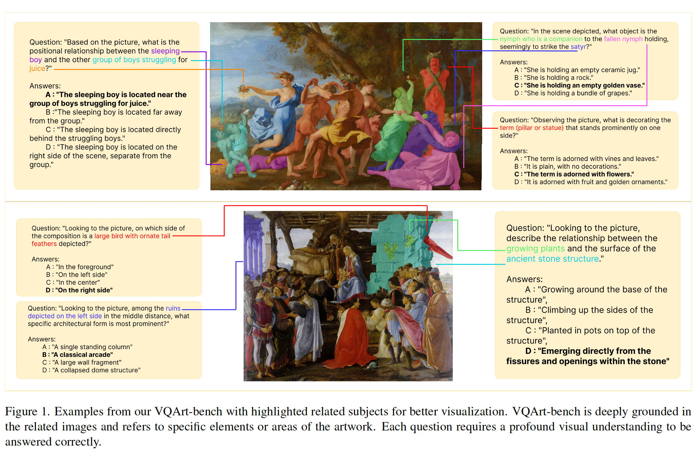
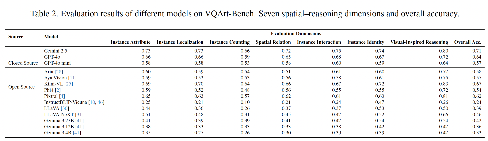

# VQArt-Bench: A semantically rich VQA Benchmark for Art and Cultural Heritage

**著者**: Andrea Alfarano, Lorenzo Venturoli, Darío Negueruela del Castillo  
**所属**: University of Zurich, Max Planck Society  
**出版**: ICCV Workshop 2025

---

## 1. 論文の目的または目標は何ですか？

<p align="center"></p>

Multimodal Large Language Models（MLLMs）の視覚的理解能力を評価するVQA（Visual Question Answering）ベンチマークは多数存在するが、**芸術・文化遺産という専門ドメインにおける深い意味理解を適切に評価できていない**という問題がある。

既存のアートVQAベンチマーク（AQUAやVISCOUNTHなど）は、ルールベースのテンプレート生成に依存しているため、以下の深刻な欠陥を抱えている：

- **言語的多様性の欠如**：固定テンプレートへの依存により、狭い構文パターンに閉じた質問しか生成できない
- **表層的な質問**：文脈・象徴・暗示的関係が無視され、shallow な質問に終始する
- **事実的不正確さの混入**：例として、聖母マリアを「woman（女性）」と表現したり、存在しない「シャツの動物」を幻覚として生成する
- **高頻度パターンへの偏り**：AQUA テストセットでは "Human" と "Person" だけで正解の30%以上を占め、モデルが統計的ショートカットを利用できてしまう

本論文の目的は、こうした限界を克服する**新しい大規模VQAベンチマーク「VQArt-Bench」**を構築し、現在のMLLMが芸術・文化遺産の視覚理解においてどの程度の能力を持つかを包括的に評価することである。

---

## 2. トピックを探求するために使用された方法またはアプローチは何ですか？

### 評価次元の設計

認知科学に基づき、7つの視覚理解次元を設定した：

| 次元 | 内容 |
|------|------|
| Instance Identity | 特定の物体・人物の識別（存在確認・クラス判定） |
| Instance Attribute | 色・形・素材・質感などの視覚的属性 |
| Instance Location | 画像フレーム内の絶対・相対位置 |
| Instance Counting | 特定クラスの出現個数のカウント |
| Spatial Relation | 複数物体間の空間的関係の認識 |
| Instance Interaction | 人物・物体間の行為・関係性の理解 |
| Visual-Inspired Reasoning | 常識・因果推論（意図・原因・将来の結果の推測） |

### データ収集・前処理

- **データソース**：Wikipedia（画像＋人間が執筆した説明文の組み合わせ）
- 約30,000枚の画像と対応する記事をダウンロード
- 400語未満の記事はフィルタリングして除外
- **LLMによる前処理**：作者の伝記・他作品への言及など視覚的に無関係なテキストを除去し、対象作品に関連する視覚的記述のみを抽出  
  ※ 画像はLLMに渡さず（渡すと幻覚リスクが増加するため）、テキストのみを処理

### マルチエージェント質問生成パイプライン

4つの専門エージェントが順次協調して質問を生成する：

```
Topic Selector → Question Generator → Question Refiner → Judge
```

**Step 1: Topic Selector（トピック選択・グラウンディング）**  
クリーン化済みテキストを分析し、候補トピックを提案する。各トピックに対し、根拠となる最小テキストスニペットを元テキストから引用することで、幻覚防止のためのグラウンディングを実施する。

**Step 2: Question Generator（open-ended質問生成）**  
グラウンドされたトピックから、ニュアンスのあるopen-ended質問を作成する。テキストに基づきつつも、**画像を観察することで回答できる**質問のみに限定し、メタデータだけで答えられる質問は排除する。

**Step 3: Question Refiner（多択式への変換・ディストラクター生成）**  
open-ended質問をMCQ（4択）形式に変換する。特定の画像に基づく視覚的誤解釈を想定した**高品質なディストラクター**を生成し、深い視覚分析を要求する問題を作成する。

**Step 4: Judge（品質検証）**  
すべてのMCQを評価する品質ゲートキーパー。各質問が「画像から一義的に回答可能か」「非自明か」「指定の評価次元に沿っているか」「言語的に正確か」を検証し、不合格の質問は除外する。

### 人手による品質検証

- 生成されたQAペアの**25%をランダムサンプリング**して専門家アノテーターが手動レビュー
- **98%以上**の質問が幻覚なしと確認され、パイプラインの信頼性が実証された

---

## 3. 主要な結果または発見は何でしたか？

### ベンチマーク規模と構成

VQArt-Benchは**14,463問**のMCQ（4択）から構成され、7次元にわたって分布している。データセットはWikipediaをソースとし、Religious art・Portraitureが最多ジャンルで、屋内/屋外・人物数・シンボル数など多様な分布を持つ。

**Table 1: 各評価次元の質問数分布**

| 評価次元 | 質問数 |
|---------|--------|
| Instance Identity | 2,031 |
| Instance Attribute | 2,598 |
| Instance Location | 2,100 |
| Instance Counting | 1,710 |
| Spatial Relation | 2,067 |
| Instance Interaction | 1,794 |
| Visual-Inspired Reasoning | 2,163 |
| **合計** | **14,463** |

### 14モデルの評価結果（Table 2）

<p align="center"></p>

**全体的な傾向：**
- ほとんどのモデルがランダム推定（25%）は超えるが、50%に届かないモデルも多い
- 閉鎖ソースモデルがオープンソースモデルを明確に上回る

**主な発見：**

**① MLLMはInstance Countingが最も苦手、Visual-Inspired Reasoningが最も得意**  
人間にとっては「数える」方が「推論する」より遥かに簡単であるにもかかわらず、モデルは逆の傾向を示す。Visual-Inspired Reasoningは個別インスタンスの具体的な知識よりも汎化能力を要求するため、MLLMの強みが活きる。一方、Countingには高品質なディストラクターが多く、モデルを欺きやすい。

**② アートの視覚分析は標準ベンチマークより遥かに難しい**  
InstructBLIP-VicunaはSEED-Benchで59%を達成するが、VQArt-Benchでは**24%（ほぼランダム推定）**に落ち込む。芸術作品は歴史的・宗教的・架空の人物など日常生活を超えた対象を描き、視覚的スタイルも自然画像と根本的に異なるためである。

**③ 閉鎖ソースモデルが圧倒的リード**  
**Gemini 2.5**が全指標で最高性能（Overall 71%）を達成し、次いでGPT-4o（64%）、GPT-4o mini（57%）と続く。

**④ オープンソース最高は Kimi-VL（67%）**  
GPT-4o・GPT-4o miniを上回る。ネイティブ解像度エンコーダ（MoonViT）とvisual reasoningに特化した訓練戦略が寄与していると考察される。MoEアーキテクチャが性能向上に効果的である可能性も示唆される。

**⑤ モデルサイズと性能の正の相関**  
同一モデルシリーズ（Gemma 3）で検証：4B（33%）→ 12B（36%）→ 27B（42%）と段階的に向上。ファインチューニングなしでもスケールが性能改善に寄与することが確認された。

---

## 4. 結論は何であり、なぜそれが重要なのですか？

### 結論

本研究は、ルールベースVQAの根本的限界を実証し、LLMベースのマルチエージェントパイプラインによって**言語的に多様で意味論的に豊かなVQAベンチマーク**を構築できることを示した。VQArt-Benchによる評価では：

- 現在の最先端MLLMでさえアート理解に大きな限界があること（Gemini 2.5でも71%止まり）
- Instance Countingという一見単純なタスクで弱点が露呈すること
- 閉鎖ソースとオープンソースの間に明確な性能差が存在すること

が明らかとなった。

### なぜ重要なのか

**評価ツールとしての重要性**：既存ベンチマークでは高スコアを取るモデルが、アートという専門ドメインに移行すると急激に性能が低下することが示された。VQArt-Benchは、単純な統計的ショートカットでは解けない真の視覚的リテラシーを測る、より厳格な評価基盤を提供する。

**研究の方向性への貢献**：Kimi-VLの好成績は、MoEアーキテクチャとvisual reasoning志向の訓練が有望な研究方向であることを示唆する。また、オープンソースとクローズドソースの性能差は、研究コミュニティが芸術的解釈に特化したモデル開発に注力すべき必要性を浮き彫りにする。

**文化・社会的意義**：美術館・博物館・文化遺産機関におけるAI活用（作品解説・検索・教育支援など）を高度化するためには、アートに特化した深い視覚理解が不可欠であり、本ベンチマークはその発展を促進する基盤となる。
