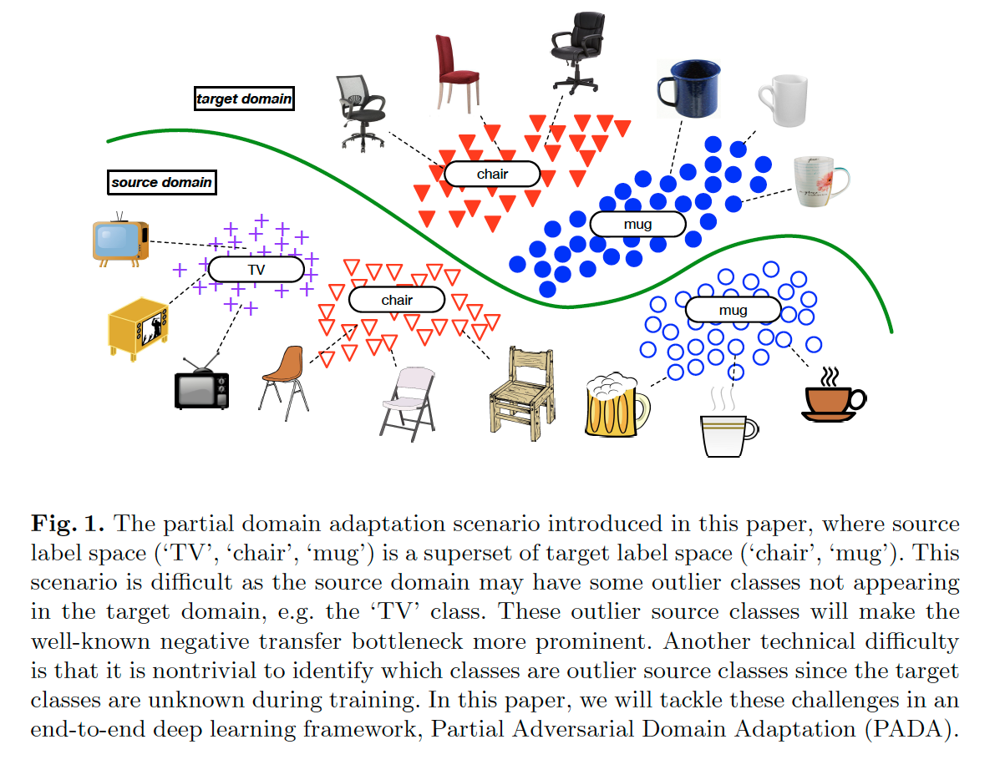
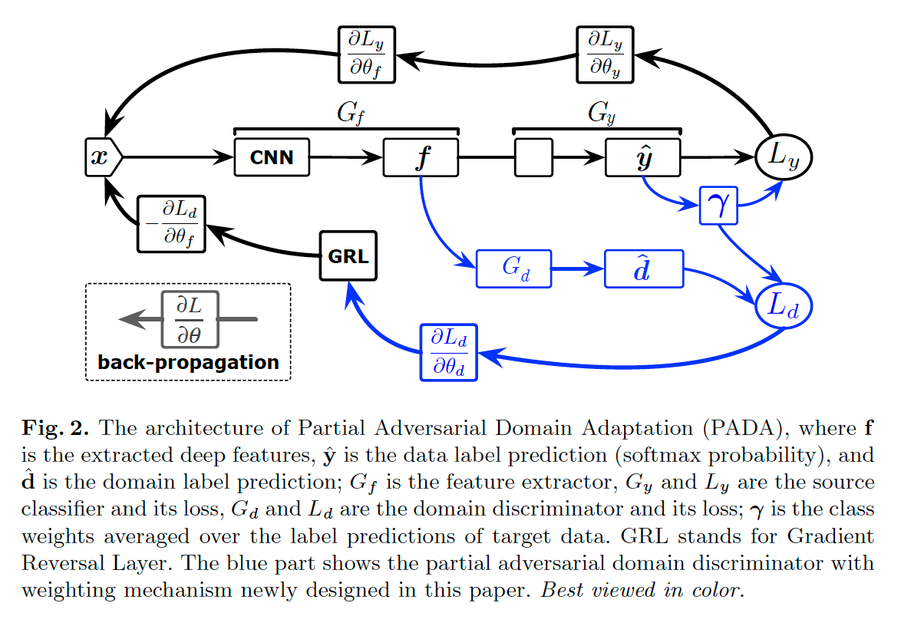
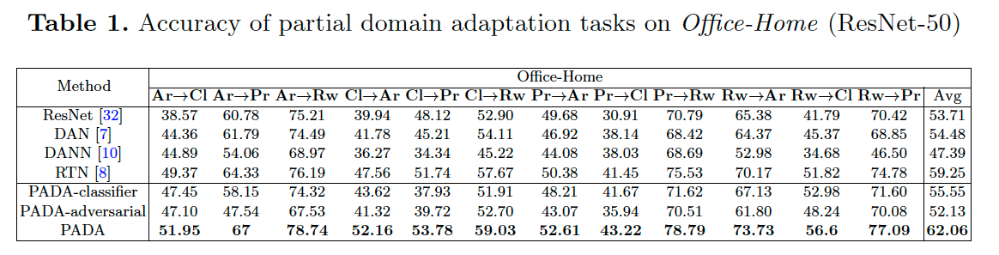
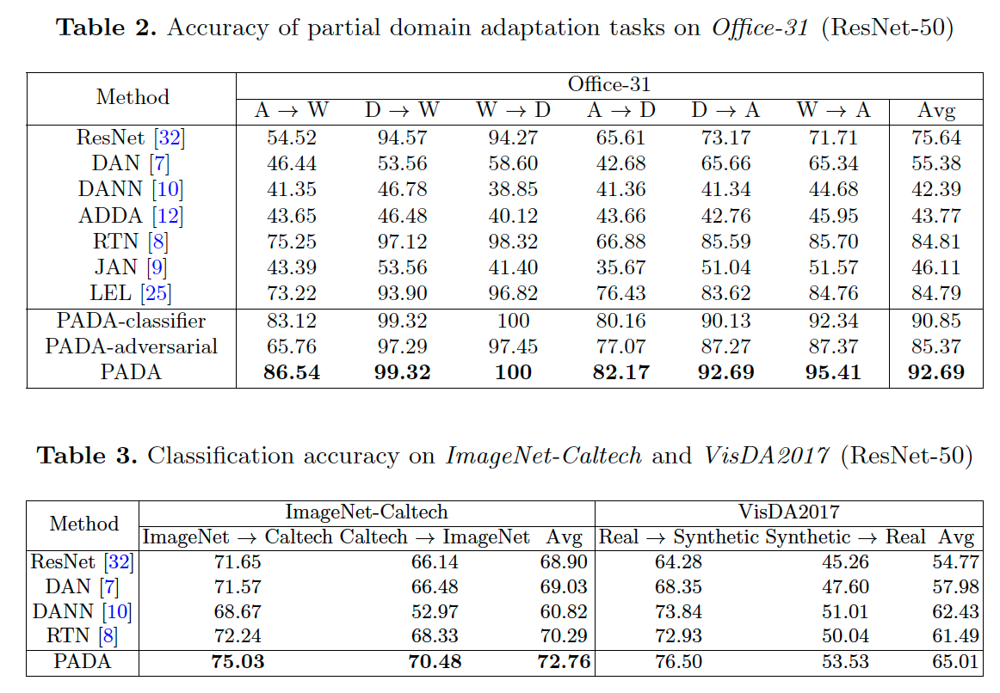
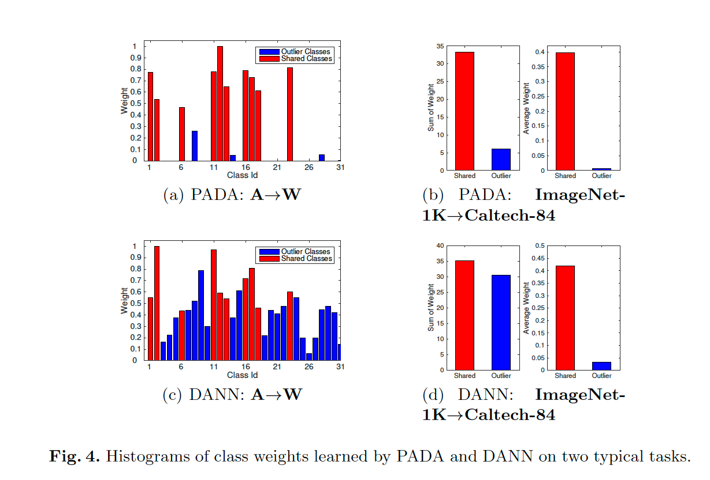
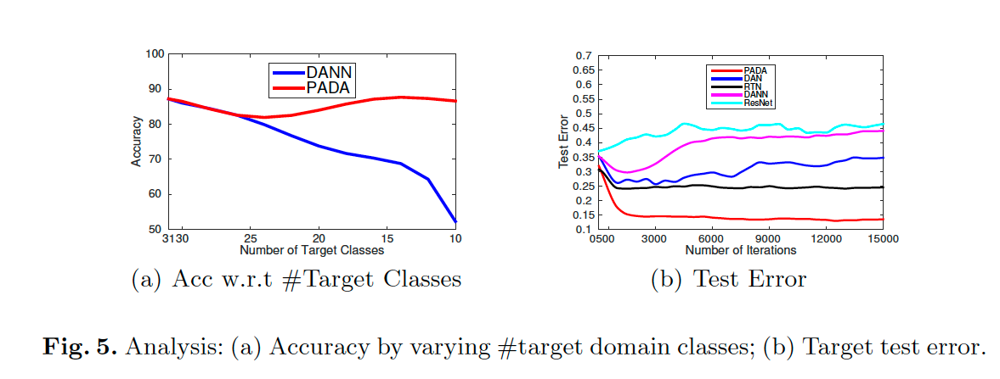
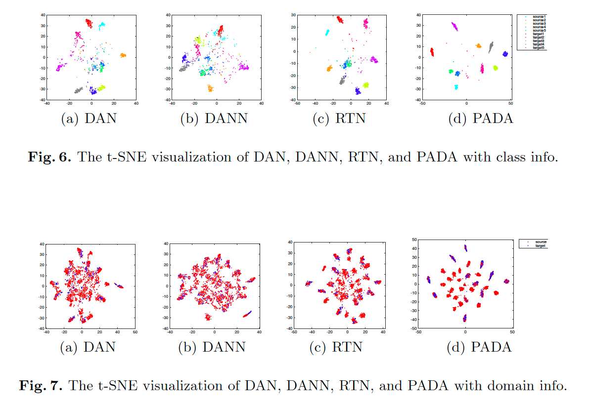

# Partial Adversarial Domain Adaptation

**著者**: Zhangjie Cao, Lijia Ma, Mingsheng Long, Jianmin Wang.  
**所属**: School of Software, Tsinghua University, China / National Engineering Laboratory for Big Data Software / Beijing National Research Center for Information Science and Technology.  
**出版**: ECCV 2018 (arXiv:1808.04205).  

---

## 1. 論文の目的または目標は何ですか？

<em>Fig. 1: 部分ドメイン適応の問題設定．ターゲットラベル空間がソースラベル空間の部分集合．</em>

本論文は，**Partial Domain Adaptation（部分ドメイン適応）** という新しい問題設定を導入し，それを解決する手法を提案することを目的としている．

**従来のドメイン適応の問題点:**
- 既存のドメイン適応手法は，ソースドメインとターゲットドメインの**ラベル空間が完全に一致する**ことを前提としている．
- しかし実応用では，関心のあるターゲットドメインと同一ラベル空間を持つソースドメインを見つけることは困難．
- ImageNetのような大規模データセットを，より小さな関心領域のデータセット（例: Caltech-256）に転移させたいというニーズがある．

**部分ドメイン適応の設定（Fig. 1参照）:**
- ターゲットラベル空間 $C_t$ がソースラベル空間 $C_s$ の**部分集合**であると仮定（$C_t \subset C_s$）．
- 例: ソース = {TV, chair, mug}, ターゲット = {chair, mug}．
- 「TV」のような**outlier source classes**（ターゲットに存在しないソースクラス）が存在することが新たな課題．

**解決すべき2つの技術的課題:**
1. **負の転移の緩和**: outlier source classesに属するソースデータがターゲットの分類性能を悪化させる．
2. **正の転移の促進**: 共有ラベル空間 $C_t$ における特徴分布のマッチングを行う．
3. ターゲットクラスが学習時には未知であるため，どのクラスがoutlierかを自動的に識別する必要がある．

---

## 2. トピックを探求するために使用された方法またはアプローチは何ですか？

### 提案手法: Partial Adversarial Domain Adaptation (PADA)

PADAは，敵対的ドメイン適応（DANN）を拡張し，outlier source classesの影響を自動的に下げる**重み付け機構**を導入した手法である．アーキテクチャはFig. 2に示されている．

<em>Fig. 2: PADAのアーキテクチャ．特徴抽出器 G_f，ソース分類器 G_y，部分敵対的ドメイン識別器 G_d で構成．クラス重み γ をソース分類器とドメイン識別器の両方に適用．</em>

**PADAの主要構成要素:**

1. **特徴抽出器 $G_f$**: ResNet-50ベースのCNNで，転移可能な特徴 $f$ を抽出．
2. **ソース分類器 $G_y$**: ソースドメインのラベル予測 $\hat{y}$ を出力．
3. **部分敵対的ドメイン識別器 $G_d$**: ソース／ターゲットドメインを識別（重み付き）．
4. **クラス重みベクトル $\gamma$**: ターゲットデータに対するソース分類器の予測を平均して算出．

**クラス重みの計算:**

$$\gamma = \frac{1}{n_t} \sum_{i=1}^{n_t} \hat{y}_i$$

- ターゲットデータはoutlierクラスに属さないため，outlierクラスに対する予測確率は小さくなる．
- $\gamma$ を最大値で正規化（$\gamma \leftarrow \gamma / \max(\gamma)$）．

**最適化目的関数:**

$$C(\theta_f, \theta_y, \theta_d) = \frac{1}{n_s}\sum_{x_i \in D_s} \gamma_{y_i} L_y(G_y(G_f(x_i)), y_i) - \frac{\lambda}{n_s}\sum_{x_i \in D_s} \gamma_{y_i} L_d(\cdot) - \frac{\lambda}{n_t}\sum_{x_i \in D_t} L_d(\cdot)$$

クラス重み $\gamma_{y_i}$ を**ソース分類器とドメイン識別器の両方**に適用することで，outlierクラスのソースデータの寄与を下げる．

### 実験設定

- **データセット**: Office-31（31→10クラス），Office-Home（65→25クラス），ImageNet-Caltech（1000⇔84クラス），VisDA2017（12→6クラス）．
- **ベースライン**: ResNet-50, DAN, DANN, RTN, ADDA, JAN, LEL．
- **アブレーション**: PADA-classifier（分類器の重みなし），PADA-adversarial（識別器の重みなし）．
- **実装**: PyTorch，ImageNet事前学習済みResNet-50をfine-tuning．

---

## 3. 主要な結果または発見は何でしたか？

### 定量評価（Table 1, 2, 3参照）

- **Office-Home**: PADAは平均精度 **62.06%** で，最良ベースラインのRTN (59.25%) を上回った（Table 1参照）．
- **Office-31**: PADAは平均 **92.69%** を達成し，RTN (84.81%) より約8ポイント高い結果（Table 2参照）．
- **ImageNet-Caltech**: 平均 **72.76%**，VisDA2017では平均 **65.01%** を達成（Table 3参照）．
- 全てのタスクにおいてPADAが最高性能を示した．

<em>Table 1: Office-Home データセットでの精度比較．</em>

<em>Table 2 & 3: Office-31 / ImageNet-Caltech / VisDA2017 での精度比較．</em>

### 重要な発見

1. **既存手法（DAN, DANN）はResNetより悪化**: 全ソースクラスをターゲットにマッチさせるため，outlierクラスによる負の転移が発生．特にDANNなどの敵対的手法は，より強力にドメインをマッチさせるためMMDベース手法よりも負の転移の影響を受けやすい．

2. **アブレーション結果**:
   - PADA > PADA-classifier: ソース分類器への重み付けが有効．
   - PADA > PADA-adversarial: ドメイン識別器への重み付けが特に重要．

3. **クラス重みの可視化（Fig. 4参照）**:
   - PADAは共有クラスに大きな重み，outlierクラスに**ほぼゼロの重み**を自動的に割り当てる．
   - DANNではoutlierクラスの重みが依然として大きく，負の転移を防げない．

<em>Fig. 4: クラス重みの可視化．PADAは outlier source classes の重みをほぼゼロに抑えるが，DANNはoutlierクラスにも大きな重みを残す．</em>

4. **ターゲットクラス数による精度変化（Fig. 5(a)参照）**:
   - ターゲットクラス数が減るとDANNの精度は急激に低下するが，PADAは安定．
   - ターゲットクラス数が31（標準ドメイン適応）のときPADAはDANNと同等性能 → 重み付け機構はoutlierがない場合に誤動作しない．

5. **収束性能（Fig. 5(b)参照）**: PADAは最も低いテスト誤差に高速かつ安定して収束．

<em>Fig. 5: (a) ターゲットクラス数の変化に対する精度，(b) 学習時の収束曲線．</em>

6. **t-SNE可視化（Fig. 6, 7参照）**: PADAはソース・ターゲット両方のクラスを良く識別し，ターゲットデータが正しいソースクラスに整列．outlierクラスはターゲットに影響しない．

<em>Fig. 6 & 7: t-SNE による特徴埋め込みの可視化．PADAはソース・ターゲット両ドメインで共有クラスを良く整列させる．</em>

---

## 4. 結論は何であり，なぜそれが重要なのですか？

### 結論

本論文は，**Partial Domain Adaptation** という新しい現実的なドメイン適応シナリオを定義し，それを解決する **PADA** を提案した．PADAは:

- ターゲットデータに対するソース分類器の予測平均を用いて**クラス重み**を自動算出．
- この重みをソース分類器とドメイン識別器の両方に適用することで，outlierクラスの寄与を**自動的かつ動的に低減**．
- 共有ラベル空間における特徴分布マッチングにより**正の転移を促進**．
- 複数ベンチマークで既存手法を大幅に上回る性能を達成．

### 重要性・貢献

1. **新しい問題設定の確立**: ImageNetのような大規模ラベル付きデータセットを，任意の小規模ターゲットデータセットに転移するという，より一般的かつ実用的なシナリオを定式化した．これにより，ターゲットドメインに合わせたソースデータセットを毎回探す必要がなくなる．

2. **負の転移問題への取り組み**: ドメイン適応の最大のボトルネックである負の転移を，outlier source classesの自動識別と重み付けという統一された枠組みで解決．

3. **エンドツーエンド学習**: 追加のメタ情報やアノテーションなしに，ネットワーク自身の予測のみから重みを計算できる．シンプルかつ効果的．

4. **実用的応用への道筋**: 大規模事前学習モデル（ImageNet等）の知識を，部分的にしか共有しないタスクへ転移する方法論を提供し，現実世界の転移学習応用の幅を広げた．