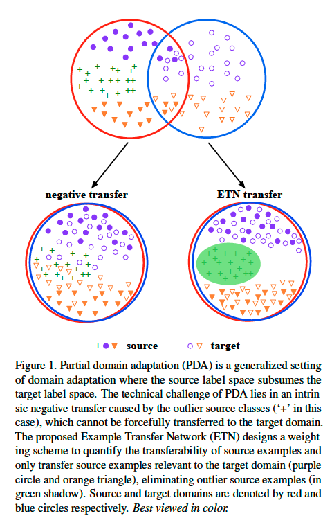
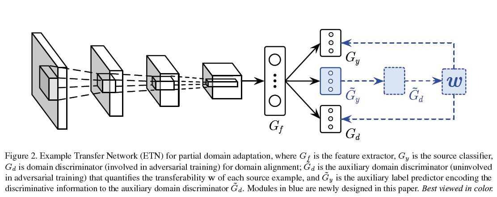
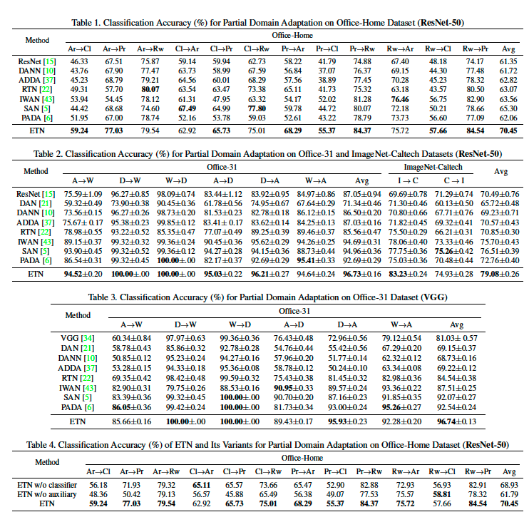
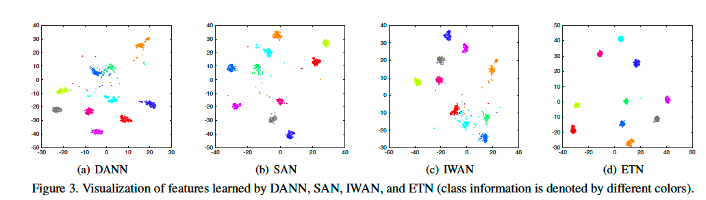
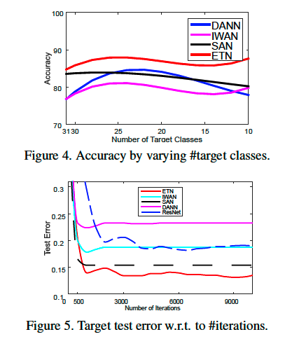
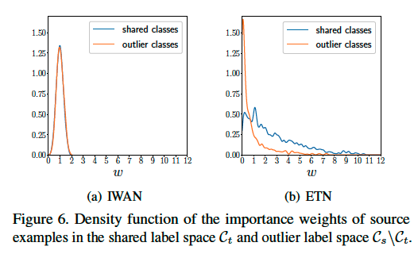

# Learning to Transfer Examples for Partial Domain Adaptation

**著者**: Zhangjie Cao, Kaichao You, Mingsheng Long, Jianmin Wang, Qiang Yang.  
**所属**: Tsinghua University / Hong Kong University of Science and Technology.  
**出版**: CVPR 2019 (arXiv:1903.12230v2)

---

## 1. 論文の目的または目標は何ですか？

本論文は **Partial Domain Adaptation (PDA)** という設定における転移学習を扱う。標準的なドメイン適応がソースとターゲットで同じラベル空間を仮定するのに対し、PDAでは **ソースのラベル空間 $\mathcal{C}_s$ がターゲットのラベル空間 $\mathcal{C}_t$ を包含する**($\mathcal{C}_s \supset \mathcal{C}_t$)状況を扱う。例えばImageNet-1Kのような大規模ラベル付きデータセットから、より少数のクラスしか含まない小規模なターゲットドメインに知識を転移したい、という現実的なシナリオを想定している。

PDAの中心的な技術課題は **negative transfer**(負の転移)である。ターゲットに存在しないソースクラス(outlier classes、$\mathcal{C}_s \setminus \mathcal{C}_t$)を、従来のドメイン適応手法のように強引にターゲットと整合させようとすると、有害な知識転移が発生し性能を悪化させる。一方、ターゲットラベルは訓練時に未知であるため、「どのソースサンプルが共有クラスに属し、どれがアウトライアか」を直接判別できない。

そこで本論文は、**ソースサンプル一つひとつの転移可能性(transferability)を自動的に定量化し、関連サンプルを促進・無関係サンプルを抑制する統一フレームワーク Example Transfer Network (ETN)** を提案することを目的とする。図1にPDAの設定とETNが解決したい問題の直感的イメージが示されている。

<b>図1</b>: Partial Domain Adaptationの設定。ソースのラベル空間がターゲットを包含し($\mathcal{C}_s \supset \mathcal{C}_t$)、アウトライアクラスによるnegative transferが課題となる。

---

## 2. トピックを探求するために使用された方法またはアプローチは何ですか？

### ETNの全体構成

ETNは図2に示される構成を持つ。ベースとなるのは標準的なdomain adversarial network(特徴抽出器 $G_f$、ソース分類器 $G_y$、ドメイン識別器 $G_d$)で、これに **補助ラベル予測器 $\tilde{G}_y$** と **補助ドメイン識別器 $\tilde{G}_d$** を新規に追加している(図2の青いモジュール)。

<b>図2</b>: Example Transfer Network (ETN) のアーキテクチャ。標準的なdomain adversarial network(特徴抽出器 $G_f$、ソース分類器 $G_y$、ドメイン識別器 $G_d$)に、補助ラベル予測器 $\tilde{G}_y$ と補助ドメイン識別器 $\tilde{G}_d$(青いモジュール)を追加する構成。

### Transferability Weighting Framework(3.1節)

各ソースサンプル $x_i^s$ に対し転移可能性を表す重み $w(x_i^s)$ を導入し、これを **ソース分類器の損失と、ドメイン識別器の損失の両方** に乗じる(式2、式3)。先行研究のIWAN[43]はドメイン識別器側にしか重みを掛けていなかったが、ETNはソース分類器にも重みを掛けることでアウトライアの悪影響を分類器自体からも除去する。

加えて、ターゲットラベルが未知という困難に対応するため、半教師あり学習の枠組みでターゲットサンプルの予測エントロピー最小化項(Grandvalet & Bengio, 2005)を式(2)に組み込み、決定境界をターゲットの低密度領域に押しやる。

### Example Transferability Quantification(3.2節)

重み $w(x_i^s)$ をどう計算するかが本論文の核心である。著者は段階的に設計を進めている。

**素朴な発想**: 補助ドメイン識別器 $\tilde{G}_d$ をadversarial trainingに参加させずに別個に訓練し、「このソースはターゲットに近いか」を判定させる(IWANの方式)。しかしこの方式には問題があり、$\tilde{G}_d$ の損失は全ソースサンプルを「source側(出力1)」に押し上げる項しか持たないため、訓練が進むと共有クラスもアウトライアもまとめて出力1に潰れ、両者の差が消えてしまう。$\tilde{G}_d$ の目的関数(source vs targetの分離)と、本当に欲しいもの(共有 vs アウトライアの分離)がずれていることが本質的問題である。

**ETNの解決策**: ラベル情報を $\tilde{G}_d$ に統合する。具体的には、補助ラベル予測器 $\tilde{G}_y$ にleaky-softmax活性化(式5)を適用する:

$$\tilde{\sigma}(z)_c = \frac{\exp(z_c)}{|\mathcal{C}_s| + \sum_{c'=1}^{|\mathcal{C}_s|} \exp(z_{c'})}$$

通常のsoftmaxと違い、分母に定数 $|\mathcal{C}_s|$ が加わるため**出力の要素和は1未満**になる。ロジットがどこかで大きい(=どれかのクラスに自信がある)と要素和は1に近づき、ロジットが全体的に小さい(=どのクラスにも自信がない)と要素和は0に近づく。

そして $\tilde{G}_d$ を **独立に作るのではなく、$\tilde{G}_y$ の出力の総和として構成する**(式6):

$$\tilde{G}_d(G_f(x_i)) = \sum_{c=1}^{|\mathcal{C}_s|} \tilde{G}_y^c(G_f(x_i))$$

これにより $\tilde{G}_d$ は「クラス構造を経由したsource判定」を行うようになり、ラベル情報とドメイン情報が融合される。$\tilde{G}_y$ は式(7)のone-vs-restマルチタスク損失で、$\tilde{G}_d$ は式(8)のドメイン識別損失で訓練される。最終的な重みは式(9):

$$w(x_i^s) = 1 - \tilde{G}_d(G_f(x_i^s))$$

として定義され、ミニバッチ内で平均1に正規化される。

### Minimax Optimization(3.3節)

全体の最適化はミニマックス問題(式10)として定式化され、$G_f, G_y, G_d, \tilde{G}_y$ のパラメータが鞍点解として end-to-end に求められる。

### 評価設定

Office-31、Office-Home、ImageNet-Caltechの3つのベンチマークでPDAタスクを構成し、ResNet-50およびVGGをバックボーンとして比較。ベースラインにはResNet単体、DAN、DANN、ADDA、RTN、SAN、IWAN、PADAを含む。Ablation studyとして、ソース分類器側の重みを外したETN w/o classifier、補助ラベル予測器を外したETN w/o auxiliaryも評価している。

---

## 3. 主要な結果または発見は何でしたか？

**ベンチマーク性能**: ETNは全データセットで一貫してstate-of-the-artを達成した。詳細な数値は表1(Office-Home)、表2(Office-31およびImageNet-Caltech)、表3(VGGバックボーンでのOffice-31)を参照。特にOffice-Homeでは平均精度70.45%(次点SAN 65.30%)、ImageNet-Caltechでは平均79.08%(次点SAN 76.51%)と大きな差をつけている。アウトライアクラスが極端に多いImageNet→Caltech(ソース1000クラス、共有84クラス、アウトライア916クラス)で改善幅が顕著であり、ETNが大規模なアウトライア環境でも頑健に機能することを示す。

<b>表1〜4</b>: 各ベンチマークでの分類精度比較。表1: Office-Home (ResNet-50)、表2: Office-31およびImageNet-Caltech (ResNet-50)、表3: Office-31 (VGG)、表4: Office-Home上でのAblation study。

**Ablation study**(表4): ETN w/o classifierとの比較から、ソース分類器側の重み付けがアウトライアの悪影響を遮断する効果を持つことが確認された。さらにETN w/o auxiliaryとの差はより大きく(70.45 vs 61.79)、補助ラベル予測器によるラベル情報の注入が重み品質に決定的に重要であることが分かる。

**特徴の可視化**(図3): t-SNEによるターゲット特徴の埋め込みを見ると、DANN、IWAN、SANの特徴はクラスごとの集まりが不明瞭なのに対し、ETNの特徴は明確にクラスごとにクラスタ化している。

<b>図3</b>: ターゲット特徴のt-SNE可視化(DANN/IWAN/SAN/ETN)。ETNではクラスごとにクラスタが明確に分離している。

**ターゲットクラス数の感度**(図4): ターゲットクラス数を23から10へ減らしていく実験で、DANNはクラス数減少とともに急速に性能が悪化(negative transferが顕在化)するのに対し、ETNは安定して全手法を上回る精度を維持。さらに全クラスが共有される場合(=標準ドメイン適応)でもDANNを上回っており、重み付け機構が非PDA設定でも害を及ぼさないことが示された。

**収束特性**(図5): ETNは他手法より低いテスト誤差に収束し、訓練の安定性も高い。

<b>図4・図5</b>: (左)ターゲットクラス数を変化させた際の精度推移、(右)訓練に伴うテスト誤差の収束曲線。ETNはクラス数の変動に頑健で、より低い誤差に安定して収束する。

**重み分布**(図6): 共有クラスとアウトライアクラスの重み $w$ の密度関数を可視化したもので、これがETNの中心的主張を最も直接的に裏付ける図である。IWANでは両者の分布が大きく重なるのに対し、ETNではアウトライアクラスのほぼすべてのサンプルが0近傍に集中し、共有クラスは大きな重みを持つよう明確に分離されている。これは3.2節で述べた「$\tilde{G}_y$ 経由でラベル情報を $\tilde{G}_d$ に統合する」設計が、目論見どおり共有/アウトライア間のギャップを保持できていることを示す経験的証拠である。

<b>図6</b>: 共有クラスとアウトライアクラスに対する重み $w$ の密度関数。IWANは両分布が大きく重なるが、ETNはアウトライアが0近傍に、共有クラスが大きな重み側に明確に分離している。

---

## 4. 結論は何であり、なぜそれが重要なのですか？

本論文は、Partial Domain Adaptationにおけるnegative transferを抑制するための弁別的かつ頑健な手法 **Example Transfer Network (ETN)** を提案した。中核的な貢献は二つある。第一に、ソースサンプルの転移可能性を **ソース分類器とドメイン識別器の両方** に作用させることで、アウトライアの悪影響を二重に遮断する点。第二に、補助ラベル予測器 $\tilde{G}_y$ にleaky-softmaxを適用し、補助ドメイン識別器 $\tilde{G}_d$ をその出力の総和として構成することで、純粋なドメイン情報だけに頼る既存手法(IWAN)が抱える「訓練が進むと共有/アウトライアの差が消える」問題を回避し、**discriminativeな重み**を生成できる点。

複数のベンチマークでstate-of-the-artを達成し、特にアウトライアクラスが圧倒的に多い大規模設定での頑健性を実証した。重み分布の可視化(図6)は、この手法が単に精度向上をもたらすだけでなく、設計の意図どおりに共有クラスとアウトライアクラスを分離する内部表現を獲得していることを示している。

学術的には、PDAという設定における「重み設計」の方向性を、単なるドメイン情報ベースから **ラベル情報統合型** へ進めた点に意義がある。実用的には、ImageNetのような大規模データセットを source として、特定用途の小規模ターゲットドメインへ転移する応用(本論文ではタンパク質の機能予測などが例示されている)で、negative transferを心配せずにbig domainの知識を活用できる道を開いた点が重要である。