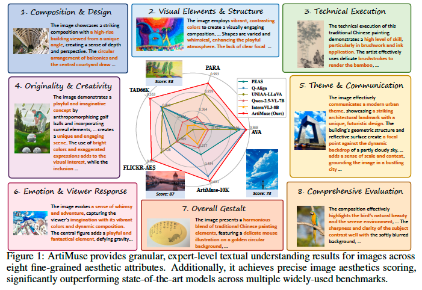
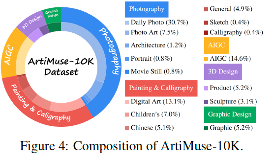
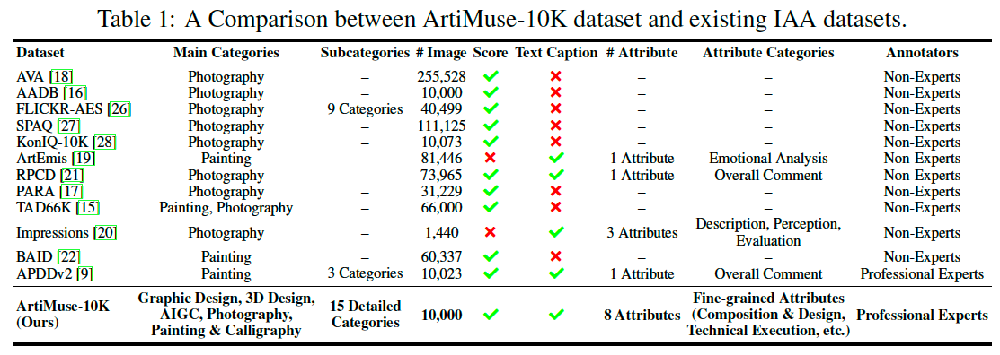
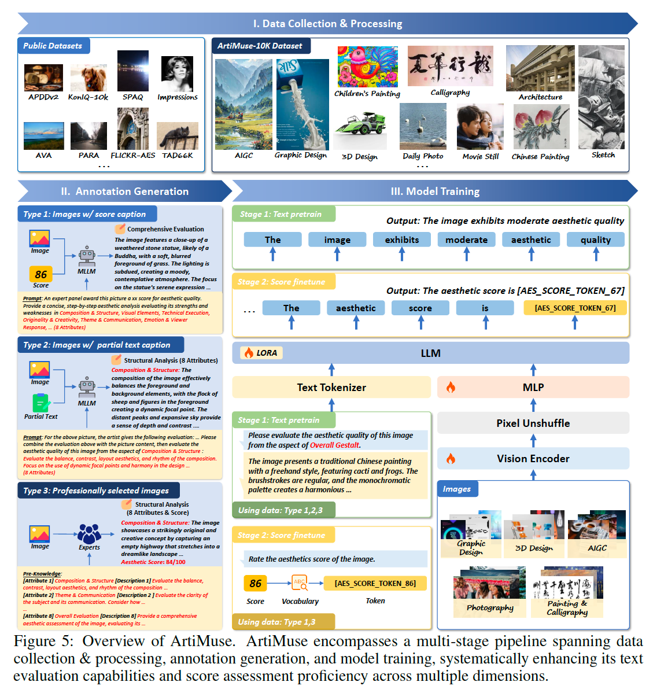
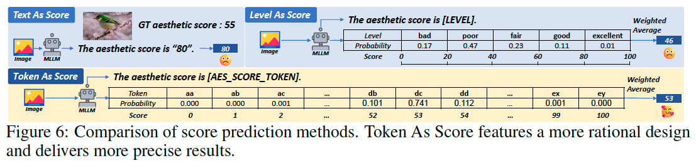
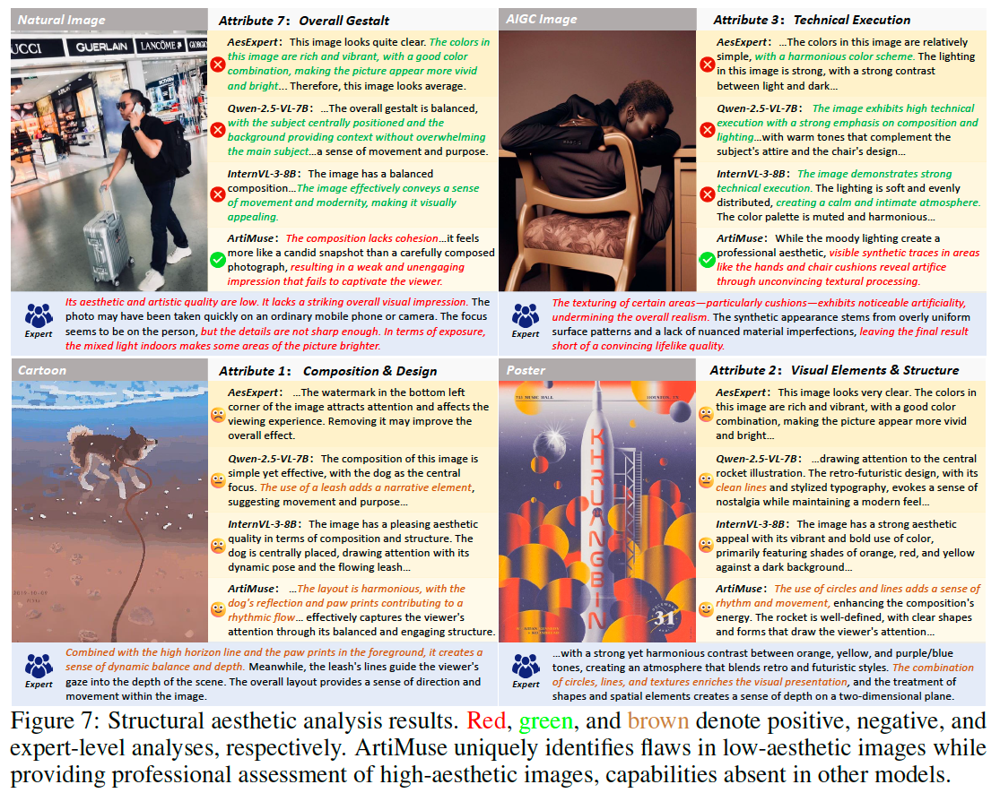
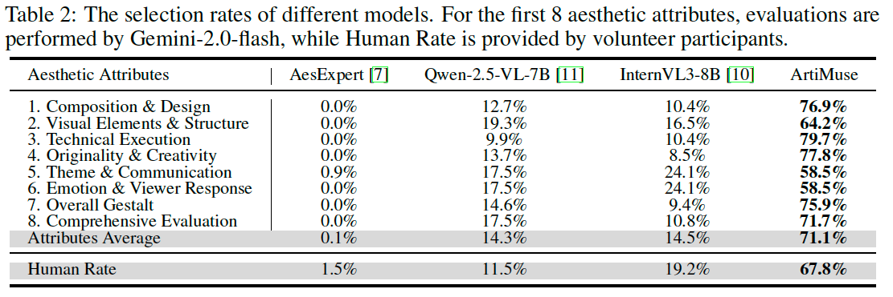
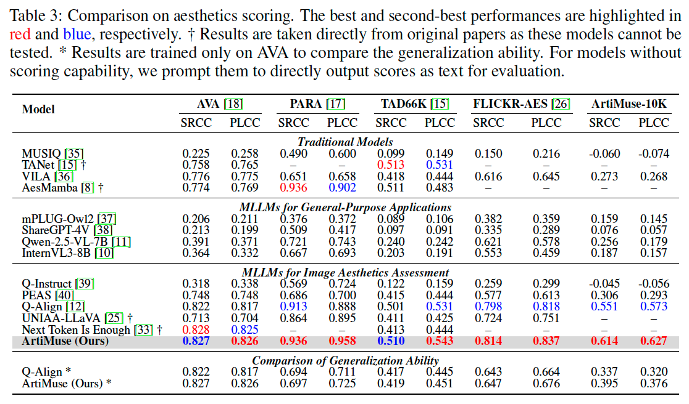
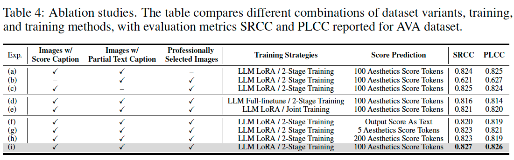
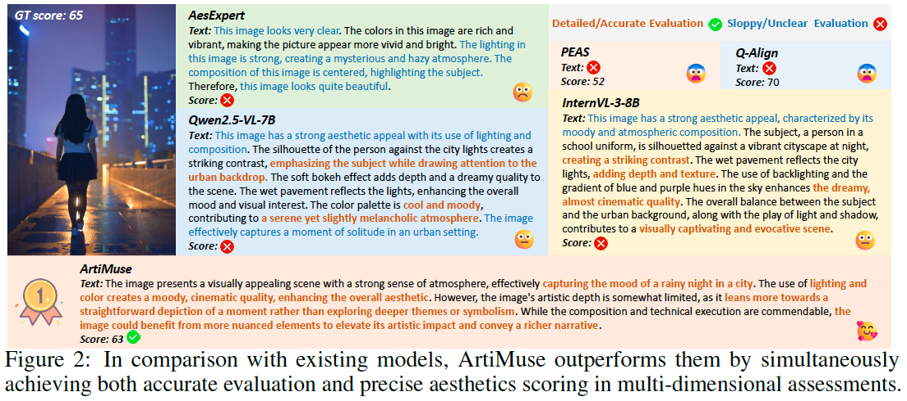

# ArtiMuse: Fine-Grained Image Aesthetics Assessment with Joint Scoring and Expert-Level Understanding

**著者**: Shuo Cao, Nan Ma, Jiayang Li, Xiaohui Li, Lihao Shao, Kaiwen Zhu, Yu Zhou, Yuandong Pu, Jiarui Wu, Jiaquan Wang, Bo Qu, Wenhai Wang, Yu Qiao, Dajuin Yao, Yihao Liu  
**所属**: 上海AI研究所 (Shanghai AI Lab)、中国科学技術大学 (USTC)、中国美術学院 (China Academy of Art)、北京大学、上海交通大学 (SJTU)、中山大学、香港中文大学 (CUHK)、香港理工大学 ほか  
**出版**: arXiv preprint (arXiv:2507.14533v2)、2025年（Preprint, Under review）

---

## 1. 論文の目的または目標は何ですか？

画像審美性評価（Image Aesthetics Assessment, IAA）は、構図・色彩調和・感情表現といった画像の「高次の美的属性」を評価するタスクであり、AIGC コンテンツ評価、創作支援、写真教育などで基盤的な能力として重要性が増している。教育応用・芸術創作・AIGC 技術の急速な発展に伴い、**定量的なスコアリング**と**専門的な理解（テキスト評価）**の両方を同時に提供できる手法への実用的需要が高まっている。

しかし、既存手法には以下の限界がある。

- **モダリティバイアス**: マルチモーダル大規模言語モデル（MLLM）ベースの IAA 手法は、知覚力・汎化能力に優れる一方で、「スコアのみ」または「テキストのみ」に偏っており、両者を統合できていない。
- **細粒度の属性分解の欠如**: ほとんどの手法は単純な全体スコア予測に依存し、美的評価を多次元の属性に分解できないため、さらなる審美的分析を支えられない。
- **データセットの不足**: 既存データセットは規模が小さく、粒度が粗く、確立された美学理論に基づく専門家による注釈を欠いている。

本論文の目標は、これらの課題を解決し、**精密なスコア予測**と**専門家レベルの細粒度テキスト分析**を統合した IAA を実現することである。具体的な貢献は次の3点である。

1. **ArtiMuse**: 統合スコアリングと専門家レベルの理解能力を備えた、革新的な MLLM ベースの IAA モデル。
2. **ArtiMuse-10K**: 専門家がキュレーションした初の画像審美データセット。10,000枚の画像を5主要カテゴリ・15サブカテゴリにわたって収録し、各画像に8次元の属性分析と全体スコアを専門家が注釈付けしている。
3. **Token As Score**: 連続値スコア予測のための軽量かつ効果的な新戦略。

> 上記 **Figure 1** は、8つの細粒度審美属性ごとに専門家レベルのテキスト理解結果を提示し、同時に複数の公開ベンチマークで最先端モデルを大きく上回るスコアリング性能を示す ArtiMuse の概要を表している。

---

## 2. トピックを探求するために使用された方法またはアプローチは何ですか？

### 2.1 ArtiMuse-10K データセット

ArtiMuse-10K は、多様性と粒度の両面で既存 IAA データセットを大きく上回る（**Table 1** を参照：各データセットとの比較）。

- **構成**: 5主要カテゴリ（Photography、Painting & Calligraphy、AIGC、3D Design、Graphic Design）と15サブカテゴリ（中国画、彫刻、日常写真など）から成る計10,000枚（カテゴリ別内訳は **Table 6** を参照）。
- **画像収集**: 非 AIGC 画像は学生課題やコンペ作品など学術的に制作された作品を専門家と協働で収集。AIGC 画像は Stable Diffusion 系列、Dreamlike Photoreal 2.0、FLUX などの最先端生成モデルで作成。
- **8つの審美属性**: ①Composition & Design（構図・デザイン）、②Visual Elements & Structure（視覚要素・構造）、③Technical Execution（技術的完成度）、④Originality & Creativity（独創性・創造性）、⑤Theme & Communication（主題・伝達）、⑥Emotion & Viewer Response（感情・鑑賞者反応）、⑦Overall Gestalt（全体のまとまり）、⑧Comprehensive Evaluation（総合評価）。各属性の詳細定義は **Table 5** を参照。
- **専門家注釈**: 3年以上〜30年超の経験を持つ美学分野の専門家が、各画像を8属性のテキスト分析と全体スコアで注釈。MLLM が陥りがちな「過度に肯定的な評価バイアス」（Figure 7参照）を緩和するため、意図的に低品質サンプルも保持している。

加えて、APDDv2・PARA・Impressions など既存公開データセットから 350,000 枚超の高品質注釈画像をキュレーションし、注釈タイプ別（スコアのみ／部分テキスト／専門家選定）に注釈生成を行った（収集統計は **Table 7** を参照）。

### 2.2 モデル構造と学習戦略

- **ベースモデル**: InternVL-3-8B（Vision Encoder: InternViT-300M、LLM: Qwen2.5-7B）。動的解像度戦略を**固定解像度（448×448）**に変更。これは審美評価が構図・色彩調和・空間関係などの全体的特徴に依存するため、画像をタイル分割すると大域的特徴が断片化し性能が劣化するためである（固定解像度により SRCC・PLCC が約0.3改善し、学習・推論効率も2倍以上に）。
- **2段階学習**:
  - **Stage 1: テキスト事前学習** — 全収集データを用い、各画像と対応する審美分析キャプションのペアで構造的審美分析能力を獲得。LLM には LoRA を適用し、事前学習知識を保持。
  - **Stage 2: スコアファインチューニング** — 全体スコアを専用のスコアトークンに変換し学習。両段階とも Vision Encoder・MLP・LLM を学習（LLM は LoRA）。
- ハイパーパラメータの詳細は **Table 11** を参照（A100 80GB×4 で学習、テキスト事前学習は約5時間）。

### 2.3 Token As Score 戦略

MLLM は本来離散トークン生成向けに設計されているため、連続値スコア予測が技術的課題となる。

- 既存手法 **Text As Score**（スコアを直接テキスト出力）は深刻なハルシネーションを起こす。**Level As Score**（Q-Align のように5段階の離散レベルに変換）は粒度が粗く情報損失が大きい。
- 提案手法 **Token As Score** は、ネイティブ LLM トークナイザ内の既存トークンを使用し、語彙拡張やトークナイザ再学習を不要としたまま、離散トークンを連続値に密にマッピングする。具体的には、序数的な意味を持つ簡潔な101個の既存トークン（例: `aa`, `ab`, ... と二文字組み合わせ）を0〜100のスコアに対応付ける。
- 推論時は予測トークンを数値に戻し、全スコアトークンの確率分布上で期待値を計算して最終スコア $S_{Aes}=\sum_{i=0}^{100} i \times p_i$ を導出する。
- 上記 **Figure 6** は3手法の比較で、Token As Score がより合理的な設計でより精密な結果を出すことを示す（GT 55 に対し Token As Score は 53 と高精度）。

---

## 3. 主要な結果または発見は何でしたか？

### 3.1 構造的審美分析（テキスト評価）

- **MLLM による判定**: 専門家のテキスト評価を参照に、判定 MLLM（Gemini-2.0-flash）が各属性で最良モデルを選択した結果、ArtiMuse は8属性すべてで他モデルを上回り、平均選択率 **71.1%** を達成（**Table 2** を参照）。AesExpert は0.1%、Qwen-2.5-VL-7B は14.3%、InternVL3-8B は14.5%にとどまる。
- **人間による判定**: ユーザースタディでも ArtiMuse の選好率は **67.8%** と圧倒的（Human Rate、Table 2）。

- **定性比較**: ArtiMuse は自然画像・AIGC 画像の双方で一貫した優位性を示し、特に低品質画像の構図の欠陥や AIGC 特有のアーティファクト（不自然なテクスチャ処理など）を独自に指摘できる。上記 **Figure 7** は赤＝肯定的分析、緑＝否定的分析、茶＝専門家分析を示す。

### 3.2 審美スコアリング

ArtiMuse は AVA、PARA、TAD66K、FLICKR-AES、ArtiMuse-10K の複数ベンチマークで最先端性能を達成（詳細は **Table 3** を参照）。

- ほぼ全データセットで最高指標を記録し、特に **PARA** と **ArtiMuse-10K** では他モデルを 0.05 PLCC 以上上回る。
- **汎化能力**: AVA のみで学習し未知データセットで評価した場合も、最強ベースライン Q-Align を一貫して上回る。ArtiMuse のゼロショット転移性能は、専用 IAA モデルを凌駕する場合もある（クロスデータセット詳細は **Table 13** を参照）。
- **大規模 MLLM との比較**: わずか8Bパラメータながら、Qwen-2.5-VL-72B、InternVL3-78B、GPT-4o、Gemini-2.0-flash といった最先端の大規模オープン／クローズドソース MLLM をスコアリングで大幅に上回る（**Table 12** を参照）。

### 3.3 アブレーション研究

- **データセット構成**（Table 4 (a)-(c)）: いずれの構成要素を除いても性能低下。特に「スコアキャプション付き画像」サブセット（AVA 由来データを含む）の除外で最も大きく低下。
- **学習戦略**（Table 4 (d)(e)(i)）: フルファインチューニングは事前学習で獲得した審美的事前知識を失わせ性能を損なう。提案の **LoRA + 2段階学習** が最良。
- **スコア予測**（Table 4 (f)-(i)、および詳細な **Table 10**）: スコアをテキスト出力する(f)は劣る。トークン数は少なすぎると(g)マッピング不正確、多すぎると(h)モデル容量超過で劣化。**既存トークンを使った順序付き100トークン**が最適バランスで最終採用された。新規拡張トークンは事前学習知識・序数関係を欠くため既存トークンに劣る。

---

## 4. 結論は何であり、なぜそれが重要なのですか？

**結論**: 本研究は、画像審美性評価のための大規模な専門家注釈データセット **ArtiMuse-10K** と、専門家レベルのテキスト評価と精密なスコアリングを初めて両立した **ArtiMuse** モデル、そして MLLM における精密な連続値スコア予測を可能にする軽量手法 **Token As Score** を提示した。ArtiMuse は構造的審美分析とスコアリングの双方で最先端性能と優れた汎化能力を実証した。上記 **Figure 2** は、既存モデルが「正確な評価」と「精密なスコアリング」の片方しか達成できないのに対し、ArtiMuse が両者を同時に達成することを示している。

**重要性・貢献**:

- **モダリティバイアスの解消**: 「スコアのみ／テキストのみ」という従来の二分を超え、定量評価と質的説明を統合。AIGC コンテンツ評価・創作支援・写真教育など実応用に直結する、解釈可能で多次元的な審美 AI を実現した。
- **細粒度・専門家品質のデータ基盤**: 8属性に分解された専門家注釈により、単なるスコア予測から「全体的な審美的推論・ユーザーが解釈可能な分析」へと分野を前進させる。モデル・データセットはともに公開予定で、分野全体の発展に寄与する。
- **効率的なスコアリングパラダイム**: Token As Score は語彙拡張・トークナイザ再学習を不要とし、量子化損失を回避する汎用的かつ実装が容易な手法であり、他の MLLM ベースの回帰タスクへの応用可能性を持つ。

**限界（Limitations）**: 現行モデルは「理解・分析」に限定されており、専門的な審美的改善提案（どう改善すべきか）を提供できない点が今後の課題として残されている。