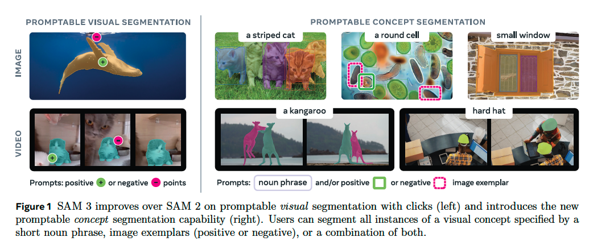
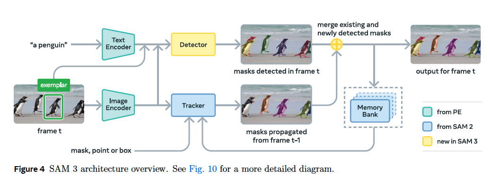
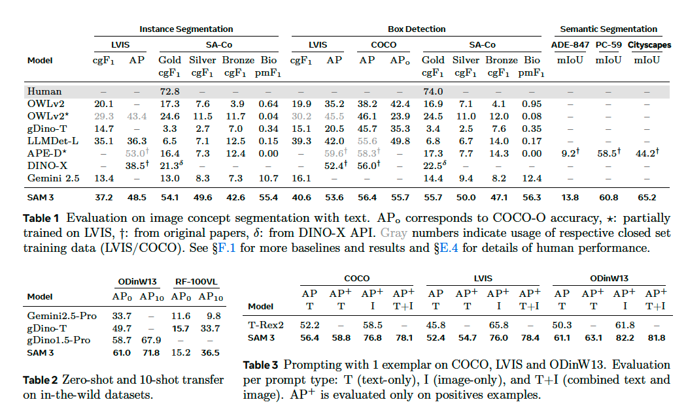
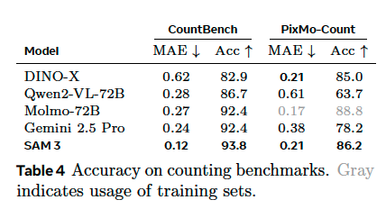
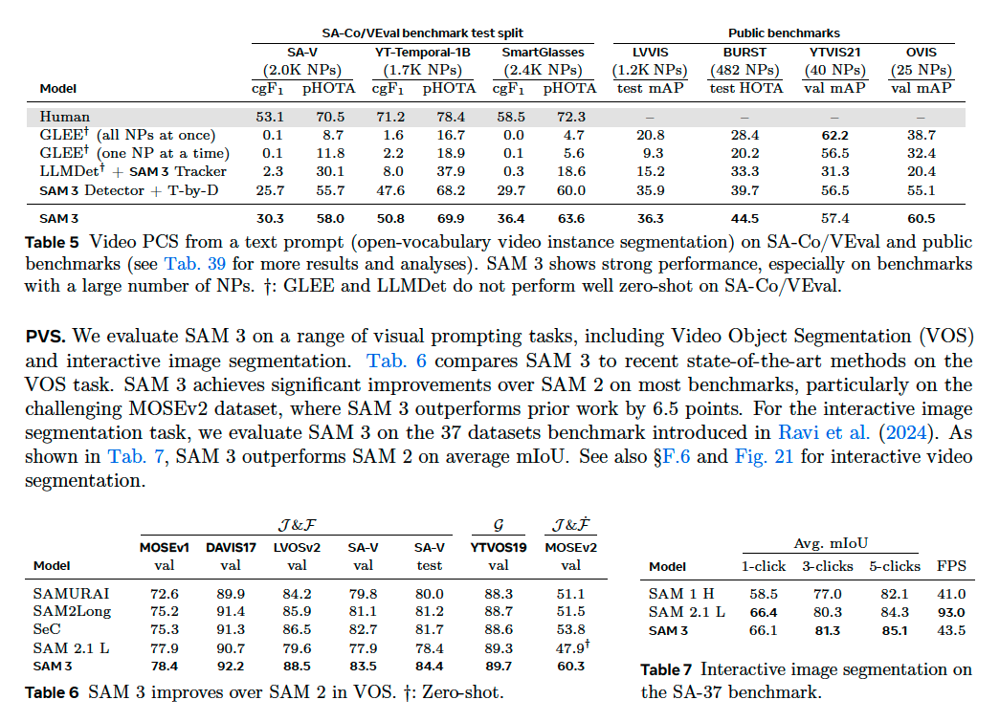
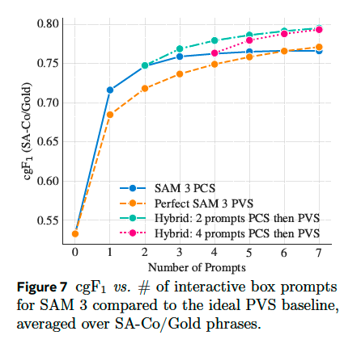
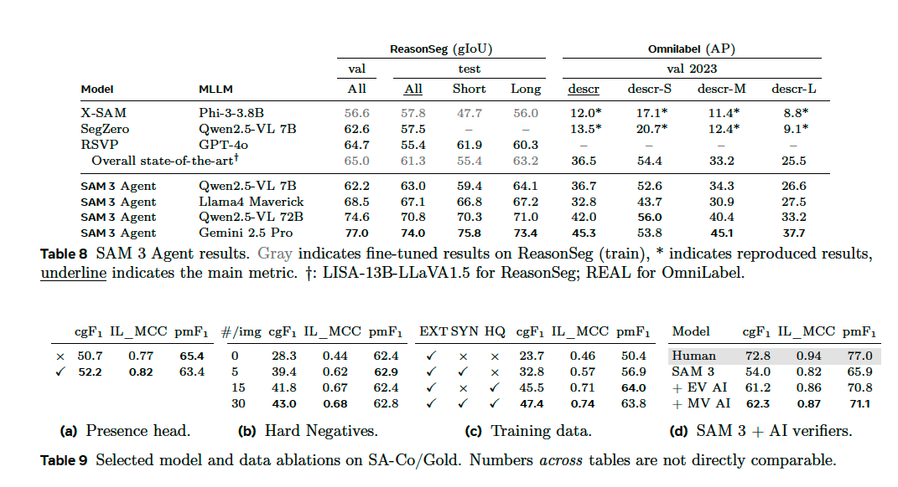
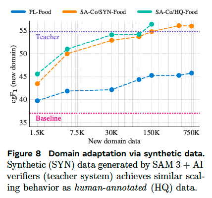

# SAM 3: Segment Anything with Concepts

**著者**: Nicolas Carion, Laura Gustafson, Yuan-Ting Hu (他多数).  
**所属**: Meta Superintelligence Labs.  
**出版**: arXiv preprint (arXiv:2511.16719v2 [cs.CV]), 2026

---

## 1. 論文の目的または目標は何ですか？

本論文の目的は，画像・動画中の任意の概念（concept）を，テキストや画像例示（image exemplar）といった**コンセプトプロンプト**から検出・セグメンテーション・追跡できる統一モデル **SAM 3 (Segment Anything Model 3)** を構築することである．

従来のSAM, SAM 2は「Promptable Visual Segmentation (PVS)」、すなわち点・ボックス・マスクといった幾何プロンプトで**1プロンプトあたり1つの物体**をセグメントするタスクに焦点を当てていた．しかし、「ビデオ内の全ての猫」のように，**ある概念に該当する全インスタンスを画像/動画全体から見つけ出してセグメントする**という汎用的タスクは扱えなかった．

そこで著者らは新たなタスクとして **Promptable Concept Segmentation (PCS)** を定式化する：

- **入力**: 画像または短い動画（≤30秒）と，短い名詞句（NP，例: "yellow school bus", "striped cat"），画像例示（positive/negative bounding box），またはこれらの組合せ
- **出力**: その概念に一致する全インスタンスのセグメンテーションマスクと、動画ではフレーム間で一貫した識別ID

加えて以下を達成することが目標である：
- PCSをサポートしつつ，PVS（点・ボックス・マスク）も継続的にサポートする統一アーキテクチャの構築
- インタラクティブな改良プロンプト（image exemplar・clicks）による誤検出の修正機能
- 既存ベンチマークの50倍以上の概念数を持つ大規模ベンチマーク **SA-Co** の構築
- 大規模で多様な学習データを効率的に作成できる**ヒトとAIのループ型データエンジン**の設計

論文Figure 1 はPVS（左）とPCS（右）の違いを直感的に示している．

<b>Figure 1.</b> PVS（左）とPCS（右）の比較．PVSは1プロンプト=1物体だが，PCSはテキスト/画像例示から該当する全インスタンスを検出・セグメント・追跡する．

---

## 2. トピックを探求するために使用された方法またはアプローチは何ですか？

### 2.1 モデルアーキテクチャ：Detector + Tracker の二重構造

SAM 3はSAM 2の一般化として設計されている．主要な構成要素は以下の通り：

<b>Figure 4.</b> SAM 3のアーキテクチャ概要．共有Vision Encoder（PE），DETRベースのDetector，SAM 2を継承したTrackerの3要素から構成され，テキスト/画像例示プロンプトに対応する．

- **共有Vision Encoder**: Perception Encoder (PE; Bolya et al., 2025) を画像とテキストに対して共通利用．
- **Detector（DETRベース）**: 画像レベルの検出器．テキストプロンプトと画像例示はそれぞれエンコーダで埋め込まれ，"prompt tokens"として fusion encoder で画像特徴量とクロスアテンションされる．デコーダはMaskFormer風のmask headとセマンティックセグ用のheadを持つ．DAC-DETRのデュアル監督，Align損失，box-region-positional bias を採用．
- **Tracker（SAM 2継承）**: 動画用．prompt encoder, mask decoder, memory encoder, memory bank からなり，フレーム間でmaskletを伝播．Detectorとは独立して学習され，Detectorの恒等性非依存な性質と，Trackerの恒等性分離という相反するタスクが衝突しないようにする．

### 2.2 Presence Token：認識と局在化の分離

検出器に **presence token** を導入することが本論文の重要な技術的貢献である：

- 各object queryは局在化（localization）に集中：p(qᵢ がマッチ | 概念が画像中に存在)
- 全体的なpresence tokenが認識（recognition）を担当：p(NP が画像中に存在)
- 最終スコアは両者の積．これにより hard negative （adversarialな名詞句）に対する堅牢性が大幅向上．

### 2.3 動画追跡：マッチングと時系列曖昧性解消

- 各フレームで Detector が新規物体 Oₜ を検出，Tracker が前フレームのマスクレット Mₜ₋₁ を伝播してM̂ₜ を生成し，IoUベースのマッチング関数でマージ．
- **時系列曖昧性解消**：(1) masklet detection score（過去フレームでの検出マッチング頻度）に基づくマスクレット抑制，(2) 高信頼度の検出結果による定期的な re-prompt によりオクルージョンや distractor に対処．

### 2.4 データエンジン：ヒト・AIループ型大規模アノテーション

論文Figure 5 にデータエンジンの全体像が示されている．以下の4フェーズで構築：

1. **Phase 1（Human Verification）**: SAM 2 + open-vocab detector でマスク候補生成 → 全て人手で検証．4.3M の image-NP ペアを SA-Co/HQ に投入．
2. **Phase 2（Human + AI Verification）**: Phase 1のラベルで Llama 3.2 を fine-tuning し，Mask Verification (MV) と Exhaustivity Verification (EV) を行う **AI verifier** を構築．スループットがほぼ倍増．SAM 3 を6回再学習，122M のペアを追加．
3. **Phase 3（Scaling and Domain Expansion）**: 22.4M ノードの Wikidata ベースオントロジーから NP をマイニング．ドメインを15個に拡張．SAM 3 を7回，AI verifier を3回再学習，19.5M ペアを追加．
4. **Phase 4（Video Annotation）**: Phase 3で成熟した SAM 3 を動画に拡張．シーン/動きフィルタやオブジェクト密度サンプリングで効率化．52.5K動画・467K maskletsを収集．

### 2.5 SA-Co データセットとベンチマーク

- **学習用**: SA-Co/HQ（5.2M画像, 4M NP）, SA-Co/SYN（合成；38M NP, 1.4B masks）, SA-Co/EXT（15外部データセット）, SA-Co/VIDEO（52.5K動画, 24.8K NP）．
- **評価ベンチマーク**: SA-Co は **207K の固有概念，121K の画像/動画，3M超 の media-phrase ペア**を持ち，既存ベンチの50倍以上の概念規模．Gold（3アノテータ），Silver, Bronze, Bio, VEval の5分割．
- **評価指標**: 信頼度0.5でしきい値を切り，localization の `pmF1`，classification の `IL_MCC`，主指標として両者を統合した **classification-gated F1 (cgF1) = 100 × pmF1 × IL_MCC** を採用．キャリブレーションを重視した実用的な指標設計．

---

## 3. 主要な結果または発見は何でしたか？

### 3.1 画像PCS（テキストプロンプト）

論文 Table 1 によれば，SAM 3 は zero-shot で：

- **LVIS mask AP**: 48.5（従来最良 38.5 を大幅に上回る）
- **SA-Co/Gold cgF1**: 54.1（最強ベースライン OWLv2★ の24.6を**2倍以上**）
- **人間性能（72.8 cgF1）の約74%**を達成
- COCO, COCO-O, ADE-847, PascalConcept-59, Cityscapes でも APE などの専門ベースラインを上回る

<b>Tables 1–3.</b> 画像PCSの zero-shot 性能（Tab.1: SA-Co/Gold ほか主要ベンチマーク, Tab.2: in-the-wild few-shot, Tab.3: 既存セグ/検出ベンチマーク）．

### 3.2 in-the-wild ベンチマーク（Few-shot）

論文 Table 2 によれば，ODinW13 と RF-100VL での zero-shot / 10-shot 転移で gDino1.5-Pro を含む全ベースラインを大幅に上回る（例：ODinW13 zero-shot で 61.0 vs. 58.7）．

### 3.3 オブジェクトカウンティング

論文 Table 4 では CountBench / PixMo-Count で MLLM 群（Gemini 2.5 Pro, Molmo-72B, Qwen2-VL-72B など）を accuracy・MAE 両面で上回る．**MLLMが提供できないセグメンテーション結果も同時に出力**できる点が大きな利点．

<b>Table 4.</b> オブジェクトカウンティング性能の比較．SAM 3はMLLM群を accuracy / MAE で上回り，かつセグメンテーションマスクも同時出力できる．

### 3.4 動画PCS

論文 Table 5 によれば，SA-Co/VEval や LVVIS, BURST, YTVIS21, OVIS で全ベースラインを大きく超える．特に NP 数が膨大なベンチマーク（SA-V: 2.0K NPs, SmartGlasses: 2.4K NPs）で顕著であり，**人間 pHOTA の80%以上**に到達．

### 3.5 PVSへの後方互換性

論文 Table 6 と Table 7 によれば，SAM 2 と比較して VOS タスクで MOSEv2 で**+6.5ポイント**の大幅改善．37データセットのインタラクティブセグメンテーションでも平均 mIoU が SAM 2 を上回る．**PCS追加と同時にPVS性能も向上**している点が重要．

<b>Tables 5–7.</b> 動画PCSの性能（Tab.5）と PVS への後方互換性（Tab.6: VOS, Tab.7: インタラクティブセグメンテーション）．SAM 2 を上回りつつPCS能力も獲得．

### 3.6 推論速度

H200 GPU で **100超の物体を含む単一画像を 30 ms で処理**．動画では物体数に応じて線形に増えるが，5物体程度であればほぼリアルタイム．

<b>Figure 7.</b> SAM 3 の定性結果例．多様な概念プロンプトに対するセグメンテーション/追跡の様子．

### 3.7 Ablation の主要発見

- **Presence token は IL_MCC を大きく押し上げ，cgF1 で +1.7〜+2 ポイント程度寄与**（Tab. 9a）．
- 概念がimage-level negativeの時はマスクスコアに勾配を流さない方が良い（recognition-localization 分離設計と整合，Tab. 10）．
- バックボーン（PE）, hard negative の追加, 高品質データと合成データの両方を使うスケーリング則が成立．

<b>Tables 8–9.</b> 主要 ablation．Presence token・データスケーリング・バックボーン選択などの寄与を定量化．

<b>Figure 8.</b> Ablation の可視化と詳細分析．設計上の主要コンポーネントが性能向上にどう寄与するかを示す．

---

## 4. 結論は何であり，なぜそれが重要なのですか？

本研究は，画像・動画における **promptable な open-vocabulary 概念セグメンテーション (PCS)** という新たなタスクを定式化し，それを実現する統一モデル **SAM 3** を提案した．主要貢献は以下の3点に集約される：

1. **新タスクとベンチマークの提示**: PCS タスクを定義し，既存ベンチマークの50倍以上の概念数（207K）を持つ大規模ベンチマーク **SA-Co** を公開した．これにより open-vocabulary segmentation 研究の評価基盤が大きく拡張された．
2. **アーキテクチャ革新**: 認識・局在化・追跡を分離する設計と **presence token** の導入により，DETR系モデルの open-vocabulary における長年の難点（hard negative 耐性，キャリブレーション）を実用レベルで解決した．SAM 2 を継承するため，PVSタスクの能力も同時に保持している．
3. **データエンジン**: Llama 3.2 ベースの **AI verifier** をヒトのアノテーションループに組み込むことで，スループットを倍以上にし，4M unique phrases / 52M masks の高品質データセットを構築した．これは「AIをデータ作成に活用する」というスケーラブルな手法論として独立した価値を持つ．

**意義と重要性**:
- SAM 3 は既存システムの**精度を画像・動画ともに約2倍**にしており，open-vocabulary segmentation の到達水準を大きく引き上げた．人間性能の70〜80%域に達したことは，視覚AIが実用域に近づいたことを示す．
- ロボティクス，コンテンツ制作，AR，データアノテーション，科学分野（生物学・医療など）といった広範な応用に直結する基盤技術として，マルチモーダルAIにおける重要なマイルストーンとなる．
- MLLM と組み合わせることで（論文付録Gの SAM 3 Agent），複雑な参照表現や推論を要するクエリにも対応可能であり，将来の視覚-言語システムの中核コンポーネントとなり得る．
- モデルチェックポイント・コード・SA-Co ベンチマークがオープンソース化されており，研究コミュニティ全体への波及効果が大きい．

一方，著者らは限界として **out-of-domain な用語への汎化が依然として課題**であることを認めており，自動ドメイン適応や追加学習が今後の研究方向として残されている．それでも本研究は，「概念」レベルの promptable segmentation を確立した点で，CV の歴史において SAM, SAM 2 に続く重要な転換点と位置付けられる．