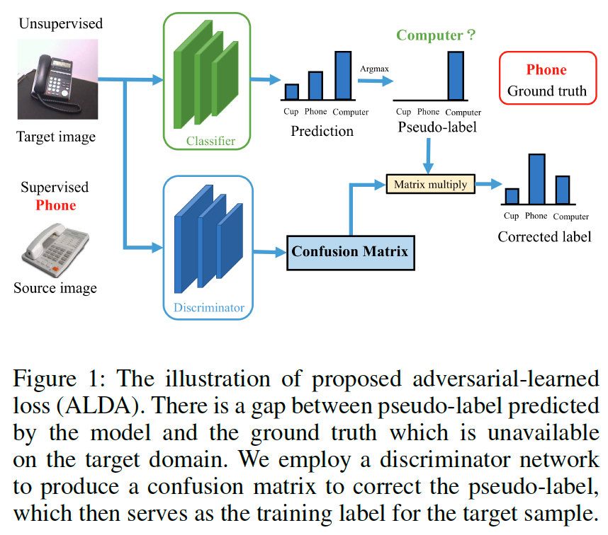
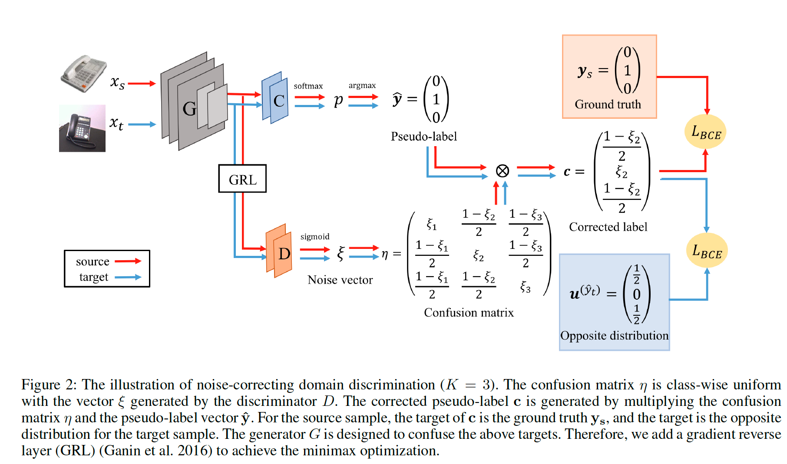
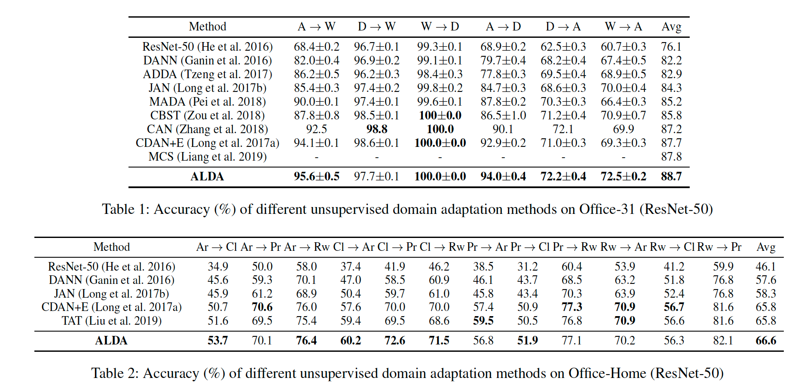
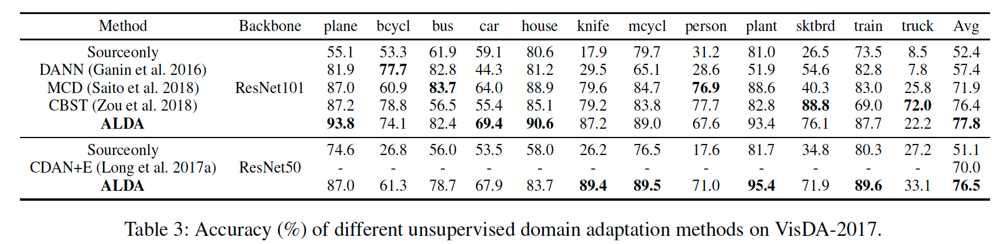
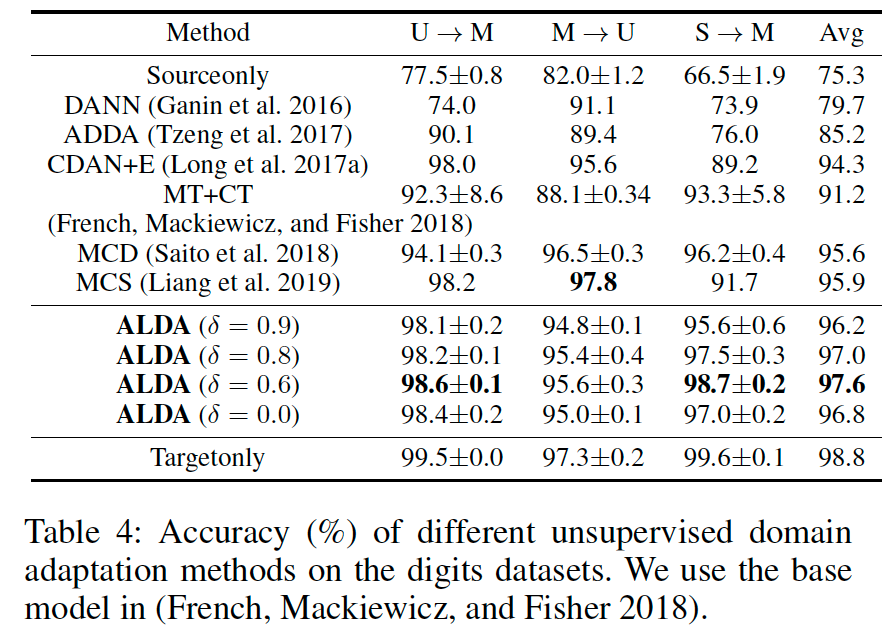
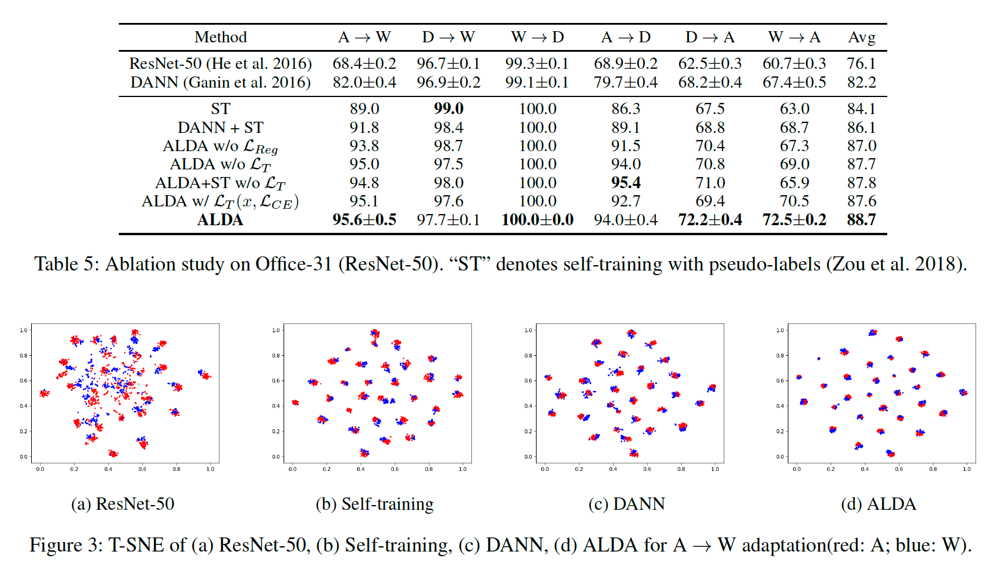

# Adversarial-Learned Loss for Domain Adaptation (ALDA)

**著者**: Minghao Chen, Shuai Zhao, Haifeng Liu, Deng Cai  
**所属**: Zhejiang University (State Key Lab of CAD&CG), Fabu Inc., Alibaba-Zhejiang University Joint Institute of Frontier Technologies  
**出版**: AAAI 2020 (arXiv:2001.01046v1)

---

## 1. 論文の目的または目標は何ですか？

本論文は，**教師なしドメイン適応（Unsupervised Domain Adaptation; UDA）**における2つの主要なアプローチの長所を統合することを目的としている．

UDAは，ラベル付きソースドメインから学習した知識を，ラベルなしターゲットドメインに転移する問題である．ドメイン間でデータ分布が異なる（ドメインシフト）ため，単純な転移では精度が大きく低下する．

従来手法には大きく2つのアプローチが存在するが，それぞれに弱点がある：

- **ドメイン敵対学習**：ドメイン識別器を用いて特徴分布を揃える理論保証があるが，ターゲット特徴が識別的（discriminative）かを考慮しない．
- **自己学習（Self-training）**：疑似ラベルを使って識別的な特徴を学習できるが，疑似ラベルにノイズが含まれ，ドメイン分布のアライメントに理論保証がない．

これら2手法の長所を組み合わせることが理想的だが，単純に組み合わせるだけでは効果が薄い．

そこで著者らは，**疑似ラベルのノイズを混同行列（Confusion Matrix）で定式化**し，それを**敵対的学習で自動推定**することで，分布アライメントとノイズ補正を同時に実現する新手法**ALDA（Adversarial-Learned Loss for Domain Adaptation）**を提案する．

---

## 2. トピックを探求するために使用された方法またはアプローチは何ですか？

### 提案手法 ALDA の全体像

ALDAは，特徴抽出器 G・分類器 C・**ノイズ補正型ドメイン識別器 D** の3つで構成される（図1参照）．

<b>図1</b>: ALDA の全体アーキテクチャ．特徴抽出器 G，分類器 C，ノイズ補正型ドメイン識別器 D から成る．

#### 混同行列によるノイズの定式化

理想の損失（正解ラベル使用）と疑似ラベルを用いた損失の差は，混同行列 $\eta_{kl} = p(y=k|\hat{y}=l,x)$ を介して以下のように表現できる：

$$L_T = \sum_k \sum_l \eta_{kl} \, p(\hat{y}=l|x) \, L(p_t, k) = \sum_k c_k \, L(p_t, k)$$

ここで $c_k$ は**補正済みラベルベクトル**であり，疑似ラベルに混同行列を掛けることで「正解に近い形」に補正される．

問題を扱いやすくするため，混同行列は **class-wise uniform**（対角成分が $\xi_k$，非対角成分が $(1-\xi_l)/(K-1)$）と仮定する．

#### ノイズ補正型ドメイン識別（図2参照）

<b>図2</b>: ノイズ補正型ドメイン識別の概念図．識別器が出力するノイズベクトルにより，疑似ラベルを補正済みラベルへ変換する．

識別器 D はノイズベクトル $\xi^{(x)} = \sigma(D(G(x)))$ を出力し，これが混同行列を構成する．敵対的学習はドメインごとに異なる目標を持つ：

- **ソース**：補正済みラベル $c^{(x_s)}$ を **正解ラベル $y_s$** に近づける
- **ターゲット**：補正済みラベル $c^{(x_t)}$ を**反対分布 $u^{(\hat{y}_t)}$**（疑似ラベル位置が0，他が均等）に近づける

生成器 G はこの識別を撹乱するように学習し，結果として class-wise な特徴分布アライメントが達成される．

#### 補正済み損失関数

混同行列推定後，ターゲット用の損失は次のように構成される：

$$L_T(x_t, L_{unh}) = \sum_k c_k^{(x_t)} L_{unh}(p_t, k)$$

基本損失には **Unhinged Loss** $L_{unh}(p,k) = 1-p_k$ を採用．これは均一ノイズに対するロバスト性が理論的に証明されており，混同行列で取りきれない残留ノイズを吸収する役割を果たす．

#### 正則化項

GANと同様に敵対学習の不安定性を緩和するため，識別器Dにソース画像のクラス分類タスクを追加する：

$$L_{Reg}(x_s, y_s) = L_{CE}(\text{softmax}(D(G(x_s))), y_s)$$

#### 理論的保証

- **Theorem 1**：敵対損失の最適点で，ソースとターゲットの特徴分布が一致する（$P_s = P_t$）．
- **Theorem 2**：最適点では，疑似ラベルが正解と一致するサンプルでは $c_{\hat{y}_t} = 1/2$（学習促進），不一致サンプルでは $c_{\hat{y}_t} = 0$（学習抑制）となり，**正解を見ずに自動でサンプルが選別される**．

### 実験設定

評価は4つの標準ベンチマークで実施：

- **Digits**：MNIST, USPS, SVHN
- **Office-31**：3ドメイン・31クラス
- **Office-Home**：4ドメイン・65クラス
- **VisDA-2017**：合成画像→実画像の大規模適応

バックボーンは ResNet-50/101（画像系）または小規模CNN（数字系）．最適化はSGD（運動量0.9）またはAdam．閾値 $\delta$ は0.6〜0.9，トレードオフ $\lambda$ は0から1へ漸増させる．

---

## 3. 主要な結果または発見は何でしたか？

### ベンチマーク結果

ALDA は4つすべてのデータセットで **state-of-the-art** を達成した．

- **Office-31**（表1参照）：平均精度 **88.7%**．CDAN+E（87.7%）やCAN（87.2%）を上回り，特に難タスク（A→W, A→D, D→A, W→A）で顕著な優位性を示した．
- **Office-Home**（表2参照）：平均精度 **66.6%**．より多クラス・大きな見た目ギャップの設定でもCDAN+E（65.8%）やTAT（65.8%）を超えた．クラス数が多いほど識別器出力 $\xi$ の表現力が高まり，class-wise アライメントが強化される．

<b>表1・表2</b>: Office-31 および Office-Home データセットにおける分類精度の比較．

- **VisDA-2017**（表3参照）：ResNet-101で平均 **77.8%**．ResNet-50ベースでも76.5%を達成し，CDAN+E（70.0%）を大きく上回った．

<b>表3</b>: VisDA-2017 における12クラスごとの精度と平均精度の比較．

- **Digits**（表4参照）：3タスク平均 **97.6%**（$\delta=0.6$）．教師あり学習との差を大幅に縮めた．

<b>表4</b>: 数字データセット（MNIST/USPS/SVHN）における転移タスクの精度比較．

### Ablation Study（表5参照）

<b>表5・図3</b>: Office-31 上での Ablation Study（左）と t-SNE による特徴可視化（右）．

各コンポーネントの寄与を確認：

- **DANN + ST（単純結合）**：86.1% → ALDAの88.7%に劣り，**適切な統合の重要性**を示す．
- **$L_{Reg}$ 除去**：87.0%へ低下．正則化項は敵対学習の安定化に重要．
- **$L_T$ 除去**：87.7%へ低下．ノイズ補正型識別だけでも有効だが，補正済み損失との併用が最良．
- **Cross Entropyへ置換**：87.6%へ低下．**Unhinged Loss の均一ノイズ耐性が確かに効いている**．

### 可視化と理論検証

- **t-SNE可視化**（図3）：ALDAではターゲットクラスタがソースクラスタと密に整合し，特徴が**整列かつ識別的**であることが確認できる．
- **重みの観察**（補足資料Fig.1）：訓練が進むと正解サンプルの $c_{\hat{y}_t}$ は0.5に，不正解サンプルは0付近に収束．Theorem 2が予言した**自動選別が実際に発生**することを実証した．

---

## 4. 結論は何であり，なぜそれが重要なのですか？

### 結論

本論文は，**疑似ラベルのノイズを混同行列で定式化し，それを敵対的学習で推定する** という新しい枠組み ALDA を提案した．単一の敵対損失 $L_{Adv}$ を最適化するだけで，以下の2つが同時に達成される：

1. **ドメイン分布のアライメント**（Theorem 1）
2. **信頼できる疑似ラベルの自動選別**（Theorem 2）

この理論的保証のもと，4つの標準ベンチマークすべてでSOTAを実現した．

### 重要性と貢献

- **理論的貢献**：ドメイン敵対学習と自己学習という従来は別系統と見なされていた2手法を，混同行列という共通の概念で**理論的に統合**した．Ben-David et al. の理論枠組みを継承しつつ，ノイズラベル学習の知見を取り込んだ点が新しい．
- **実用的貢献**：実装は既存の敵対学習フレームワークの自然な拡張であり，追加の計算コストは小さい．それでいて多様なベンチマークで一貫した改善を示した．
- **応用上の意義**：ラベル付与コストが高い実応用（医療画像，自動運転，リモートセンシングなど）において，ドメインシフトへの耐性向上は本質的な価値を持つ．ALDAの枠組みは，こうした領域で**ラベルなしデータを効果的に活用する基盤**となり得る．
- **後続研究への影響**：「混同行列を学習対象とする」というアイデアは，ノイズラベル学習・半教師あり学習・ドメイン適応の交差領域で多くの後続研究を触発する可能性がある．

一方で，class-wise uniform 仮定はクラス間の非対称な混同パターンを完全には捉えていない点が今後の改善余地として残されている．