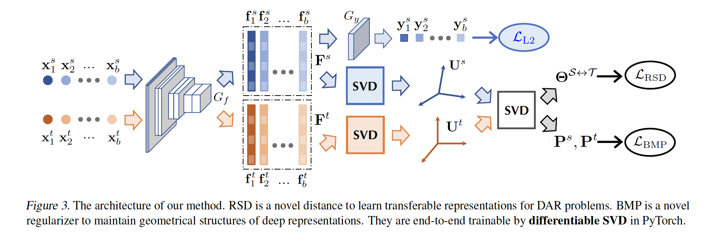
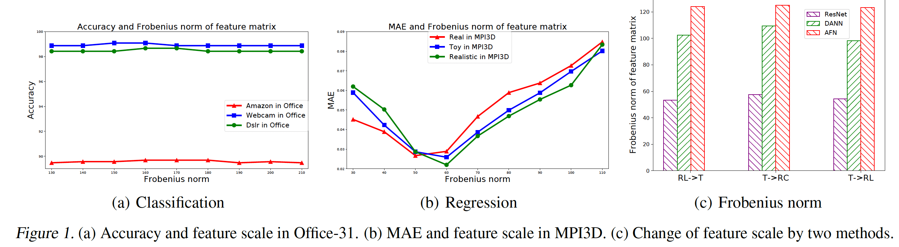
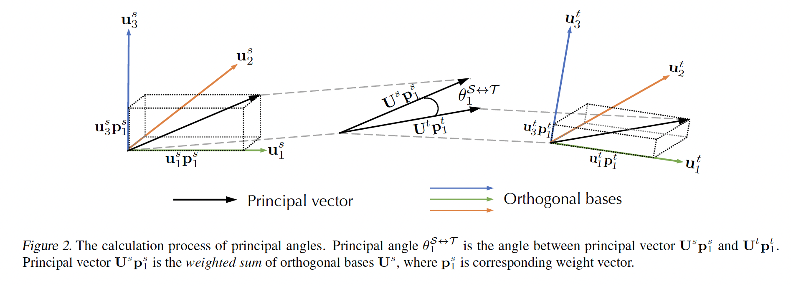
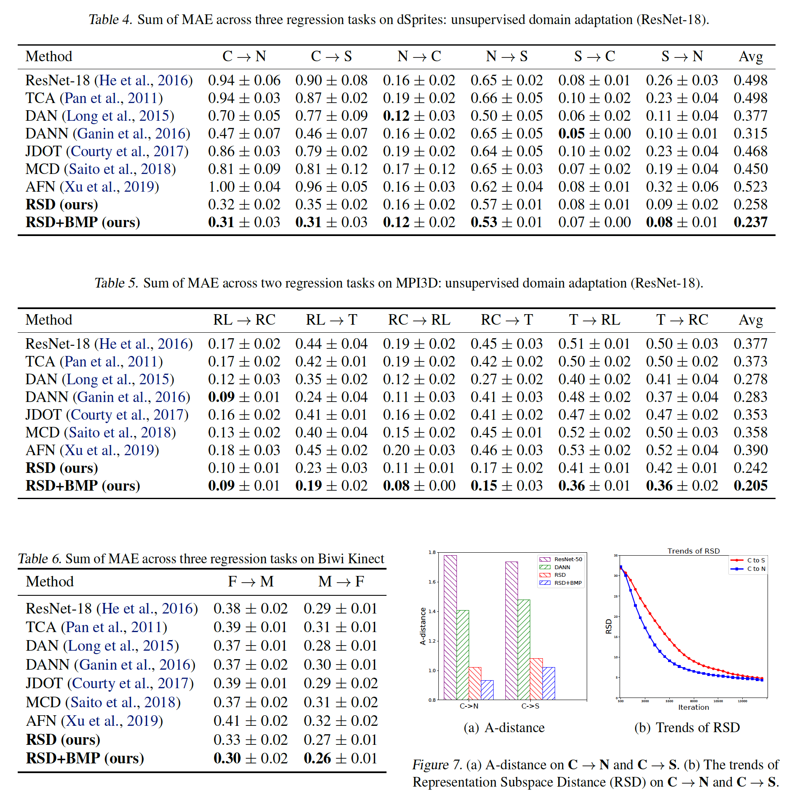
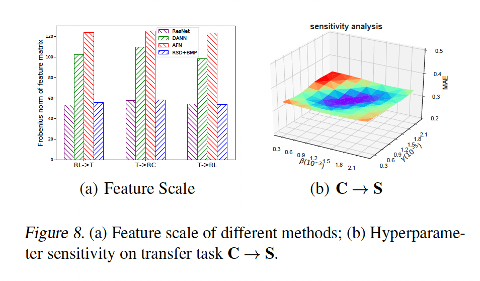

# Representation Subspace Distance for Domain Adaptation Regression

**著者**: Xinyang Chen, Sinan Wang, Jianmin Wang, Mingsheng Long
**所属**: School of Software, BNRist, Tsinghua University
**出版**: International Conference on Machine Learning (ICML) 2021

---

## 1. 論文の目的または目標は何ですか？

<b>Figure 3.</b> 提案手法 RSD+BMP のアーキテクチャ概要

本論文は **教師なし領域適応回帰 (Domain Adaptation Regression, DAR)** を深層学習の枠組みで解くことを目的としている。DARとは、ラベル付きのソース領域 $D_s = \{(x_i^s, y_i^s)\}$ で学習した回帰モデルを、ラベルなしのターゲット領域 $D_t = \{(x_i^t)\}$ に汎化させる問題である。分布が異なる ($P \neq Q$) という設定のもとで、ターゲット領域での予測精度を高めることが課題となる。

領域適応分類 (DAC) では深層学習による不変表現学習が大きな成果を上げているが、回帰の深層モデルへの適用は進んでいなかった。本論文はこの背景に対し、以下の根本的な問いを投げかける：

> **「なぜ深層領域適応回帰は分類ほど成功していないのか？」**

著者らは予備実験により、以下の2つの重要な発見を得た（**Figure 1 参照**）：

1. **回帰の性能は特徴スケール（Frobeniusノルム）の変化に弱い**：一方で分類は特徴スケールの変動に頑健である
2. **既存のDAC手法（DANN, AFN等）は特徴スケールを大きく変えてしまう**：これが回帰性能の劣化を引き起こすリスクとなる

<b>Figure 1.</b> 特徴スケール（Frobeniusノルム）が分類と回帰の精度に与える影響の比較

この発見に基づき、本論文の目標は次のようにまとめられる：

- **特徴スケールを変えずにドメインギャップを縮める** 新しい深層DARの枠組みを構築する
- インスタンス表現ではなく **表現部分空間の直交基底** に基づいてドメイン整合を行う
- Grassmann多様体のリーマン幾何を用いて、数学的に正当化された距離尺度を提案する

---

## 2. トピックを探求するために使用された方法またはアプローチは何ですか？

### 2.1 基本的なアイデア：直交基底による整合

特徴行列 $F^s = [f_1^s, \ldots, f_b^s]$ のFrobeniusノルムは特異値のみに依存する：

$$\|F^s\|_F = \sqrt{\sum_{i=1}^{b} \sigma_i^s}$$

特異値分解 $F^s = U^s \Sigma^s (V^s)^T$ により、特徴行列を「方向 ($U$)」と「スケール ($\Sigma$)」に分離できる。**直交基底 $U$ のみを用いてドメイン整合を行えば、$\Sigma$ に影響を与えずに済む**、というのが本手法の核心的アイデアである。

### 2.2 Representation Subspace Distance (RSD)

ソース部分空間 $\mathcal{S}$ とターゲット部分空間 $\mathcal{T}$ の類似度を、Grassmann多様体上の **主角 (Principal Angles)** $\Theta = [\theta_1, \ldots, \theta_b]$ で測る。主角は以下のSVDから一括で求まる：

$$(U^s)^T U^t = P^s \left(\text{diag}(\cos\Theta)\right) (P^t)^T$$

これに基づき、本論文は次の新しい距離を定義する：

$$\text{dis}_{\text{RSD}}^{\mathcal{S}\leftrightarrow\mathcal{T}}(U^s, U^t) = \|\sin\Theta\|_1 = \sum_{i=1}^{m} \sin\theta_i$$

著者らは **Theorem 1** で、RSDが距離の3公理（非負性・対称性・三角不等式）を全て満たす一般距離であることを証明している。

### 2.3 Bases Mismatch Penalization (BMP)

RSDだけでは、基底の重要度順序が無視されるという問題がある。例えばソース側の「重要な基底」がターゲット側の「重要でない基底」と対応付けられる可能性がある。これを防ぐため、重み行列 $P^s, P^t$ の絶対値が一致するよう制約する正則化項を導入する：

$$\text{reg}_{\text{BMP}}^{\mathcal{S}\leftrightarrow\mathcal{T}}(U^s, U^t) = \left\| |P^s| - |P^t| \right\|_F^2$$

これにより、**重要度順が揃った基底同士が対応付けられ**、深層表現の幾何学的構造が保たれる（**Figure 2 参照：主角と主ベクトルの計算過程**）。

<b>Figure 2.</b> 主角 (Principal Angles) と主ベクトルの計算過程の概念図

### 2.4 最終的な最適化問題

3つの損失を組み合わせたエンドツーエンドの最適化問題は次式で表される：

$$\min_{G_f, G_y} \mathcal{L}_{L2}(G_f, G_y) + \beta \mathcal{L}_{\text{RSD}}(G_f) + \gamma \mathcal{L}_{\text{BMP}}(G_f)$$

- $\mathcal{L}_{L2}$：ソース領域での二乗回帰損失
- $\mathcal{L}_{\text{RSD}}$：部分空間距離（ドメインギャップを縮める）
- $\mathcal{L}_{\text{BMP}}$：基底の重要度順を整合（幾何学的構造を保つ）

PyTorchの微分可能なSVDにより、エンドツーエンドで学習可能である（**Figure 3 参照：手法のアーキテクチャ**、冒頭に掲載）。

### 2.5 実験設定

3つのベンチマークで評価を行った：

- **dSprites**：2D合成データセット（Color, Noisy, Screamの3ドメイン、6つの転移タスク）
- **MPI3D**：シミュレーションから実世界への3D物体データセット（Toy, RealistiC, ReaLの3ドメイン、6つの転移タスク）
- **Biwi Kinect**：実世界の頭部姿勢推定データセット（Female, Maleの2ドメイン、2つの転移タスク）

ベースバックボーンには **ResNet-18** (ImageNet事前学習) を使用。比較手法として、浅い回帰手法 (TCA, JDOT) と深層分類向け手法 (DAN, DANN, MCD, AFN) を採用した。

---

## 3. 主要な結果または発見は何でしたか？

### 3.1 ベンチマーク評価結果

**Table 4 (dSprites)、Table 5 (MPI3D)、Table 6 (Biwi Kinect) 参照**

<b>Table 4-6 と Figure 7.</b> 3つのベンチマーク (dSprites, MPI3D, Biwi Kinect) における比較結果、および表現の転移性分析 (A-distance, RSDの推移)

提案手法 **RSD+BMP** は、3つの全てのベンチマークで既存手法を大幅に上回る精度を達成した：

- **dSprites**：平均MAE 0.237 (ベスト)。DANN (0.315) と比較して約25%の改善
- **MPI3D**：平均MAE 0.205 (ベスト)。最良の既存手法DAN (0.278) と比較して約26%の改善。特に難しいT→RL、T→RCタスクで顕著な向上
- **Biwi Kinect**：F→M で 0.30、M→F で 0.26 を達成し、全タスクで最良

注目すべきは、**深層DAC手法 (AFN等) が回帰タスクではしばしばResNetベースラインより悪化する** ことである。これは「特徴スケールの変化が回帰性能を劣化させる」という著者らの仮説を裏付けている。

### 3.2 アブレーション研究

- **RSD単体**：簡単なタスクでは既に大きな改善
- **RSD + BMP**：難しいタスク（T→RL、T→RC等）で更に大幅な性能向上を達成

これは、簡単なタスクでは部分空間整合だけで十分だが、難しいタスクでは基底の重要度順序を揃える必要があることを示している。

### 3.3 表現の転移性分析

**Figure 7 参照**（上記の Table 4-6 と同じ画像内に掲載）

- **A-distance**：提案手法はDANNより小さいA-distanceを達成し、より転移可能な表現を学習していることを示す
- **RSDの推移**：学習が進むにつれてRSDが減少。タスクの転移難易度（C→S の方が C→N より難しい）とRSDの収束挙動が一致

### 3.4 特徴スケールの保存

**Figure 8(a) 参照**

提案手法 RSD+BMP は、ResNetベースラインと同等の特徴スケール（Frobeniusノルム）を維持している。一方、DANNやAFNは特徴スケールを大きく変化させる。これにより、**「特徴スケールを変えずにドメインギャップを縮める」という設計目標が実現できている** ことが定量的に確認された。

<b>Figure 8.</b> (a) 各手法の特徴スケール (Frobeniusノルム) の比較、(b) ハイパーパラメータ β, γ に対する感度分析

### 3.5 計算コスト

1反復あたりの学習時間は、ソースのみのモデル (0.203秒) から提案手法 (0.229秒) へとわずか12%程度の増加に留まる。SVDを3回実行する追加コストは実用上問題ない。

### 3.6 ハイパーパラメータ感度

**Figure 8(b) 参照**

トレードオフパラメータ $\beta, \gamma$ の広い範囲で安定した性能を達成しており、実用上ロバストである。

---

## 4. 結論は何であり，なぜそれが重要なのですか？

### 結論

本論文は深層領域適応回帰 (DAR) という、これまで深層学習の枠組みで十分に取り組まれてこなかった問題に挑み、以下の主要な貢献を行った：

1. **本質的な問題の発見**：回帰性能は特徴スケールに敏感であり、既存のDAC手法は特徴スケールを変えてしまうため回帰タスクには不適切である、という根本的な問題を実験的に明らかにした

2. **新しい距離尺度 RSD の提案**：Grassmann多様体のリーマン幾何に基づき、距離の3公理を満たす **表現部分空間距離 (RSD)** を定義した。これにより特徴スケールを変えずにドメイン整合が可能となった

3. **正則化項 BMP の提案**：基底の重要度順を保つ **基底ミスマッチペナルティ (BMP)** を導入し、深層表現の幾何学的構造を保ちながら学習を行う仕組みを提供した

4. **新しいベンチマークの構築**：dSpritesとMPI3Dの2つのDARベンチマークを構築し、コミュニティに貢献した

### 重要性

本研究の意義は学術的にも実用的にも大きい：

- **学術的意義**：深層回帰における領域適応の問題に対する**最初の体系的かつ理論的に正当化された解決策**を提供した。「分類と回帰の差異は損失関数の構造（クロスエントロピー vs 二乗損失）にあり、それが特徴スケールへの感度の違いを生む」という洞察は、今後の深層回帰研究全般に対する重要な指針となる

- **方法論的意義**：従来のインスタンスベース分布整合から、**部分空間ベース（Grassmann多様体）整合** へとパラダイムを転換した点は、領域適応研究に新しい方向性をもたらす

- **実用的意義**：物体位置推定、画像レジストレーション、人物姿勢推定など、回帰問題は実応用で広く存在する。本手法はラベルなしターゲットデータのみで動作するため、ラベル付けコストの削減に貢献する

- **再現性**：コードと2つの新しいベンチマークが公開されており、今後の研究を促進する基盤を提供している ([github.com/thuml/Domain-Adaptation-Regression](https://github.com/thuml/Domain-Adaptation-Regression))

総じて本論文は、**深層DARという未開拓領域に対する早期かつ重要な肯定的結果** を提示しており、今後この分野が発展していくための強固な礎を築いたと言える。