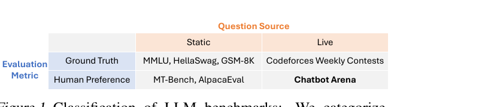
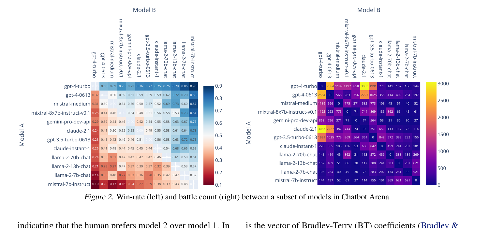
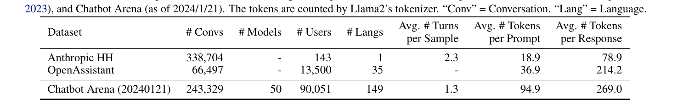
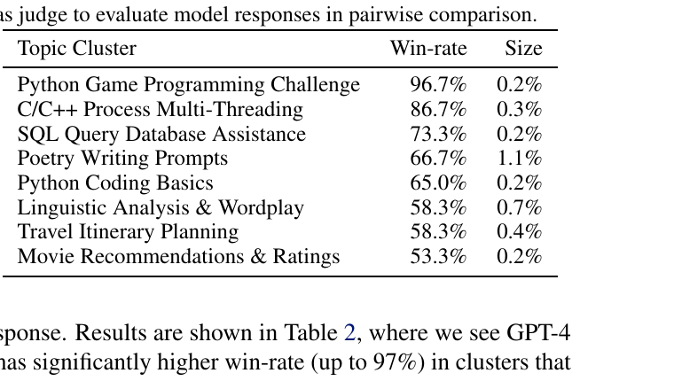
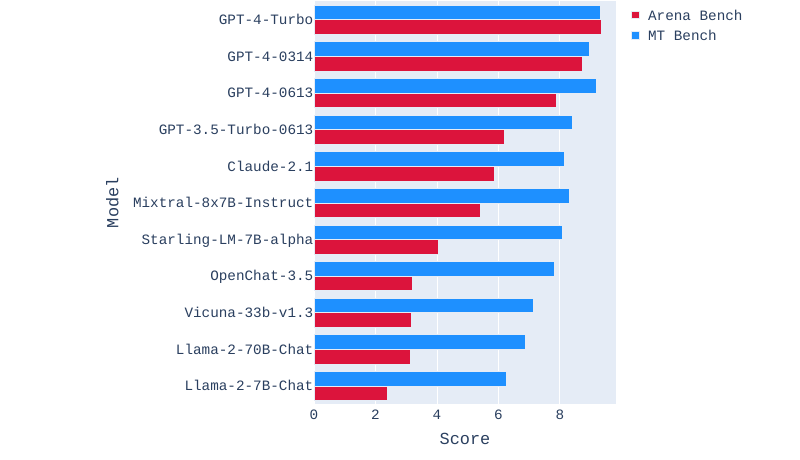
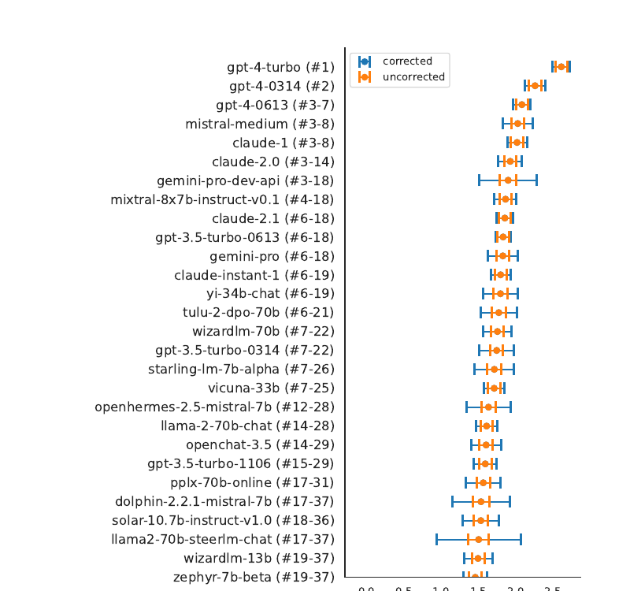
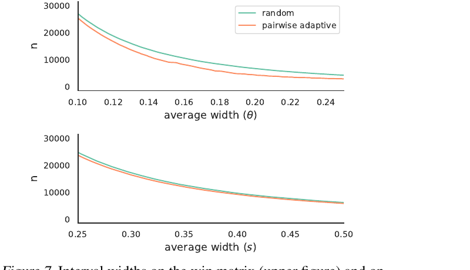

# Chatbot Arena: An Open Platform for Evaluating LLMs by Human Preference

**著者**: Wei-Lin Chiang*, Lianmin Zheng*, Ying Sheng, Anastasios N. Angelopoulos, Tianle Li, Dacheng Li, Banghua Zhu, Hao Zhang, Michael I. Jordan, Joseph E. Gonzalez, Ion Stoica (*Equal contribution)  
**所属**: UC Berkeley / Stanford / UCSD  
**出版**: Proceedings of the 41st International Conference on Machine Learning (ICML), PMLR 235, 2024 (arXiv:2403.04132)

---

## 1. 論文の目的または目標は何ですか？

LLM の能力評価には MMLU (Hendrycks+ 2020), HellaSwag (Zellers+ 2019), GSM-8K (Cobbe+ 2021), MT-Bench, AlpacaEval など多数のベンチマークが存在するが，**Figure 1** の通り「質問のソース (Static / Live)」×「評価指標 (Ground Truth / Human Preference)」の 2 軸で分類でき，主流は **Static × Ground Truth** に集中している．これらには次の本質的限界がある：

- **Closed-ended で硬直**：実世界の自由形式タスクや open-ended な使い方を反映できない (Zheng+ 2023b)．
- **テストセット汚染 / 飽和**：時間とともに学習データに混入し信頼性が失われる (Yang+ 2023; Oren+ 2023)．
- **Ground truth 確立の困難**：最先端 LLM が解くタスクほど「正解」を定義しにくい．
- **ユーザ嗜好との乖離**：実利用シーンで何を「良い回答」とみなすかは ground truth では捉えられない．

本論文の目的は，これらを解消する **「Live × Human Preference」象限の評価プラットフォーム** ＝ **Chatbot Arena** を構築し，以下を実証することである：

1. crowdsource された自由プロンプトが十分に多様かつモデル弁別力を持つこと．
2. 匿名 pairwise battle による human preference vote が，専門家評価と高い一致を示すこと．
3. 大規模・ノイズあり設定下でも統計的に妥当な ranking と信頼区間を効率的に推定できること．

---

## 2. トピックを探求するために使用された方法またはアプローチは何ですか？

### 2.1 データ収集インターフェース（pairwise battle）

ユーザは https://chat.lmsys.org で任意のプロンプトを入力し，匿名化された **2 つのモデル A, B** の応答を並べて比較し，「A is better / B is better / Tie / Both are bad」の 4 択で投票する．モデル名は投票後にのみ開示．prompt の rubric を一切固定しないことで，topic 多様性と現実利用との整合性を確保している．

### 2.2 Bradley-Terry モデルによる ranking（Elo ではない理由）

データセットを $\mathcal{A} = \{(m,m') : m < m',\ m,m' \in [M]\}$ とする．時刻 $t$ にペア $A_t \in \mathcal{A}$ を見せ，response $H_t \in [0,1]$ を観測．**win matrix** $\theta^*(a) = \mathbb{E}[H_t \mid A_t = a]$ を推定し，これを **Bradley-Terry (BT) coefficient** $\xi$ に変換する：

$$\mathbb{P}(H_t = 1) = \frac{1}{1 + e^{\xi_{m'} - \xi_m}}$$

ランク $\mathrm{rank}(\mathbb{P})_m = 1 + \sum_{m' \in [M]} \mathbf{1}\{s(\mathbb{P})_{m'} > s(\mathbb{P})_m\}$ を BT 係数で決める．従来 Elo (Elo 1967) を使っていたが，BT 係数は**統計的推定の対象として自然**で，misspecification があっても MLE が漸近正規となる古典結果 (Huber 1967; White 1982) が利用できるため切り替えた．

**Figure 2** は推定された win matrix（左）と battle count（右）．非一様サンプリングにより，性能が近いモデル間に投票を集中させ uncertainty を抑えている．

### 2.3 信頼区間：sandwich estimator と bootstrap

逆確率重み付き MLE：

$$s(\hat{\mathbb{P}}) = \mathrm{argmin}_{\xi}\ \sum_{t=1}^{T} \frac{1}{P(A_t)}\, \ell\!\left(H_t, \frac{1}{1 + e^{\xi_{A_t,2} - \xi_{A_t,1}}}\right)$$

信頼区間は (1) pivot bootstrap (DiCiccio & Efron 1996), (2) **Huber sandwich covariance** (Huber 1967) の 2 種を比較し，シミュレーション（Appendix A）で sandwich の方が大標本で interval 幅が小さいことを示し，これを採用．multiplicity 補正には chi-square CLT 区間を用いる．

### 2.4 能動的サンプリング

各 pair $a$ について「sample した場合の confidence interval 幅の縮小量」に比例して選ぶ：

$$P_t(a) \propto \sqrt{\frac{\hat{\Sigma}_{t,a,a}}{|\{t : A_t = a\}|}} - \sqrt{\frac{\hat{\Sigma}_{t,a,a}}{|\{t : A_t = a\}| + 1}}$$

これにより**統計的妥当性を保ったまま**収束を加速する．

### 2.5 異常ユーザの検出

各ユーザの $j$ 番目の投票毎に，過去履歴 $\mathcal{H}_{A'_j} = \{H_t : A_t = A'_j\}$ との順位ベース p-value を計算：

$$p_i = \frac{1}{|\mathcal{H}_{A'_i}| + 1}\!\left(1 + \sum_{h \in \mathcal{H}_{A'_i}} \mathbf{1}\{h \geq H'_i\}\right)$$

これを **Fisher's combination test** $M_j = -2 \sum_{i=1}^{j} \log p_i$ で集約．具体的には **1〜100 の範囲からランダムに選んだ 5 個の $j$** において $M_j \geq \chi^2_{2j, 1-\alpha/5}$ なら異常と判定する（Bonferroni 補正で 5 検定分の $\alpha/5$）．これは異常ユーザがプロトコルを逆手に取って ranking を hack するのを防ぐための工夫．

### 2.6 Topic modeling パイプライン

prompt diversity を測るため，**BERTopic** (Grootendorst 2022) を用いて：OpenAI `text-embedding-3-small` で埋め込み → **UMAP** で次元削減 → **HDBSCAN** で minimum cluster size 32 のクラスタリング → 各クラスタから 10 prompt をサンプリングして **GPT-4-Turbo** にラベル生成させる．

---

## 3. 主要な結果または発見は何でしたか？

### (1) データ規模と多言語性

**Table 1**：2024/1/21 時点で **243,329 conversations / 50 models / 90,051 users / 149 言語**．Anthropic HH (338,704 conv, 1 言語) や OpenAssistant (66,497 conv, 35 言語) と比較し，**言語多様性とモデル多様性で群を抜く**．77% が英語，5% が中国語，残りは Russian / German / Spanish / French / Japanese 等．

### (2) Topic 多様性

BERTopic は **600 クラスタ**を識別．最大クラスタも全体の 1% に過ぎず，他は <0.5% の **long-tail 分布**．Figure 3 の similarity matrix（top-16 クラスタ）でクラスタ間 similarity は低く，互いにほぼ独立であることが視覚的に示される（cluster centroid embedding 間の cosine similarity）．Poetry / coding / math / medical / role-playing など広範な話題を網羅．

### (3) Topic 別モデル弁別力

**Table 2**：**GPT-4-0613 vs Llama-2-70b-chat** の win-rate（30 prompt/cluster，GPT-4-Turbo を judge として LLM-as-judge 評価）：

| Topic Cluster | GPT-4-0613 Win-rate | Size |
|---|---|---|
| Python Game Programming Challenge | **96.7%** | 0.2% |
| C/C++ Process Multi-Threading | 86.7% | 0.3% |
| SQL Query Database Assistance | 73.3% | 0.2% |
| Poetry Writing Prompts | 66.7% | 1.1% |
| Python Coding Basics | 65.0% | 0.2% |
| Linguistic Analysis & Wordplay | 58.3% | 0.7% |
| Travel Itinerary Planning | 58.3% | 0.4% |
| Movie Recommendations & Ratings | 53.3% | 0.2% |

**reasoning / coding 系では proprietary が圧倒的（最大 96.7%），simple な recommendation 系では差が縮まる（53.3%）**．Arena prompts はこのモデル間の能力差を明示的に切り出せることを示している．

### (4) Arena Bench vs MT-Bench

**Figure 4**：Arena からの challenging prompts で構成した Arena Bench は，MT-Bench と比べ **open model と proprietary model のスコア差が大きく開く**．つまり MT-Bench で天井に近かった open model も，Arena Bench では実力差が顕在化する．

### (5) Vote 品質：crowd vs expert 一致率

**Table 3**：GPT-4-Turbo vs Llama-2-13b と GPT-4-Turbo vs GPT-3.5-Turbo-0613 についてそれぞれ **160 battles** をランダム抽出し，UC Berkeley 大学院生の expert 2 名（外部検索による fact-check 許可）と GPT-4 judge にラベル付けさせて比較：

| GPT-4-Turbo vs Llama-2-13b | Expert 1 | Expert 2 | GPT-4 |
|---|---|---|---|
| Crowd | 72.8% | 77.8% | 75.6% |
| Expert 1 | - | 89.8% | 81.0% |
| Expert 2 | - | - | 78.5% |

GPT-3.5-Turbo-0613 との比較でも crowd-expert 一致率は **73-83%**．expert 同士の **79-89%** と比べて 5-10% 程度の差で，crowd vote は信頼に足る．論文はこの差を主に **「crowd ユーザが間違える，もしくはモデル応答中の factual error を見落とす」** ことに帰着させており，残り (10-20% の expert 不一致) の多くは「prompt に明確な正解がない」ケース（Appendix D.4）に起因．

### (6) BT ranking 結果

**Figure 5**：multiplicity 補正あり (corrected, chi-square CLT) と なし (uncorrected) の信頼区間．**gpt-4-turbo** が rank #1，gpt-4-0314 #2，gpt-4-0613 が #3-7 と続く．mistral-medium, claude-1 が proprietary に並び，open model では mixtral-8x7b-instruct (#4-18) が最上位．補正版は当然広いが ranking が変わるほどではない．

### (7) 能動的サンプリングの効率

**Figure 7**：win matrix（上）と BT score（下）における信頼区間幅 vs サンプル数．win matrix を精度 **0.2** で推定するのに **random=6,800 sample, adaptive=4,400 sample**（random は adaptive より **54% 多くのデータが必要**），BT score を精度 **0.3** で推定するのに **random=17,200 sample, adaptive=16,400 sample**（**5% 多くのデータが必要**）．win matrix 推定の方が BT score 推定よりも能動サンプリングの効果が大きい．

### (8) 異常ユーザ検出

**Table 5**：手動で識別した 25 名の異常ユーザ（"hi" を 100 回送る等）と 25 名の正常ユーザに対する confusion matrix．$\alpha=0.1$ で **TPR 13/14 (93%) / TNR 24/36 (67%)**．false negative は「常に異常ではない」ユーザに集中．

---

## 4. 結論は何であり，なぜそれが重要なのですか？

**結論**：Chatbot Arena は **crowdsourced・live・pairwise human preference** に基づく初の大規模オープン LLM 評価プラットフォームとして，(a) 多言語・多モデル・多 topic の prompt 多様性，(b) crowd vote の expert 一致性，(c) BT + sandwich + active sampling による統計的に厳密かつサンプル効率の良い ranking pipeline，(d) Fisher 結合検定による異常ユーザ検出，を一体として実証した．2023/4 〜 2024/1 で 240K+ vote, 90K+ user, 149 言語をカバーし，業界の事実上のリーダーボードとして広く参照されるに至った．

**重要性と意義**：

1. **静的ベンチマークが届かない実用評価への橋渡し**：MMLU/MT-Bench 系が捉えられない open-ended な実利用品質を，spec を固定しないユーザ prompt × pairwise 比較で測れる枠組みを示した．汚染・飽和に強く，新モデルを継続的に統合できる **live** な性質が本質的．

2. **手法論的貢献**：Elo を BT 係数に置き換え，sandwich covariance と active sampling を組み合わせることで，nuisance noisy な crowdsource 設定でも統計的に妥当な uncertainty quantification と効率的データ収集を両立する pipeline を提示．これは ML 評価論への手法論的貢献として独立に価値がある．

3. **データ公開**：100K+ pairwise preference dataset の release を約束．従来の LMSYS-Chat-1M (Zheng+ 2023a) は preference ラベルを持たなかったため，**preference-based 学習 (RLHF, DPO, reward model) の研究にとって直接的に有用**．

4. **限界の正直な議論**：ユーザ層が LLM 愛好家・研究者に偏る可能性，production / specialized domain の prompt 分布との乖離，safety 評価の欠如を明示．今後は multimodal / agent leaderboard, より堅牢な異常検出 (nonnegative supermartingale, E-values) への拡張が示唆されている．

Chatbot Arena は「**評価そのものを open かつ live にし，統計的に厳密に運用する**」という方向性を確立した点で，LLM 開発エコシステムの基幹インフラとして位置付けられる．

---

## 5. 論文発表後の動向と批判（2024年6月 ICML 発表 〜 2026年5月時点）

> 本セクションは原論文外の調査に基づく．Chatbot Arena は ICML 2024 発表後に商業化・スケール拡大を遂げる一方で，原論文では深く扱われなかった構造的問題が次々に顕在化している．

### 5.1 業界標準化と商業化

- 2025年4月，UC Berkeley の研究プロジェクトから **Arena Intelligence Inc.（通称 LMArena）** として正式に法人化．
- 2026年1月，Felicis と UC Investments 主導の **Series A で $150M を調達，valuation $1.7B**．月間 5M+ ユーザ，月間 60M conversation．
- OpenAI / Google / Anthropic / Meta 等が**新モデル公開時に必ず Arena 順位を引用**する事実上のリーダーボードに．

### 5.2 「The Leaderboard Illusion」論文による構造的批判（Singh+ 2025, arXiv:2504.20879）

Cohere Labs / Princeton / Stanford / AI2 等が **243 モデル・42 provider・2M battle** を分析し，4 つの構造的問題を指摘：

| 問題 | 具体的な発見 |
|---|---|
| **未公開 private testing** | 一部 provider は本番公開前に複数 variant を Arena で内部テストでき，悪いスコアを retract できる．論文 abstract で名指しされた極端な事例は **Meta が Llama-4 公開前に 27 variant をテスト**してベストを選んだケース（後述 §5.3） |
| **データアクセスの非対称性** | Google と OpenAI がそれぞれ全 vote データの **19.2% / 20.4%** を獲得，対して **83 個の open-weight モデル合計で 29.7%**．Arena データに access できる側だけが分布シフトに適応可能 |
| **Prompt 重複** | 2024年11月〜2025年4月の期間で平均 **20.14%**，2025年3月にピーク **26.5%** の prompt が duplicate / near-duplicate．12月→1月で 7.3% が完全一致．データ access のある provider は「未来の prompt」を実質的に train データとして使える |
| **Arena 分布への overfitting** | Arena 風 prompt で fine-tune すると **Arena-Hard（500件の静的 LLM-judge benchmark）で +112% win-rate**，一方 MMLU は微減．論文は「Arena 順位」と「一般能力」の乖離と主張．ただし LMArena は「Arena-Hard は live Arena ではない」と反論（§5.5） |
| **Silent な model 削除** | 全 243 モデルのうち公式 deprecate は **47 モデルのみ**，残り **205 モデルが告知なく削除**．open-weight / open-source model に偏って削除される傾向 |

### 5.3 Meta Llama 4 Maverick 事件（2025年4月）

- Meta が `Llama-4-Maverick-03-26-Experimental` を Arena 投入し ELO **1417** を獲得 → コミュニティが「公開版と挙動が違う」と指摘．
- 実態は**絵文字多用・冗長な応答スタイル**に最適化された preference-tuned variant（公開版とは別物）．後に公開版を Arena で測ると ELO は **~1370 まで低下**．
- LMArena は **policy 改訂を発表**：今後は「公開版と同一の重み」でなければリーダーボード掲載不可，experimental の明示を義務化．
- The Leaderboard Illusion が指摘した「27 variant を pre-release test」の具体事例がこの Meta による Llama 4 開発であり，論文 abstract で名指しされている．

### 5.4 Style / Length バイアス問題

LMArena 自身も以前から **応答の長さ・markdown 装飾が preference vote を歪める**ことを認めており，2024年8月から **「Style Control」リーダーボード**を併設（Bradley-Terry 回帰に長さ・markdown header/bold/list の features を追加し効果を除去）．Bradley-Terry 回帰の正規化係数：

| Feature | Coefficient |
|---|---|
| Response Length | **0.249** |
| Markdown List | 0.031 |
| Markdown Header | 0.024 |
| Markdown Bold | 0.019 |

- **長さが圧倒的に支配的**で，markdown 装飾は二次的．
- Style control 適用後，**GPT-4o-mini が rank 6 → 11，Grok-2-mini が 6 → 18 と大幅下落**，逆に Claude 3.5 Sonnet (6→4)，Claude 3 Opus (16→10)，Llama-3.1-405B が上昇．crowd preference の絶対値は style に強くバイアスされていた．
- これは原論文（Chiang+ 2024）が depth で扱わなかった blind spot．

### 5.5 LMArena 側の反論

公式 response (`news.lmarena.ai/our-response/`) では具体的に以下を反論：

- **pre-release testing の実質効果は ~11 Elo（50 tests + 3000 votes 後）** であり論文の「100+ point boost」は不当 Gaussian distribution に基づいた non-realistic simulation．fresh vote が継続的に入るため selection bias は急速に 0 に収束．
- 論文の **「open-source 8.8%」は誤り**：Llama/Gemma 等の open-weight を除外した数字．**LMArena 公式統計（2025/4/27 公開）では open models は 40.9%**．
- **provider preferential treatment は無し**：大手 lab が多くの model を submit するのは単に開発数が多いから．**Cohere 自身も 9 件の pre-release test を受けており，xAI/OpenAI より 2-3倍多い**．
- **pre-release testing policy は秘密ではない**：2024年3月1日に公開済み．
- 同一 checkpoint の score 差 (例: 1069±27 vs 1054±18) は **通常の統計的ノイズの範囲内**．

ただし **批判の一部は受け入れ，以下の policy 改訂を実施**：
- 複数 pre-release variant のテストを明示的に許可．
- deprecated model を明確に retired と marking．
- **10 個以上の model が同時に pre-tested された場合，post-release で 2000 fresh votes が貯まるまで score を "provisional" 扱い**．

### 5.6 メタ的構図 — Goodhart の法則の顕在化

> "When a measure becomes a target, it ceases to be a good measure."

Chatbot Arena は「open-ended human preference を直接測る初の大規模 platform」として **静的ベンチマーク汚染問題を解消**したが，皮肉にも自身が **新たな最適化対象 (target)** となり，(a) Arena 風応答に optimize された model，(b) Arena データ access による不公平，(c) style / verbosity の preference hack 等の **新種の Goodhart 現象**を引き起こした．原論文が "Limitations" 章で予見した「ユーザ層の偏り」「safety 評価の欠如」よりもむしろ **gaming / overfitting の方が深刻な批判軸**として浮上している．

### 5.7 評価コミュニティの現在の相場観

- **「Arena 順位だけを信用するな」**は 2025 年以降コンセンサス化．Style Control 版を見る，SimpleBench / GPQA / SWE-bench 等の **task-specific benchmark とクロスチェック**する，**held-out eval（Scale, Vellum 等）**を併用するのが標準実践．
- ただし「**open-ended な実利用品質**を測る唯一スケーラブルな手段」という地位は失われておらず，批判は「廃棄論」ではなく **「制度設計の改善要求」** が主流．LMArena 自身も style control / policy 改訂で応答しつつある．

### 参考資料

- The Leaderboard Illusion (Singh+ 2025, arXiv:2504.20879)
- LMArena's Response to "The Leaderboard Illusion" (`news.lmarena.ai/our-response/`)
- Simon Willison: "Understanding the recent criticism of the Chatbot Arena" (2025-04-30)
- TechCrunch: "Study accuses LM Arena of helping top AI labs game its benchmark" (2025-04-30)
- The Register: "Meta accused of Llama 4 bait-n-switch to juice LMArena rank" (2025-04-08)
- LMSYS Blog: "Does style matter? Disentangling style and substance" (2024-08-28)
- TechCrunch: "LMArena lands $1.7B valuation" (2026-01-06)
- 404 Media: "Researchers Say the Most Popular Tool for Grading AIs Unfairly Favors Meta, Google, OpenAI"
