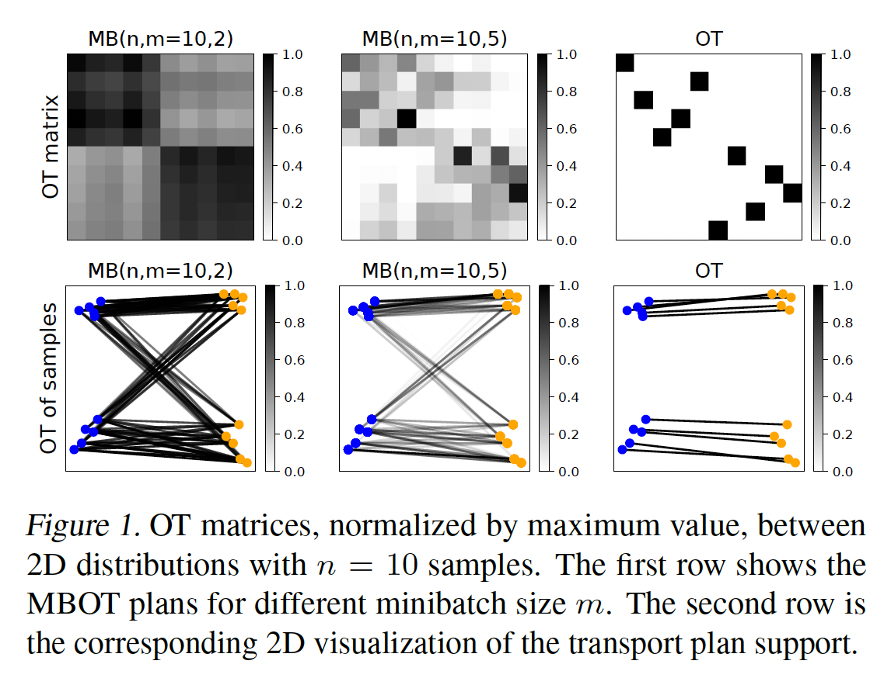
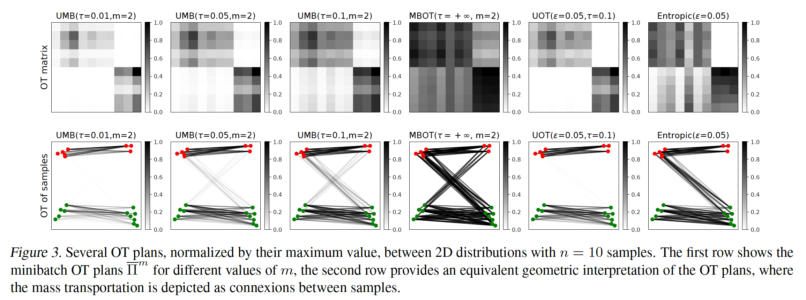
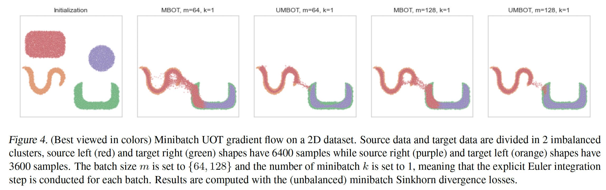
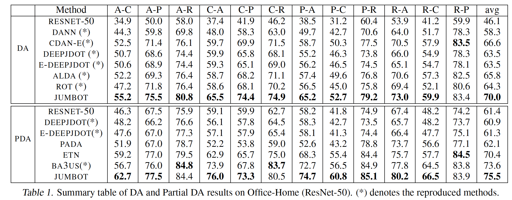
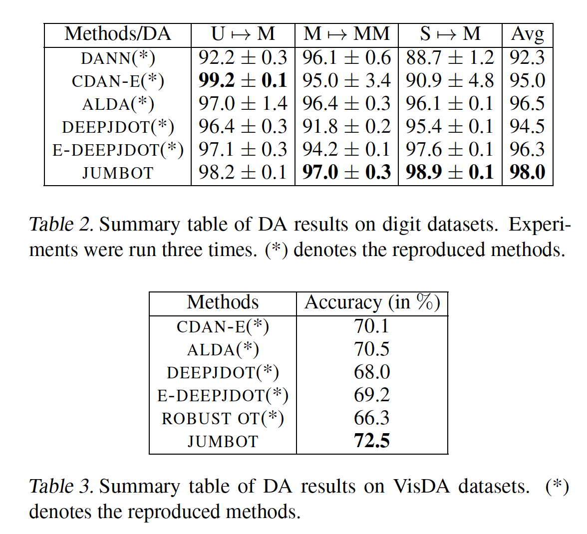
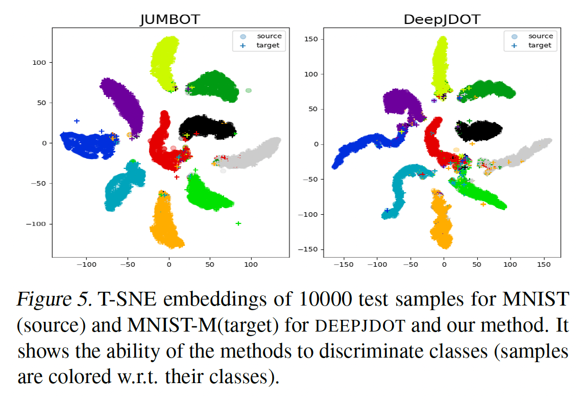
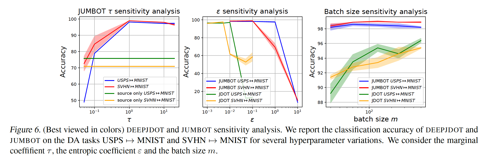

# Unbalanced minibatch Optimal Transport; applications to Domain Adaptation

**著者**: Kilian Fatras, Thibault Séjourné, Nicolas Courty, Rémi Flamary  
**所属**: Univ. Bretagne-Sud (CNRS, INRIA, IRISA) / ENS, PSL University / École Polytechnique, CMAP, France  
**出版**: Proceedings of the 38th International Conference on Machine Learning (ICML), PMLR 139, 2021

---

## 1. 論文の目的または目標は何ですか？

*Figure 1: 2D トイ例における OT 行列(上段)とサンプル間の対応(下段)。ミニバッチサイズ m が小さいほど輸送計画が滲み、無関係なサンプル同士が結ばれてしまう様子を示す。*

機械学習では2つの確率分布を比較する操作が頻出する。経験分布 $\alpha$ に対し、パラメータ $\lambda$ を持つモデル分布 $\beta_\lambda$ を当てはめる問題は、分布間の不一致度を測る関数(divergence)$L$ を用いて次のように書ける。

$$\lambda^* = \arg\min_\lambda L(\alpha, \beta_\lambda)$$

最適輸送(Optimal Transport, OT)は、非パラメトリックな確率分布同士を幾何的構造を考慮して比較できるため、この $L$ の有力な候補として生成モデルやドメイン適応など多くの場面で使われている。しかし OT は計算量が $O(n^3 \log n)$($n$ はサンプル数)と重く、大規模データへの直接適用が難しいという根本的な問題を抱えている。

この問題を緩和する代表的な手法が **ミニバッチ OT(Minibatch OT, MBOT)** である。データから小さなサブセット(ミニバッチ)を取り出して OT を計算し、それを平均することで近似する。計算面では魅力的だが、本論文はこの戦略に重大な欠点があることを指摘する。すなわち、**ミニバッチ化によって輸送計画が滑らかに「滲み」、本来結ばれるべきでないサンプル同士が対応付けられてしまう**(Figure 1 参照)。これは OT の「マージナル制約」(全サンプルを必ず輸送する制約)が、ミニバッチのサンプリング効果と組み合わさることで増幅されるために起こる。

本論文の目標は、この望ましくない結合を抑えるために、**マージナル制約を緩めた Unbalanced OT(UOT)をミニバッチレベルで使う**という代替的な定式化を提案し、その理論的性質を明らかにし、ドメイン適応で実用的な有効性を実証することである。提案手法 **Unbalanced Minibatch OT (UMBOT)** は、(i) ミニバッチサンプリング効果に対してロバストな損失を与え、(ii) UOT を近似しつつミニバッチサイズに対してスケールするため大規模データや深層学習で実用可能、という二つの利点を持つ。

---

## 2. トピックを探求するために使用された方法またはアプローチは何ですか？

### Unbalanced Minibatch OT (UMBOT) の定式化

本論文は (Liero et al., 2017) の Csiszár ダイバージェンスによる UOT 定式化を採用する。UOT は OT のハードなマージナル制約をソフトなペナルティに置き換えたもので、輸送計画を $\pi$、その周辺分布を $\pi_1, \pi_2$、ground cost を $c$ として次式で定義される。

$$\mathrm{OT}^{\tau,\varepsilon}_\phi(\alpha,\beta,c) = \min_{\pi \in \mathcal{M}_+(\mathcal{X}^2)} \int c\, d\pi + \varepsilon\,\mathrm{KL}(\pi\,|\,\alpha\otimes\beta) + \tau\bigl(D_\phi(\pi_1\|\alpha) + D_\phi(\pi_2\|\beta)\bigr)$$

ここで $\tau$ はマージナルペナルティ係数、$\varepsilon \ge 0$ はエントロピー正則化係数で、$\tau\to\infty$ で通常の OT に戻る。第3項のソフトペナルティにより、外れ値や対応相手のないサンプルを「無理に運ばず捨てる」ことが可能になり、ロバスト性が生まれる。なお、エントロピーを加えると $\mathrm{OT}^{\tau,\varepsilon}_\phi(\beta,\beta,c)\neq 0$ となり距離の性質が崩れるため、これを補正した **Unbalanced Sinkhorn ダイバージェンス** $S^{\tau,\varepsilon}_\phi$ も用いられる。

$$S^{\tau,\varepsilon}_\phi(\alpha,\beta,c) = \mathrm{OT}^{\tau,\varepsilon}_\phi(\alpha,\beta,c) + \tfrac{\varepsilon}{2}(m_\alpha - m_\beta)^2 - \tfrac{1}{2}\mathrm{OT}^{\tau,\varepsilon}_\phi(\alpha,\alpha,c) - \tfrac{1}{2}\mathrm{OT}^{\tau,\varepsilon}_\phi(\beta,\beta,c)$$

ミニバッチ UOT は、$h \in \{\mathrm{OT}^{\tau,\varepsilon}_\phi, S^{\tau,\varepsilon}_\phi\}$ を内側の損失とし、サイズ $m$ のミニバッチ(インデックス $m$-組 $I, J$)にわたって平均する **完全推定量 $\bar{h}^m$** で定義される。

$$\bar{h}^m_C(X,Y) := \binom{n}{m}^{-2} \sum_{I,J\in\mathcal{P}_m} h(u_m, u_m, C_{I,J})$$

これは計算量が膨大なため、ランダムに選んだ $k$ ペアだけで近似する計算可能な **不完全推定量** を用いる。

$$\tilde{h}^m_{k,C}(X,Y) := k^{-1} \sum_{(I,J)\in\mathcal{D}_k} h(u_m, u_m, C_{I,J})$$

両者とも U 統計量の理論により、真の期待値 $E_h = \mathbb{E}_{(X,Y)\sim\alpha^{\otimes m}\otimes\beta^{\otimes m}}[h(u_m,u_m,C^m(X,Y))]$ の不偏推定量となる。

*Figure 3: n=10 サンプルの 2D 分布間で得られる各種 OT 計画(最大値で正規化)。上段はミニバッチ OT 行列 $\Pi^{inv}_m$、下段はそれを質量輸送の接続として幾何的に表現したもの。マージナル係数 $\tau$ を小さくした UMB ほど無関係なサンプル間の結合が抑えられ、$\tau\to\infty$ の MBOT やエントロピー正則化では結合が滲む様子を示す。*

### 理論的性質の解析

- **偏差の上界(Theorem 1)**: 不完全推定量 $\tilde{h}^m_k$ と真の期待値 $E_h$ の偏差が、確率 $1-\delta$ で次のように抑えられることを示した。

$$|\tilde{h}^m_k(X,Y) - E_h| \le M\left(\sqrt{\frac{\log(2/\delta)}{2\lfloor n/m\rfloor}} + \sqrt{\frac{2\log(2/\delta)}{k}}\right)$$

  第1項はデータのランダム性($\sqrt{m/n}$ オーダー)、第2項はミニバッチサンプリング($\sqrt{1/k}$ オーダー)に由来する。$M$ は UOT の上界。収束レートは既存の OT 版とほぼ同じで、かつ **次元 $d$ に依存しない**。
- **外れ値へのロバスト性(Lemma 1)**: 外れ値で汚染した分布を $\tilde{\alpha}=\zeta\alpha+(1-\zeta)\delta_z$、外れ値の平均コストを $m(z)$ とすると、UOT は上界が飽和する一方、通常の OT は下界に $C(z,y^*)$ を含み外れ値が遠ざかると損失が無限に増加する。

$$\mathrm{OT}^{\tau,0}_{\mathrm{KL}}(\tilde{\alpha},\beta,C) \le \zeta\,\mathrm{OT}^{\tau,0}_{\mathrm{KL}}(\alpha,\beta,C) + 2\tau(1-\zeta)\bigl(1-e^{-m(z)/2\tau}\bigr)$$

  右辺第2項は $m(z)\to\infty$ で $2\tau(1-\zeta)$ に飽和する(頭打ちになる)。
- **不偏勾配と最適化(Theorem 2)**: UOT は微分不可能なことがあるが、Clarke 一般化微分を用いることで期待値と勾配の交換 $\partial_\theta\mathbb{E}[h]=\mathbb{E}[\partial_\theta h]$ が成り立ち、SGD が臨界点に確率1で収束することを保証した。これにより正則化なしの UOT でも深層学習で安全に使える。

### ドメイン適応への応用: JUMBOT

提案手法を教師なしドメイン適応に応用したものが **JUMBOT (Joint Unbalanced MiniBatch OT)** である。これは DeepJDOT (Damodaran et al., 2018) の OT 部分をミニバッチ UOT に置き換えたもので、埋め込み関数 $g_\theta$ と分類器 $f_\lambda$ を用い、特徴距離とラベルのクロスエントロピー $\mathcal{L}$ を組み合わせたジョイントコスト関数を持つ。

$$(C_{\theta,\lambda})_{i,j} = \eta_1\|g_\theta(x^s_i) - g_\theta(x^t_j)\|^2_2 + \eta_2\,\mathcal{L}\bigl(y^s_i, f_\lambda(g_\theta(x^t_j))\bigr)$$

全体の目的関数は、ソースの教師あり分類損失とミニバッチ UOT による転送項の和である。

$$\min_{\theta,\lambda}\ \sum_i \mathcal{L}\bigl(f_\lambda(g_\theta(x^s_i)), y^s_i\bigr) + \eta_3\,\tilde{h}^m_{k,C_{\theta,\lambda}}\bigl((X^s,Y^s),(X^t,f_\lambda(g_\theta(X^t)))\bigr)$$

Csiszár ダイバージェンスには KL を用い、$k=1$ で最先端の結果が得られた。

### 評価データセットと実験設定

勾配フロー(2D トイ例)に加え、digits 系(USPS→MNIST, MNIST→MNIST-M, SVHN→MNIST)、Office-Home(4 ドメイン・65 カテゴリ・12 シナリオ)、VisDA-2017(合成→実写・大規模)で評価。POT・Geomloss・PyTorch を用いて実装し、DANN, CDAN-E, DEEPJDOT, ALDA, ROT などの最新手法と比較した。

---

## 3. 主要な結果または発見は何でしたか？

*Figure 4: アンバランスなクラスタを持つ 2D データの勾配フロー。MBOT はターゲットの形状を崩すが、UMBOT は形状を保ちながら正しく対応付ける。*

**勾配フロー(Section 5.1)**: クラスサイズがアンバランス(6400 vs 3600)な 2D データで、MBOT はマージナル制約により全サンプルを無理に輸送してターゲット形状を崩すのに対し、UMBOT は形状を保ちながら正しい対応を作ることを視覚的に示した(Figure 4)。

**ドメイン適応の性能**: JUMBOT はすべてのベンチマークで最先端の性能を達成した。

- **Digits(Table 2 参照)**: 平均 98.0% で、既存手法を 1.5 ポイント以上上回り、基盤手法 DEEPJDOT に対しては 4 ポイント以上の改善。
- **Office-Home(Table 1 参照)**: 平均 70.0% を達成し、12 シナリオ中 11 で最高精度。既存 SOTA に対し平均約 4% の改善。
- **VisDA-2017(Table 3 参照)**: 72.5% で 2 ポイントの差で SOTA。

*Table 1: Office-Home(ResNet-50)における DA・Partial DA の結果。JUMBOT が DA で平均 70.0%、Partial DA で平均 75.5% を達成し最高精度。(*) は再現実装。*

*Table 2 / Table 3: (上)digits データセットの DA 結果。JUMBOT が平均 98.0% で最高。(下)VisDA データセットの DA 結果。JUMBOT が 72.5% で最高。(*) は再現実装。*

**Ablation study**: JUMBOT と DEEPJDOT の違いはエントロピー正則化と UOT 化の二つだが、中間段階の E-DEEPJDOT(エントロピーのみ追加)との比較から、**改善の主因は UOT 化であり、エントロピー正則化だけでは不十分**であることが分かった。Office-Home ではエントロピー単独では改善しなかった。

*Figure 5: MNIST→MNIST-M の t-SNE 埋め込み。JUMBOT はクラスタがきれいに分離するが、DEEPJDOT は重なりが見られる。*

**なぜ勝つのか(分析)**: USPS→MNIST タスクで、異なるラベル同士のペアリングの割合が DEEPJDOT では平均 7% であるのに対し、JUMBOT では 0.7% と約 10 分の 1 に減少した。これが誤ったラベル転送(negative transfer)を防ぐ。t-SNE 可視化でも JUMBOT のクラスタ分離の良さが確認された(Figure 5)。

*Figure 6: DEEPJDOT と JUMBOT の感度解析。マージナル係数 τ、エントロピー係数 ε、バッチサイズ m に対する精度変化。*

**感度解析(Figure 6)**: マージナル係数 $\tau$ には最適点があり($\tau \approx 1$ 付近で最高)、小さすぎると negative transfer、大きすぎると通常のエントロピー OT に退化する。最も劇的なのはバッチサイズへの依存性で、**JUMBOT はバッチサイズにほぼ依存せず安定**だが、DEEPJDOT は小さいバッチで 4〜6% も精度が低下する。これは JUMBOT が計算予算の小さい環境で有利であることを示す。

---

## 4. 結論は何であり，なぜそれが重要なのですか？

ミニバッチ化は大規模データを深層学習で扱うための一般的な手法であり OT と相性が良いが、OT のマージナル制約とサブサンプリング効果が組み合わさることで OT の欠点が増幅され、学習性能を損なう。本論文はこの問題を緩和するために、**マージナル制約を緩めた Unbalanced OT をミニバッチレベルで用いる**ことを提案した。

理論面では、不偏推定量の存在、勾配の存在、濃度(偏差)不等式といった重要な性質がミニバッチ UOT でも保たれることを示した。実用面では、提案手法 JUMBOT が負の結合効果を抑え、より効率的な分布間比較を実現し、困難なドメイン適応問題で最先端の性能に到達することを実証した。

**この研究の意義**は次の点にある。第一に、広く使われているミニバッチ OT の隠れた欠点(滑らかな滲み・誤った結合)を理論と実験の両面から明らかにした。第二に、その解決策として UOT のミニバッチ化を提案し、不偏推定・勾配・濃度といった理論的保証を整備したことで、単なる経験則ではなく原理に基づいた手法として確立した。第三に、小さなバッチサイズに対するロバスト性や過学習の抑制など、実環境での扱いやすさという実用的価値を示した。著者らは、実世界データを扱う際には OT よりも UOT の方が適している可能性を示唆しており、これらの結果が機械学習応用におけるミニバッチ Unbalanced OT の利用を促進すると結論づけている。