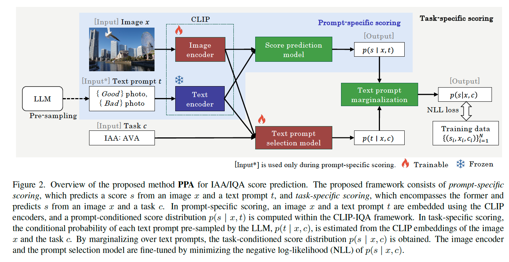
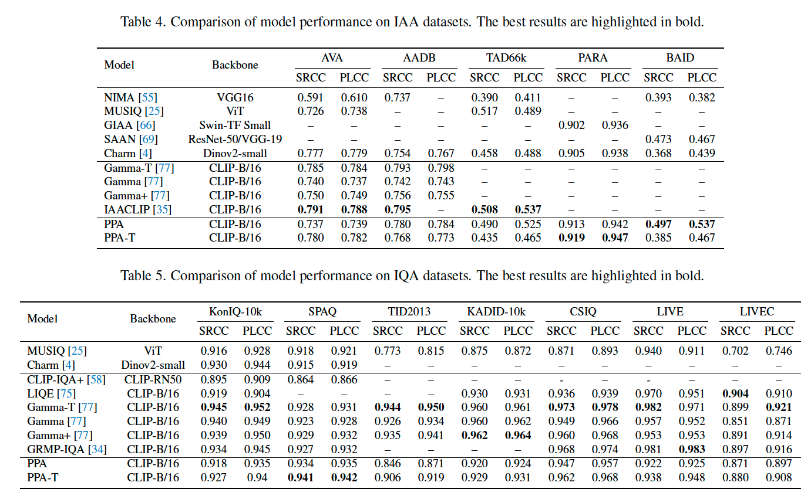
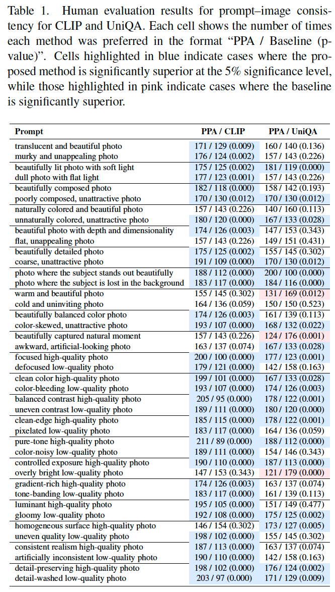
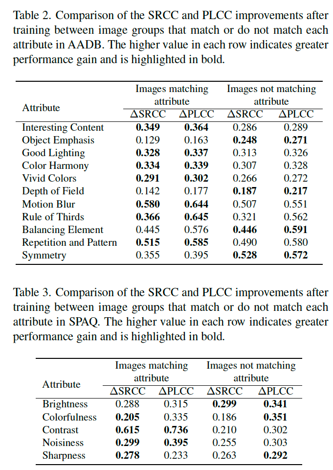
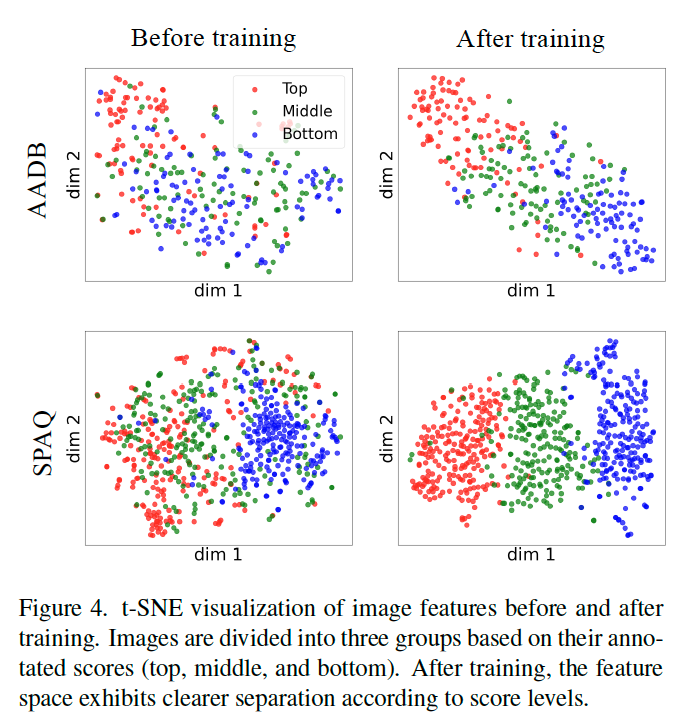

# Probabilistic Prompt Adaptation for Unified Image Aesthetics and Quality Assessment

**著者**: Takayuki Hara, Yuya Otsuka  
**所属**: LY Corporation  
**出版**: CVPR 2026 [1]

---

## 1. 論文の目的または目標は何ですか？

本研究の主な目標は、**画像の美的評価（IAA）と視覚的品質評価（IQA）の両方において、高い予測精度と、自由なテキスト指示（プロンプト）による柔軟な評価制御を統合的に実現すること**です [1, 2]。

既存の手法には、以下の二律背反する課題がありました：
- **精度の壁**: CLIP-IQAのようなテキスト駆動型モデルは柔軟ですが、特定のタスクに対する予測精度が専門モデルに劣ります [3]。
- **柔軟性の欠如**: 特定のデータセットで高精度なモデルは、あらかじめ定義された評価基準（スコア）しか出力できず、「透明感のある写真」といったユーザー独自の細かなニュアンスに応えることができません [3, 4]。
- **データの制約**: 属性レベルやプロンプトレベルのラベル付けには膨大なコストがかかるため、ラベルなしでこれらを学習する仕組みが求められていました [2, 3]。

本論文では、プロンプトを潜在変数として扱い、画像とタスクに応じて動的に重み付けを行う**Probabilistic Prompt Adaptation (PPA)** フレームワークを提案することで、これらの課題を解決しています [1, 5]。

---

## 2. トピックを探求するために使用された方法またはアプローチは何ですか？

### 2.1 確率的プロンプト適応 (PPA) フレームワーク
PPAの核心は、スコア予測を「画像 $x$ とタスク $c$ が与えられたときの、多様なプロンプト $t$ による予測値の混合分布」として定式化した点にあります [6, 7]。

1.  **プロンプト選択モデル ($p_\phi$)**: 画像の特徴とタスクの埋め込みベクトル（learnable vector）を入力とし、事前にLLMからサンプリングされた260種類のプロンプト集合（$T_{samp}$）の中から、その場面に最も適したプロンプトの確率分布（重み）を推定します [8, 9]。
2.  **スコア予測モデル ($p_\theta$)**: CLIP-IQAをベースとし、画像と各プロンプトのコサイン類似度からスコアを算出します。画像エンコーダには **CLIP-B/16** を採用し、知覚的整合性を高めるために最後の4ブロックを微調整（$\theta$）しています [10, 11]。
3.  **周辺化（Marginalization）**: 個別のプロンプトによる予測値を、推定された確率 $p_\phi$ で加重平均することで最終的なスコアを得ます [7, 12]。

### 2.2 アノテーションフリーな学習
本手法の大きな特徴は、**プロンプトごとの正解ラベルを必要としない**点です。学習には「画像、タスク、総合スコア」の三つ組みデータのみを使用し、負の対数尤度（NLL）を最小化する目的関数（式5）によって、プロンプトの選択重みと予測モデルを同時に最適化します [2, 7, 12]。

### 2.3 プロンプトのサンプリング
評価の多様性を確保するため、GPT-5を用いて美学（IAA）に関する11属性と品質（IQA）に関する9属性から合計260種類の対義語プロンプトペア（例：「鮮やかな写真」vs「くすんだ写真」）を事前に生成し、これらを「専門家の意見」として利用しています [13]。

---

## 3. 主要な結果または発見は何でしたか？

### 3.1 特定タスクにおける高い予測精度
PPAは、IAAおよびIQAの計12の主要ベンチマークデータセットで評価されました。
- **IAA性能（Table 4 参照）**: PARAやBAIDデータセットにおいて、従来のSOTAモデルを上回る精度を達成しました。AVAにおいても専門モデルに匹敵する性能を示しています [14, 15]。
- **IQA性能（Table 5 参照）**: SPAQにおいて最高精度を記録し、KonIQ-10kやLIVECといった野生の画像データセットでも極めて高い相関（SRCC/PLCC）を維持しています [14, 16]。

### 3.2 人間の知覚との整合性
757名の参加者による人間評価試験（Table 1 参照）の結果、PPAはCLIP-IQAやUniQAといった既存のVLMベース手法よりも、テキストの指示（プロンプト）と画像の内容が統計的に有意に一致していることが証明されました [17, 18]。特に、フォーカス、色彩、コントラストなどの物理的な属性において、人間の直感に近いスコア制御が可能になっています [18, 19]。

### 3.3 属性レベルの理解と解釈性
AADBおよびSPAQデータセットを用いた属性別評価（Table 2, 3 参照）では、PPAの学習によって「構図（Rule of Thirds）」や「ノイズ（Noisiness）」などの細かな属性の識別能力が大幅に向上することが確認されました [20-22]。また、t-SNEを用いた特徴空間の可視化（Figure 4 参照）では、学習後にはスコアの良し悪しに応じて画像が明確に分離されるようになり、モデルが評価基準を構造的に理解していることが示されました [23, 24]。

---

## 4. 結論は何であり，なぜそれが重要なのですか？

### 結論
本研究により、プロンプトを確率的に適応させるPPAフレームワークが、画像評価における**精度の高さと制御の柔軟性**を両立できることが示されました。本モデルは、特定のタスクをこなす「専門家」としての顔と、任意の言葉を受け付ける「汎用評価器」としての顔を併せ持っています [25]。

### 意義と貢献
- **実用性**: コンテンツ制作において、「温かみのある光」や「ピクセルの粗さ」といった具体的なキーワードに基づいた自動フィルタリングや検索が可能になります [3, 4]。
- **学習効率**: プロンプトごとの詳細なアノテーションが不要であるため、既存のスコアデータセットをそのまま活用して、高度なテキスト駆動型モデルを構築できます [2, 26]。
- **学術的貢献**: 美的評価と品質評価という、主観と客観が混ざり合う二つの領域を、単一の確率的枠組みで統合した点は、今後のマルチモーダル学習における重要なステップとなります [25, 27]。

今後は、マルチモーダル大規模言語モデル（MLLM）との統合を深めることで、より複雑で感情的な評価基準への適応や、評価理由のテキスト生成などへの発展が期待されます [27]。
