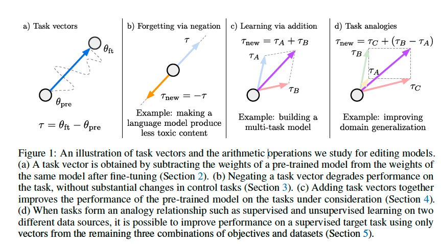
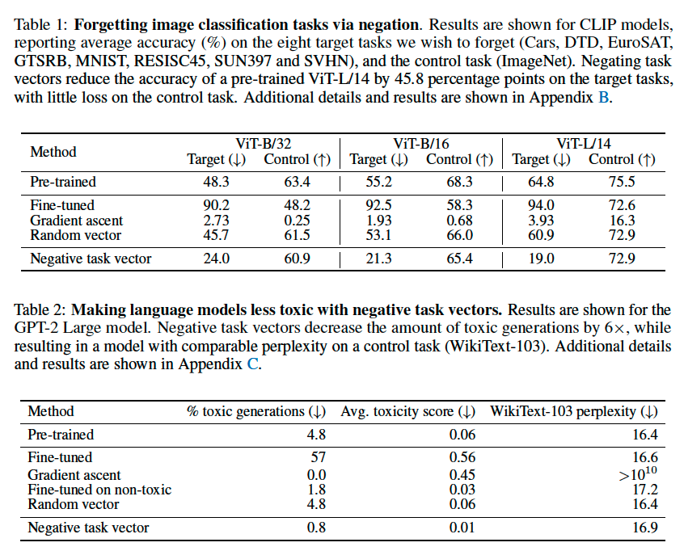
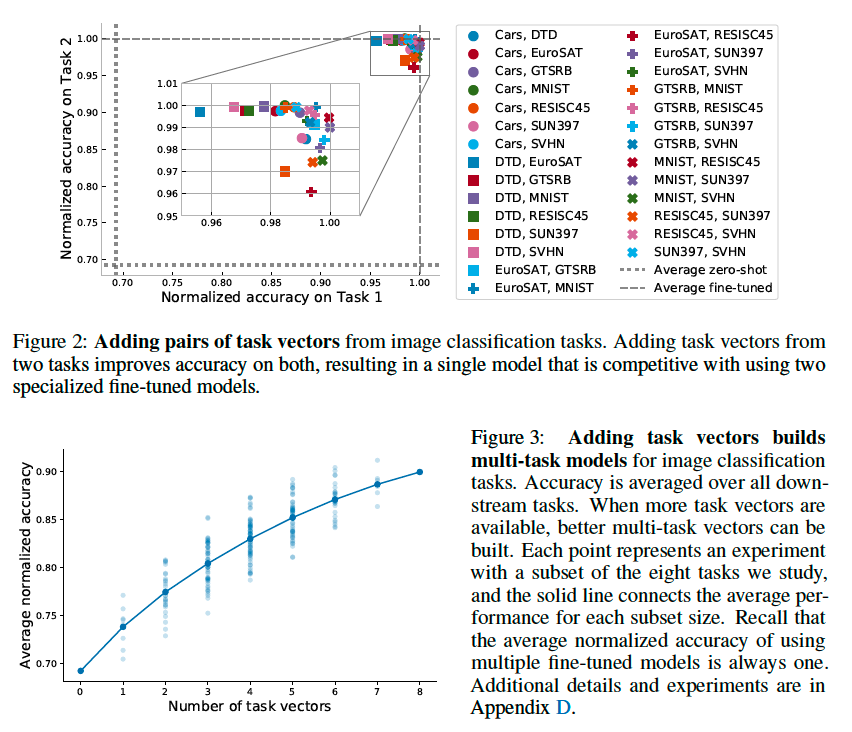
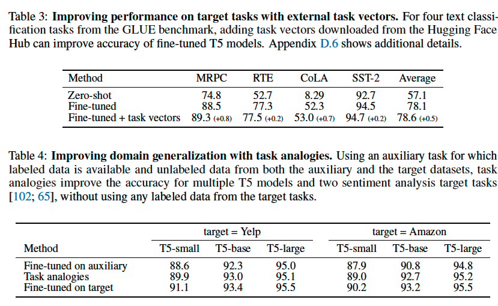
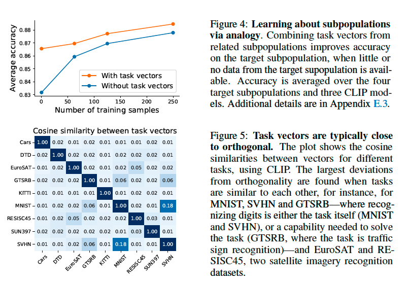
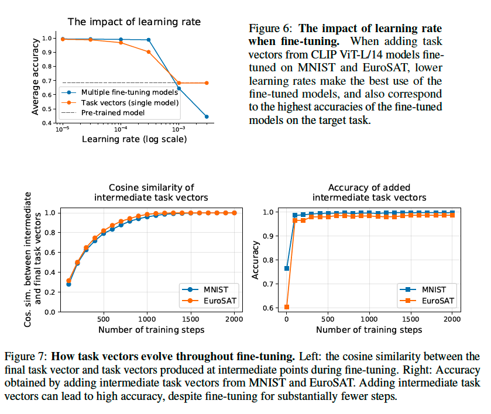

# Editing Models with Task Arithmetic

**著者**: Gabriel Ilharco, Marco Tulio Ribeiro, Mitchell Wortsman, Suchin Gururangan, Ludwig Schmidt, Hannaneh Hajishirzi, Ali Farhadi
**所属**: University of Washington, Microsoft Research, Allen Institute for AI
**出版**: ICLR 2023

---

## 1. 論文の目的または目標は何ですか？

事前学習済みモデルを下流タスクで使う際には、性能向上・バイアス除去・人間の選好への整合・新情報への更新など、事後的に振る舞いを編集したい場面が多々ある。本論文の目的は、こうしたモデル編集を**追加学習や訓練データへのアクセスを必要とせず**、効率的かつモジュラーに行える新しいパラダイムを提案することである。

具体的には、**task vector**（事前学習済みモデルの重みと、あるタスクでfine-tuningした後の重みの差分ベクトル）を導入し、その上での算術演算（否定・加算・類推）によってモデルの振る舞いを意図的に操作できることを示す。これは推論時の計算・メモリコストを増やさず、重み空間上の要素ごとの線形操作のみで完結する点が特徴である。

論文で扱う3つの算術操作は以下の通り（Figure 1参照）:

- **Negation（否定）**: 不要な振る舞い（例: 毒性のある生成、特定タスクの能力）を取り除く
- **Addition（加算）**: 複数タスクを単一モデルに統合、あるいは単一タスクの性能向上
- **Analogy（類推）**: 「AはBに対し、CはDに対する」という関係を使い、データの少ないターゲットタスクの性能を改善

---

## 2. トピックを探求するために使用された方法またはアプローチは何ですか？

### Task Vectorの定義

事前学習済みモデルの重みを $\theta_{\text{pre}}$、タスク $t$ でfine-tuning後の重みを $\theta^t_{\text{ft}}$ とすると、task vectorは要素ごとの差分として定義される:

$$\tau_t = \theta^t_{\text{ft}} - \theta_{\text{pre}}$$

編集後のモデルは $\theta_{\text{new}} = \theta + \lambda \tau_{\text{new}}$ で得られ、スケーリング係数 $\lambda$ はvalidationセットで決定する。

### 3つの算術操作

1. **Negation**: $\tau_{\text{new}} = -\tau$ — fine-tuned方向と逆向きに外挿する
2. **Addition**: $\tau_{\text{new}} = \sum_i \tau_i$ — 複数タスクのベクトルを足し合わせる
3. **Analogy**: $\tau_{\text{new}} = \tau_C + (\tau_B - \tau_A)$ — 4タスクが類推関係を成す場合

### 実験設定

- **画像分類**: CLIP（ViT-B/32, ViT-B/16, ViT-L/14）で8タスク（Cars, DTD, EuroSAT, GTSRB, MNIST, RESISC45, SUN397, SVHN）。コントロールタスクはImageNet
- **テキスト生成**: GPT-2（Small/Medium/Large）。毒性低減はCivil Commentsで毒性スコア > 0.8のサンプルでfine-tuning、評価はDetoxify。コントロールはWikiText-103のperplexity
- **NLP**: T5-baseをGLUE 4タスク（MRPC, RTE, CoLA, SST-2）でfine-tuning。Hugging Face Hubから427の外部チェックポイントをexternal task vectorsとして利用
- **ドメイン汎化**: T5（small/base/large）でAmazon・Yelpのsentiment analysisを類推により転移

### 比較対象（ベースライン）

事前学習モデル、fine-tunedモデル、勾配上昇によるfine-tuning（Golatkar et al., Tarun et al.）、layer-wiseに同じmagnitudeを持つランダムベクトル、非毒性データでのfine-tuning。

---

## 3. 主要な結果または発見は何でしたか？

### Negationによる忘却（Section 3）

CLIPでnegative task vectorを適用すると、ターゲット8タスクの平均精度をViT-L/14で**45.8ポイント**低下させつつ、ImageNetの精度はほぼ維持される（Table 1参照）。勾配上昇はターゲット精度をより下げるがコントロールタスクも崩壊させる。ランダムベクトルはどちらにもほとんど影響しない。

GPT-2 Largeでは毒性生成の割合を**4.8% → 0.8%（約6倍の削減）**、平均毒性スコアも0.06 → 0.01に低減し、WikiText-103のperplexityは16.4 → 16.9と僅差を維持（Table 2参照）。非毒性データでのfine-tuningより効果的。

### Additionによる学習（Section 4）

CLIPで2タスクのtask vectorを加算すると、ターゲット2タスク両方で高精度を維持する単一モデルが得られ、専用fine-tunedモデル2つを使う場合の**98.9%の正規化精度**を達成する（Figure 2参照）。8タスク全部を加算したベストモデルでも91.2%の平均正規化精度を達成（Figure 3参照）。

NLPでは、Hugging Face Hubから取得したexternal task vectorsをfine-tunedモデルに加えることで、MRPC・RTE・CoLA・SST-2いずれでも精度が向上（平均+0.5ポイント、Table 3参照）。

### Analogyによる転移（Section 5）

ターゲットタスクのラベル付きデータなしでも、補助sentiment分析タスクと両ドメインの教師なし言語モデリングを類推で組み合わせることで、Yelp・AmazonどちらをターゲットにしてもT5-small/base/largeで補助タスク単体fine-tuningを上回る精度を達成（Table 4参照）。

サブポピュレーション実験（写真とスケッチ × 2クラス集合）では、ターゲットなしの状態で平均**3.4ポイント**の精度向上を達成し、これはおおよそ100サンプル分のラベル付けに相当する効果（Figure 4参照）。

### 分析的知見（Section 6）

- **Task vectorはほぼ直交**: 異なるタスク間のcosine類似度は非常に小さく、これが加算による干渉の少なさを説明する（Figure 5参照）。意味的に近いタスク（MNIST/SVHN/GTSRB、EuroSAT/RESISC45）でのみ類似度が上がる

- **学習率の影響**: 大きい学習率はtask vector適用時の性能を急激に劣化させる（個別fine-tuningよりも顕著、Figure 6参照）
- **学習途中のtask vector**: 数百ステップで最終ベクトルとほぼ同じ方向に収束し、加算精度も早期に飽和（Figure 7参照）。計算節約の余地を示唆
- **重み平均とアンサンブル**: 2つのtask vector加算（λ=0.5）の精度は対応するfine-tunedモデルのアンサンブル精度とPearson相関0.99で一致（Figure 8参照、Appendix A）

---

## 4. 結論は何であり，なぜそれが重要なのですか？

本論文は、**task vectorとその上での算術演算**という、シンプルかつ統一的なモデル編集パラダイムを提示した。否定で能力を消去し、加算で多タスク化や単一タスク強化を行い、類推でラベルなしターゲットタスクへ転移できることを、画像分類（CLIP）・言語生成（GPT-2）・NLP（T5）の複数モダリティ・複数モデルで実証した。

この研究の重要性は次の点にある:

- **追加学習や訓練データへのアクセスが不要**: 重み空間上の要素ごとの線形操作のみで編集が完結する。Hugging Face Hubのような公開モデル群を再利用・転用できる実用的価値が大きい
- **推論コストの増加なし**: 編集後も同じアーキテクチャ・同じパラメータ数のため、メモリや計算量のオーバーヘッドがない。アンサンブルや混合エキスパート的アプローチに対する明確な利点
- **モジュラリティ**: 新しいタスクを追加する際にmulti-task学習をやり直す必要がなく、ベクトルを足すだけで対応可能。public checkpoint生態系との親和性が高い
- **理論的基盤との接続**: 重み補間・損失地形・線形モード接続の既存研究と整合し、外挿（extrapolation）まで領域を広げた点で寄与が大きい

**限界**: task vectorは(1)同一アーキテクチャ・同一事前学習初期化のモデル間でしか使えない、(2)fine-tuningによる獲得性能が小さいタスクではnegationが効きにくい、(3)スケーリング係数 $\lambda$ のチューニングが必要、といった制約がある。一方でBERT-baseやT5-smallのような「標準的」初期化を共有するチェックポイントが数千存在しており、適用可能な範囲は実用上十分広い。

著者らはコードを https://github.com/mlfoundations/task_vectors で公開しており、後続研究（task vector merging、task arithmetic拡張など）の基盤となっている。