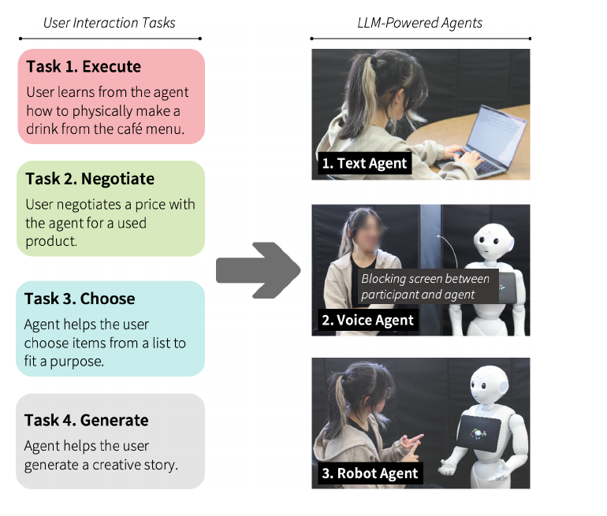
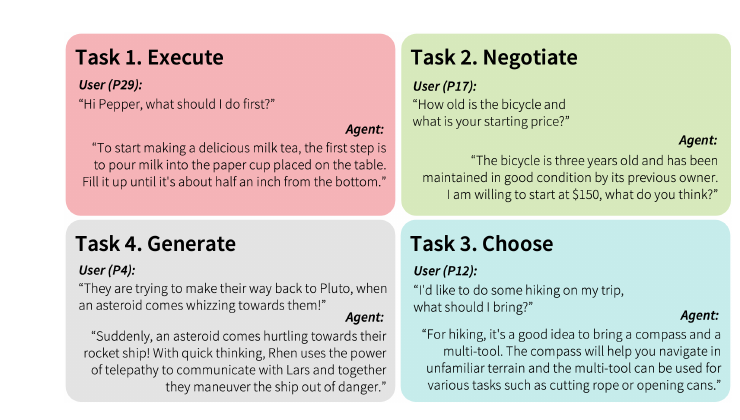
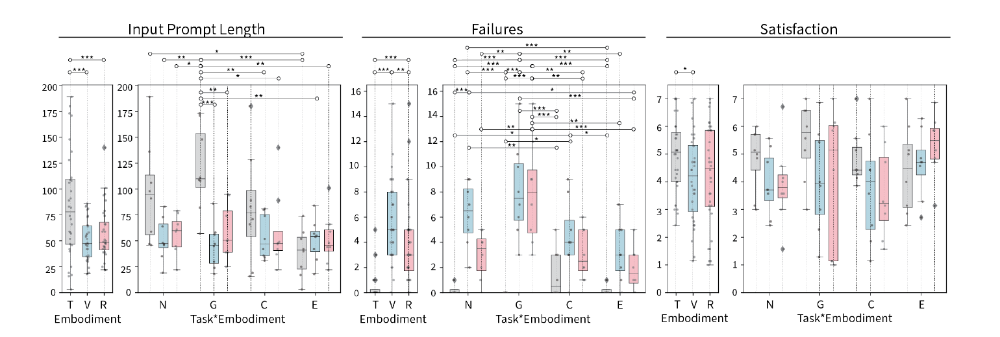
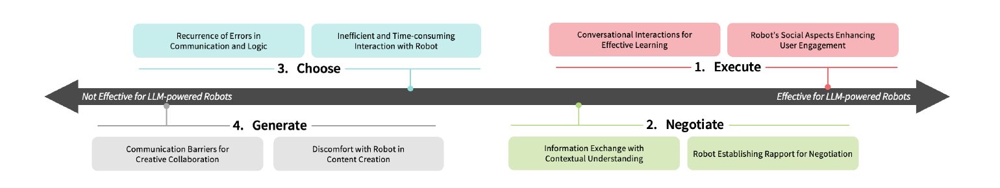

# Understanding Large-Language Model (LLM)-powered Human-Robot Interaction

**著者**: Callie Y. Kim*, Christine P Lee*, Bilge Mutlu  (* equal contribution)
**所属**: Department of Computer Sciences, University of Wisconsin–Madison (USA)
**出版**: HRI '24 (ACM/IEEE International Conference on Human-Robot Interaction), March 11–14, 2024, Boulder, CO

---

## 1. 論文の目的または目標は何ですか？

<b>図1</b>: ユーザスタディの構成。参加者は 4 タスク(Execute / Negotiate / Choose / Generate)のいずれか 1 つに割り当てられ、3 種類のエージェント(Text / Voice / Robot Pepper)とカウンタバランスされた順序で対話する。Voice 条件では Pepper を黒スクリーンで隠し、音声のみで対話する。

本論文は、**大規模言語モデル (LLM) を搭載したロボット**を人間-ロボットインタラクション(HRI)で活用する際の **固有の設計要件** を明らかにすることを目的としている。

LLM はライフライクな会話・文脈適応・一貫したインタラクションを可能にする一方、ロボットという身体性 (embodiment) を持つエージェントに統合した場合、Text や Voice ベースの対話とは異なる期待や知覚が生じることが先行研究 [16, 35, 41, 46] から示唆されている。しかし、

- **どのタスクで** LLM ロボットの利点が活きるのか
- **どの設計要素** が他の embodiment と区別される独自の要件となるのか

について体系的な知見が欠けていた。

そこで著者らは次の 3 つのリサーチクエスチョンを設定する:

1. 人々は LLM を搭載したロボットをどのように知覚するか
2. その知覚はタスク文脈によってどう変わるか
3. どのタスク文脈が「ロボット embodiment + LLM」の組み合わせから恩恵を受けるか

これに答えるべく、Text / Voice / Robot の 3 種類の LLM エージェントを、概念-行動 × 協調-対立の 2 軸で構成された McGrath [44] の "task circumplex" に基づく 4 つのタスクで比較する。

---

## 2. トピックを探求するために使用された方法またはアプローチは何ですか？

### Embodiment の設計

3 種類のエージェントはすべて **GPT-3.5 (OpenAI `text-davinci-003`)** をバックエンドとし、`temperature=0.7`, `max_tokens=2048` で統一されている (fine-tuning なし)。各タスクのプリプロンプトは Billing らの Pepperchat [7] と同一に揃えている。

- **Text Agent**: 標準的なチャットボット。ユーザはキーボード入力で OpenAI API と対話する。
- **Voice Agent**: 音声アシスタントを模倣。Pepper を黒スクリーンで物理的に隠し、`ALAudioDevice` で音声を取得 → Google Cloud Speech-to-Text → GPT → `ALAnimatedSpeech` で読み上げ。スマートスピーカではなく**同じ Pepper を遮蔽して使う**理由を著者らは2点挙げる: (1) スマートスピーカ・スマートディスプレイ・仮想アシスタントなど voice-based agents の広い設計空間の中で特定の技術に偏った比較になるのを避けるため、(2) voice / robot の両条件で音声インタラクションの品質を一貫させるため。
- **Robot Agent**: Pepper [58] を **animated gestures、text-to-speech、顔認識** という基本構成で運用 (Pepperchat 経由、Google Cloud STT 利用)。著者らは意図的に**ミニマリスト設計**を採用し、非言語的cuesのチューニングや視覚キュー(voice agent への表示など)などの特殊な設計上の工夫を行わず、各エージェントを *out-of-the-box* な構成のまま用いることで、3 つの embodiment の高レベルな違いを浮き彫りにする方針を取っている。

### タスクの設計 — McGrath Task Circumplex に基づく 4 タスク

<b>図2</b>: 各タスクのインタラクション例。Execute はカフェドリンクの作り方を教わる学習、Negotiate は中古品の価格交渉、Choose は旅行用具の絞り込み、Generate は架空の物語の共同創作。タスクごとに対話の型が大きく異なる。

circumplex は (1) 対立 ↔ 協調、(2) 概念 ↔ 行動 の 2 軸からなり、グループタスクを以下 4 カテゴリに分類する。本研究では各カテゴリを 1 つずつ実験タスクとして実装した:

| タスク | 論文での定義 | 本実験での具体シナリオ |
| --- | --- | --- |
| **Generate** | アイデアやプランを生成する | 参加者とエージェントが交互に 1 文ずつ足して架空の物語を共同創作 |
| **Choose** | 正解または合意可能な答えがある選択肢から解を選ぶ | 旅行用のアイテム集合から実用性重視で必要品を選定(エージェントごとにスキー/ビーチ/キャンプの3種で学習効果を防止) |
| **Negotiate** | 視点・利害・動機の対立を解消する | エージェントが中古品の売り手、参加者が買い手として価格交渉(最低価格は実験者が設定) |
| **Execute** | プランやパフォーマンスを実行する | エージェントが指示役となり、参加者がカフェメニューの飲み物を実際に物理的に作る学習タスク |

### 実験計画

- **被験者**: 32 名 (男性 10、女性 20、ジェンダークィア 1、ノンバイナリ 1)、年齢 18-59 歳 ($M=27.47, SD=10.30$)
- **設計**: 混合要因デザイン。**タスクは被験者間** (32 名を 4 タスクに 8 名ずつ割当)、**embodiment は被験者内** (Text / Voice / Robot をカウンタバランスで全員が経験)
- **手続き**: 約 60 分のセッション。各エージェントとの対話後にアンケートと半構造化インタビューを実施

### 測定指標

- **主観指標**: 改変版 Godspeed Questionnaire [5] (Animacy, Anthropomorphism, Likeability, Perceived Intelligence)。Perceived Safety はサブ尺度内で項目方向が一貫しなかったため除外。Satisfaction は USE Questionnaire [38] のサブ尺度 (7 件法、$\alpha=0.96$)。
- **行動指標**: 参加者プロンプトの **入力トークン数** (OpenAI API のトークナイザで計測) を会話長の代理として記録。
- **性能指標**: **Failures** を 2 種に分類してカウント — (1) Technical errors (エージェントの割り込み、ASR 誤認識など)、(2) Hallucinations (応答が文脈不整合 or 事実に反する)。
- **質的データ**: インタビュー逐語録を Clarke & Braun [13] の Thematic Analysis でコーディング。

### 解析

主観・行動・性能指標は反復測定 ANOVA (factorial) で task × embodiment の効果を検定。有意な場合は Tukey HSD で事後対比較を行う。質的データは話し合いを通じてコードブック化し、テーマを抽出する。

---

## 3. 主要な結果または発見は何でしたか？

### 定量結果 — Embodiment は入力長・失敗・満足度に有意な影響

<b>図3</b>: 入力プロンプト長 (左)、Failure 数 (中央)、Satisfaction (右) を、embodiment 単体および task×embodiment で示したボックスプロット。横線付き白丸は Tukey HSD による有意対比 ($^*p<.05$, $^{**}p<.01$, $^{***}p<.001$)。embodiment は T=Text, V=Voice, R=Robot、task は N=Negotiate, G=Generate, C=Choose, E=Execute。

- **入力プロンプト長**: 主効果あり $F(2,56)=14.30, p<.001$。Text > Voice = Robot。特に **Generate タスクで Text が突出して長い** ($F(6,56)=4.25, p=.001$)。創作のような認知負荷の高い場面では、参加者は音声よりも文章で構造化したい欲求があると解釈される。
- **Failures**: 主効果あり $F(2,56)=55.16, p<.001$。**Voice > Robot > Text** の順で失敗が多い。特に **Generate タスクで失敗が頻発** ($F(6,56)=5.94, p<.001$)。長く入り組んだ発話に対する ASR・割り込み制御の脆弱さが要因。
- **Satisfaction**: 主効果あり $F(2,56)=3.81, p=.028$。Text > Voice、Text > Robot は marginal な差。失敗の多寡が満足度に転写されている。
- **その他の Godspeed 項目** (Anthropomorphism / Animacy / Likeability / Perceived Intelligence) は **embodiment・task ともに有意差なし**。著者らは、サンプル数の少なさによる高分散と、minimalist robot design による非言語cuesの抑制が原因と考察している。

### 定性結果 — タスク別のテーマ

<b>図4</b>: 定性的発見のサマリ。LLM 搭載ロボットへの選好順は Execute → Negotiate(効果的)→ Choose → Generate(効果的でない)。Execute / Negotiate は「ラポール構築」「社会的関係」を要するタスクであり、ロボットの社会的存在感と LLM の能力が相乗効果を生む。一方 Choose / Generate ではロボットの物理性と社会的存在感がむしろ阻害要因となり、技術的失敗もこれを助長する。

#### Execute (最も好まれた)
**(a) Conversational Interactions for Effective Learning** — LLM の文脈理解により、自然な対話のなかで指示・補足質問・確認が自然に流れた。プロンプトが短く明瞭になりやすいタスクで、Failure もタスク中最も少ない (図3 中央)。P26: *"He's smart enough to teach me!"*
**(b) Robot's Social Aspects Enhancing User Engagement** — ドリンクを手で作りながら口頭で質問できるため、Text のように手を止めて入力する必要がなくマルチタスクが容易。Voice は応答タイミングが読みにくく "choppy" と評された一方、Robot は首の傾きや視線で考えていることを示し、リアルライクな対話感を生んだ。さらに 5 名の参加者は、将来的にロボットが**腕や身体を使って動作を実演する**ことを期待しており、**LLM の高度な言語能力が同等に高度な非言語cuesへの期待を引き上げている**ことが明確になった。P26: *"動きはランダムで話の質と合っておらず、むしろ creepy だった。"*

#### Negotiate (2 番目)
**(c) Information Exchange with Contextual Understanding** — 対話履歴を踏まえた連続的なやり取りで、商品状態・履歴・バンドル提案を自然に詰めていける。Text/Robot は応答完了が視覚的・非言語的に明示されるため Failure が少ないが、Voice は完了タイミングが読みにくく失敗が多い。
**(d) Robot Establishing Rapport for Negotiation** — 交渉成立にはラポールが本質的であり、Robot は視線・表情・身体動作で **「真剣に取引してくれる相手」** という知覚を醸成した。Text は便利だが "search engine" と見なされ、特に高価な商品(車など)での交渉相手としては不向きと評価された。P5: *"コーヒーマシンならまだしも、車を Text と交渉するのは sketchy。"*

#### Choose (好まれない)
**(e) Recurrence of Errors in Communication and Logic** — 候補を絞り込む過程で LLM が文脈不整合な提案(*"スキー旅行に砂を焼くトレイを持って行ってその上を滑れる"*)や前言撤回を繰り返した。Voice/Robot ではこの hallucination に加えて ASR 由来の技術的失敗も重なり、エンゲージメントを毀損する。
**(f) Inefficient and Time-consuming Interaction with Robot** — 参加者は事前にざっくり候補を持っており、「クイック検索」相当の情報粒度を期待していた。しかしロボットの会話は冗長な前置きを伴い、要点を引き出すまで何往復もかかる。Text は履歴がスクロール参照できる利点も加わり、効率面で大きく勝った。P8: *"Pepper は親切だけど、知りたい正確な情報には到達しないし、fluff が多くて結局何を言われたか思い出せない。"*

#### Generate (最も好まれない)
**(g) Communication Barriers for Creative Collaboration** — 物語創作は人名・特性・舞台設定など長く具体的なプロンプトを要する。Voice/Robot 経由ではリアルタイムに言語化することが難しく、無駄な pause が増え、ASR エラー・割り込みが頻発した (Failure 数最多)。Text は構造的に整理できるため好まれた。
**(h) Discomfort with Robot in Content Creation** — LLM の高度な言語能力が「賢い相手」という期待を生み、ロボットの視線が**創作プレッシャー・羞恥・不安**として知覚された。P6: *"Text のときはじっくり考えたが、ロボットだとすぐ返さなきゃと感じて、ありきたりな話をしてしまった。"* P19: *"テキストの方が accountability がなくて快適だった。"*

---

## 4. 結論は何であり、なぜそれが重要なのですか？

### 結論 — 4 つの設計示唆

著者らは Discussion で、研究結果から 4 つの設計示唆を導いている:

1. **LLM ロボットを豊かな非言語cuesと組み合わせる**
   LLM による高度な発話能力は、ユーザの中で「同等に高度な非言語cuesがあるはず」という期待を生む(これは Text / Voice 単体では発生しない、ロボット固有の効果)。視線 [25]、ジェスチャ [33, 64]、表情 [11] を発話と整合的に設計することが必須となる。

2. **タスク特性に応じた LLM のカスタマイズ / fine-tuning**
   Execute / Negotiate のような「関係性」「ラポール」を要するタスクは既存 LLM のままで概ね機能する。一方、Choose / Generate のような効率・正確性が肝になるタスクでは、**冗長な社会的描写を抑制する fine-tuning** やドメイン特化チューニング [37, 50, 74] が必要。

3. **ロボット設計へのLLM活用と境界設定**
   LLM はロボットの dialogue system / intent 抽出 / 対話バリエーション処理という従来コストの高い領域を肩代わりでき、パーソナライズ対話を低コストで実装可能にする。一方で **hallucination** やキャラクタからの逸脱はリスクであり、curated pre-training data [69, 73]、program verification [14, 65]、human-in-the-loop review [51] などで境界を設定する必要がある。

4. **限界と今後**
   - 比較対象が Text / Voice エージェントに限られ、**「非 LLM のロボット」との比較がない**点を著者自身が認める。Wizard-of-Oz やルールベースを用いた今後の検証が必要。
   - サンプル数 ($n=32$) によるバラつきが大きく、主観指標で多くが非有意。
   - Minimalist robot design のため、Pepper が持つ非言語的表現の真の上限はまだ未検証。

### 意義

- **HRI 設計と LLM 開発の双方向ガイドライン**: 「LLM をどう robot に乗せるか」と「ロボットに乗せる前提で LLM をどう作るか」の両側にまたがる初期の実証研究であり、Cherakara ら [11] や Irfan ら [25]、Yamazaki ら [74] のような特定タスク中心の研究と異なり、**タスク次元を体系的に切る** 視点を持ち込んだ。
- **タスク選定の指針**: McGrath circumplex を HRI に適用し、**社会的関係構築が中心のタスク(Execute / Negotiate)で LLM ロボットは強く、効率・正確性中心のタスク(Choose / Generate)では弱い**という実証的境界を提示した。今後 LLM ロボットの応用先(高齢者支援、教育、接客、コンパニオン)を選定する際の重要な参照点となる。
- **「期待のミスマッチ」という新たな失敗モード**: LLM の高度な発話能力が、非言語cuesや配慮への期待を引き上げ、それが満たされないと "creepy" や不安として返ってくる。これは LLM 時代の HRI における**新しいデザインリスク**であり、本研究はそれを実証データで言語化した点に大きな価値がある。

総じて本研究は、**LLM の能力をロボットに統合するだけでは十分でなく、タスク文脈と非言語的振る舞いに応じた「整合性のある設計」が必要**であることを、4 タスク × 3 embodiment の比較から鮮明に示した最初期のマイルストーンと位置付けられる。

---

## 付録 — 本論文以降の HRI × LLM 研究の流れ

> **注記**: 以下は本論文 (Kim et al. 2024) には記載されていない、レビュー筆者による論文外の追加コンテキストである。各文献は WebSearch / WebFetch で 2026 年 5 月時点の公開情報を照合した上で引用している。

結論から言えば、HRI 研究は本論文以後、「LLM をロボットに載せるとユーザがどう感じるか」から、「**LLM を含むロボットをどう設計・評価・統制するか**」へと重心が移っている。単なる *chatbot-on-robot* ではなく、身体性・非言語行動・長期相互作用・安全性・評価方法・透明性が中心論点である。

### 方向 1: LLM を「会話生成器」から「社会的行動生成器」へ

Kim et al. が示した「LLM の言語能力に見合う非言語キューへの期待」は、その直後の HRI 2024 で具体的な手法論として応答された。

- **Mahadevan et al., "Generative Expressive Robot Behaviors using Large Language Models," HRI 2024 (Best Paper, Technical Track)** — 著者: Karthik Mahadevan, Jonathan Chien, Noah Brown, Zhuo Xu, Carolina Parada, Fei Xia, Andy Zeng, Leila Takayama, Dorsa Sadigh。社会的文脈やユーザ指示から、ロボットの表現的行動(ジェスチャ・動作)そのものを LLM で生成する。ルールベースは新状況・新モダリティへの拡張が難しく、データ駆動は状況ごとに専用データを要するため、LLM の社会的文脈理解を使って**適応的・合成可能**な動作生成を行うという位置付け。DOI: 10.1145/3610977.3634999。

問いは「LLM が自然に話せるなら、ロボットはどう動き、どう間を取り、どう視線・身振りで社会的意味を伝えるべきか」に移っている。

### 方向 2: 短時間の実験から長期・複数回・実環境に近い評価へ

Kim et al. は単発のラボ実験だったが、その後は**反復セッション**での受容性や関係性の変化を見る研究が増えている。

- **Mauliana et al., "Exploring LLM-powered multi-session human-robot interactions with university students," Frontiers in Robotics and AI 2025** — 大学生 13 名(女性 5・男性 8)が 4 週間にわたって LLM 搭載の社会的ヒューマノイドロボット **EMAH** (Ameca [Engineered Arts] 上に Flan-T5-Large + RAG で実装)と対話した探索的研究。Sociability / Agency / Engagement は時間経過で安定し、Animacy は親密度と共に上昇する一方、Disturbance(不快感)は減衰しなかった。瞬間的な満足度より「何度も使いたいか」「関係性が深まるか」「期待外れや不気味さが蓄積するか」を測る視点が前面化している。DOI: 10.3389/frobt.2025.1585589。

### 方向 3: LLM を「人間モデル」として使う流れ

ロボットがユーザの感情・意図・信頼を推定する際に、LLM を**追加学習なしの zero-shot 人間モデル**として使う潮流がある。

- **Zhang & Soh, "Large Language Models as Zero-Shot Human Models for Human-Robot Interaction," IROS 2023** — 著者: Bowen Zhang, Harold Soh (CLeAR Lab, NUS)。3 つの社会的データセット上で、LLM が purpose-built モデルと同等の性能で人間の反応を予測できることを示し、ロボットのプランナーに統合して trust シナリオに応用した。同時にプロンプト感度・空間/数値推論の失敗といった限界も明示しており、「LLM が人間の感情を*知っている*」と主張するのではなく、**社会的判断の仮説生成器・人間モデルの近似・評価補助**として位置付ける慎重な使い方を提案している。arXiv:2303.03548。

### 方向 4: 透明性・報告基準・安全性の議論

LLM をロボットに統合した瞬間に、再現性・モデル名・プロンプト・ガードレール・API 更新・失敗例・安全境界などが研究品質の前提となる。これを正面から論じたのが Williams / Matuszek らの一連の仕事である。

- **Williams, Matuszek, Mead, DePalma, "Scarecrows in Oz: The Use of Large Language Models in HRI," ACM Transactions on Human-Robot Interaction (THRI) 2023** — LLM を**完成品のソリューションとしてではなく**、Wizard-of-Oz と同様の「身代わりモジュール (Scarecrow)」として暫定的にロボットアーキテクチャに組み込み、最終的には理論的に動機付けられた解で置き換えるべき、というスタンスを提示。倫理・安全・制御の観点で LLM を直接ロボットに載せるのが不適切な場合があると同時に、HRI の多くの構成要素に対しては有望な baseline / scaffold になり得ると論じる。DOI: 10.1145/3606261。〔注: ユーザの参考メモでは「THRI 2024」とあったが、THRI 本誌掲載は 2023 年。HRI Companion 2024 で同シリーズのワークショップ論文が別に発表されている。〕
- **Matuszek, Williams, DePalma, Mead et al., "Reporting Guidelines for Large Language Models in Human–Robot Interaction," ACM THRI 2026** — LLM が vision / manipulation / planning / reasoning / learning / HRI に black-box モジュールとして組み込まれている現状を踏まえ、HRI 研究で LLM 利用をどう報告すべきかをガイドラインとして提案した。**モデル名・バージョン・プロンプト・温度・失敗処理・人間の監督・安全境界**を明示しない研究は今後弱く評価されやすい。DOI: 10.1145/3777552。

### 方向 5: HRI 全体としては「人間中心評価」の成熟へ

LLM 一色の潮流に見えるが、HRI 本流はむしろ**実環境・長期・人間行動・相互作用理解**を依然として中核に据えている。

- **HRI 2025**: 458 件のアブストラクト→ 400 件の完全投稿 → 100 件採択(採択率 25%)。Full Paper は **Theory and Methods / Design / Technical / Systems / User Studies** の 5 トラックに分かれ、貢献の種類を明示することを求める設計になっている。
- **HRI 2025 Best Paper の 1 つ**は LLM 研究ではなく、Ramnauth, Shic, Scassellati (Yale) による *"Gaze Behavior During a Long-Term, In-Home, Social Robot Intervention for Children with ASD"* に贈られた。ASD 児の家庭内長期介入における視線パターン研究で、長期・実環境・人間行動という HRI 本流の価値観が依然として中核にあることを示している。

### 本論文 (Kim et al. 2024) の現在的位置付け

以上 5 つの方向の起点として読むと、本論文の貢献は単に「LLM ロボットを評価した」ではなく、

1. **方向 1 の問題提起者**: 言語と非言語の整合性ギャップを実証データで指摘した。
2. **方向 2 への前提条件**: 単発実験での選好を確立することで、長期評価が比較できる基準値を提供した。
3. **方向 4 の動機付け**: hallucination・期待ミスマッチを embodiment 別に観察したことが、報告ガイドライン議論の素材になった。

つまり、LLM × HRI 研究の流れの中で、**「何を測るべきか」と「何が問題になるか」のスコープを 4 タスク × 3 embodiment 比較で言語化した節目の研究**として読み直せる。一方で、Kim et al. 以降の HRI コミュニティでは「LLM を使った」だけでは不十分であり、**人間との相互作用に関する具体的な知識貢献**(行動生成、長期効果、人間モデル、報告基準、社会的影響)が問われる段階に入っている。
