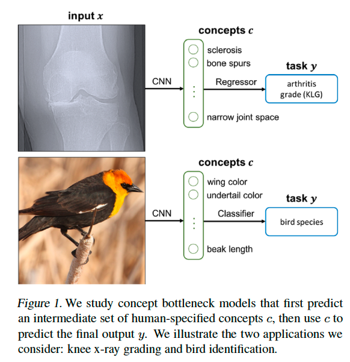
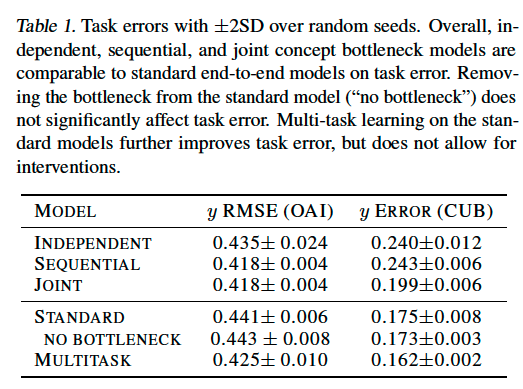
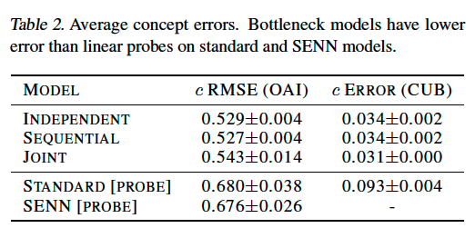
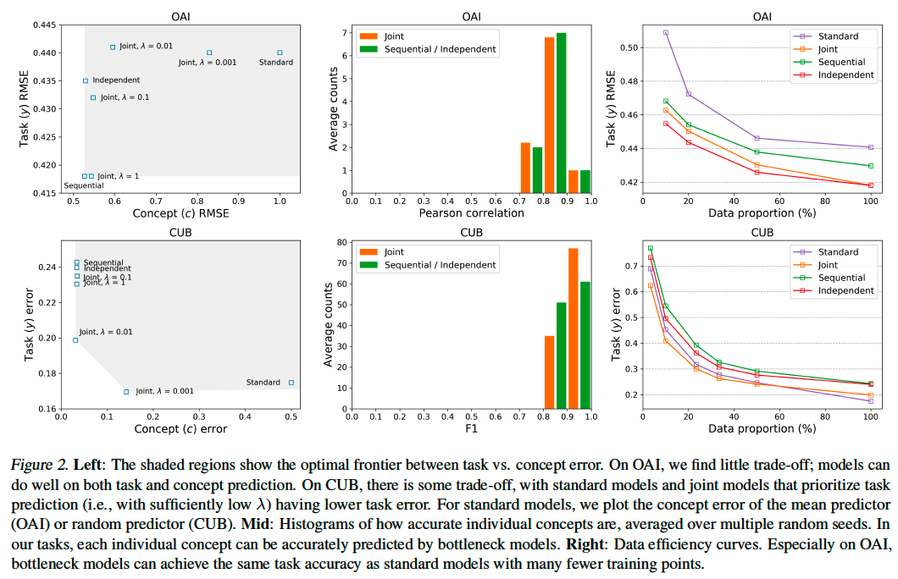
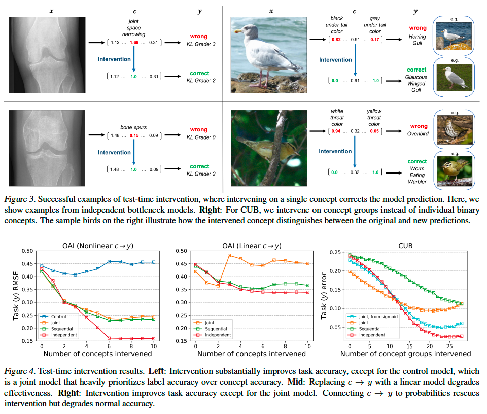
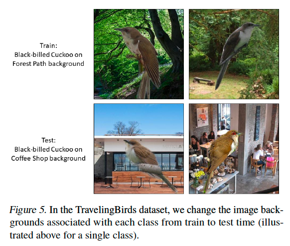
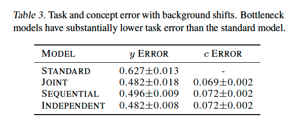

# Concept Bottleneck Models

**著者**: Pang Wei Koh*, Thao Nguyen*, Yew Siang Tang*, Stephen Mussmann, Emma Pierson, Been Kim, Percy Liang (*Equal contribution).  
**所属**: Stanford University, Google Research.  
**出版**: Proceedings of the 37th International Conference on Machine Learning (ICML), PMLR 119, 2020

---

## 1. 論文の目的または目標は何ですか？

<p align="center"></p>

本論文は、**機械学習モデルと人間が高レベルな概念（concepts）を介して相互作用できる仕組み**を構築することを目的としている。例えば、放射線科医が膝のX線画像から変形性関節症の重症度を予測するモデルを使う際、「もしモデルが骨棘（bone spur）が無いと判断したら、依然として重度の関節炎と予測するか？」といった介入的な問いをモデルに投げかけたい、という動機である。

しかし、現在のSOTAモデルは生の入力 *x*（ピクセル）から出力 *y*（関節炎の重症度）へ直接end-to-endに学習されており、「関節腔の狭小化」「骨棘の存在」といった臨床医が用いる高レベル概念で操作することができない。

そこで著者らは、古典的アイデアである「**まず人間が指定した概念 *c* を予測し、その概念を用いて最終的な目的変数 *y* を予測する**」という二段階構造の **Concept Bottleneck Model (CBM)** を再検討し、以下の問いに答えることを目指している:

- タスク精度と概念解釈性の間にトレードオフは存在するか？
- テスト時の概念への介入（intervention）はモデル精度を改善するか？
- 異なる学習方法（独立、逐次、結合）はどのような違いを生むか？
- 概念ボトルネックは分布シフトに対してロバストか？

---

## 2. トピックを探求するために使用された方法またはアプローチは何ですか？

### Concept Bottleneck Model の構造

モデルは *f(g(x))* の形式を持ち、*g: ℝᵈ → ℝᵏ* が入力 *x* を概念空間にマップし、*f: ℝᵏ → ℝ* が概念から最終予測を行う。学習データは三つ組 *(x, c, y)* で、入力に概念 *c* と目的変数 *y* の両方が注釈されている。**任意のニューラルネットワークの中間層を概念数 *k* に合わせてリサイズし、その層に概念予測損失を追加する**だけで CBM に変換できる。

### 3つの学習方法

1. **Independent bottleneck**: *g* と *f* を独立に学習。*f* は真の *c* で訓練するが、テスト時は *ĝ(x)* を入力として受け取る。
2. **Sequential bottleneck**: まず *g* を学習し、その予測 *ĝ(x)* を用いて *f* を学習。
3. **Joint bottleneck**: タスク損失と概念損失の重み付き和 *L_Y + λΣL_C* を同時最小化。λ→0 で標準モデル、λ→∞ で sequential に対応。

### データセットと応用

- **OAI（X線関節症グレーディング）**: Osteoarthritis Initiative の膝X線データ（n=36,369）。Kellgren-Lawrenceグレード（4段階）を予測。概念は骨棘・硬化・関節腔狭小化など放射線科医が用いる *k=10* の臨床概念（回帰問題）。アーキテクチャは ResNet-18 + 3層MLP。
- **CUB（鳥の種同定）**: Caltech-UCSD Birds-200-2011（n=11,788）。200種の鳥の分類。概念は翼の色・くちばしの形状などの *k=112* のバイナリ属性。アーキテクチャは Inception-v3 + 線形層。

### 評価項目

タスク精度、概念精度、テスト時介入による精度向上、データ効率、ポストホック解析（線形プローブ、SENN）との比較、TravelingBirds データセット（背景を訓練／テストでシャッフル）による分布シフトへのロバスト性。

---

## 3. 主要な結果または発見は何でしたか？

### (1) タスク精度と概念精度の両立

CBMは標準のend-to-endモデルと**同等または上回るタスク精度**を達成しつつ、各概念を高精度に予測できる（**Table 1, Table 2 参照**）。OAIでは joint・sequential bottleneck が標準モデルより低いRMSEを示した。CUBでは標準モデル（0.175）と joint bottleneck（0.199）の差は小さく、概念予測は平均誤差0.03程度と高精度だった。**Figure 2-Left** が示すように、タスク誤差と概念誤差の間に大きなトレードオフは観察されなかった。

<p align="center"></p>
<p align="center"></p>
<p align="center"></p>

### (2) ポストホック解析より優れた概念予測

標準モデルや SENN（Self-Explaining Neural Network）の中間層から線形プローブで概念を復元する手法と比較すると、CBMの概念精度は大幅に高い（OAIで概念RMSE 0.53 vs プローブ0.68、CUBで誤差0.03 vs 0.09）。**事前に概念を知っているなら、それを使って訓練する方がポストホック復元より効果的**であることが示された。

### (3) テスト時介入による精度向上（最重要発見）

**Figure 4 参照**。オラクルが概念の真値を教える形で介入すると、タスク精度が大幅に向上する:

- **OAI**: 2つの概念に介入するだけでRMSEが0.4超から約0.3に低下。10概念全てに介入した independent bottleneck は0.15程度まで誤差が下がる。
- **CUB**: 概念グループへの介入で誤差が大きく低下（25グループ全介入で約0.03）。

興味深いのは **independent bottleneck が介入時に最も効果的**だったこと。これは *f* が真の *c* で訓練されており、介入で *ĉ* が真値に置き換わったとき訓練分布と一致するためと解釈される。一方、joint で λ が小さすぎる場合（λ=0.01）は概念表現が真の概念とずれており、介入が逆効果となる場合もあった（"control" 曲線）。

**成功例（Figure 3 参照）**: X線で「骨棘=0.15」と誤予測したケースで人間が「1.0」に修正するとKLG予測が0→2に変わり正解となる。鳥の例では「黒色の尾下覆」を「灰色」に修正することで Herring Gull → Glaucous Winged Gull に修正される。

<p align="center"></p>

### (4) データ効率

OAIでは sequential bottleneck が**全データの約25%で標準モデルと同等のタスク精度**を達成。良い概念があれば学習データ数を削減できる（**Figure 2-Right 参照**）。

### (5) 分布シフトへのロバスト性

**TravelingBirds データセット**（訓練時とテスト時で背景画像をシャッフル、Figure 5 参照）における結果（**Table 3 参照**）では、標準モデルの誤差0.627に対し CBM は0.48程度と大幅に良好。概念が複数クラス間で共有されるため背景との偽相関が弱まり、分布シフトに強くなる。

<p align="center"></p>
<p align="center"></p>

### (6) 理論解析

線形回帰の枠組みでの解析（Appendix C）により、**概念数 k が入力次元 d より十分小さく、かつ概念のノイズが目的変数のノイズより小さいとき**、独立ボトルネックモデルの過剰誤差は標準モデルより小さくなることが示された:

```
過剰誤差比 ≤ (k/d) · (σ²_Y + σ²_C) / (σ²_Y + σ²_C)
```

---

## 4. 結論は何であり，なぜそれが重要なのですか？

**結論**: Concept Bottleneck Model はタスク精度を犠牲にすることなく、人間が理解できる高レベル概念に基づいた**解釈可能性**と**介入可能性**を提供する。さらに、テスト時に専門家がモデルの誤った概念予測を修正することで、人間とモデルの協調による予測精度の大幅な向上が可能となる。

**重要性と意義**:

1. **「精度 vs 解釈性のトレードオフ」という通説への反証**: 概念ボトルネックを導入してもタスク精度は劣化せず、むしろ向上する場合もあることを実証的に示した。

2. **真の意味でインタラクティブなモデル**: ポストホック解釈と異なり、ユーザーが概念値を直接編集して反事実的（counterfactual）な予測を得られる。「骨棘がないと判断していたら、関節炎の重症度予測はどう変わるか？」という臨床的に意味のある問いに答えられる。

3. **医療をはじめとする高stakes領域への応用可能性**: 医療では概念（症状・所見）が標準的に定義されており、放射線科医が画像を見る際に追加で概念注釈を付けるコストは比較的低い。一方で診断ミスのコストは高く、人間との協調が望まれる。著者らは網膜疾患診断、心臓MRI解釈、嵐予測など類似タスクへの直接適用を期待している。

4. **将来研究の方向**: 概念が不完全な場合の側路（side channel）の追加、概念集合の対話的な学習、適応的な介入戦略（情報利得を最大化する概念選択）、介入から学習し続けるモデルなど、多くの拡張可能性がある。

5. **データ効率と頑健性**: 良い概念があれば少ないデータで高精度を達成でき、また偽相関による分布シフトにも強い。これは実用上極めて重要な性質である。

本論文は、ディープラーニングの解釈性研究において、ポストホック手法に頼らず**設計段階から解釈性を組み込む**という方向性を強く後押しするものであり、その後の概念ベース解釈研究に大きな影響を与えた重要な研究と位置づけられる。