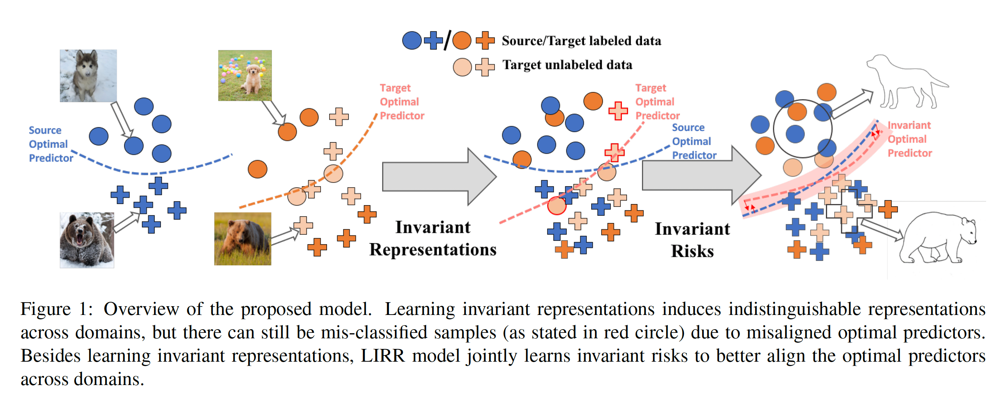
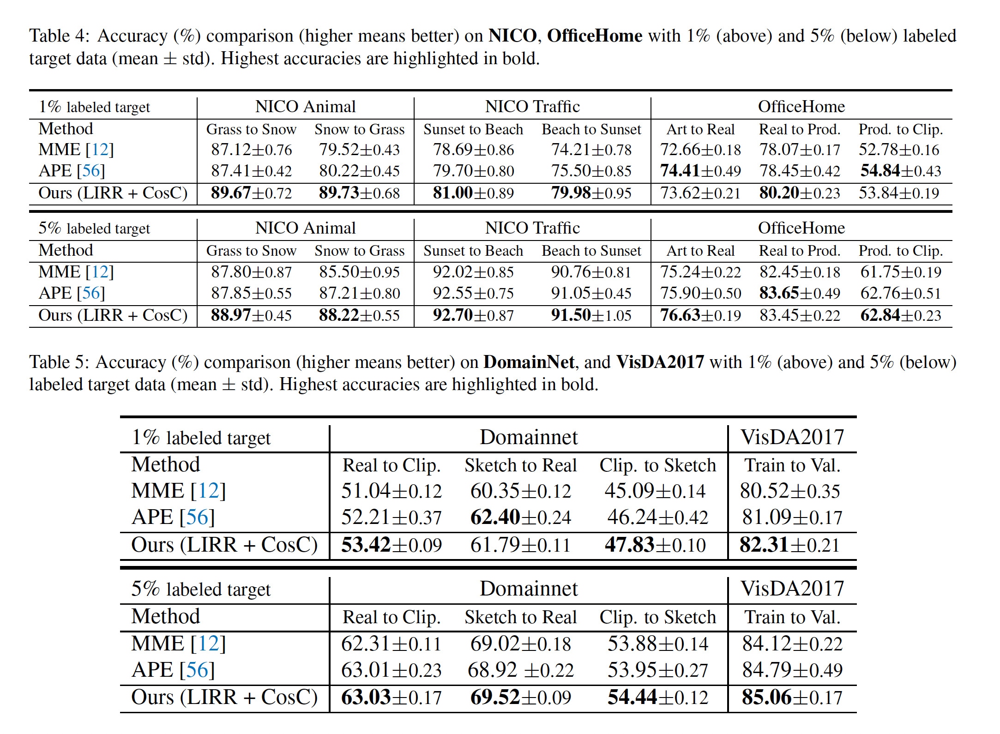
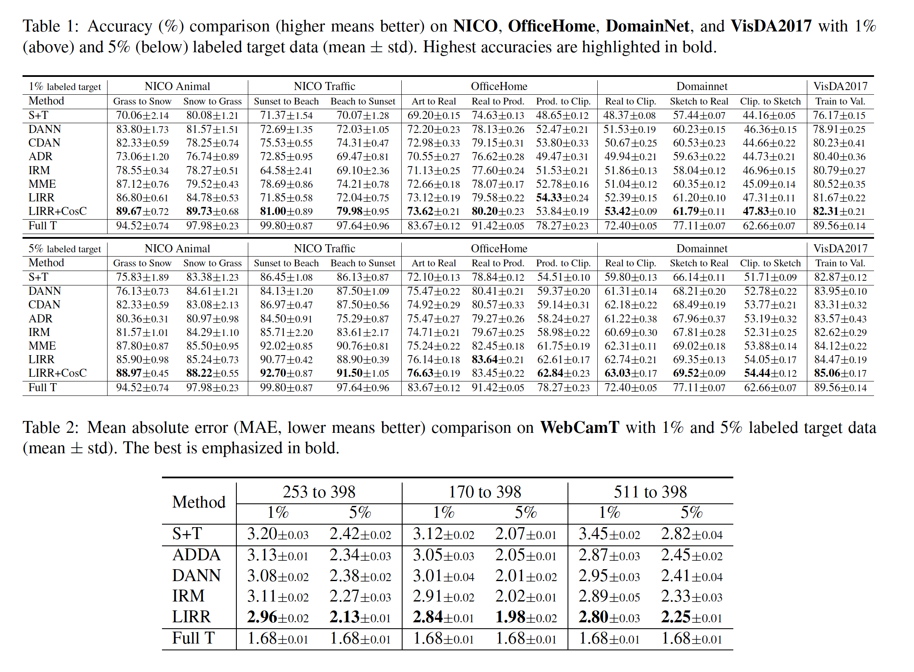
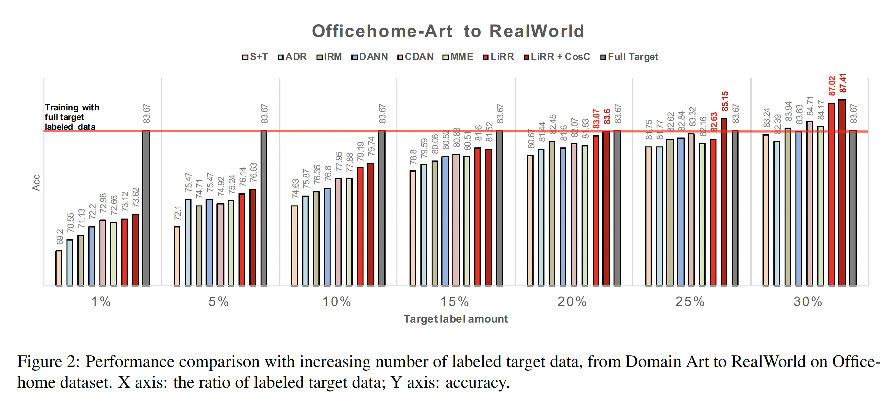
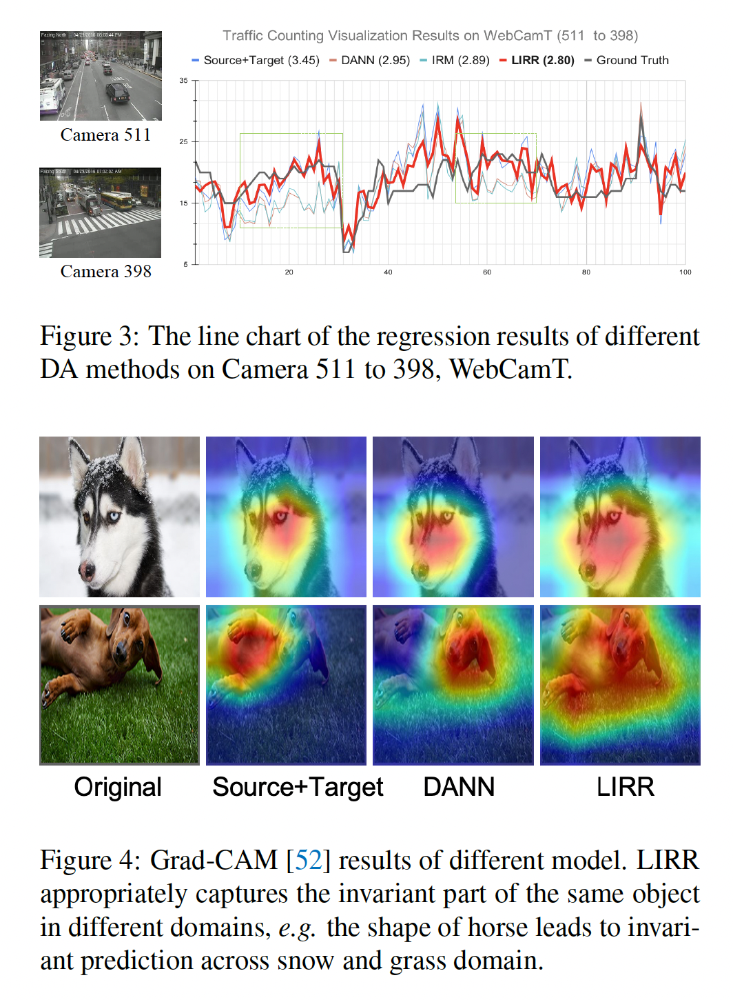

# Learning Invariant Representations and Risks for Semi-supervised Domain Adaptation

**著者**: Bo Li, Yezhen Wang, Shanghang Zhang, Dongsheng Li, Kurt Keutzer, Trevor Darrell, Han Zhao.  
**所属**: UC Berkeley (BAIR), UC San Diego, Microsoft Research Asia, UIUC.  
**出版**: arXiv (2010.04647v3) 2021.  

---

## 1. 論文の目的または目標は何ですか？

教師あり学習はソースとターゲットのデータが同一分布から得られる前提に依存するが、現実の応用ではドメインシフトが頻繁に発生し、この前提が崩れる。従来の Unsupervised Domain Adaptation (UDA) はラベルなしターゲットデータに対する適応を目指し、ドメイン不変な表現の学習に注力してきた。しかし近年の研究により、ラベル分布がドメイン間で異なる場合、不変表現の学習だけではターゲットでの汎化を保証できず、むしろ性能を悪化させ得ることが示されている。

一方、現実の応用(車両カウント、物体検出、音声認識など)では、ターゲットドメインから少量のラベル付きデータを取得することが多くの場合可能である。本論文はこの実用的な設定である **Semi-supervised Domain Adaptation (Semi-DA)** に焦点を当て、次の問いに答えることを目標とする:

> **「少量のターゲットラベルを最大限活用し、ターゲットでの汎化性能を高めるにはどう設計すべきか?」**

具体的な貢献の目標は以下の3点である:

1. Semi-DA における分類・回帰問題に対する **finite-sample 汎化バウンド** を導出すること
2. 上記バウンドから、特徴の周辺分布と条件付き分布の **両方** を同時に揃える原理的な学習指針を導くこと
3. その指針を実装した **LIRR (Learning Invariant Representations and Risks)** アルゴリズムを提案し、有効性を実証すること

---

## 2. トピックを探求するために使用された方法またはアプローチは何ですか？

### 2.1 理論的アプローチ:Semi-DA における汎化バウンドの導出
 
#### 設定と記号
 
ソースから $n$ 個のラベル付きサンプル $S = \{(x_i^{(S)}, y_i^{(S)})\}_{i=1}^n$、ターゲットから少量の $m$ 個のラベル付きサンプル $\tilde{T} = \{(x_j^{(\tilde{T})}, y_j^{(\tilde{T})})\}_{j=1}^m$($m \ll n$)が与えられる。  
$g: \mathcal{X} \to \mathcal{Z}$ を特徴抽出器、$h: \mathcal{Z} \to \{0,1\}$ を仮説とし、各ドメインの最適予測器を条件付き平均関数 $f_S(Z) := \mathbb{E}_S[Y \mid Z]$、$f_{\tilde{T}}(Z) := \mathbb{E}_{\tilde{T}}[Y \mid Z]$ と定義する。  
ノイズ量は $n_S := \mathbb{E}_S[|Y - f_S(Z)|]$、$n_{\tilde{T}} := \mathbb{E}_{\tilde{T}}[|Y - f_{\tilde{T}}(Z)|]$ で測る。
 
#### Theorem 4.1(分類版)
 
$\mathcal{H}$ を VC 次元 $d$ の仮説集合とすると、信頼度 $1 - \delta$ で次が成立する:
 
$$
\begin{aligned}
\varepsilon_T(h) \leq\; & \underbrace{\frac{m}{n+m}\widehat{\varepsilon}_{\tilde{T}}(h) + \frac{n}{n+m}\widehat{\varepsilon}_S(h)}_{\text{(A) 経験誤差の凸結合}} \\
& + \frac{n}{n+m}\Big\{\underbrace{d_{\mathcal{H}\Delta\mathcal{H}}(\widehat{\mathcal{D}}_S(Z), \widehat{\mathcal{D}}_T(Z))}_{\text{(B) 周辺分布距離}} + \underbrace{\min\{\mathbb{E}_S[|f_S - f_{\tilde{T}}|], \mathbb{E}_T[|f_S - f_{\tilde{T}}|]\}}_{\text{(C) 最適予測器距離}}\Big\} \\
& + \underbrace{\frac{n}{n+m}|n_S + n_{\tilde{T}}|}_{\text{(D) ノイズ項}} + \underbrace{O\!\left(\sqrt{\left(\tfrac{1}{m} + \tfrac{1}{n}\right)\log\tfrac{1}{\delta} + \tfrac{d}{n}\log\tfrac{n}{d} + \tfrac{d}{m}\log\tfrac{m}{d}}\right)}_{\text{(E) 有限サンプル収束項}}
\end{aligned}
$$
 
各項の意味は次の通り:
 
- **(A)**: ソースとターゲットの経験誤差の凸結合。重みはサンプル数比 $\frac{n}{n+m}, \frac{m}{n+m}$ で決まり、ターゲットラベルが増える($m$ が増える)ほど $\widehat{\varepsilon}_{\tilde{T}}$ の寄与が大きくなる。
- **(B)**: 特徴空間 $Z$ 上での周辺分布のずれを、対称差仮説クラス $\mathcal{H}\Delta\mathcal{H}$ に基づく擬距離 $d_{\mathcal{H}\Delta\mathcal{H}}$ で測る項。**不変表現学習** で最小化される。
- **(C)**: ソースとターゲットの最適予測器 $f_S, f_{\tilde{T}}$ の差。**不変リスク学習** で最小化される。$\min$ で取っているのは、どちらのドメイン上で測ってもバウンドが成立するため、よりタイトな方を採用しているという意味である。
- **(D)**: 各ドメインのノイズの和。アルゴリズムでは制御不可能な定数項。
- **(E)**: 有限サンプル収束項。$n, m \to \infty$ で 0 に収束し、VC 次元 $d$ への依存性が現れる。
#### Theorem 4.2(回帰版)
 
回帰では $h: \mathcal{Z} \to [0, 1]$ とし、VC 次元の代わりに擬次元 $P\dim(\mathcal{H}) = d$ を用いる。また分布距離は次のクラスに基づく擬距離 $d_{\tilde{\mathcal{H}}}$ に置き換える:
 
$$
\tilde{\mathcal{H}} := \{\mathbb{I}_{|h(x) - h'(x)| > t} : h, h' \in \mathcal{H}, 0 \leq t \leq 1\}
$$
 
これは「2 つの回帰関数の差がしきい値 $t$ を超えるか」という指示関数の集合で、連続値関数の差を測るための工夫である。バウンドの構造は分類版と完全に並行する。
 
#### 先行研究との比較
 
Ben-David ら (2010) の古典的 UDA バウンドは
 
$$
\varepsilon_T(h) \leq \varepsilon_S(h) + d_{\mathcal{H}}(\mathcal{D}_S, \mathcal{D}_T) + \lambda, \qquad \lambda := \min_{h \in \mathcal{H}}\{\varepsilon_S(h) + \varepsilon_T(h)\}
$$
 
の形をとるが、合同最適誤差 $\lambda$ は仮説クラスや特徴空間に依存して**勝手に変動する**ため、表現学習を行うと制御不能な挙動を示す(Zhao ら 2019 が指摘)。本論文の Theorem 4.1, 4.2 は $\lambda$ を含まず、代わりに直接最適化可能な「最適予測器距離」(項 C)を与える点で、**アルゴリズム設計の指針として使える形**になっている。さらに、ターゲット経験誤差項(A の一部)、有限サンプル収束項(E)、ノイズ項(D)を明示的に取り込み、Semi-DA 設定の有限サンプル解析として完結している。

### 2.2 情報理論的解釈

著者はバウンドの主要2項を、相互情報量のチェインルールにより以下のように分解する:

$$
I(D; Y, Z) = \underbrace{I(D; Z)}_{\text{不変表現}} + \underbrace{I(D; Y \mid Z)}_{\text{不変リスク}}
$$

これは「結合独立性 $D \perp (Y, Z)$ を達成するには、周辺独立性 $D \perp Z$ と条件付き独立性 $D \perp Y \mid Z$ の**両方**が必要」という主張に対応し、両者を同時に最適化する LIRR の設計を正当化する。

### 2.3 LIRR アルゴリズムの設計

#### (a) 不変表現の学習(式 3)
DANN 流の敵対的学習でドメイン分類器 $C$ を騙すように特徴抽出器 $g$ を訓練し、$I(D; Z)$ の最小化を実現する。

#### (b) 不変リスクの学習(式 5–7)
条件付きエントロピーの差 $H(Y \mid Z) - H(Y \mid D, Z)$ を最小化するため、2 種類の予測器を導入する:

- $f_i$:特徴 $z$ のみを入力に取る不変予測器(損失 $L_i$)
- $f_d$:特徴 $z$ にドメインタグ(全 0 または全 1 のチャンネル)を結合した入力を取るドメイン依存予測器(損失 $L_d$)

両者は **min-max** 構造で訓練される:

$$
\min_{g, f_i} \max_{f_d} \mathcal{L}_{\text{risk}} = L_i + \lambda_{\text{risk}}(L_i - L_d)
$$

ここで $f_d$ はドメイン情報を最大限活用しようとし、$g$ と $f_i$ は $f_d$ の特権を無効化する($L_i - L_d \to 0$)ように協力する。最終的な損失は (a) と (b) の和(式 8)である。

### 2.4 実験設定

- **分類タスク**: NICO, VisDA2017, OfficeHome, DomainNet の 4 データセット。バックボーンは ResNet34。ターゲットラベルは 1% および 5% をサンプル。
- **回帰タスク**: WebCamT(交通カウント)。バックボーンは VGG16 + FCN8s 。
- **比較手法**: S+T, DANN, CDAN, ADR, IRM, MME(分類)/ ADDA, DANN, IRM(回帰)。

---

## 3. 主要な結果または発見は何でしたか？

### 3.1 分類タスク

LIRR は 5 つのデータセットすべてで既存手法を上回った(Table 1 を参照)。特に:

- 単独の不変項のみを最適化する手法(DANN, CDAN は不変表現のみ; IRM は不変リスクのみ)に対し、LIRR は両方を同時最適化することで一貫した改善を示した。
- Cosine Classifier (CosC) と組み合わせた **LIRR+CosC** は MME を上回り、Semi-DA における新しい最高性能を達成した(Table 4, 5 を参照)。

### 3.2 回帰タスク

WebCamT の交通カウントタスクでも、LIRR はすべての設定で最低の MAE を記録した(Table 2 を参照)。回帰問題でも理論的指針が有効であることを実証している。

### 3.3 ターゲットラベル比率を増やしたときの挙動

ターゲットラベル比率を 1% から 30% まで段階的に増やす実験では、LIRR と他手法のギャップが**比率の増加とともに広がる**ことが確認された(Figure 2 を参照)。これは Theorem 4.1 の予測(ラベル比率 $m$ が増えるとバウンドがタイトになる)と整合する。

さらに 25–30% のラベル比率では、LIRR がターゲットフルラベルで訓練した **Full Target ベースラインを上回る**という結果が得られた。これはソースデータの構造的情報を活用することで、ターゲット単独で学習するより堅牢な表現が獲得されることを示唆している。

### 3.4 視覚的解釈

WebCamT のカウント予測では、LIRR の予測曲線が他手法より地上真値(GT)に近く追従していた(Figure 3 を参照)。

Grad-CAM による可視化では、Source+Target や DANN がオブジェクトの一部しか捉えられないのに対し、LIRR は犬の顔や馬の体形といった**ドメイン横断的に不変な部分**を一貫して捉えていることが示された(Figure 4 を参照)。

---

## 4. 結論は何であり、なぜそれが重要なのですか？

本論文は、UDA より現実的な設定である Semi-DA において:

1. 分類・回帰の両方に対する **finite-sample 汎化バウンド** を初めて導出した(marginal/conditional 両シフトを扱う形で)
2. バウンドから「**不変表現と不変リスクを同時に学ぶべき**」という原理的指針を、情報理論的恒等式 $I(D; Y, Z) = I(D; Z) + I(D; Y \mid Z)$ で正当化した
3. その指針に従う **LIRR アルゴリズム**を提案し、5 つの分類データセットと交通カウント回帰タスクで一貫した state-of-the-art 性能を達成した

### この研究の意義

**理論面の意義**: 従来のドメイン適応バウンドに含まれていた厄介な合同最適誤差項 $\lambda$ を排除し、表現学習中も挙動が予測可能で、かつ実装可能な目的関数に直接対応するバウンドを与えた。これにより「不変表現のみ」や「不変リスクのみ」を追求する従来研究の不十分性を理論的に明確化した。

**実用面の意義**: Semi-DA は「少量のターゲットラベルを取得できる」という現実的な状況に対応しており、車両カウント、物体検出、音声認識など多くの応用領域で直接的に活用可能である。LIRR がフルターゲット学習を上回るケースがあるという発見は、「**ソースデータの構造を活かすことで、ターゲット単独学習より良い表現が得られ得る**」という、転移学習の本質的な価値を再確認するものでもある。

**方法論面の意義**: 不変表現学習(DANN 系)と不変リスク学習(IRM 系)という、それぞれ独立に発展してきた 2 つの研究系列を**情報理論の単一の枠組みで統合**し、両者が排他的でなくむしろ相補的であることを示した点は、今後のドメイン適応・ドメイン汎化研究における重要な視座を提供している。