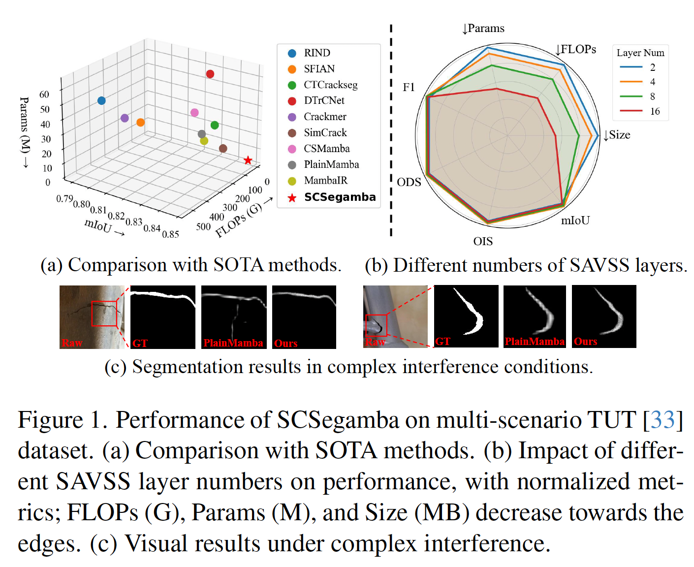
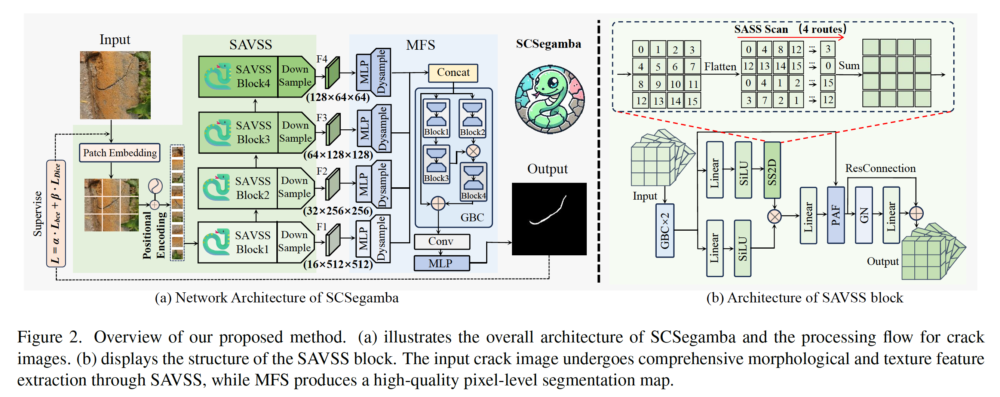
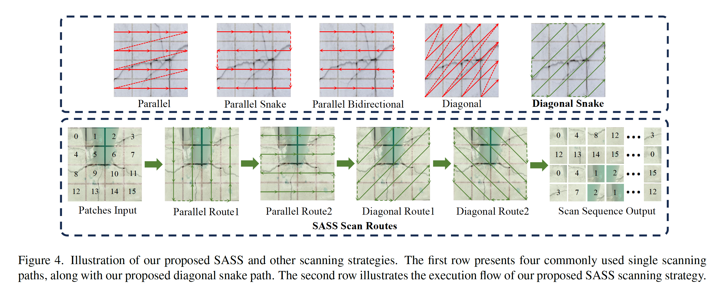
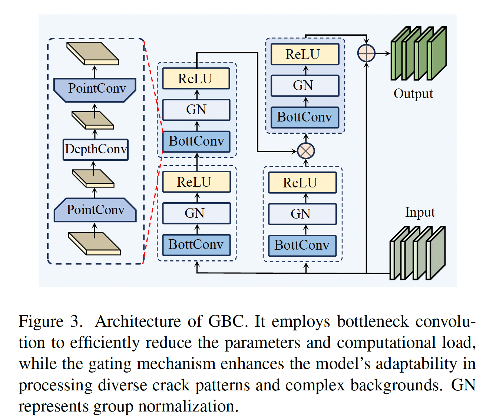
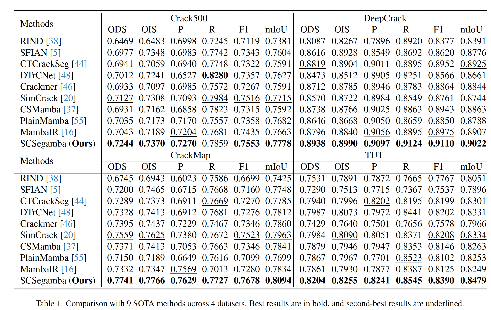
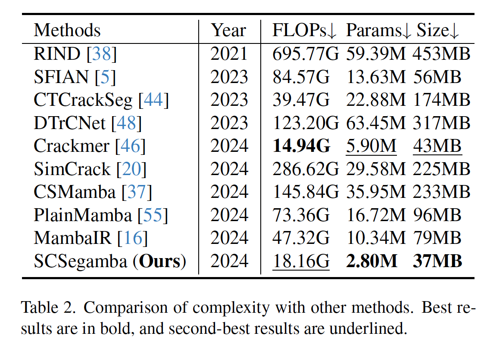
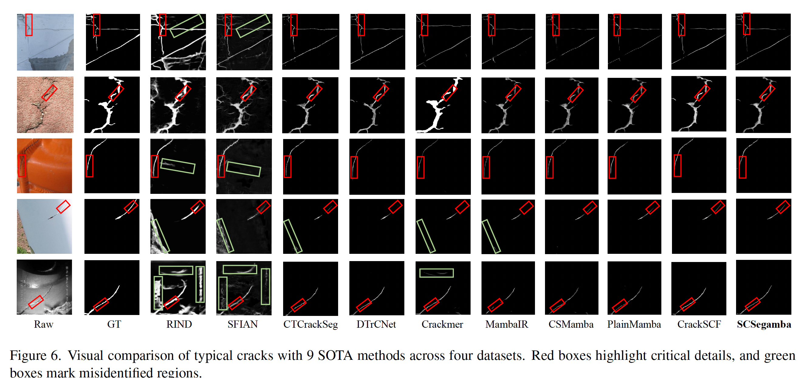
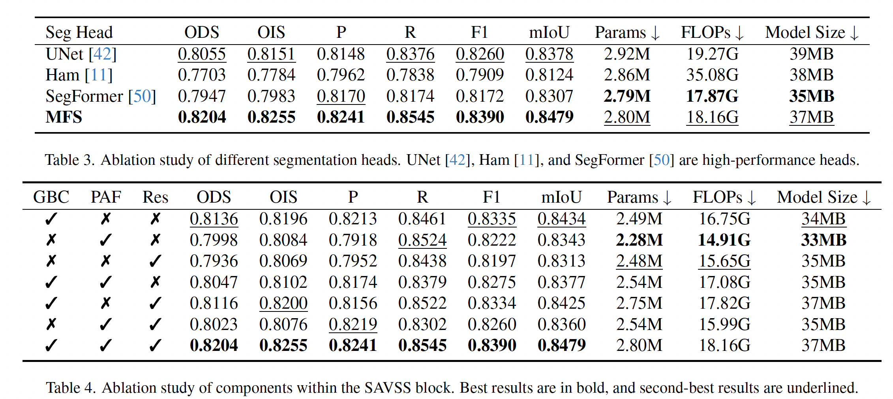
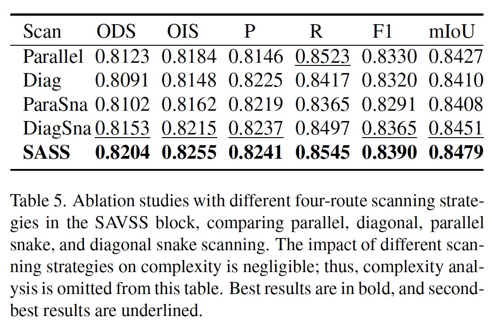

# feat: Lightweight Structure-Aware Vision Mamba for Crack Segmentation in Structures

**著者**: Hui Liu, Chen Jia, Fan Shi, Xu Cheng, Shengyong Chen  
**所属**: 天津理工大学 コンピュータサイエンス・工学部 他  
**出版**: arXiv (Submitted 2024 / Updated 2025)

---

## 1. 論文の目的または目標は何ですか？

<em>図1: 多シナリオTUTデータセットにおけるSCSegambaの性能。(a) SOTA手法との比較、(b) SAVSS層数の影響、(c) 複雑な干渉条件下でのセグメンテーション結果。</em>

本論文の目的は、**複雑な背景ノイズや多様な亀裂形状（テクスチャ・形態）に対して頑健でありながら、エッジデバイス等のリソース制限下でも動作可能な超軽量な亀裂セグメンテーションモデルを開発すること**です。

背景として、従来のCNNベースの手法は局所的なバイアスにより長い亀裂の連続性を捉えられず、Transformerベースの手法は計算量が入力解像度の2乗で増えるため高解像度処理に多大なコストがかかるという課題がありました。また、最新のMamba（状態空間モデル）は計算効率に優れるものの、亀裂特有の複雑な曲がり方や細いテクスチャを捉えるための構造的な配慮が不足していました。これらを解決し、**「精度」と「低コスト」の高度な両立**を目指しています。

---

## 2. トピックを探求するために使用された方法またはアプローチは何ですか？

### SCSegamba: 構造意識型軽量Mambaネットワーク

提案手法 **SCSegamba** は、以下の革新的なコンポーネントで構成されています。

<em>図2: SCSegambaの全体アーキテクチャ。(a) クラック画像の処理フロー、(b) SAVSSブロックの構造。SAVSSが形態・テクスチャ特徴を抽出し、MFSが高品質なピクセルレベルのセグメンテーションマップを生成する。</em>

1.  **SAVSS (Structure-Aware Visual State Space module)**:
    *   **SASS (Structure-Aware Scanning Strategy)**: 従来の平行・対角スキャンに代わり、**「対角スネークスキャン」**を含む4方向のスキャン戦略を導入。これにより、多方向に分岐し不規則に伸びる亀裂のトポロジー（つながり）とテクスチャの連続性を強力に維持します。

        

        
<em>図4: 提案するSASSと他のスキャン戦略の比較。上段は4つの代表的なスキャン経路と提案の対角スネーク経路、下段はSASSスキャンの実行フローを示す。</em>

    *   **GBC (Gated Bottleneck Convolution)**: 特徴抽出の初期段階に導入。数学的な**低ランク近似（BottConv）**を利用して、パラメータ数と計算量を大幅に削減しつつ、ゲート機構によって背景ノイズを抑制し亀裂の形態学的特徴を際立たせます。

        

        
<em>図3: GBCのアーキテクチャ。ボトルネック畳み込みでパラメータ・計算量を削減し、ゲート機構で多様な亀裂パターンや複雑な背景への適応性を高める（GNはグループ正規化）。</em>

2.  **MFS (Multi-scale Feature Segmentation head)**:
    *   SAVSSから出力される4つの異なるスケールの特徴マップを効率的に統合。MLP（多層パーセプトロン）とGBC、動的アップサンプリングを組み合わせることで、軽量さを保ちながら精細なセグメンテーションマップを生成します。

3.  **評価環境とデータセット**:
    *   **データセット**: Crack500, DeepCrack, CrackMap（高解像度）, TUT（多シナリオ・高ノイズ）の4つで検証。
    *   **損失関数**: 二値クロスエントロピー(BCE)とDice Lossを1:5の比率で組み合わせ、ピクセルの不均衡（亀裂が背景に比べて極めて少ない）に対応しています。

---

## 3. 主要な結果または発見は何でしたか？

主要な実験結果として、SCSegambaは**わずか2.8Mという極小のパラメータ数でありながら、全ての公開データセットにおいて既存のSOTA（最高性能）手法を圧倒**しました。

#### 1. 定量的評価（精度と効率の両立）
*   **精度**: 最も困難とされるTUTデータセットにおいて、**F1スコア 0.8390、mIoU 0.8479** を達成。これは次点の手法をF1で2.21%、mIoUで1.74%上回る結果です。

<em>表1: 4データセットにおける9つのSOTA手法との比較（太字が最良、下線が次点）。</em>

*   **軽量性（表2参照）**: パラメータ数は**2.80M**、モデルサイズは**37MB**であり、比較対象の中で最も効率的であったモデルよりもさらに52.54%（パラメータ）削減されています。

<em>表2: 他手法との計算量比較。SCSegambaは最小のParams (2.80M)・Size (37MB) を達成。</em>

#### 2. 亀裂のタイプ別パフォーマンス
*   **細長い亀裂 (CrackMap)**: SASSの効果により、極細で複雑な形状の亀裂においてもF1スコアで2.06%向上するなど、顕著な強みを示しました。
*   **形態の把握 (DeepCrack)**: GBCの導入により、大きな亀裂領域の輪郭をクッキリと捉える能力が向上しました。

#### 3. 視覚的比較（図6参照）
*   プラスチックのトラック、金属、暗いパイプ内部など、背景に強いノイズが含まれる状況下でも、誤検出（偽陽性）を最小限に抑え、連続した亀裂領域を出力できることが視覚的にも証明されました。

<em>図6: 4データセットにおける9つのSOTA手法との典型的な亀裂の視覚比較。赤枠は重要なディテール、緑枠は誤検出領域を示す。</em>

#### 3.5 アブレーション研究
*   セグメンテーションヘッド（表3）やSAVSSブロック内のコンポーネント（GBC・PAF・Res、表4）、4方向スキャン戦略（表5）の各構成要素が、精度と軽量性の両立に寄与することを確認しました。特に提案の **SASS** は、平行・対角・スネークの各スキャンを単独で用いる場合よりも一貫して高い精度を示しました。

<em>表3・表4: セグメンテーションヘッド（表3）およびSAVSSブロック内コンポーネント（表4）のアブレーション研究。</em>

<em>表5: SAVSSブロックにおける4方向スキャン戦略のアブレーション研究。提案のSASSが最良。</em>

#### 4. 実世界への応用（図8, 表11参照）
*   Raspberry Pi 4を搭載した自律走行車両（Turtlebot4 Lite）とサーバーを用いたリアルタイム推論試験を実施。1フレームあたり**0.0313秒**という高速な推論速度を記録し、実際のビデオデータでも背景ノイズを抑えた安定的なセグメンテーションを実証しました。

---

## 4. 結論は何であり，なぜそれが重要なのですか？

### 結論
本研究により、Mambaアーキテクチャに構造意識型の設計（SASSやGBC）を組み込むことで、**CNNやTransformerが抱えていた「視野の狭さ」や「計算コストの増大」という壁を打破できること**が示されました。SCSegambaは、リソースが極めて限られた環境においても、高精度かつ精細なピクセルレベルの亀裂検出が可能であることを証明しました。

### 意義と貢献
*   **学術的重要**: Mambaを画像認識、特に「細長い構造体」の検出に最適化するための新しいスキャン戦略と軽量化手法を提示した点に大きな価値があります。
*   **社会的・実用的重要**: パラメータ数が極めて少なく推論が高速であるため、ドローンや点検ロボットなどの**エッジデバイスにそのまま搭載可能**です。これにより、道路や橋梁、産業用部材の自動点検の効率が劇的に向上し、インフラ維持管理のコスト削減と安全性向上に大きく貢献することが期待されます。