# From Concepts to Judgments: Interpretable Image Aesthetic Assessment

**著者**: Xiao-Chang Liu, Johan Wagemans
**所属**: Research Unit Brain and Cognition, KU Leuven (ベルギー・ルーヴェン)
**出版**: arXiv preprint (2026年3月)

---

## 1. 論文の目的または目標は何ですか？

本論文は，**画像審美評価(Image Aesthetic Assessment, IAA)** において，「予測精度」と「人間にとっての解釈可能性」を両立させるモデルを構築することを目的としている。

近年のIAAモデルは深層ニューラルネットワーク(DNN)の採用により予測性能が飛躍的に向上したが，その代償として**「なぜそのスコアになったのか」を人間が理解できない**というブラックボックス問題を抱えている。例えば写真家やデザイナーがモデルを使う場面を想像すると，「なぜこの写真は低評価なのか? シンメトリーが悪いのか? 照明が悪いのか? 構図が崩れているのか?」といった疑問に答えられないモデルは，専門的な用途では使いものにならない。

そこで著者らは，以下を満たすフレームワークを提案する:

- **人間が名前を付けられる審美概念**(三分割法・色の調和・対称性など)を基盤として予測を行う
- **事後的(post-hoc)な説明**ではなく，**本質的に解釈可能(inherently interpretable)** なモデルを設計する
- 解釈可能性を犠牲にせず，最先端モデルと競争可能な予測性能を達成する

この設計思想は，Rudinら[74, 75]の「高リスク判断では『説明された』ブラックボックスではなく本質的に解釈可能なモデルを使うべき」という主張，および Iigayaら[26, 27]の「人間の審美判断は低次・高次特徴の**線形和**でよく近似できる」という神経科学的知見に支えられている。

---

## 2. トピックを探求するために使用された方法またはアプローチは何ですか？

### 提案手法の3つの構成要素

提案フレームワークは図1に示される3つのモジュールから構成される。

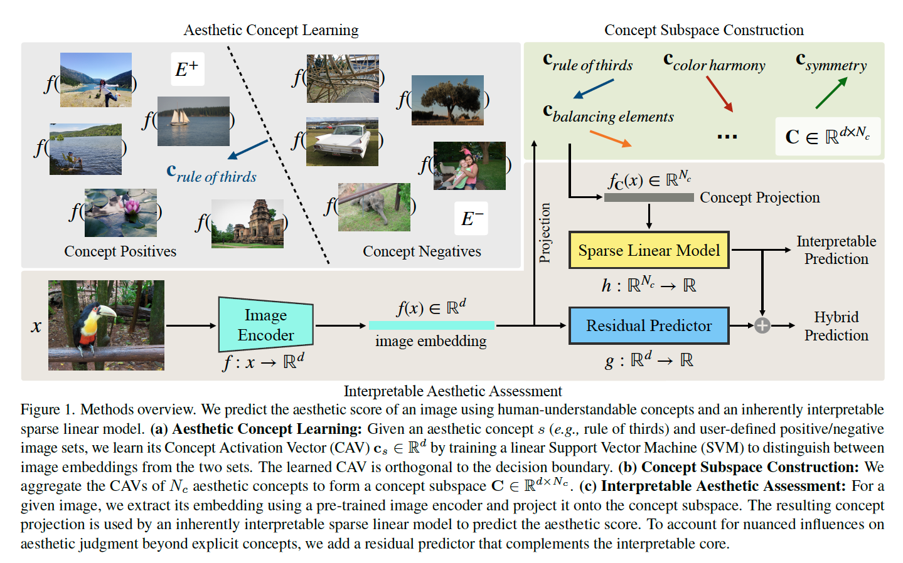

**(1) 審美概念の学習 (Aesthetic Concept Learning)**

各審美概念 $s$(例: 三分割法)について，正例画像セット $P_s^+$(三分割法に従う画像)と負例画像セット $P_s^-$(従わない画像)をユーザが用意する。これらをCLIP-ResNet50で1024次元ベクトルに変換し，線形SVMで両者を分離する超平面を学習する。SVMの決定境界に**直交し正例側を指す法線ベクトル**を**Concept Activation Vector (CAV)** $\mathbf{c}_s \in \mathbb{R}^d$ として取り出す。このCAVが「その概念が強くなる方向」を表す。各概念あたり100サンプル程度で十分に頑健なCAVが得られる。

**(2) 概念部分空間への射影と線形予測 (Interpretable Prediction)**

$N_c$ 個の概念のCAVを束ねて概念部分空間 $\mathbf{C} \in \mathbb{R}^{d \times N_c}$ を構成する。入力画像 $x$ の埋め込み $f(x)$ を各概念軸に射影し，$N_c$ 次元の概念プロファイル $f_C(x)$ を得る:

$$f_C^i(x) = \frac{\langle f(x), \mathbf{c}_i \rangle}{\|\mathbf{c}_i\|^2_2}$$

これに**スパース線形モデル**(Elastic Net正則化)を適用して審美スコアを予測する:

$$h(f_C(x)) = \mathbf{w}^\top f_C(x) + b$$

重み $\mathbf{w}$ は各概念の重要度を直接表し，射影値 $f_C(x)$ は画像が各概念をどれだけ体現しているかを示す。**両者を見れば予測の根拠が完全に追跡できる**設計になっている。

**(3) 残差予測器 (Residual Predictor)**

明示的概念だけでは捉えきれない微細な要因を補うため，画像埋め込みから直接スコアを補正する軽量な線形回帰 $g(f(x); \theta) = \mathbf{w}_r^\top f(x) + b_r$ を追加する。残差予測器は概念部分空間と線形モデル $h$ を固定したまま**逐次的に**学習されるため，解釈可能なコア部分は変更されない。

### データセットと評価指標

写真領域(AADB, PARA, AVA)と芸術領域(LAPIS, BAID)の計5データセットで評価。写真用にはAADBの11属性とPARAの9属性を，芸術用にはLAPISの26スタイル+7ジャンル(計33属性)を概念として学習。評価指標はSRCC(順位相関)とPLCC(線形相関)を使用。

---

## 3. 主要な結果または発見は何でしたか？

### 予測性能 — 競争力のあるスコア

各データセットでの性能比較を表1〜表4に示す。

- **AADB**: ハイブリッドモデルがSRCC=0.745で2位(表1参照)
- **PARA**: ハイブリッドモデルがSRCC=0.877でCharmに次ぐ性能(表2参照)
- **LAPIS**: ハイブリッドモデルがSRCC=0.817で**ベースラインを上回る最高性能**を達成(表3参照)
- **BAID**: ハイブリッドモデルがSRCC=0.502で**全手法中最高**(表4参照)

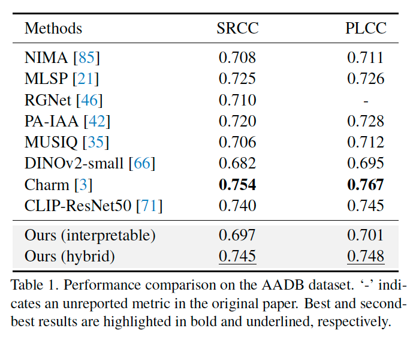

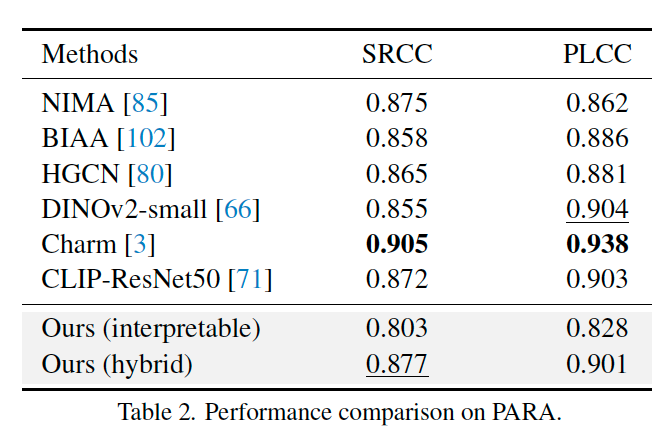

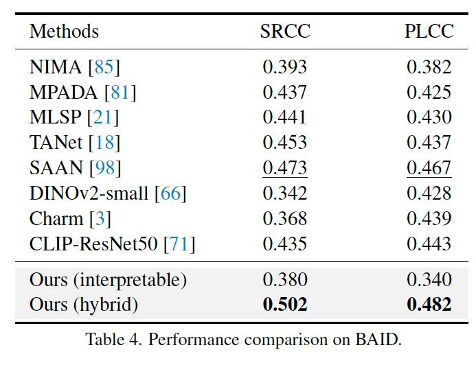

解釈可能なブランチ単独でもCNN系の古典的手法と同等以上の性能を維持しており，解釈可能性のために大きな精度を犠牲にしていないことが示された。

### 解釈可能性 — 学習された概念重みの妥当性

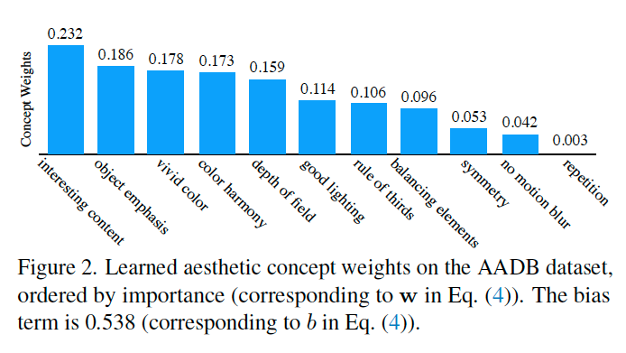

AADBで学習された概念重み(図2参照)を見ると，**interesting content** が最も影響力が大きく，次いで **object emphasis** や色関連属性が続き，**repetition** はほぼ無視できるレベルとなっている。これはプロの写真家への聞き取りに基づくデータセット設計と整合する。

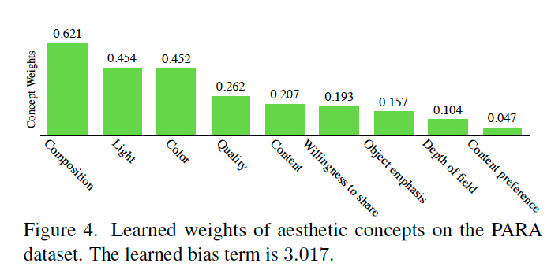

PARAでは **Composition** が支配的因子となり(図4参照),データセットの性質の違いが重みに反映される様子も観察された。

### 画像単位の解釈例

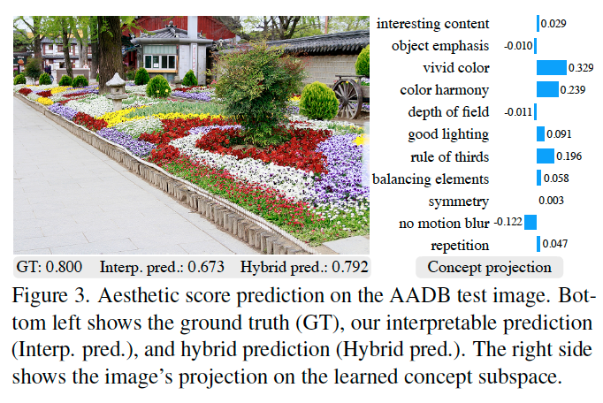

AADBのテスト画像(花壇の写真)に対する予測例(図3参照)では，モデルは vivid color, color harmony, rule of thirds を最も顕著な特徴として識別し，これは人間の主観的判断とよく一致する。

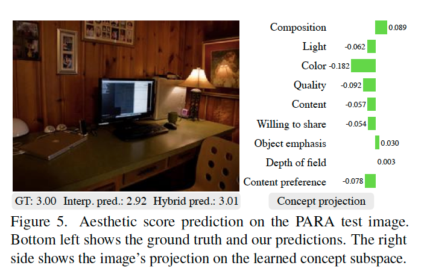

PARAの暗い書斎の画像(図5参照)では Composition が高く評価される一方，Color や Quality が負の値となり,**画像の「良い点」と「悪い点」の両方を正しく言語化**できている。

### 芸術領域での発見

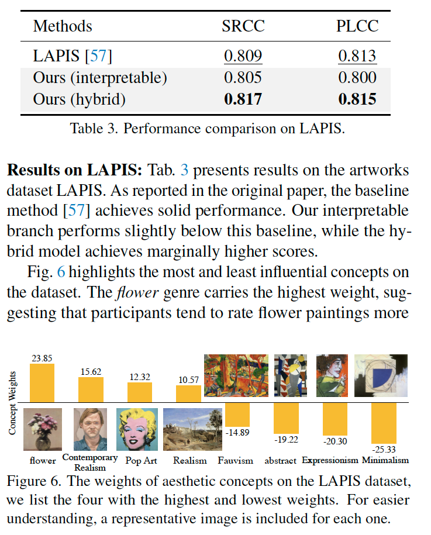

LAPISの概念重み(図6参照)では **flower** ジャンルが最高重み,Contemporary Realism, Pop Art, Realism などの**具象的様式が高評価**,Minimalism, Expressionism, Fauvism, abstract などの**抽象的様式が低評価**となり,LAPISの作成者が報告する「抽象作品は具象作品より低評価を受けやすい」という傾向を**学習された重みが定量的に再現**している。

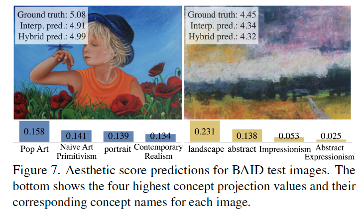

BAIDのテスト画像(図7参照)では,肖像画にはportraitやContemporary Realism,抽象風景画にはabstractやImpressionismといった概念が高く射影されており,**作品のスタイル的本質を概念射影が捉えている**ことが示された。

### 既存の説明可能IAAとの比較

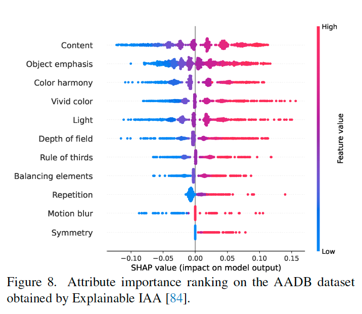

ブラックボックスモデルに事後的SHAP分析を適用するExplainable IAA[84]による属性重要度(図8参照)と比較すると,本手法の概念重み順序とほぼ一致する(content が最重要,symmetry, motion blur, repetition が最下位)。**事後説明と同等の解釈を,本質的解釈可能モデルとして直接得られる**ことが確認された。

---

## 4. 結論は何であり，なぜそれが重要なのですか？

### 結論

本研究は,IAAに対して新しいモデリング視点を提示した:

1. **CLIPで画像をベクトル化 → SVMで概念方向ベクトル(CAV)を抽出 → 概念部分空間に射影 → スパース線形モデルで予測**,という透明なパイプラインで,予測の各段階が人間に追跡可能。
2. 残差予測器を逐次的に追加することで,解釈可能なコアを保ったまま予測性能を底上げする実用的な設計を提案。
3. 写真・芸術の双方の領域,計5データセットでSOTAに匹敵する性能を維持しつつ,データセットレベル(全体的な審美傾向)と画像レベル(個別画像の特徴)の**二層の解釈**を提供できることを実証した。

### 意義と重要性

**学術的意義**: 多くのIAA研究が「精度向上」に集中する中,本論文はRudinら[74, 75]の哲学に従い「事後説明ではなく本質的に解釈可能な設計」をIAAドメインに持ち込んだ。さらに,Iigayaらの「審美判断は特徴の線形和で近似できる」という神経科学的知見を計算モデルとして具体化した点で,**実証美学(empirical aesthetics)と計算アプローチの橋渡し**となっている。

**実用的意義**: 写真家・デザイナー・アートキュレーター・美術史研究者など,「なぜこのスコアか」を知る必要がある専門家にとって,本フレームワークは実用的価値を持つ。特に**概念集合をユーザが画像例で定義できる**(機械学習の専門知識不要)という設計は,ドメイン専門家による拡張・カスタマイズを可能にし,応用範囲を大きく広げる。

**限界と今後の展望**: 著者らは線形予測器の表現力の限界(概念間の相乗効果や文脈依存の組み合わせを捉えにくい)を認めており,今後は「人間が理解可能な範囲での非線形な概念間相互作用」や「個人差を反映した概念集合の段階的洗練」が研究方向として示されている。

機械と人間の審美判断の隔たりは依然として大きいが,**人間が名付け可能な概念を解釈可能モデルに直接組み込む**というアプローチは,この溝を埋める有望な一歩を提示している。