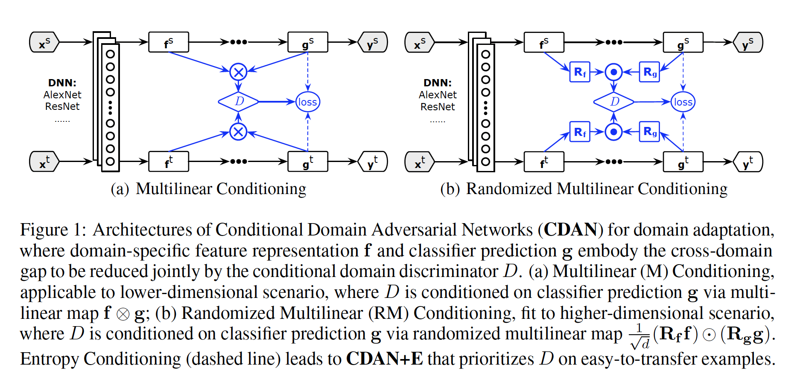
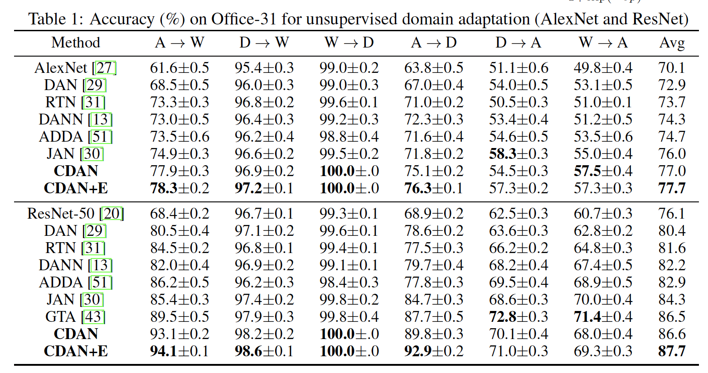
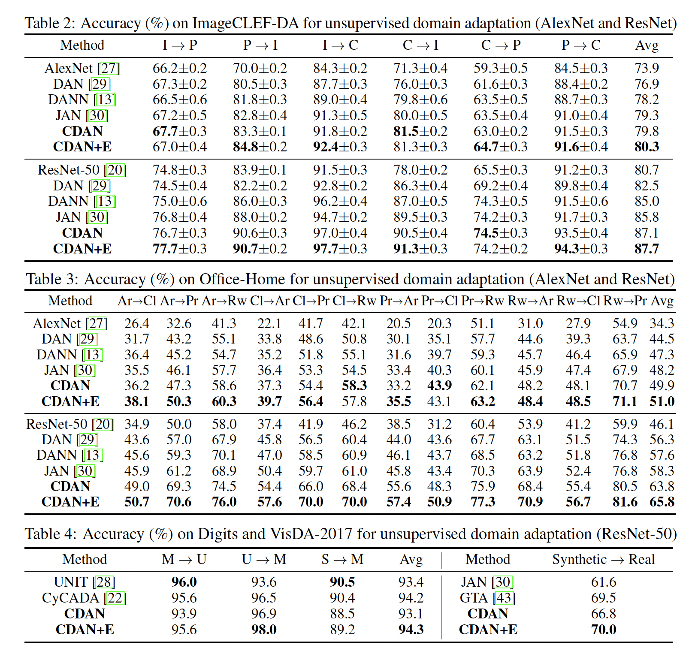
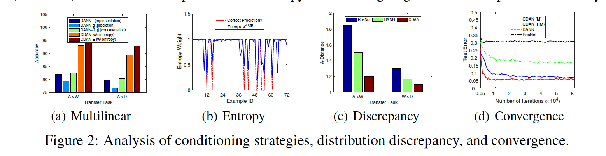
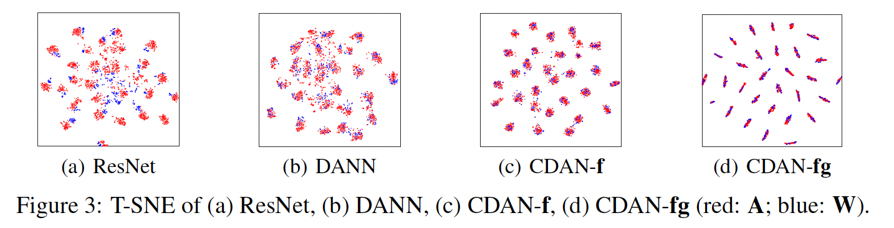
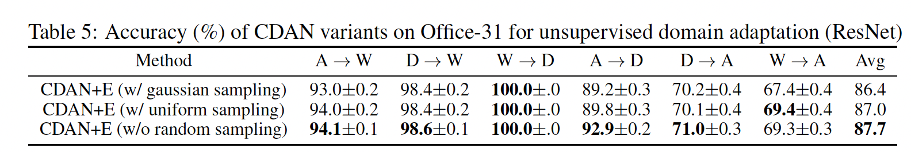

# Conditional Adversarial Domain Adaptation

**著者**: Mingsheng Long, Zhangjie Cao, Jianmin Wang, Michael I. Jordan  
**所属**: Tsinghua University (China), University of California, Berkeley (USA)  
**出版**: NeurIPS (32nd Conference on Neural Information Processing Systems) 2018

---

## 1. 論文の目的または目標は何ですか？

本論文は **教師なしドメイン適応 (Unsupervised Domain Adaptation)** において、敵対的学習に基づく既存手法が抱える2つの根本的問題を解決することを目的としている。

教師なしドメイン適応とは、ラベル付きのソースドメイン(例:写真)で学習したモデルを、ラベルなしのターゲットドメイン(例:イラスト)でも高精度に動作させる枠組みである。DANN [Ganin et al.] のような既存の敵対的ドメイン適応では、ドメイン識別器を騙すように特徴抽出器を学習することで、ドメイン不変な特徴表現を獲得する。

しかし著者らは、既存手法には以下の2つの限界があると指摘している:

1. **多峰性 (multimodal) の取りこぼし**:分類問題ではクラスごとに特徴空間に複数のモード(クラスタ)が存在する。特徴 f の分布だけを揃えようとすると、ソースの「犬モード」がターゲットの「猫モード」に誤って整列される可能性があり、識別器が騙されても各クラスが正しく対応している保証がない。

2. **不確実な予測による条件付けのリスク**:分類器の予測が確信を持たない例(エントロピーが大きい例)で条件付けを行うと、誤った情報で識別器が訓練され、適応が悪化する。

そこで著者らは、Conditional GAN の発想を取り入れ、**ドメイン識別器を分類器の予測 g で条件付けする**新しい枠組み **Conditional Domain Adversarial Network (CDAN)** を提案している。

---

## 2. トピックを探求するために使用された方法またはアプローチは何ですか？

### CDAN の全体アーキテクチャ

CDAN は2つの新しい条件付け戦略を中核に据えている。アーキテクチャの全体像は **図1** を参照。

<b>図1</b>: CDAN のアーキテクチャ。(a) Multilinear Conditioning と (b) Randomized Multilinear Conditioning の2種類の条件付け戦略を示す。

- **(a) Multilinear Conditioning**:低次元の場合、特徴 f と予測 g の外積 f ⊗ g で D を条件付け
- **(b) Randomized Multilinear Conditioning**:高次元の場合、ランダム投影で計算量を抑えた近似版

### Multilinear Conditioning(多重線形条件付け)

特徴 f と分類器予測 g の単純な連結 f ⊕ g では、両者が独立になってしまい、クラスごとの特徴の違い(=多峰構造)を捉えられない。

そこで著者らは **外積 T_⊗(f, g) = f ⊗ g** を提案する。ワンホットラベルを仮定した場合:

- 連結の平均: E[f ⊕ g] = E[f] ⊕ E[g](独立な平均)
- 外積の平均: E[f ⊗ g] = E[f|y=1] ⊕ ... ⊕ E[f|y=C](**クラス条件付き平均**)

この性質により、外積はクラスごとの分布 P(f|y) を自然に表現でき、多峰構造を捉えた整列が可能になる。

ただし f が d_f 次元、g が d_g 次元の場合、外積は d_f × d_g 次元となり、次元爆発する。これを解決するため、**ランダム多重線形写像** を導入する:

$$T_⊙(f, g) = \frac{1}{\sqrt{d}} (R_f f) \odot (R_g g)$$

ここで R_f, R_g は学習開始時に1回だけサンプリングされる固定のランダム行列。定理1により、この近似は外積と内積の意味で不偏推定であることが保証される。

実装上は次元が4096以下なら外積、それ以上ならランダム化版を使い分ける。

### Entropy Conditioning(エントロピー条件付け)

学習初期はターゲットの予測が不安定であり、すべての例を平等に扱うと適応が劣化する。そこでエントロピー H(g) = −Σ g_c log g_c で予測の不確実性を測り、各例に重み:

$$w(H(g)) = 1 + e^{-H(g)}$$

を掛けて識別器の学習に使う。確信のある例の重みは約2、不確実な例は約1となり、**転移しやすい例を優先**できる。この拡張版を **CDAN+E** と呼ぶ。副次的にエントロピー最小化の効果も得られ、半教師あり学習的な恩恵も得られる。

### 理論的解析

Ben-David らのドメイン適応理論に基づき、ターゲット誤差の上界を導出。重要な点は、ドメイン間距離が特徴 f だけの分布ではなく **(f, g) の同時分布 P_G と Q_G** の距離として定式化されること。これにより「g を識別器の条件付けに含める」という CDAN の設計が理論的に正当化される。

### 実験設定

- **データセット**:Office-31、ImageCLEF-DA、Office-Home、Digits (MNIST/USPS/SVHN)、VisDA-2017(計5種)
- **比較手法**:DAN、RTN、DANN、ADDA、JAN、UNIT、GTA、CyCADA など
- **ベースネットワーク**:AlexNet、ResNet-50(ImageNet 事前学習済み)
- **ハイパーパラメータ**:λ=1 で固定、Importance-weighted cross-validation で他のパラメータを選択

---

## 3. 主要な結果または発見は何でしたか？

### 主要なベンチマーク結果

CDAN および CDAN+E は **5つのデータセットすべてで state-of-the-art を更新**した。

- **Office-31**(表1参照):ResNet-50 ベースで CDAN+E が平均 87.7% を達成。特に難しいタスク A→W (94.1%)、A→D (92.9%) で大幅改善。生成系手法 GTA (86.5%) も上回る。

<b>表1</b>: Office-31 における各手法の精度比較(ResNet-50 ベース)。CDAN+E が全タスクで最高精度を達成。

- **ImageCLEF-DA**(表2参照):CDAN+E が平均 87.7%(ResNet-50)、既存ベスト JAN の 85.8% を上回る。
- **Office-Home**(表3参照):カテゴリ数が多く視覚的にも異なる難タスクで、CDAN+E が平均 65.8%(ResNet-50)。JAN の 58.3% から **7.5ポイント** の大幅向上。
- **Digits および VisDA-2017**(表4参照):生成系の特化手法 CyCADA や GTA と互角以上。CDAN+E は VisDA-2017 で 70.0% を達成し、GTA (69.5%) を上回る唯一の特徴レベル手法。

<b>表2-4</b>: ImageCLEF-DA(表2)、Office-Home(表3)、Digits/VisDA-2017(表4)における精度比較。

著者の主張通り、**カテゴリ数が多く難しいタスクほど CDAN の改善幅が大きい**点が特筆される。これは多峰構造の活用が効果を発揮することの証左である。

### Ablation Study と分析

**図2** に詳細な分析結果がまとめられている:

<b>図2</b>: (a) 条件付け戦略の比較、(b) エントロピー重みと予測正誤の関係、(c) A-distance によるドメイン間距離、(d) 収束曲線。

- **(a) Conditioning Strategies**:単純な連結 (DANN-[f,g])、特徴のみ (DANN-f)、予測のみ (DANN-g) はすべて CDAN に劣る。**特徴とクラスの相互作用(cross-covariance)を捉えることが重要**であることを確認。
- **(b) Entropy Weight**:エントロピー重み e^(-H(g)) と予測の正誤がよく対応している。正解例では重みが1に近く、誤り例では小さい値となり、転移しやすい例を識別できている。
- **(c) Distribution Discrepancy**:A-distance で測ったドメイン間距離は、ResNet > DANN > CDAN の順で小さくなる。CDAN が最もドメインギャップを縮められている。
- **(d) Convergence**:CDAN は DANN より速く収束し、CDAN (M) は CDAN (RM) よりさらに速い。

### 可視化

**図3** の t-SNE 可視化により、CDAN-fg(f と g の両方で条件付け)が最もクラス分離とドメイン整列の両立に成功していることが視覚的に確認できる。ResNet ではドメインが分離、DANN では整列するがクラスが混在、CDAN-f は改善、CDAN-fg が最良。

<b>図3</b>: t-SNE による特徴空間の可視化。左から ResNet、DANN、CDAN-f、CDAN-fg。CDAN-fg がクラス分離とドメイン整列の両立を達成している。

### Ablation:ランダムサンプリング戦略

**表5** より、ランダムサンプリングなし版 (w/o random sampling) が最も性能が高い (87.7%) が、ランダム化版でも Gaussian (86.4%)、Uniform (87.0%) と比較的近い性能を示し、ランダム化による近似の妥当性が裏付けられた。

<b>表5</b>: ランダムサンプリング戦略の比較(Office-31)。ランダム化なしが最高性能だが、Gaussian/Uniform でも近い精度を維持。

---

## 4. 結論は何であり、なぜそれが重要なのですか？

### 結論

本論文は、敵対的ドメイン適応に対して **「分類器予測 g によるドメイン識別器の条件付け」** という新しい原理的枠組みを提案した。具体的な貢献は以下の3点である:

1. **Multilinear Conditioning**:特徴 f と予測 g の外積を介した条件付けにより、両者間の相互作用(cross-covariance)を捉え、多峰分布のクラス単位での整列を実現
2. **Entropy Conditioning**:予測の不確実性に基づいて転移しやすい例を優先的に扱うことで、転移可能性を保証
3. **理論的保証**:Ben-David らのドメイン適応理論の枠組みで、CDAN のミニマックス学習がターゲット誤差の上界を最小化することを示した

### 重要性と意義

本研究の意義は以下の点にある:

- **実用面での汎用性**:5つの異なる性質のベンチマーク(物体認識、数字認識、シミュレーション-実世界)すべてで一貫して state-of-the-art を達成。特に Office-Home のような多クラスかつ視覚的に異なるドメイン間での大幅な性能向上は、現実世界での応用可能性を示唆する。

- **理論と実践の橋渡し**:Conditional GAN の発想をドメイン適応に持ち込み、それが古典的ドメイン適応理論の (f, g) 同時分布の距離最小化と自然に整合することを示した。これは敵対的ドメイン適応に対する理論的理解を深める貢献である。

- **実装の単純さ**:複雑な生成モデル(GTA、CyCADA、UNIT など)を一切使わず、わずか数行のコード追加で既存の DANN を上回る性能を実現する。これは研究コミュニティへの実装ハードルを大きく下げる。

- **後続研究への影響**:「特徴だけでなくクラス予測も条件付けに使う」という発想は、その後のドメイン適応研究の標準的な設計パターンの一つとなった。多峰性を扱うための cross-covariance や entropy regularization のアイデアは、半教師あり学習や転移学習の他のタスクにも応用可能である。

総じて本研究は、**シンプルかつ理論的に正当化された手法で、敵対的ドメイン適応の本質的限界を克服した**という点で、ドメイン適応分野における重要なマイルストーンと位置付けられる。