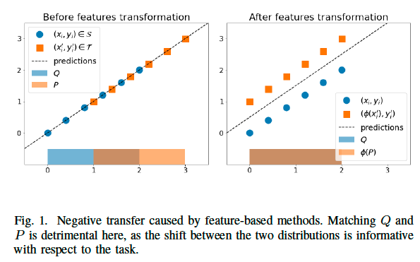
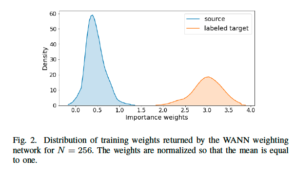
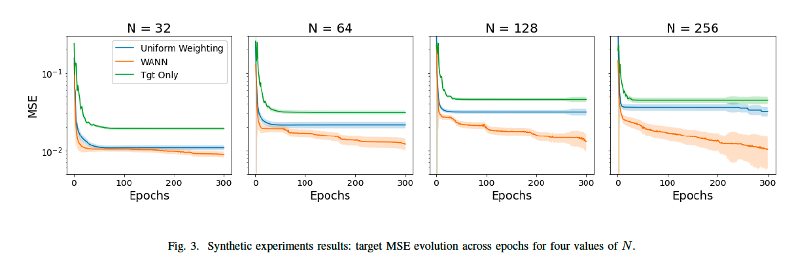
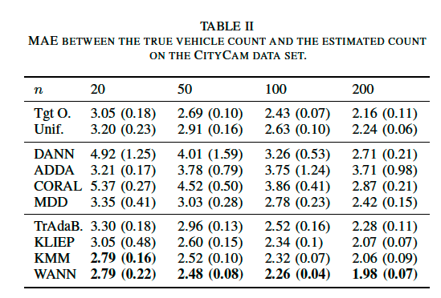
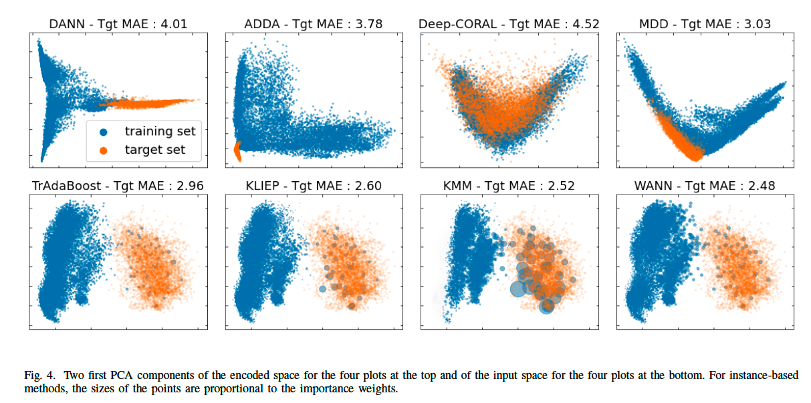
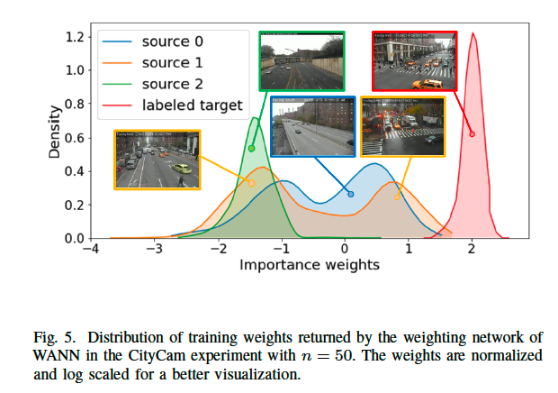
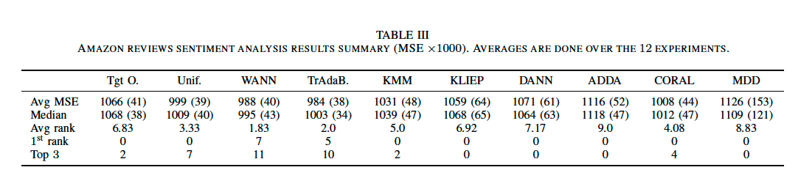

# Adversarial Weighting for Domain Adaptation in Regression

**著者**: Antoine de Mathelin, Guillaume Richard, François Deheeger, Mathilde Mougeot, Nicolas Vayatis  
**所属**: Michelin / EDF R&D / Centre Borelli, Université Paris-Saclay, CNRS, ENS Paris-Saclay  
**出版**: arXiv:2006.08251v4 [cs.LG] 2021

---

## 1. 論文の目的または目標は何ですか？

本論文は，**共変量シフト (covariate shift) 仮定下における回帰タスクのための教師ありドメイン適応 (supervised domain adaptation)** を扱う．具体的には，ソースドメイン $(Q, f_Q)$ には大量のラベル付きデータが存在するが，ターゲットドメイン $(P, f_P)$ には少数のラベル付きデータしか存在しない状況において，ソースドメインから得た知識を活用してターゲットドメインの回帰タスクを効率的に学習することを目指している．

著者らが指摘する既存研究の課題は以下の2点である:

- **特徴ベース手法 (feature-based methods)** は近年の敵対的ニューラルネットワーク (DANN, ADDA, Deep-CORAL, MDD等) の成功により主流となっているが，共変量シフト下の回帰問題ではソース・ターゲット分布間のシフト自体が情報を持っているため，分布をマッチングさせる特徴変換は **負の転移 (negative transfer)** を引き起こしやすい．Figure 1 では $Q = \mathcal{U}[0,2]$, $P = \mathcal{U}[1,3]$, $f = \text{Id}$ という単純な例で，特徴変換が予測精度を悪化させることが示されている．

<em>Figure 1: 共変量シフト下で特徴ベース手法が負の転移を起こす単純例．分布整合は予測精度を悪化させる．</em>

- **インスタンスベース手法 (instance-based methods)** は共変量シフトに適しているが，KMM, KLIEP, Cortes & Mohri らの手法は半正定値カーネルに基づく二次計画問題を解く必要があり，**大規模データに対してスケールしにくい** という計算上の問題を抱えている．

本研究はこれら2つの欠点を同時に克服することを目的とする．すなわち，敵対的ニューラルネットワークの計算効率と，インスタンスベース手法が持つ共変量シフトへの適合性を両立する新しい枠組みを提案することが目標である．

---

## 2. トピックを探求するために使用された方法またはアプローチは何ですか？

### Y-discrepancy に基づく敵対的最適化定式化

提案手法 **WANN (Weighting Adversarial Neural Network)** は，ソース・ターゲット間の差異を測る教師あり距離尺度である **Y-discrepancy** を最小化する形で定式化される．Y-discrepancy は仮説クラス $\mathcal{H}$ 上の最大損失差として次式で定義される:

$$
\text{Y-disc}_{\mathcal{H}}(P, q) = \max_{h' \in \mathcal{H}} \left| \mathcal{L}_P(h', f_P) - \mathcal{L}_q(h', f_Q) \right|
$$

この尺度はターゲットリスクに対する一般化境界 $\mathcal{L}_P(h, f_P) \le \mathcal{L}_q(h, f_Q) + \text{Y-disc}_{\mathcal{H}}(P, q)$ を与える．著者らはこの上界を最小化するため，以下の min-max 問題を提案する:

$$
\min_{h \in \mathcal{H},\, q \in \mathcal{F}} \max_{h' \in \mathcal{H}} \mathcal{L}_q(h, f_Q) + \mathcal{L}_{\hat{P}}(h', f_P) - \mathcal{L}_q(h', f_Q)
$$

### WANN アルゴリズムの構成

3 つのニューラルネットワークから構成される:

- **タスクネットワーク $h \in \mathcal{H}$**: ターゲットタスクを学習する本体．
- **敵対的仮説ネットワーク $h' \in \mathcal{H}$**: Y-discrepancy を最大化する worst-case 仮説を近似する．
- **重み付けネットワーク $q \in \mathcal{F}$**: 各ソース・ターゲットインスタンスに重みを割り当てる．出力末尾に ReLU を付加して非負性を保証．

クリッピング定数 $C_h, C_q$ による重みクリッピング正則化を適用することで，重み付けマップの滑らかさを制御し，ごく少数のサンプルにのみ重みが集中する退化解を回避する．最適化は確率的勾配降下・上昇法 (SGDA) によって一回のフィードフォワード計算で同時に行われる．

### 実験設計

3 種類のデータセットで評価:

1. **合成データ (Cortes & Mohri 2014 由来)**: 入力次元 $N \in \{32, 64, 128, 256\}$ のガウス混合分布上の回帰タスク．Uniform Weighting / Target Only との比較．
2. **CityCam 車両カウントデータセット**: 4 台のカメラ画像 (高速道路 2 台 + 交差点 2 台)．交差点 1 台をターゲット (約 5000 枚)，残り 3 台をソース (約 10000 枚) とする．ResNet50 特徴を入力．
3. **Amazon レビュー感情分析**: 4 ドメイン (dvd, kitchen, electronics, books) 間の 12 通りの組合せでレビュー評価値 (1〜5) を予測．

比較手法は特徴ベース (DANN, ADDA, Deep-CORAL, MDD) とインスタンスベース (Uniform, Target Only, TrAdaBoostR2, KLIEP, KMM) の両系統を網羅している．

---

## 3. 主要な結果または発見は何でしたか？

**合成データ実験 (Figure 3)**: ターゲット MSE の epoch 推移を見ると，WANN は Uniform Weighting と Target Only の両者を一貫して下回り，**入力次元 $N$ が大きくなるほど (タスクが難しくなるほど) 優位性が顕著** になる．Figure 2 の重み分布は二峰性を示しており，重み付けネットワークがターゲット分布から引かれた 20% のソースサンプルを高い重み (約 3) で選別し，残りの 80% にも適度な重み (約 0.5) を残していることが確認できる．

<em>Figure 2: WANN が学習した重みの二峰分布．ターゲット分布から引かれた 20% のソースサンプルが高い重みで選別される．</em>

<em>Figure 3: 合成データにおけるターゲット MSE の epoch 推移．入力次元 $N$ が大きくなるほど WANN の優位性が顕著になる．</em>

**CityCam 実験 (Table II 参照)**: ラベル付きターゲット数 $n \in \{20, 50, 100, 200\}$ の全条件で WANN が最良または同率最良の MAE を達成．特に注目すべき所見は以下:

- **すべての特徴ベース手法 (DANN, ADDA, Deep-CORAL, MDD) が naive な Uniform Weighting や Target Only よりも悪い MAE を示し，明確に負の転移を起こしている**．Deep-CORAL は分布マッチングが最も成功しているにもかかわらずターゲット MAE が最大という結果は，共変量シフト下では分布整合が逆効果となるという主張を強く裏付けている．
- ラベル付きターゲット数の増加とともに WANN と KMM/KLIEP の差が広がる．これは Y-discrepancy が教師あり指標であり，ターゲット損失 $\mathcal{L}_{\hat{P}}(h', f_P)$ の推定精度が上がるほど WANN が優位になるためと著者は説明している．

<em>Table II: CityCam 車両カウントタスクにおける各手法のターゲット MAE．全 $n$ で WANN が最良または同率最良．</em>

Figure 4 の PCA 可視化では，特徴ベース手法は埋め込み空間でソースとターゲットを近づけることに成功している一方で，インスタンスベース手法 (KLIEP, KMM, WANN) はターゲット近傍のソース点に高い重みを割り当てており，**WANN の重み付けは KMM/KLIEP より保守的** であることが見て取れる．Figure 5 では，交差点カメラ (source 1) のサンプルがターゲットに最も近い重みを得ており，さらにそのカメラ内の 2 視点に対応する二峰分布まで重み付けネットワークが捉えていることが示されている．

<em>Figure 4: ResNet50 特徴の PCA 可視化．特徴ベース手法は埋め込みを整合させ，インスタンスベース手法はターゲット近傍のソース点に高い重みを与える．</em>

<em>Figure 5: CityCam 各ソースカメラに対する WANN の重み分布．交差点カメラ (source 1) のサンプルが高い重みを獲得し，視点に対応する二峰分布まで捉えている．</em>

**Amazon レビュー実験 (Table III 参照)**: 12 実験の平均 MSE は WANN が 988 で最小 (TrAdaBoost 984 と統計的に同等)．平均順位は WANN が 1.83 で最良，1 位獲得回数は 12 実験中 7 回．拡張 Poisson binomial 検定では WANN と TrAdaBoost が他手法より優れる確率が Uniform に対して 0.67，Deep-CORAL に対して 0.74，その他に対して 0.9 以上．WANN を bagging すると TrAdaBoost より確率 0.62 で優位となる．

<em>Table III: Amazon レビュー感情分析 12 ドメインペアでの MSE．WANN が平均順位 1.83 で最良．</em>

---

## 4. 結論は何であり，なぜそれが重要なのですか？

本研究は，共変量シフト仮定下の回帰ドメイン適応に対して，**重み付けネットワークを敵対的訓練で学習するという新しいインスタンスベース手法 WANN** を提案した．主要な貢献は以下にまとめられる:

- 教師あり距離である **Y-discrepancy を敵対的最適化問題として定式化** し，これを SGDA で解くことで，従来のカーネルベース手法 (KMM, KLIEP) のような二次計画問題を解く必要をなくし，大規模データへのスケーラビリティを獲得した．
- ソース重みを個別パラメータではなく **正則化付きニューラルネットワークの出力として表現** することで，重み付けマップの滑らかさを制御し，退化解を回避するという実装上の工夫を導入した．
- 共変量シフト下では特徴ベース手法が明確に負の転移を起こすことを実証的に示し，**「分布をマッチングさせること」と「タスクを正しく解くこと」が必ずしも一致しない** という重要な経験的洞察を与えた．

学術的意義としては，敵対的訓練という強力な道具を特徴変換ではなく **インスタンス再重み付け** に応用するという視点を明確に打ち出した点が挙げられる．これは敵対的ドメイン適応研究の主流が特徴ベースに偏っていた状況に対する一つのアンチテーゼとなっている．実用的意義としては，工業設計や患者予測など，ドメイン間のシフトそのものに意味があり完全な分布整合が望ましくない応用シナリオにおいて，少数のラベル付きターゲットデータで効率的に適応できる枠組みを提供する点にある．

将来課題として，著者らは WANN を教師なし・半教師ありドメイン適応へ拡張すること，および重み付けネットワークの出力を能動学習における **次にラベル取得すべきターゲットサンプルの選択基準** として活用する可能性を挙げている．