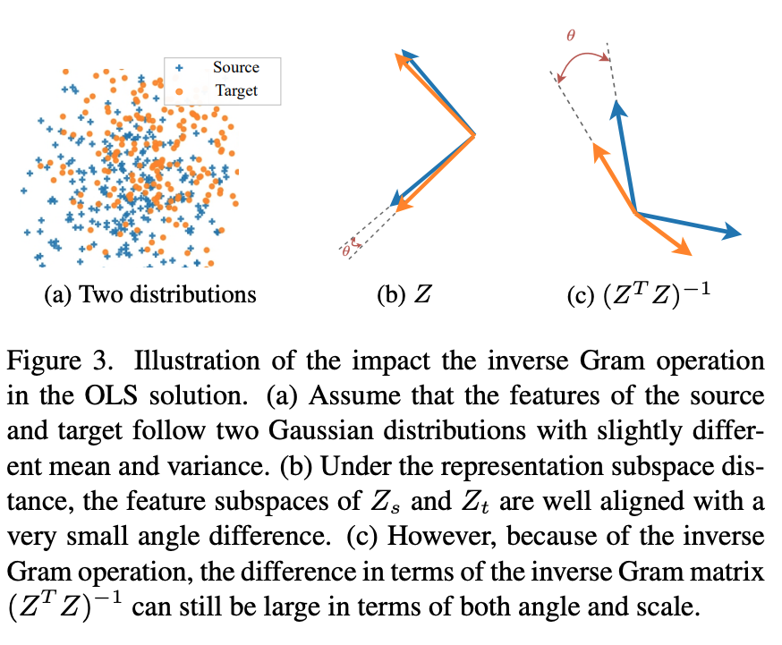
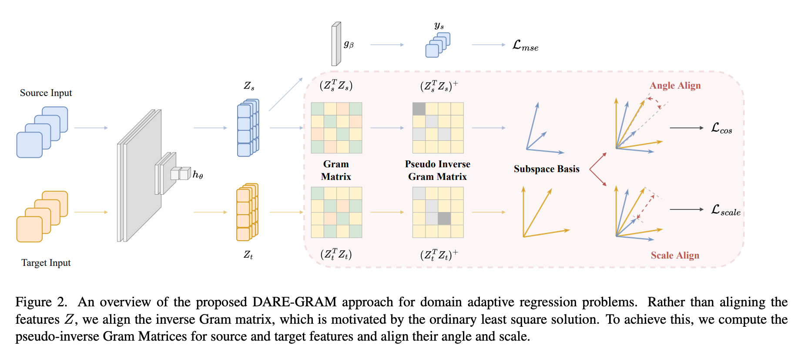
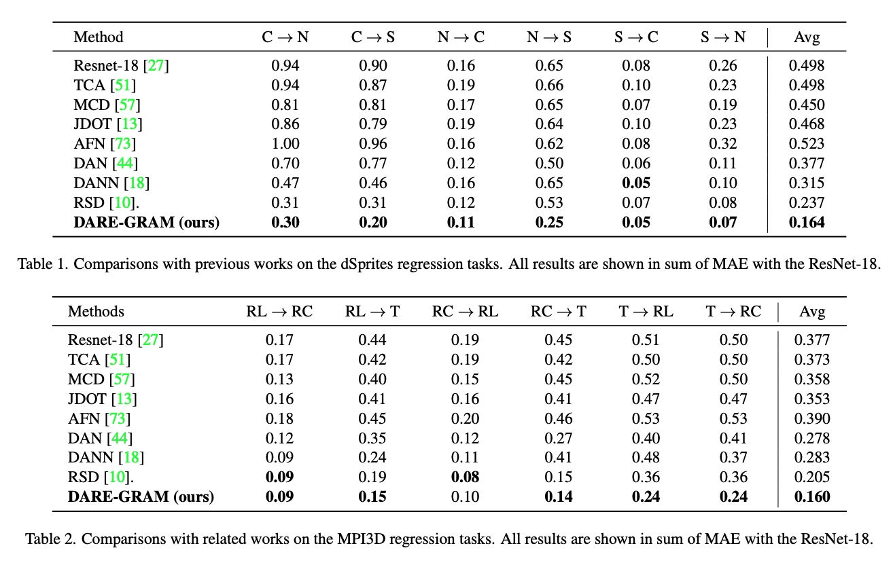
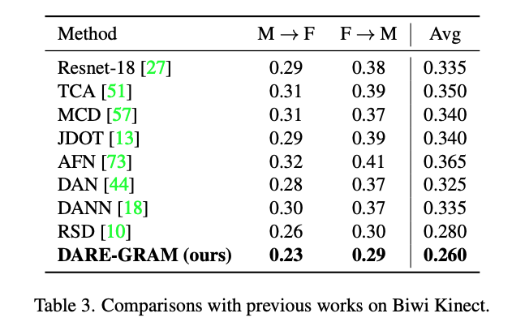
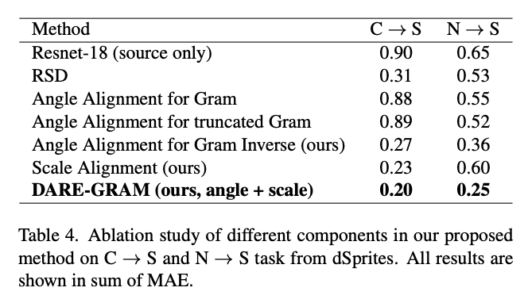
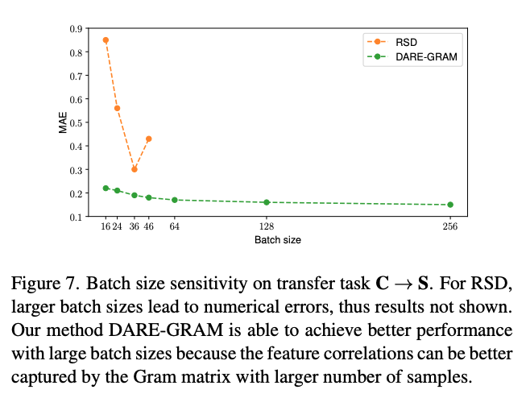

# DARE-GRAM: Unsupervised Domain Adaptation Regression by Aligning Inverse Gram Matrices

**著者**: Ismail Nejjar, Qin Wang, Olga Fink  
**所属**: EPFL , ETH Zurich  
**出版**: CVPR 2023

---

## 1. 論文の目的または目標は何ですか？

### 背景：回帰タスクにおけるドメイン適応の課題

UDA（教師なしドメイン適応）は分類・セグメンテーション問題では広く研究されてきたが、**回帰（Regression）タスクへの適用は相対的に未開拓**である。回帰問題においては、モデルが特徴スケールの差異に敏感であることが経験的に示されており（RSD [10]）、分類向けUDA手法の多くはそのままでは性能が出ない。

本論文が対象とするのは**教師なしドメイン適応回帰（DAR）**：

- ソースドメイン：ラベルあり（連続値 $y \in \mathbb{R}^{N_r}$）
- ターゲットドメイン：ラベルなし（学習時）
- ソースの知識をターゲットの回帰タスクに転移させたい

### 先行研究の問題点

既存のDAR手法（RSD等）は深い特徴表現 $Z$ のサブスペースを直接整合させることで分布ギャップを縮小しようとする。しかし、この定式化は**線形回帰層の構造を考慮していない**という根本的な問題がある。

最終的な予測は線形層 $g_\beta$ で行われ、OLS の閉形式解は：

$$\hat{\beta} = (Z^T Z)^{-1} Z^T Y$$

特徴 $Z$ が揃っていても、逆グラム行列 $(Z^T Z)^{-1}$ がソースとターゲットで大きく異なれば共通の線形回帰器は学習できない。

これは逆行列演算の性質によるもので、**$Z$ の距離が小さくても $(Z^T Z)^{-1}$ の距離は大きくなり得る**（論文Figure 3参照）。

<p align="center"></p>

### 本論文の目標

OLSの閉形式解を動機として、特徴 $Z$ ではなく**逆グラム行列 $(Z^T Z)^{-1}$ を直接整合させる**手法 **DARE-GRAM** を提案する：

1. 逆グラム行列の擬似逆行列の**角度（Angle）**を整合させる
2. グラム行列の固有値を通じた特徴の**スケール（Scale）**を整合させる
3. 上記2つの正則化項を組み合わせてエンドツーエンドで学習する

---

## 2. トピックを探求するために使用された方法またはアプローチは何ですか？

### 2.1 モデル構成

DARE-GRAMは標準的な深層ドメイン適応のアーキテクチャを踏襲する：

```
入力画像 x
    ↓ hθ：特徴抽出器（CNN）
特徴ベクトル z = hθ(x) ∈ R^p  ← ここでグラム行列を計算
    ↓ gβ：線形回帰器
予測値 ỹ = gβ(z)
```

バッチ $b$ 枚の特徴行列 $Z \in \mathbb{R}^{b \times p}$ に対して、グラム行列 $(Z^T Z) \in \mathbb{R}^{p \times p}$ を構築し、その擬似逆行列を整合の対象とする（論文Figure 2参照）。

<p align="center"></p>

### 2.2 動機：OLSの閉形式解

線形回帰の OLS 解：

$$\hat{\beta} = (Z^T Z)^{-1} Z^T Y$$

ソース・ターゲットで共通の線形回帰器 $g_\beta$ を学習するには、$\hat{\beta}_s \approx \hat{\beta}_t$ が必要。つまり $(Z_s^T Z_s)^{-1}$ と $(Z_t^T Z_t)^{-1}$ を揃えることが直接的な目標となる。

### 2.3 擬似逆グラム行列の構築

バッチサイズ $b$ が埋め込み次元 $p$ より小さい場合（$b < p$）、グラム行列のランクは $b$ 以下となり逆行列が存在しない。そこでムーア–ペンローズ擬似逆行列を利用する。

SVD分解 $Z = UDV^T$ を用いると：

$$(Z^T Z)^+ = V^T \Lambda^+ V, \quad \Lambda^+_{kk} = \begin{cases} 1/\lambda_k & (\lambda_k \text{ が閾値以上}) \\ 0 & (\text{それ以外}) \end{cases}$$

使用する主成分数 $k$ は、固有値の累積和が閾値 $T$ を超えるまでの個数として決定する：

$$\sum_{i=0}^{k} \lambda_i \Big/ \sum_{i=0}^{p} \lambda_i > T$$

これにより（i）数値的不安定性を回避し、（ii）主要な部分空間のみで整合を行う。

### 2.4 角度整合損失 $\mathcal{L}_{cos}$

擬似逆グラム行列の各列ベクトル間のコサイン類似度を最大化する：

$$\cos(\theta_i^{S \leftrightarrow T}) = \frac{G^+_{s,i} \cdot G^+_{t,i}}{\|G^+_{s,i}\| \cdot \|G^+_{t,i}\|}$$

$$\mathcal{L}_{cos}(Z^S, Z^T) = \|I - M\|_1^1, \quad M = [\cos(\theta_1^{S \leftrightarrow T}), \ldots, \cos(\theta_p^{S \leftrightarrow T})]$$

この損失を最小化することで、ソース・ターゲット両ドメインの擬似逆グラム行列の部分空間が角度的に整合する。

### 2.5 スケール整合損失 $\mathcal{L}_{scale}$

特徴 $Z$ のスケールはグラム行列のトレース（= 固有値の和）で推定できる。上位 $k$ 個の固有値の差を直接最小化する：

$$\mathcal{L}_{scale}(Z^S, Z^T) = \|\lambda_{s, i=1,\ldots,k} - \lambda_{t, i=1,\ldots,k}\|_2$$

回帰タスクでは特徴スケールへの感度が高いため（RSD [10]の知見）、スケール整合を明示的に行うことが重要である。

### 2.6 総損失関数

$$\mathcal{L}_{total}(Z^S, Z^T) = \mathcal{L}_{src} + \alpha_{cos}\mathcal{L}_{cos}(Z^S, Z^T) + \gamma_{scale}\mathcal{L}_{scale}(Z^S, Z^T)$$

| 項 | 役割 |
|---|---|
| $\mathcal{L}_{src}$ | ソースドメインのMSE損失（教師あり） |
| $\mathcal{L}_{cos}$ | 逆グラム行列の角度を整合させる |
| $\mathcal{L}_{scale}$ | 特徴スケール（固有値）を整合させる |

### 2.7 RSDとの比較

| 観点 | RSD [10] | DARE-GRAM |
|---|---|---|
| 整合対象 | $Z$ の左特異ベクトル $U$ | $(Z^T Z)^{-1}$ の列空間 |
| スケール整合 | 明示的に回避 | $\mathcal{L}_{scale}$ で明示的に実施 |
| バッチサイズ $b \geq p$ 時 | 主角度がゼロになり整合不能 | 問題なし |
| 勾配の安定性 | $1/(\lambda_i - \lambda_j)$ に依存し不安定 | 比較的安定 |

### 2.8 実験設定

| データセット | ドメイン | タスク | イテレーション |
|---|---|---|---|
| dSprites | Color / Noise / Scream | scale, X, Y の回帰（6方向） | 20,000 |
| MPI3D | Toy / Realistic / Real | 回転2軸の回帰（6方向） | 10,000 |
| Biwi Kinect | Male / Female | yaw / pitch / roll（2方向） | 1,500 |

共通設定：バックボーン ResNet-18（ImageNet事前学習）、バッチサイズ $b=36$、SGD（momentum=0.9）、評価指標 MAE。

---

## 3. 主要な結果または発見は何でしたか？

### 3.1 dSprites・MPI3D（Table 1・2参照）

<p align="center"></p>

**dSprites**（6方向平均MAE）：RSD に対して平均 **30.8%** の改善。特に困難な方向 C→S（−33.3%）および N→S（−52.8%）での改善が顕著。

### 3.2 MPI3D（Table 2参照）

6方向平均MAE（上表参照）：RSD に対して平均 **21.9%** 改善。RC/RL ペアはドメインギャップが小さく性能が飽和に近いため改善幅が小さいが、シミュレーション↔実世界の困難な方向（T→RL等）で顕著に改善。

### 3.3 Biwi Kinect（Table 3参照）

<p align="center"></p>

データ規模が小さく（15K枚）かつドメイン間の不均衡がある難しい条件でも改善を達成。

### 3.4 アブレーション研究（Table 4参照）

<p align="center"></p>

逆行列を取る操作そのものが決定的に重要であることが確認された（通常のGramや切り詰めGramとの比較）。また角度・スケール両項が補完的に寄与しており、どちらか一方だけでは不十分。

### 3.5 バッチサイズの影響（Figure 7参照）

<p align="center"></p>

RSDはバッチサイズ64超で数値誤差が発生して使用不能になるのに対し、DARE-GRAMはバッチサイズを256まで拡大しても安定して動作し、バッチサイズの増加とともにMAEが単調に低下する。これはグラム行列の特徴相関推定がサンプル数が多いほど精度が上がることに対応している。

---

## 4. 結論は何であり、なぜそれが重要なのですか？

### 4.1 結論

DARE-GRAMは以下の点を実現した：

1. **新しい視点の提示**：特徴 $Z$ ではなく**OLS解に直接現れる逆グラム行列を整合対象**にするという定式化により、回帰層の学習しやすさを直接改善する
2. **逆行列操作の重要性の実証**：アブレーションにより、通常のGramや $Z$ の整合では不十分であり、逆行列を取ることが本質的に重要であることを示した
3. **実用的な安定性**：RSDの課題（バッチサイズ制約・勾配不安定性）を解消し、大バッチサイズでより高い性能を達成

### 4.2 なぜ重要か

**理論的意義：**

既存手法の暗黙の仮定：$Z_s \approx Z_t \Rightarrow \hat{\beta}_s \approx \hat{\beta}_t$（良い回帰器が共有できる）

DARE-GRAMの指摘：上記は逆行列演算のため成立しない。$(Z^T Z)^{-1}$ を直接整合させることが理論的に正しい。

**実用的意義：**

- アーキテクチャ変更なしに損失関数の追加のみで実現
- ResNet-18という軽量バックボーンでSOTA達成
- 回帰向けUDAという未開拓分野への明確な貢献
- バッチサイズ制約なしで動作するため大規模データにも対応可能

### 4.3 今後の課題（論文より）

- 分類・セグメンテーション以外の回帰タスクへのさらなる展開
- より大規模なバックボーン（ResNet-50等）での検証
- マルチタスク回帰設定への拡張
