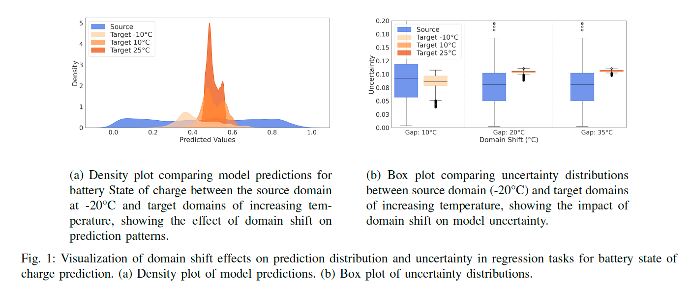
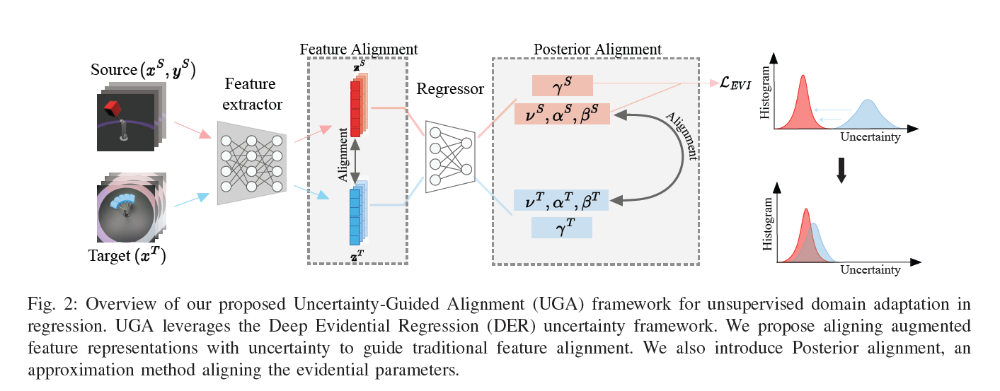
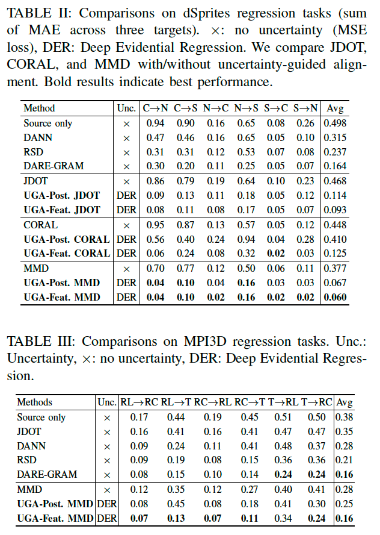
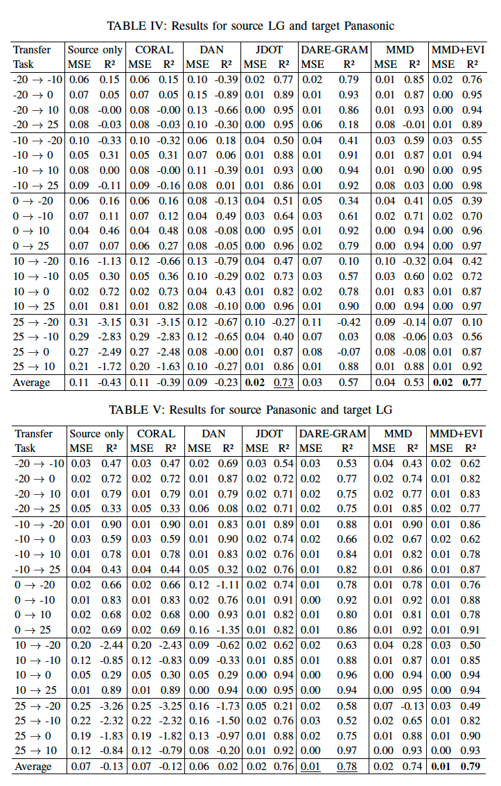
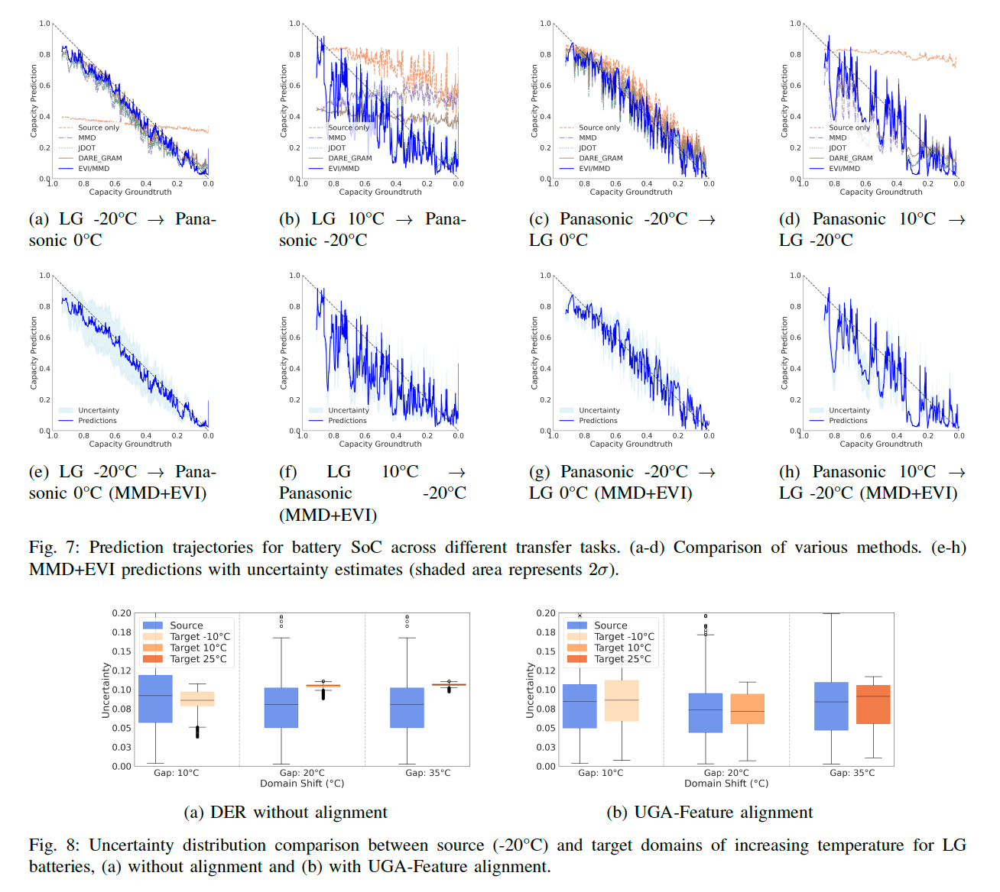
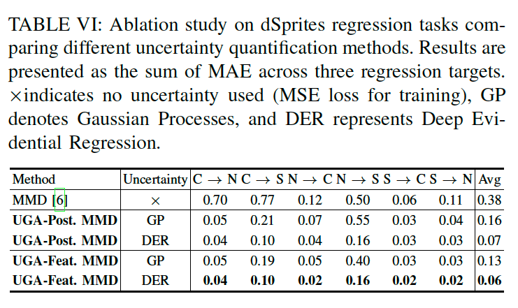

# Uncertainty-Guided Alignment for Unsupervised Domain Adaptation in Regression

**著者**: Ismail Nejjar, Gaetan Frusque, Florent Forest, Olga Fink
**所属**: Intelligent Maintenance and Operations Systems, EPFL, Lausanne, Switzerland
**出版**: Reliability Engineering and System Safety, Vol. 270 (2026) 112143

---

## 1. 論文の目的または目標は何ですか？

本研究は **Prognostics and Health Management (PHM) 応用における回帰タスクの教師なしドメイン適応 (UDAR)** の性能向上を目的としている。PHMシステムは異なる運転条件・製造元・劣化パターンの間で資産の健全性を予測する必要があるが、新しい運転コンテキストごとにラベル付きデータを得ることは現実的でない (特にrun-to-failure軌跡では困難)。本研究はこの課題に対し、ラベル付きソースドメインからラベルなしターゲットドメインへ適応するUDARアプローチを提案する。

UDARには以下の2つの根本的な課題が存在する。

**課題1: 特徴空間の構造の違い**
分類では各クラスに対応する離散的なクラスタが特徴空間に分散して形成され、alignmentが行いやすい。一方、回帰タスクではモデルが「lazy representation」に陥り、出力と相関の高い低次元部分空間に情報が集中する。このため従来のCORAL・MMD・敵対的学習などのalignment手法はPHM回帰では十分に機能しない。

**課題2: 不確実性の定量化**
分類モデルはクラス確率により自然に信頼度が得られるが、回帰モデルは点推定のみを出力するのが一般的で、信頼度の概念が欠けている。これは特にPHMのようなリスクベースの意思決定が重要な応用で深刻な問題である。

著者らはFig. 1において、ターゲットドメインの温度差が大きくなるにつれ予測値・不確実性分布が共に狭くなる **feature collapse** 現象を示し、回帰のUDAにおいて不確実性を活用する必要性を強調している。

そこで本研究では、Evidential Deep Learning による不確実性推定をalignmentプロセスに統合した新手法 **Uncertainty-Guided Alignment (UGA)** を提案する。これは PHM の2つの要件、(1) 新しい運転条件での予測信頼度の定量化、(2) 信頼性の高いクロスドメイン展開、を同時に満たすことを目指している。

---

## 2. トピックを探求するために使用された方法またはアプローチは何ですか？

### 理論的動機

著者らは「完璧な特徴alignmentは情報損失を招き性能を悪化させる」ことを Theorem 1 として証明している。Adaptation Gap $\Delta_p = I(z^S;y^S) - I(z^T;y^T)$ が大きいほど、完璧にalignmentした場合の誤差下限が指数的 $e^{2\Delta_p}$ に増加する。これは、決定論的な特徴抽出器が異なる入力を同じ点に潰すことでドメイン特有の情報を失うためである。この理論結果がUGAの設計動機を支えている。

### 提案手法 UGA の枠組み

UGAは **Deep Evidential Regression (DER)** をベースとし、出力として予測平均 $\gamma$ と不確実性パラメータ $(\nu, \alpha, \beta)$ を1回のforward passで得る。これによりBayesian NNやMC Dropoutに比べ大幅に計算効率が高い。

UGAは2つのalignment戦略を提案する (Fig. 2参照)。

**戦略1: Uncertainty-Guided Feature Alignment**
特徴とDER出力を組み合わせた埋め込み表現に対してMMDを計算してalignmentを行う。これによりfeature collapseを防ぎながらドメイン間の特徴を揃える。

$$\mathcal{L}_{\text{feature}} = \mathcal{L}_{\text{EVI}} + \lambda \cdot \text{MMD}^2_{\text{feature}}$$

**戦略2: Uncertainty-Guided Posterior Alignment**
特徴ではなく、不確実性パラメータ $(\nu, \alpha, \beta)$ そのものをMMDで揃える。予測平均 $\gamma$ はラベル分布に直結するため除外される。これは feature alignment の近似であり、計算が軽量。

$$\mathcal{L}_{\text{posterior}} = \mathcal{L}_{\text{EVI}} + \lambda \cdot \text{MMD}^2_{\text{posterior}}$$

本フレームワークはMMDやDERに限定されず、JDOT・CORALなど他のalignment手法やGaussian Processなど他の不確実性手法とも組み合わせ可能である。

### 評価実験

3つのベンチマークで評価:

1. **dSprites** (合成2D画像): Color, Scream, Noiseの3ドメイン、scaleとposition回帰
2. **MPI3D** (3D物体画像): Toy, Realistic, Realの3ドメイン、回転角回帰
3. **バッテリー SOC 予測** (PHM実問題): LG社製とPanasonic社製のリチウムイオン電池、温度-20℃〜25℃の運転条件下でのState of Charge推定

評価指標はMAE (画像) およびMSE/$R^2$ (バッテリー)。さらにジャーナル版では **不確実性キャリブレーション評価** (NLL, ECE) と **計算効率評価** (推論時間、メモリ、訓練時間) も追加されている。計52の転移タスクで、DANN、RSD、DARE-GRAM、JDOT、CORAL、MMDといった既存手法と比較を行った。

---

## 3. 主要な結果または発見は何でしたか？

### コンピュータビジョン (dSprites, MPI3D)

dSpritesでの結果は **Table 2** を参照。UGA-Feature MMD は平均MAE 0.060を達成し、既存最良のDARE-GRAM (0.164) を大幅に上回った。JDOT・CORAL・MMDのいずれにUGAを組み合わせても性能が大きく改善し、提案フレームワークの汎用性を示している。

MPI3Dでの結果は **Table 3** を参照。UGA-Feature MMDは平均MAE 0.16でDARE-GRAMと同等、6タスク中5タスクで最良の結果。

### バッテリーSOC予測 (PHM応用)

LG→Panasonic転移は **Table 4**、Panasonic→LG転移は **Table 5** を参照。

LG→Panasonicでは、source-onlyベースラインが平均$R^2 = -0.43$であるのに対し、MMD+EVI (UGA-Feature) は$R^2 = 0.77$を達成。標準MMD単独 ($R^2 = 0.53$) と比較して相対45%の改善。Panasonic→LGでも同様にMMD+EVIが$R^2 = 0.79$で最良。

特に、温度差が大きい極端な転移 (例: 25℃→-20℃) でMMD+EVIの優位性が顕著であり、LG→Panasonicの25℃→-20℃ではMMD+EVI が$R^2 = 0.10$、標準MMDは$R^2 = -0.14$という大きな差が見られた。

予測軌跡については **Fig. 8** を参照。MMD+EVIの予測がGround Truthに最も近く、また不確実性推定 (網掛け部分は$2\sigma$) はバッテリーサイクルの初期で大きく、放電が進むにつれて減少するという、自然で解釈可能な振る舞いを示している。

不確実性分布の比較については **Fig. 7** を参照。alignmentなしでは温度差が大きくなるにつれソース・ターゲット間の不確実性分布の乖離が広がるが、UGA-Feature適用後は両ドメインの不確実性分布が大きく重なり、モデルの信頼度が両ドメインでcalibrateされていることが確認できる。

### 不確実性キャリブレーション評価 (ジャーナル版で追加)

**Table 7** (25℃→-10℃) と **Table 8** (25℃→0℃) を参照。MC Dropout、Gaussian Process、Evidential Learning (本手法) を MSE、$R^2$、NLL、ECE で比較。

MC Dropoutは大きな温度シフトで一見良好なECEを示すが、$R^2$ が負であり予測精度自体が劣る。Evidential Learning は最良の点予測精度 ($R^2$) と競争力のあるキャリブレーションを両立し、PHM応用での実用性が高いことが示された。キャリブレーション曲線は **Fig. 9, 10** を参照。

### 計算効率評価 (ジャーナル版で追加)

**Table 9** (推論時間) を参照。UGA-EDLは MC Dropout (k=20) より **13.2倍高速**、SNGPより **1.6倍高速**。メモリ・パラメータも最も少ない。

**Table 10** (訓練時間) を参照。UGAはRSDやDARE-GRAMよりも訓練が高速。これは UGA がSVDのような計算コストの高い演算を避けているため。

### Ablation Study

**Table 6** を参照。GP (Gaussian Process) とDER (Deep Evidential Regression) の不確実性手法を比較。両者ともMMD単体を改善するが、DERのほうがepistemic + aleatoricの両方を扱えるため一貫して優れている。Feature alignment はPosterior alignmentより常に高性能。

さらにAppendixの **Table D.2** では、ResNet-18のBatchNormalizationを無効化することでUGAの性能が向上することが示されている (UGA-Feature: BN ありで0.237、なしで0.160)。

### 主要な発見

- 不確実性情報を埋め込み空間に組み込むことで、回帰特有のfeature collapse問題を緩和できる
- 計52タスクの平均でUGAが既存SOTAを上回る
- バッテリー応用では直感的で解釈可能なuncertaintyが得られる
- DERは単一forward passで動作するため、PHM応用に必要な低レイテンシを実現
- BatchNormを無効化することで回帰タスクでの性能が向上

---

## 4. 結論は何であり，なぜそれが重要なのですか？

本研究は、PHM分野における回帰UDAの2つの根本課題、すなわち特徴空間アラインメントと不確実性定量化を、統一的に解決する手法UGAを提案した。

主要な貢献は3点:
1. 不確実性を特徴アラインメントに統合する理論的に裏付けられたフレームワーク (Theorem 1)
2. 2つのアラインメント戦略 (uncertainty-augmented embeddings によるfeature alignment と、evidential parameters によるposterior alignment)
3. CVベンチマークと実問題PHMタスクの両方における広範な検証 (52転移タスクでSOTAを上回る)

学術的には、これまで分類UDAで多用されていた不確実性guided adaptationを回帰タスクへ初めて体系的に適用した点に新規性がある。また、計算効率の高いDERでも有効に機能し、リアルタイム推論を要するPHM応用への適合性が高い。

実応用の観点では、特にバッテリーState of Charge予測のようなPHMの分野で大きなインパクトをもつ。バッテリー製造元の違いや温度条件の違いといった現実のドメインシフトに対し、UGAは安定した性能と信頼できる不確実性推定を両立する。これは安全性が重要視される電気自動車やエネルギーストレージシステムにおいて、リスクを考慮した意思決定を支える観点で重要である。

著者らは限界として、ソース・ターゲットでラベル範囲が同じであることを仮定している点を挙げ、今後の研究方向としてtest-time adaptationへの拡張、および異なる運転制約をもつPHMシナリオへの応用を提示している。コードはGitHub (https://github.com/ismailnejjar/UGA) で公開されている。