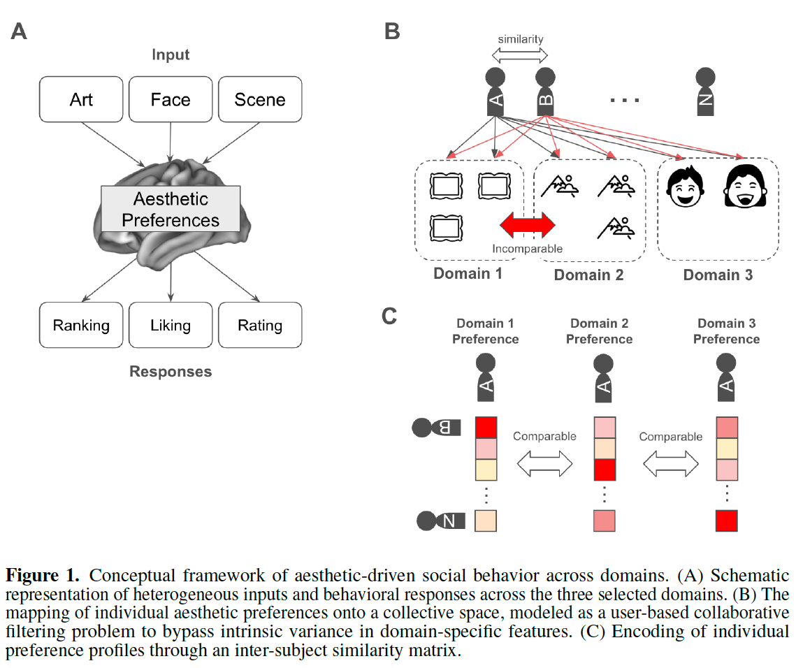
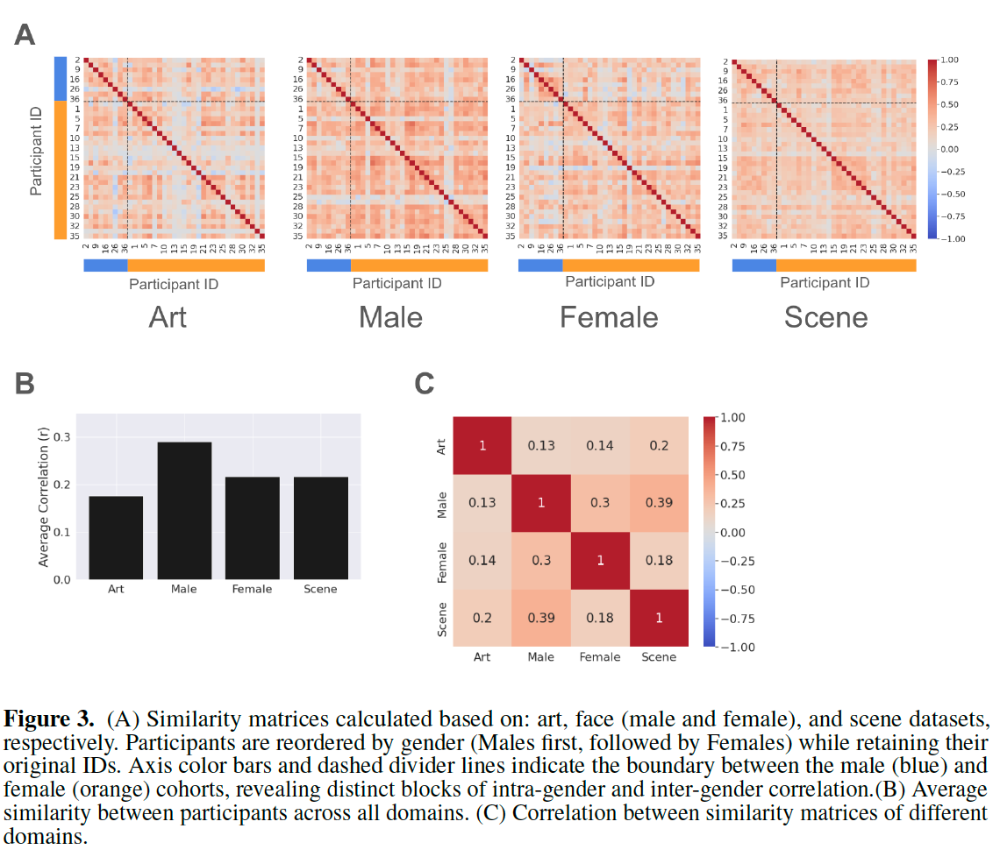
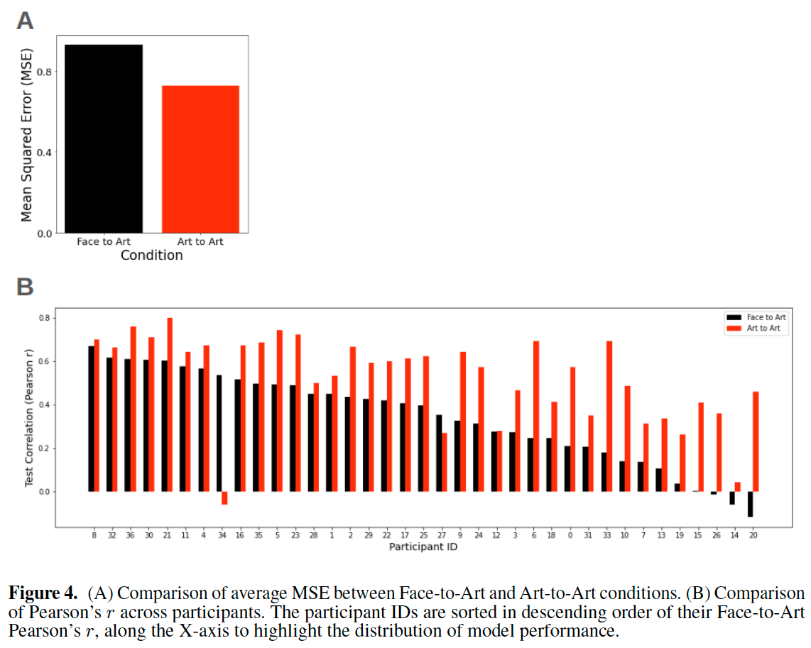
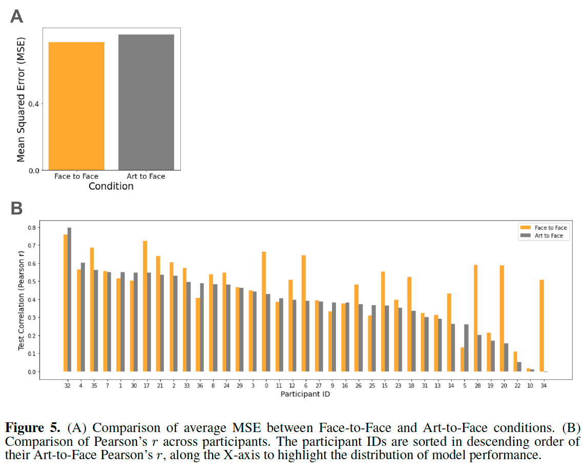
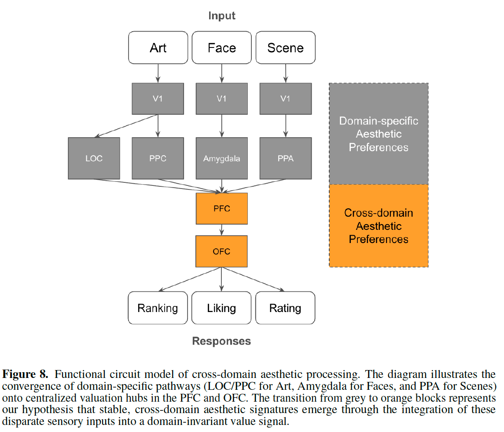

# Cross Domain Consistency of Aesthetic Preference-driven Social Behavior

**著者**: Trung Quang Pham, Junichi Chikazoe.  
**所属**: 広島大学 脳・心・感性科学研究センター, 理化学研究所 iTHEMS, Araya Inc., 高知工科大学, 玉川大学脳科学研究所.  
**出版**: bioRxiv preprint 2026 (doi: 10.64898/2026.03.21.713367).  

---

## 1. 論文の目的または目標は何ですか？

本研究は，**美的嗜好（aesthetic preference）が異なるドメイン間で一貫しているか**という問いに取り組んでいる。デジタル時代において，視覚的コンテンツへの嗜好はオンライン上の社会的行動を駆動する主要な要因となっているが，これまでの研究は主に「美術（art）」ドメインに限定されており，他ドメインへの一般化はほとんど検証されてこなかった。

著者らは以下を仮説として提示する：
- **美的判断はドメイン不変な潜在構造（domain-invariant latent structure）によって支配されている**
- あるドメインで類似した嗜好を示す個人は，一見無関係な別ドメインでも類似した整合性を示すはずである

この仮説を検証するため，著者らは美術・顔（男性／女性）・風景という3つの異なるドメインを設定し，個人の嗜好プロファイルを協調フィルタリング（collaborative filtering）の枠組みで定式化する新しい計算論的フレームワークを提案している。最終的な目標は，美的嗜好がドメイン横断的な抽象的・一般的メカニズムによって媒介されているかを実証的に示し，神経生理学的基盤（OFC・DMN）と結びつけて考察することにある。

---

## 2. トピックを探求するために使用された方法またはアプローチは何ですか？

### 行動実験

- **被験者**: 日本人37名（男性9名・女性28名）
- **刺激セット**:
  - Art: 400点（LiveAuctioneersから収集）
  - Face: 男性80点 + 女性80点（雑誌等から収集，著名人は除外）
  - Scene: 400点（AVAデータセットからサンプリング）
- **タスク**:
  - **Art**: 主観的金銭評価（JPY 100〜10,000,000，初期値10,000）
  - **Face / Scene**: 8×10グリッド上での順位付け（rank 1〜80）

### 計算論的フレームワーク（核心的アイデア）

ドメイン間で特徴量のスケールが大きく異なるため，被験者の生応答を直接マッピングすることは困難である。そこで著者らは，**「個人と集団との相対関係（inter-subject similarity）」を介して個人の嗜好プロファイルを符号化する**というアプローチを取った（Fig. 1参照）。

<b>Fig. 1</b>: 被験者間類似度を介したクロスドメイン予測フレームワークの概念図

具体的には：

1. **被験者間類似度行列の構築**: 各ドメインで被験者ペア間のPearson相関を計算し，37×37の類似度行列を作成
2. **協調フィルタリング問題への定式化**: ユーザベース協調フィルタリングの予測式（Eq. 1）を用い，あるドメインの類似度から別ドメインの応答を予測
3. **モデル**: SLIM（Sparse Linear Method, Ning & Karypis 2011）を採用。scikit-learnのElasticNetで実装。β（10⁻⁴〜10¹²）とλ（10⁻³〜10²）をグリッドサーチで最適化
4. **評価**: MSEと予測値・実測値間のPearson相関（Fisher z変換後に平均化）。75/25のtrain/test分割で20回反復

### 検証条件

- **Within-domain（ベースライン）**: Art-to-Art, Face-to-Face（leave-one-out）
- **Cross-domain（本命）**: Face-to-Art, Art-to-Face

---

## 3. 主要な結果または発見は何でしたか？

### (1) 被験者間類似度のドメイン間相関（Fig. 3）

各ドメインで構築した類似度行列の下三角部分をベクトル化し，ドメイン間でPearson相関を計算した結果：

- **Male × Scene の相関が最も強い（r = 0.39）**
- Male × Female: r = 0.30
- その他のドメインペアでも弱〜中程度の正相関を示し，ドメイン横断的な一貫性を支持

<b>Fig. 3</b>: ドメイン間における被験者間類似度行列のPearson相関

### (2) Cross-domain予測の成功（Fig. 4, Fig. 5）

協調フィルタリングモデルによる予測性能は以下の通り：

| 条件 | 平均Pearson r |
|------|----------------|
| Art-to-Art（同ドメイン基準） | 0.55 |
| **Face-to-Art（クロスドメイン）** | **0.35** |
| Face-to-Face（同ドメイン基準） | 0.48 |
| **Art-to-Face（クロスドメイン）** | **0.40** |

**重要な所見**: クロスドメイン予測は同ドメイン予測より低いものの，相関係数として実用的に高い水準（0.35〜0.40）を達成。これは，ある個人の美的嗜好の重要な部分がドメイン非依存の潜在構造に符号化されていることを示している。

<b>Fig. 4</b>: Within-domain（Art-to-Art, Face-to-Face）予測性能

<b>Fig. 5</b>: Cross-domain（Face-to-Art, Art-to-Face）予測性能

### (3) 「自然」ドメインと「人工」ドメインの差異

行動分析の結果，顔と風景という「自然（natural）」ドメイン間の相関が，これらと美術（artificial）との相関より高いことが確認された。これはVessel et al. (2018)による先行研究と整合する。一方で，本フレームワークでは「自然」⇔「人工」のクロスドメイン予測でも有意な相関が得られており，より深い共通基盤の存在を示唆している。

---

## 4. 結論は何であり，なぜそれが重要なのですか？

### 結論

- **美的嗜好はドメイン横断的に一貫した潜在的特性である**ことが計算論的に実証された
- 個人の応答を生の特徴量レベルではなく「集団内での相対位置（inter-subject similarity）」として符号化することで，ドメイン固有のスケール差を回避し，頑健なクロスドメイン予測が可能になった
- この結果は，美的判断が刺激依存的（stimulus-dependent）ではなく，**抽象的・ドメイン一般的なメカニズムに媒介されている**ことを支持する

### 神経生理学的含意（Fig. 8）

著者らは，ドメイン特異的経路（Art: V1→LOC/PPC，Face: V1→Amygdala，Scene: V1→PPA）が**前頭前皮質（PFC）と眼窩前頭皮質（OFC）に収束**し，そこでドメイン不変な価値信号が形成されるという機能的回路モデルを提案。さらに，このモデルがDefault Mode Network（DMN）の役割と整合的であることを論じている。

<b>Fig. 8</b>: ドメイン特異的視覚経路がOFC/PFCで収束する機能的回路モデル

### 重要性・貢献

1. **理論的貢献**: Theory of Aesthetic Preferences (TAP) を，cross-cultural（文化横断）からcross-domain（ドメイン横断）へと拡張
2. **方法論的貢献**: 個人の嗜好を「集団との相対関係」として表現する手法は，ドメイン間の特徴量スケール差問題を回避する一般的なフレームワークとなりうる
3. **応用的貢献**: マルチモーダル推薦システムへの直接的な応用可能性を提示。あるドメインで観測された嗜好の「潜在的シグネチャ」を，全く異なるドメインでのパーソナライズに転用できる
4. **神経科学への橋渡し**: 行動的知見を神経回路モデル（OFC・DMN）と結びつけ，今後のfMRI/EEG・XAIを用いた検証への道筋を示した

### 限界

- 視覚モダリティ内のみの検証（聴覚・触覚への拡張は今後の課題）
- 日本人のみのサンプル（文化横断検証が必要）
- 実験室内の孤立タスクであり，社会的相互作用下での「魅力ハロー効果」や同調圧力の影響は未検証