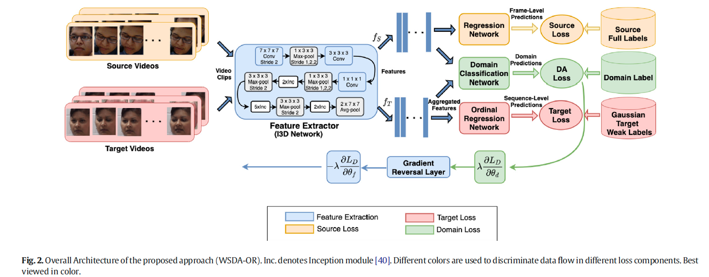
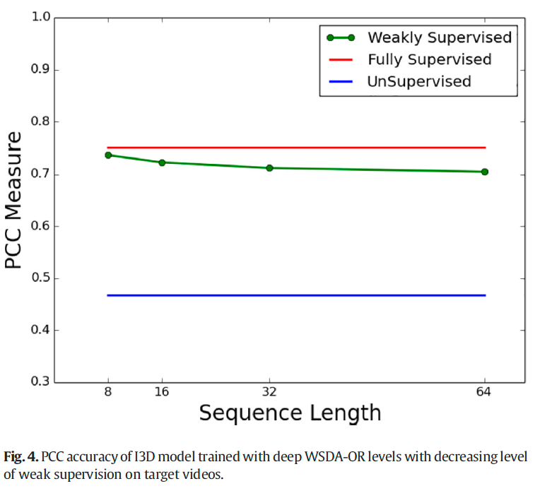
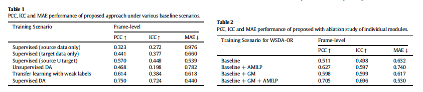
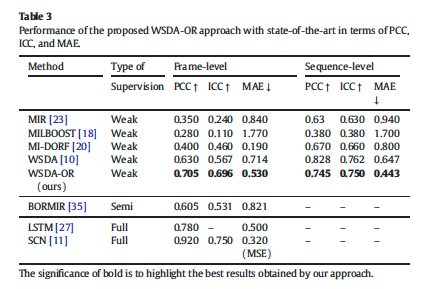
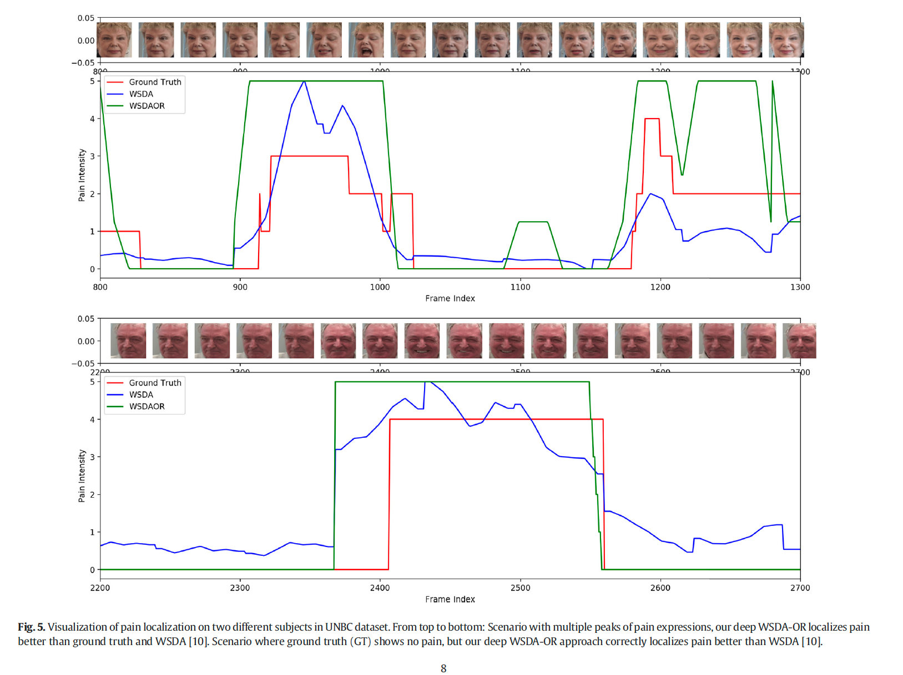
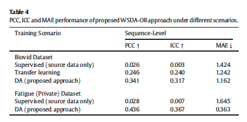

# Deep Domain Adaptation with Ordinal Regression for Pain Assessment Using Weakly-Labeled Videos

**著者**: Gnana Praveen Rajasekhar, Eric Granger, Patrick Cardinal  
**所属**: Laboratoire d'imagerie, de vision et d'intelligence artificielle, École de technologie supérieure, Université du Québec, Montreal, Canada  
**出版**: Image and Vision Computing, Vol. 110, 2021

---

## 1. 論文の目的または目標は何ですか？

本論文は，**弱ラベル付き動画を用いた痛み強度推定**という問題に取り組む．具体的には以下の3つの課題を同時に解決することを目標としている．

**① ドメインシフト問題**  
実験室環境（ソースドメイン）と実運用環境（ターゲットドメイン）では，顔表情の撮影条件や個人差によって大きなドメインシフトが生じる．既存のDLモデルはこの影響を受けやすく，性能が著しく低下する．

**② アノテーションコスト問題**  
フレーム単位で痛み強度を付与するには専門家による多大な労力が必要であり，大規模データセットへの適用が困難である．本論文ではターゲットドメインに対してシーケンスレベルの粗いラベルのみを仮定する弱教師あり学習（WSL）設定を採用する．

**③ 順序関係の未活用問題**  
痛み強度レベル（0〜15）には自然な順序関係が存在するが，既存のWSLモデルはこれを十分に活用していない．例えば強度4の予測において，強度3や5への誤分類は強度0や15への誤分類より許容されるべきである．

これらを統合的に解決する新たなDLモデル **WSDA-OR（Weakly-Supervised Domain Adaptation with Ordinal Regression）** を提案する．

---

## 2. トピックを探求するために使用された方法またはアプローチは何ですか？

### WSDA-ORモデルの構成

モデルは以下の3つの主要モジュールで構成される．

#### ① Gaussian Modeling of Ordinal Intensity Levels（GM）
痛み強度ラベルをone-hotベクトルではなく，**ガウス分布に基づくソフトラベル**として表現する．

$$q_i = e^{-\frac{(k - y_i)^2}{2\sigma^2}}$$

正解ラベルを平均，$\sigma$（=0.3）を分散として，近傍の強度レベルほど高い確率を割り当てる．これにより，順序関係を明示的なアーキテクチャ変更なしに学習できる．

#### ② Adaptive MIL Pooling（AMILP）
MIL（Multiple Instance Learning）において，従来のmax poolingは最大強度と予測された**1フレームのみ**をシーケンスラベルに関連付けていた．AMILPでは，最大強度と**予測されたすべてのフレームのソフトマックス出力の平均**を取る．

$$P(X_i) = \frac{1}{N_{t_i}} \sum_{j \in \max(1,..n_i)} G_{wl}(G_f(x_i^j))$$

痛み表情はスパースであるため，最大強度以外の中立フレームは自動的に除外され，追加パラメータなしに複数の関連フレームを活用できる．

#### ③ 敵対的ドメイン適応（Adversarial DA）
Gradient Reversal Layer（GRL）を用いた敵対的学習により，ドメイン不変な特徴表現を獲得する．全体の損失関数は以下の通り：

$$L = L_S + L_T - \lambda L_d$$

- $L_S$：ソースドメインのフレームレベルMSE損失
- $L_T$：ターゲットドメインのGaussianラベルとAMILP出力のクロスエントロピー損失
- $L_d$：ドメイン判別のロジスティック損失
- $\lambda$：エポックとともに増加するトレードオフパラメータ

特徴抽出器$G_f$はソース・ターゲット間で重みを共有し，ドメイン判別器$G_d$とmin-max競合することでドメイン不変な特徴を学習する．

### 実験設定

| 項目 | 内容 |
|---|---|
| バックボーン | I3D（Inflated 3D CNN，ImageNet事前学習） |
| ソースドメイン | RECOLA（フレームレベルラベルあり，感情強度 -1〜+1） |
| ターゲットドメイン | UNBC-McMaster肩痛データセット（シーケンスレベルラベルのみ使用） |
| 追加検証データ | BioVid, Fatigue（private） |
| 評価プロトコル | Leave-One-Subject-Out（LOSO）交差検証 |
| 評価指標 | PCC, ICC(3,1), MAE |
| 痛み強度量子化 | 16段階 → 6段階（0,1,2,3,4-5,6-15） |

---

## 3. 主要な結果または発見は何でしたか？

### ベースライン比較（Table 1参照）

弱教師ありDA（シーケンス長64）の設定でも，フルラベルに近い性能を達成した（PCC: 0.705 vs Supervised DA: 0.750）．転移学習（PCC: 0.614）を大きく上回り，DAによってラベル不足を補えることが確認された．

シーケンス長を短くするほど（アノテーション頻度を増やすほど）性能は向上し，弱教師の程度と性能のトレードオフが明確に示された．

### アブレーション研究（Table 2参照）

GMとAMILPの双方を組み合わせることで最大性能（PCC: 0.705）を達成し，各モジュールの独立した貢献も確認された．

### 既存手法との比較（Table 3参照）

弱教師あり手法の中では，フレームレベルPCCで最高性能（0.705）を達成した．フルラベルを用いるSCN [11]（PCC: 0.920）には及ばないものの，シーケンスレベルラベルのみという制約下での大幅な改善を実現した．また，Fig. 5に示すようにground truthが痛みを見逃しているケースでも正確に痛みを局在化できることが確認された．

### BioVid・Fatigueデータセットへの汎化（Table 4参照）

ソースデータのみの学習（PCC: 0.026）に対し，WSDA-ORによりBioVidでPCC: 0.341，FatigueでPCC: 0.436まで向上し，異なるドメインへの汎化能力が示された．

---

## 4. 結論は何であり，なぜそれが重要なのですか？

### 結論

本論文はGaussian Modeling，Adaptive MIL Pooling，敵対的ドメイン適応を統合したWSDA-ORを提案し，シーケンスレベルの弱ラベルのみを用いてフレームレベルの痛み強度の正確な局在化を実現した．弱教師あり設定でありながら，フル教師あり手法に迫る性能を達成している．

### 学術的貢献

- 順序回帰とMILを組み合わせた枠組みをドメイン適応に統合した初めてのモデル
- Gaussian表現をMIRの文脈で活用した最初の試み
- AMILPにより追加パラメータなしで複数関連フレームを効率的に活用

### 社会的意義

ICUの患者，神経疾患患者，乳幼児など**言語的な痛みの表現が困難な人々**への自動痛み管理システムへの応用可能性が高い．実運用環境でのドメインシフトや，大規模アノテーションの困難さという実用上の障壁を同時に低減できる点で，臨床応用に向けた重要な一歩となる．