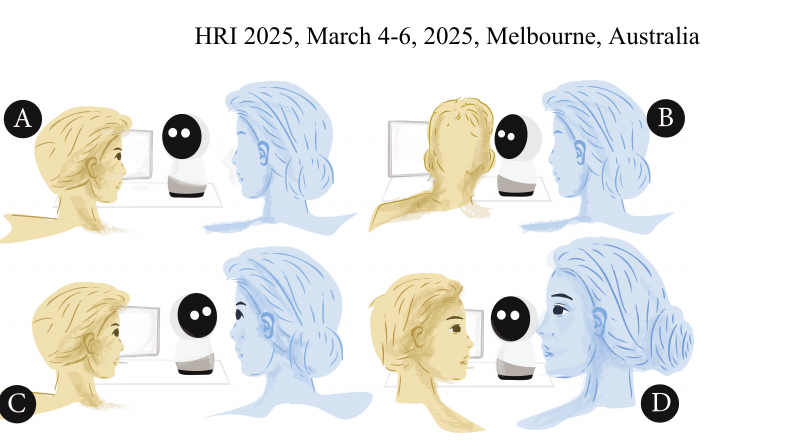
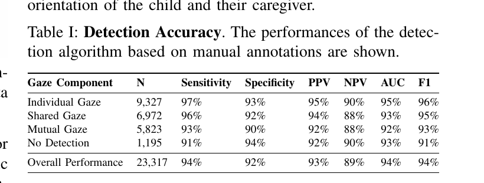
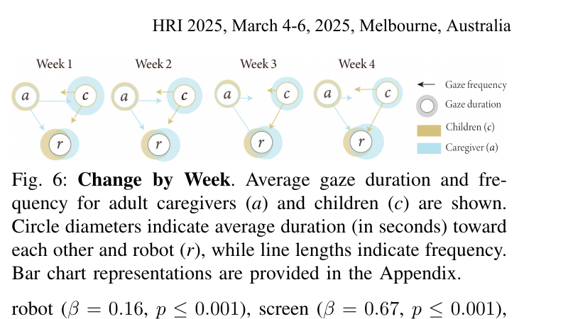
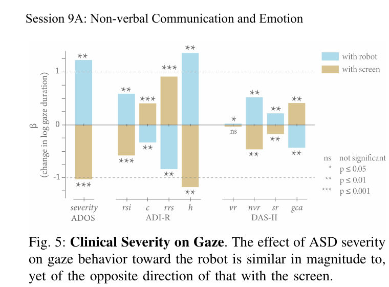

# Gaze Behavior During a Long-Term, In-Home, Social Robot Intervention for Children with ASD

**著者**: Rebecca Ramnauth¹, Frederick Shic²,³, Brian Scassellati¹
**所属**: ¹Department of Computer Science, Yale University; ²Center for Child Health, Behavior, and Development, Seattle Children's Research Institute; ³Department of Pediatrics, University of Washington School of Medicine
**出版**: HRI 2025 (20th ACM/IEEE International Conference on Human-Robot Interaction), March 4–6, 2025, Melbourne, Australia (**Best Paper Award, Theory and Methods Track** — Yale CS / Scazlab 公式発表による)

---

## 1. 論文の目的または目標は何ですか？

<b>図1</b>: Modeling Gaze。ロボットの context-contingent gaze。(A) 子がロボットを見る → (B) ロボットがスクリーンに視線を移す → (C) ロボットが養育者に視線を移す → (D) 子がその視線を追って養育者を見る、という triadic interaction の流れを設計する。

ASD (Autism Spectrum Disorder) における**非定型な視線行動** (eye contact の回避、joint attention の減少、社会的視線への感受性の低下 [13, 14]) は診断的指標であり、社会的・コミュニケーション困難の中核を成す。既存の介入は養育者・臨床医による継続的な動機付け・行動フィードバックを要し、個人差への適応も難しい。

先行研究の **Scassellati et al., Science Robotics 2018 [23]** は、ASD児の家庭で 1 ヶ月の自律ロボット介入を行い社会スキルの改善を報告したが、視線評価は**臨床医による 4 時点 (介入前 30 日 / 初日 / 最終日 / 介入後 30 日) の手動アノテーション**に留まっていた。

そこで本論文は次の 3 点を目的とする:

1. 自宅録画から自動で視線イベントを抽出するパイプラインを構築し、その精度を手動アノテーションで検証する。
2. 30 日間の介入期間にわたる視線変化を**週単位の連続解析**で捉える。
3. joint attention だけでなく、**個別視線・mutual gaze・gaze following** まで含めた包括的解析を行い、臨床指標 (ADOS / ADI-R / DAS-II) との関係を調べる。

---

## 2. トピックを探求するために使用された方法またはアプローチは何ですか？

### 参加者と臨床指標

15 家族登録、2 家族離脱 (健康問題・技術的問題) し、13 家族 (子: 女児 5・男児 8、6–12 歳, $M=10.0, SD=1.4$) が完遂。診断は clinical best-estimate アプローチに基づき、**ADI-R** (parent interview: reciprocal social interactions / communication / RRB / early development)、**ADOS** (clinician-administered, calibrated severity score $M=7.3$)、**DAS-II** (IQ ≥ 70, verbal / nonverbal / spatial / GCA) で特性付け。

### 介入システム

- **ロボット**: Jibo [26] (高さ 11 inch、3 軸 360° 可動)。デフォルトの単眼を **2 つのアニメ化された目** に改造し、より自然な social gaze をモデル化。
- **ハード**: タッチスクリーン、追跡用 RGB カメラ、録画用 RGB カメラ、知覚 PC、メイン PC。ROS で統合。
- **介入内容**: 1 セッション 30 分 / 30 日。3 つのゲーム (social-emotional understanding / perspective-taking / ordering & sequencing) を通じ、ロボット - 子 - 養育者の triadic interaction を促す。
- **context-contingent gaze** (図1): 子がロボットを見ると、ロボットはスクリーン → 養育者へと視線を誘導し、子の gaze-following を引き出す。

### 視線抽出パイプライン

156 時間 (子あたり平均 25 セッション) の録画を **OpenFace 2.0 [28]** で前処理し、各フレームの顔ランドマーク・gaze coordinates・action units を抽出。子と養育者は隣に着座するが固定はせず、複数顔検出のうち右を子・左を養育者として割り当てる (3 人以上写る場合は手動選択)。各人物の視野を**コーン**として定義し、スクリーン / ロボット / 子・養育者 / 他物体との交差から注視対象を判定する。連続フレームを同一ターゲットでグループ化してイベント化。

### 精度検証

ELAN [29] を用い、各参加者の**前半 2 週から 1 セッション・後半 2 週から 1 セッション**の計 26 セッション (12.4 時間, 全データの 7.9%) を手動アノテーション。5,635 件のアノテーションを、アルゴリズムが検出した 23,317 イベントとタイムスタンプで照合し、重複率で精度を測定。

<b>表1</b>: 視線成分別の検出性能。Individual / Shared / Mutual の各 gaze で sensitivity ≥ 91%、overall F1 = 94%。

養育者で精度 94% に対し子で 88% と有意差あり ($z=16.6, p \le 0.001$)。「右隣の対象を見る」「左隣の対象を見る」場面で精度が下がるほか、no-detection の 57% が子データに偏る。OpenFace の学習データ (MPIIGaze [31] = 神経定型成人) と子・ASD の頭部運動量のミスマッチが原因と考察される。

### データセットと解析

- 計 **269,278 gaze events**。duration は正に歪んでいたため対数変換 (Shapiro-Wilk)。
- 解析対象 3 成分: (i) **overall gaze** (注意のシフト)、(ii) **mutual gaze** (相互視線)、(iii) **joint attention** (相互視線→対象へ視線を移し共有)。
- 多重線形回帰で「週」を主要予測子とし、ADOS / ADI-R / DAS-II の moderating effect も検証。

---

## 3. 主要な結果または発見は何でしたか？

### 子の overall gaze (週単位)

回帰で週効果が有意 ($F=19.5, p \le 0.001$)。Tukey HSD では、子の平均 gaze duration は screen (70.8s) ≫ other (13.2s) ≫ robot (6.31s) > caregiver (4.07s)。

- **caregiver**: 頻度有意増加 ($t=3.38, p=0.005$)。duration は 1–3 週に有意減少した後、**最終週で急増** ($\Delta M=+1.86s, p \le 0.001$) — 3 週以上の継続が必要。
- **robot**: 頻度は週 3 で増加 ($t=2.65, p=0.03$) するも最終週で消失。duration は単調減少。Levene 検定で**週 2 以降に分散が有意に増大** ($w=7.96, p \le 0.001$) — novelty 効果の収束と個人差の顕在化を示唆。
- **screen**: 頻度・duration ともに単調増加 ($\beta=0.33, p \le 0.001$)。分散も週 2 以降に増大。
- **other**: 頻度は最終週までに有意減少 ($t=4.32, p \le 0.001$)。週 3 で一時的に duration 増加、最終週で再減少。

### 養育者の overall gaze

- **robot** への shift 頻度は介入を通じて増加 ($t=7.97, p \le 0.001$)。
- **子** への gaze は逆に **一貫して減少** ($t=-15.2, p \le 0.001$)。子は養育者への視線を増やす一方、養育者は (ロボットや screen を経由しつつも) 子から視線を外す方向にシフトしていく非対称性が観察された。

### Joint attention (mutual gaze ベース、図6)

<b>図6</b>: 週ごとの平均 gaze duration (円の直径) と頻度 (線の長さ)。a=養育者, c=子, r=ロボット。週を追うごとに子と養育者間、ロボットを介した三者間の相互視線が太くなっていく。

- **子 ↔ 養育者**: spontaneous mutual gaze の頻度が有意増加 ($t=4.31, p=0.009$) し、shared gaze の duration も増加 ($\beta=0.27, p \le 0.001$)。一方で**相互視線そのものの duration は減少** ($\beta=-0.20, p=0.002$) — 短い視線キューで長い共同注意を達成できるようになったことを示す**ポジティブな知見**。
- **ロボット ↔ 子**: 週 2 以降、ロボットとアイコンタクトした子が養育者へ視線を移す頻度が有意増加 ($t=4.56, p \le 0.001$)。joint attention 自体も初週から増加 ($\beta=0.03, p=0.006$)。
- **ロボット ↔ 養育者**: 週 2 以降、ロボットの視線を追って養育者が子へ視線を移すパターンが有意増加 ($t=2.80, p=0.02$、joint attention $\beta=0.07, p=0.004$)。

### 臨床指標の予測力 (図5)

<b>図5</b>: ASD 重症度の各指標が gaze duration に与える効果 (回帰係数 β)。ロボットへの注視 (青) と screen への注視 (茶) は**同じ程度の大きさで逆向き** — 重症度が高い子ほどロボットへの注視が伸びる一方、screen への注視は短くなる。

子の robot への gaze で **ADOS severity ($\beta=1.21, p=0.006$)、ADI-R 4 領域すべて、DAS-II 4 領域すべて** が有意に効いた。重症度が高い・コミュニケーション能力が低い・常同行動が多い子ほど robot を長く見る。screen については同じ大きさで**逆方向**の効果 (重症度が低い子ほど screen を長く見る)。
養育者側でも、子の ASD 重症度が高いほど robot と子の両方への gaze duration が伸びる ($\beta=1.00, p \le 0.001$ ほか)。

---

## 4. 結論は何であり，なぜそれが重要なのですか？

著者らは Discussion で次の 3 つを主要な貢献として整理する。

1. **介入は ASD 児の視線行動を改善した**: spontaneous mutual gaze・joint attention・shared gaze duration がいずれも増加し、特に「短い相互視線で長い共有注意」という質的に望ましいパターンが出現した。子と養育者の視線はロボットの gaze に contingent であり、**「ロボットが視線をシフトすると、人もそれに従う」という社会的キューが家庭環境で機能した**ことを連続データで示した。
2. **2 週間が境界となる timing & variability**: ロボット ↔ 養育者の joint attention、子の gaze 分散など多くの効果が**週 2 以降にようやく顕在化**する。novelty 効果の収束と個人差の顕在化のため、**社会スキル介入は 2 週間より長い評価期間が必要**であると勧告する。
3. **診断指標は強い予測子**: ADOS / ADI-R / DAS-II が子と養育者双方の gaze 行動を予測する。これは介入効果の事前見積もりや、臨床医の常時オーバーサイトの軽減に直結する。

### 意義

- **HRI における SAR (Socially Assistive Robot) 研究の長期化と実環境化を象徴する Best Paper**。短時間ラボ実験中心だった ASD ロボット研究を、1 ヶ月 156 時間の自宅データで連続評価する方法論を提示した。
- 視線抽出は **OpenFace の限界 (神経定型成人で学習)** を定量的に暴露しており、子供・ASD 集団向け gaze estimation データセット整備の必要性を提起している。
- 大規模言語モデルを中心とする HRI の潮流のなかで、**実環境・長期・人間行動という HRI 本流の価値観**を体現した代表例。LLM 系研究と相互補完的に読まれるべき節目の論文と位置付けられる ([[Kim_2024_LLM-HRI]] 付録「方向5」でも本論文に言及)。
- **限界**: $n=13$ と小さく、長期持続性 (介入終了後の維持) は未検証。今後はより大規模・長期間の評価と、子供データでの自動 gaze 推定の精度改善が課題。
