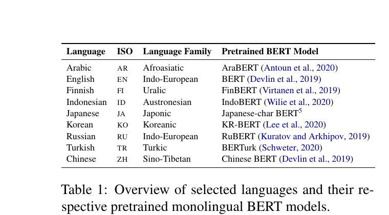
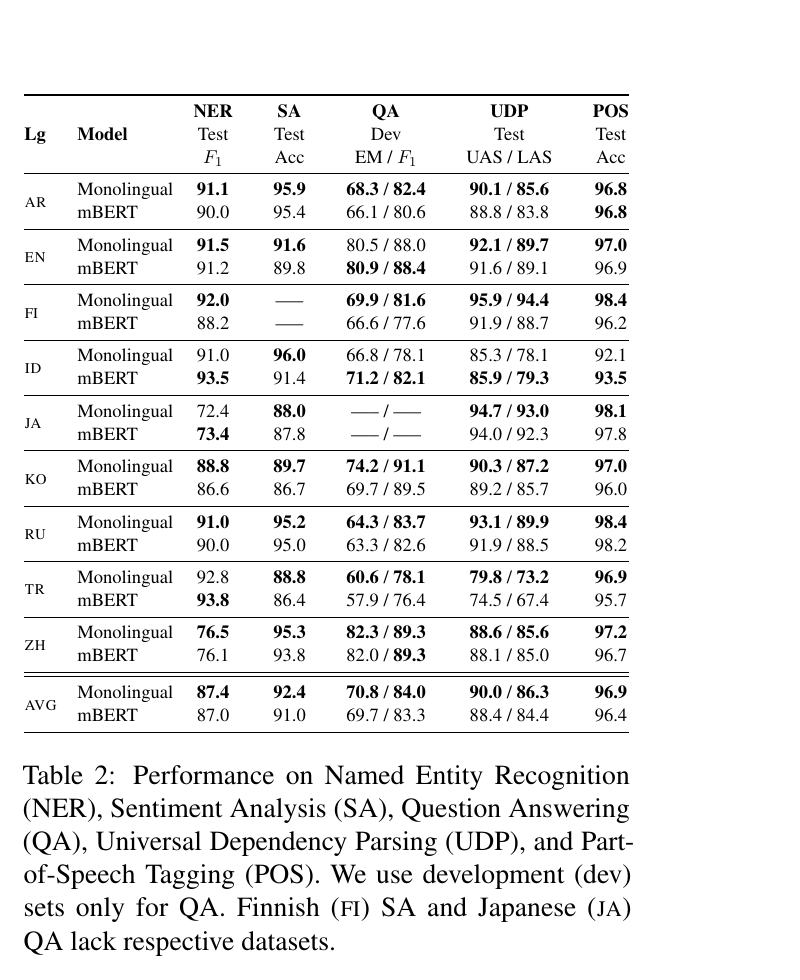
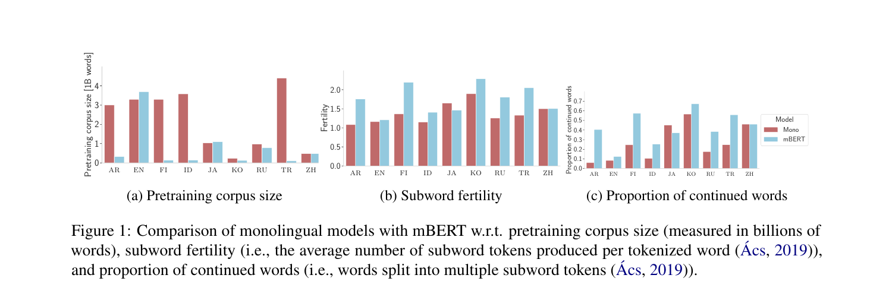
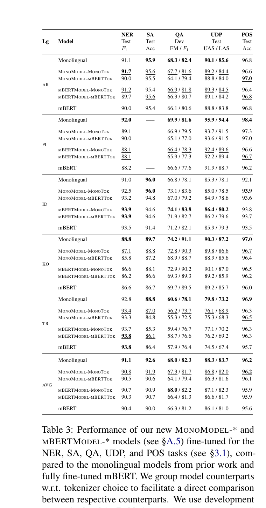
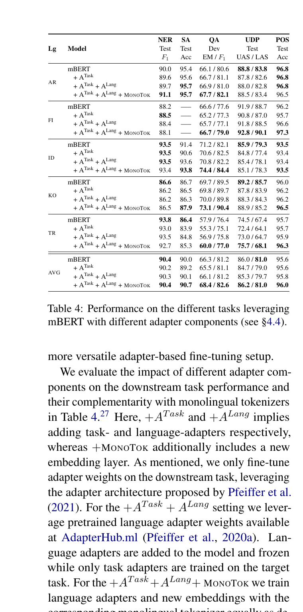
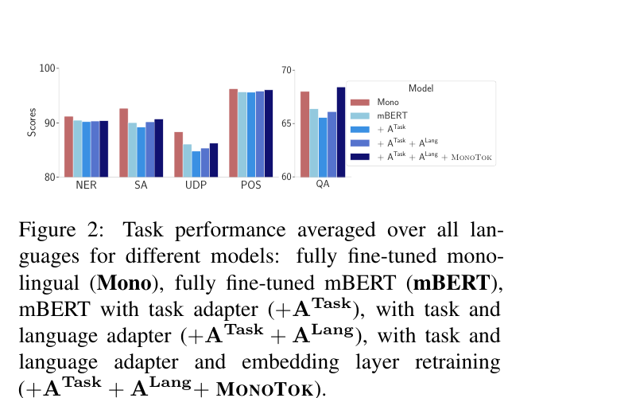
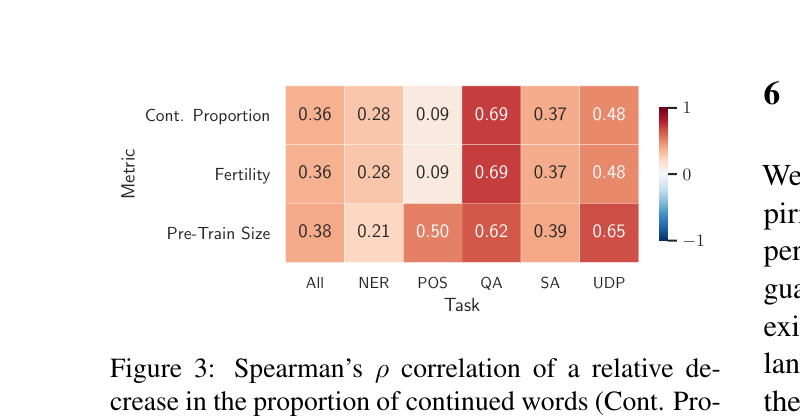

# How Good is Your Tokenizer? On the Monolingual Performance of Multilingual Language Models

**著者**: Phillip Rust, Jonas Pfeiffer, Ivan Vulić, Sebastian Ruder, Iryna Gurevych
**所属**: TU Darmstadt (UKP Lab), University of Cambridge, DeepMind
**出版**: ACL 2021

---

## 1. 論文の目的または目標は何ですか？

mBERTやXLM-Rのような多言語事前学習モデル（multilingual LMs）が次々と提案される一方で、AraBERT・FinBERT・CamemBERTなど**個別言語の単言語BERT**も継続して公開されている。後者の存在意義は「多言語モデルは *curse of multilinguality* に苦しんで単言語タスクで劣る」という前提に拠るが、この主張は**厳密で公平な比較に基づく実証的根拠が乏しく**、anecdotal evidenceに留まっていた。

本論文の目的は次の2点を体系的・統制的に検証することである:

1. mBERTと単言語BERTの**性能差は本当に存在するのか**を、typologicallyに多様な言語×構造の異なるタスクで網羅的に比較する
2. 性能差が存在するなら、その**原因が事前学習データ量にあるのか、トークナイザの質にあるのか**を切り分ける

特に著者らは **トークナイザ（vocabulary、語彙の言語適合性）** という、これまで過小評価されてきた要因に焦点を当て、9言語×5タスクで定量化する。対象言語と対応する単言語BERTモデルは下表の通り。

---

## 2. トピックを探求するために使用された方法またはアプローチは何ですか？

### 言語・タスク選定

- **9言語**: AR / EN / FI / ID / JA / KO / RU / TR / ZH（8語族にまたがる typological diversity）
- **5タスク**: NER（CoNLL-2003, FiNER, KMOU NER, WikiAnn 等）、SA（HARD, IMDb, NSMC, ChnSentiCorp 等）、QA（SQuAD v1.1, KorQuAD, SberQuAD, DRCD, TyDiQA 等）、UDP（Universal Dependencies v2.6）、POS（同 v2.6）

### Step 1: 既存モデルでの初期比較

各言語の monolingual BERT と mBERT を同一プロトコルで fine-tuning（AdamW, lr=3e-5, 10 epochs, early stopping）し、3 seedの平均で比較。これにより既存モデル群の性能ギャップを統制実験で再評価する。

### Step 2: トークナイザ統計の計測

UD v2.6 の各言語コーパス上で2指標を計算:

- **Subword fertility**: 1単語あたりの平均サブワード数（最小値1）
- **Proportion of continued words**: `##` で続くサブワードに分割される単語の割合

両者とも値が小さいほど、その言語にトークナイザが適合していることを示す。

### Step 3: 切り分け実験 — 4変種を新規事前学習

データ量とトークナイザの寄与を分離するため、AR / FI / ID / KO / TR の5言語について、Wikipedia ダンプ上で同一データ・同一手順で4つの BERT 変種を pretrain する:

| 変種名 | モデル本体 | トークナイザ |
|---|---|---|
| MonoModel-MonoTok | 新規単言語 BERT | 単言語専用 |
| MonoModel-mBERTTok | 新規単言語 BERT | mBERT のもの |
| mBERTModel-MonoTok | mBERT（埋め込みのみ再学習） | 単言語専用 |
| mBERTModel-mBERTTok | mBERT（埋め込みのみ再学習） | mBERT のもの |

MLMのみ、whole-word masking（FIのみ）、mBERTモデル変種は埋め込み層以外を凍結。これにより *同じデータ量* で *トークナイザのみが異なる* ペア比較ができる。

### Step 4: アダプタによる代替経路

mBERT を凍結したまま task adapter / language adapter / 単言語埋め込み層を段階的に追加し、軽量に「言語特化容量」を注入できるかを検証（AdapterHub の事前学習 language adapter を利用）。

---

## 3. 主要な結果または発見は何でしたか？

### 既存モデル比較（Table 2）

性能差は確かに存在するが、**言語・タスクによって大きく変動する**。FI / TR / KO / AR で単言語モデルが優位（特に FI で UDP UAS +4.0 / LAS +5.7、TR で UDP UAS +5.3 など、形態的に豊かな言語で差が顕著）、一方で **EN / JA / ZH では差がほぼなく、ID ではほぼ全タスクで mBERT が逆転**（IndoBERTがuncasedな点も影響している可能性）。POS は飽和しており全体的に差が小さい。

### トークナイザ統計（Figure 1）

mBERT の subword fertility は AR / FI / KO / RU / TR で単言語版より顕著に高く（過分割されている）、対する EN / JA / ZH ではほぼ同等。**性能ギャップが大きい言語ほどトークナイザの言語適合性も低い**という一貫した傾向。

### 切り分け実験（Table 3）

同一データ量で訓練しても、**48中38ケースで単言語トークナイザがmBERTトークナイザを上回る**（QA / UDP / SA で特に一貫、NERでは半数程度のケースで多言語Tokが競合〜優位、POS は最大0.4%差で全体的に飽和）。さらに **mBERT本体に単言語トークナイザを差し替える（MBertModel-MonoTok）だけで、20/24（言語×タスク）の組合せで元のmBERTを改善**する。一方で MonoModel-MonoTok が prior work の単言語BERTを下回るケース（18/24）も多く、これは事前学習データ量の効果を裏付ける（MonoModel-MonoTokが勝る6/24のうち4件は ID で、IndoBERTのuncasedトークナイザに対して本研究はcasedを使用しており直接比較が難しい）。

> **読み取り**: 性能ギャップは「データ量」と「トークナイザ」のほぼ独立な2因子にほぼ均等に分解される。

### アダプタによる代替（Table 4 / Figure 2）

mBERT本体を凍結し、task adapter / language adapter / 単言語トークナイザ用の新しい埋め込み層のみを学習する `+ATask + ALang + MonoTok` 構成で、**24中18の組合せでフルfine-tuned mBERTを上回り、そのうち13件は MonoTok 成分（単言語トークナイザ＋新規embedding）の寄与によるもの**。Figure 2 が示すように、QA では平均で単言語BERTすら上回る。**フルスケールの単言語事前学習を行わずとも**、language adapter と embedding 層の追加学習だけで単言語性能のギャップが大きく埋まることを示す。

### 相関分析（Figure 3）

Spearman ρ を見ると、「fertility減少」「continued words減少」「pretraining size増加」は **どれも下流性能向上と同程度の正相関**を示す（特にQA・UDPで強い）。トークナイザの質はデータ量と並ぶ第一級の説明変数であることが定量化される。

---

## 4. 結論は何であり，なぜそれが重要なのですか？

著者らは「monolingual BERTがmultilingual BERTより常に優れている」という通説を**条件付きで支持し、同時に大きく塗り替えた**。性能差は確かに存在するが、(1) **事前学習データ量** と (2) **トークナイザの言語適合性** という2因子で大部分が説明され、しかも後者は単に *embedding層を再学習する* だけで多言語モデル上に取り込める。

この研究の重要性:

- **多言語モデルの設計指針**: 多言語LMの語彙バランス改善（Chung et al. 2020 の言語クラスタリング等）、language-specific tokenizer 拡張（Pfeiffer et al. 2020c）への投資が、curse of multilinguality を実質的に緩和し得ることを定量化した
- **単言語BERT乱立の見直し**: 「mBERTで十分（適切なトークナイザを用意すれば）」と言える言語が想像以上に多く（EN/JA/ZH等）、新規単言語BERTの pretraining コストを正当化する根拠は限定的
- **モジュラー運用**: アダプタ + 単言語トークナイザという組合せが、フルスケールの単言語事前学習を伴わず単言語性能を引き上げるpracticalなレシピとして提示された
- **後続研究への基盤**: トークナイザ非依存（CANINE等）、語彙拡張、language adapter といった方向性を比較可能な統制実験テンプレートとして整備した

**限界**: (1) Wikipedia 限定の事前学習で、ドメイン汎化は未検証。(2) モデル容量を変化させた実験はなし。(3) 高〜中リソース言語に偏り、真に低リソースな言語での挙動は別途検証が必要。(4) `MonoModel-mBERTTok` の比較で明らかなように、トークナイザの寄与はタスクによって不均一（POSではほぼ無視できるレベル）。

コード・モデル・アダプタは https://github.com/Adapter-Hub/hgiyt で公開されている。

---

## 補足メモ（論文外）

論文本体には記載されていないが、本研究の位置づけを理解するうえで関連する2点を、文献的に裏付けたうえで補足する。

### 時代背景: 「単言語BERT乱立」の状況（2019–2021）

本論文が公開された2021年前後は、BERT (Devlin+ 2019) のアーキテクチャを各言語に移植する流れが強く、わずか2年間で各国の研究機関から多数の単言語BERTが公開された時期にあたる。論文中で言及されるもの以外も含め、代表例だけでも:

- **CamemBERT**（仏, ACL 2020）, **FlauBERT**（仏, LREC 2020）
- **FinBERT**（フィンランド語, 2019; 同名の金融ドメインBERTも別系統で2019年公開）
- **BERTje**（蘭, 2019, EMNLP Findings 2020）, **belabBERT**（蘭・RoBERTa系, 2021）
- **CamemBERT**, **AraBERT**（2020）, **BERTurk**（2020）, **KR-BERT**（2020）, **RuBERT**（2019）
- **BETO**（西）, **German BERT**（Deepset.AI）
- **WikiBERT**（44言語の単言語モデル, Pyysalo+ 2020）

つまり「自分の言語にも専用BERTを作る」流行が世界中で起きており、その**正当化の根拠が anecdotal だった**点こそ本論文が問題視した状況である。本論文の「mBERTで十分（適切なトークナイザを与えれば）」という結論は、この乱立の流れに対する重要なカウンターエビデンスとなった。

### 現状: トークナイザの fertility 問題は2026年時点でも未解決

本論文が指摘した *over-segmentation*（高 fertility）の問題は、LLM 時代に入った現在でも構造的課題として残り続けている。むしろスケールが大きくなったことで影響が顕在化している側面もある:

- **Token Tax（トークン税）**: 低リソース・形態的に豊かな言語は、英語より1単語あたり最大10〜15倍のトークンを消費し、推論コスト・APIの課金・レイテンシ・コンテキスト長すべてで不利を被る ([arxiv 2510.12389](https://arxiv.org/abs/2510.12389), [arxiv 2509.05486](https://arxiv.org/abs/2509.05486))
- **下流性能との直接相関**: 10種のLLMを跨いだ最近の研究では、fertility が高い言語ほど accuracy が一貫して低いことが確認されている ([Frontiers AI 2025: Ukrainian tokenization study](https://www.frontiersin.org/journals/artificial-intelligence/articles/10.3389/frai.2025.1538165/full))
- **継続する研究**: HuggingFaceブログ "Tokenization is Killing our Multilingual LLM Dream" (2025) が指摘するように、トークナイザは多言語LLMの構造的ボトルネック。Indic言語向けの IndicSuperTokenizer (2025) などSOTA fertility を主張する手法が次々登場している段階にある

つまり Rust+2021 が立てた問題提起 ——「トークナイザは事前学習データ量と並ぶ第一級の説明変数」—— は5年経った現在、より大きなスケールの multilingual LLM に対しても **そのまま当てはまり続けている**。本論文を読むうえでは、提起された問題が *過去の特殊事情* ではなく *現在進行形の構造課題* である点を認識しておく価値がある。

