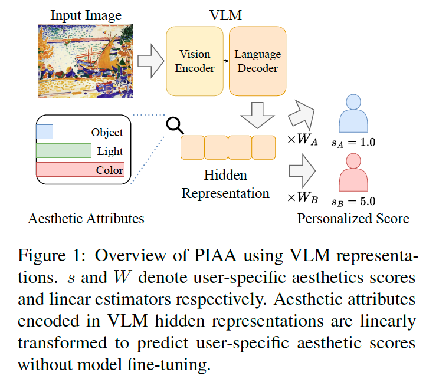
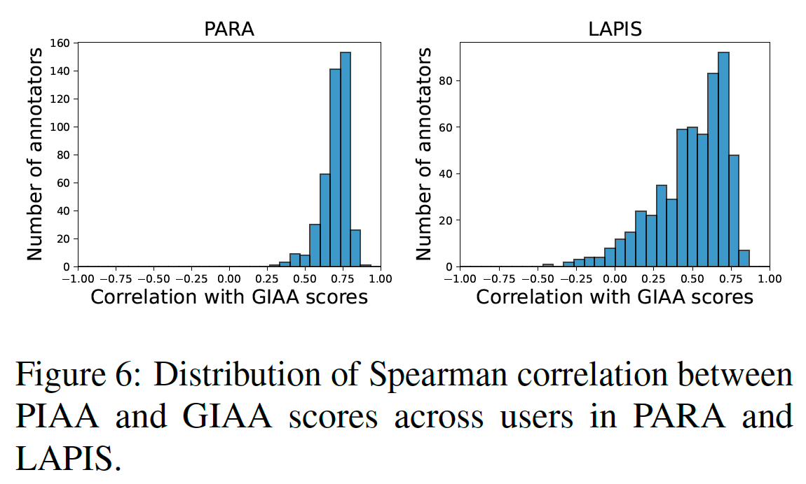
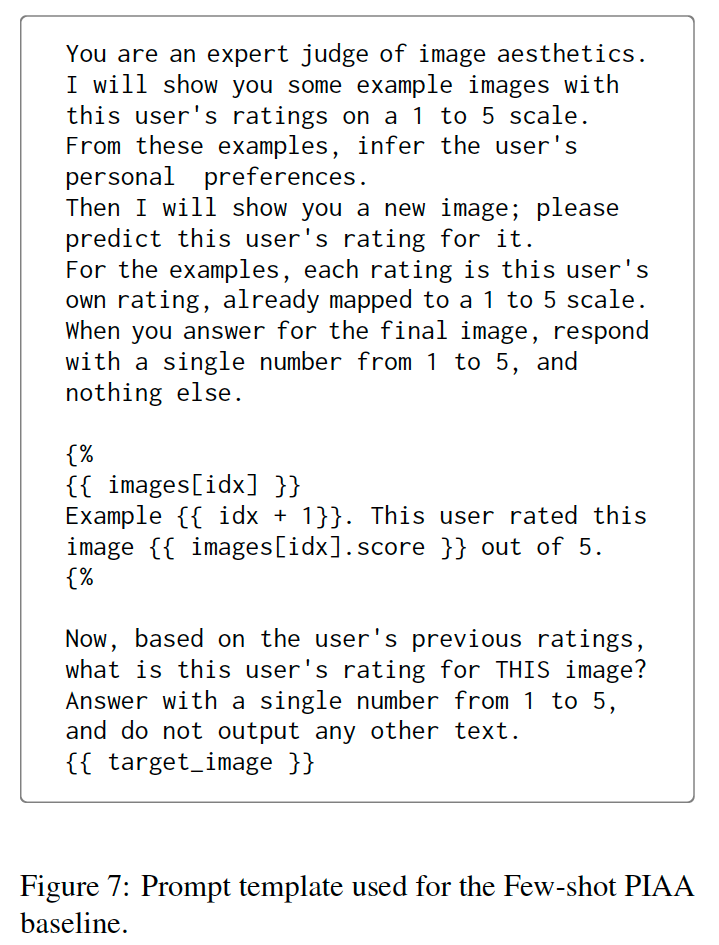
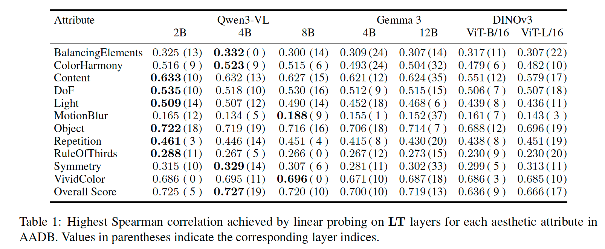
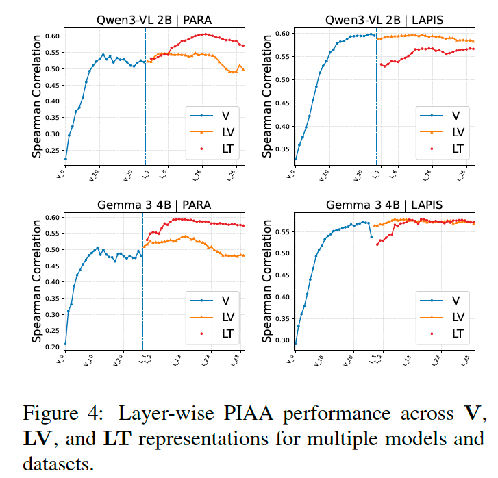
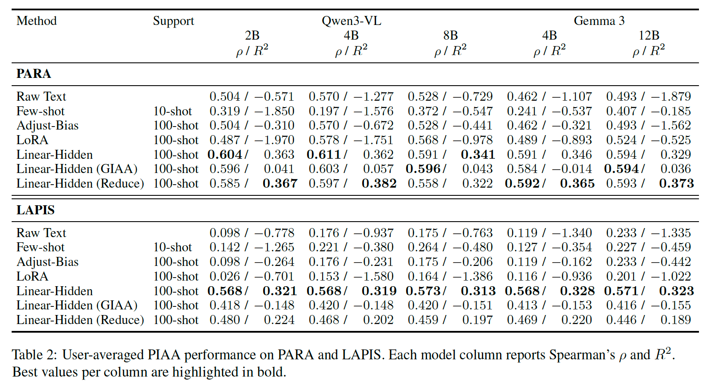
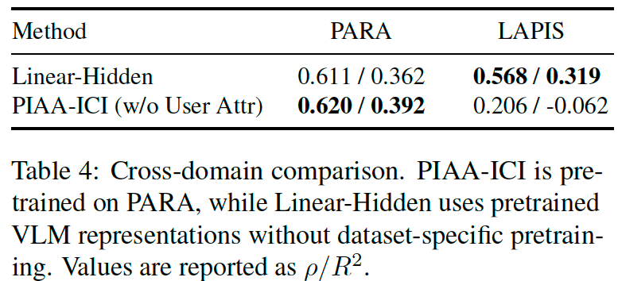

### What Do Vision–Language Models Encode for Personalized Image Aesthetics Assessment?

**著者** : Koki Ryu, Hitomi Yanaka  
**所属** : The University of Tokyo, Riken, Tohoku University  
**出版** : arXiv 2026

--------------------------------------------------------------------------------

#### 1. 論文の目的または目標は何ですか？

本論文の主な目的は、**視覚言語モデル（VLM）が、個人の美学的な好みを反映するために必要な「多層的な美的属性（照明、色、構図など）」を内部でどのようにエンコードしているかを明らかにすること**です。

従来の画像美学評価（IAA）は全ユーザーの平均的な評価を予測するものでしたが、近年は個々のユーザーの主観を反映する**個別レベル画像美学評価（PIAA）**の重要性が高まっています。実際、個人の評価と全体平均（GIAA）スコアとの相関は一様ではなく、特に芸術作品（LAPIS）では相関が低く分散の大きいユーザーが多数存在し、個別化の必要性が裏付けられます。しかし、既存のPIAA手法には「大規模なデータセットによる追加学習コスト」や「写真から芸術作品（アート）へのドメイン転用が困難」といった課題がありました。本研究では、VLMが大規模な事前学習を通じて美的属性を暗黙的に学習しているという仮説を立て、モデルを微調整（Fine-tuning）せずに内部表現を取り出すだけで高性能なパーソナライズが可能かを探求します。

--------------------------------------------------------------------------------

#### 2. トピックを探求するために使用された方法またはアプローチは何ですか？

##### 内部表現の線形プロービングと「Linear-Hidden」法

著者らは、VLM内部の美的情報を調査し、それをパーソナライズに活用するために以下の2つのアプローチを採用しました。

1.  **線形プロービング（Linear Probing）による属性検証**:
    VLMの各層から3種類の表現（ビジョンエンコーダの出力 **$V_i$**、言語デコーダ内のテキストトークン表現 **$\mathrm{LT}_i$**、ビジョントークン表現 **$\mathrm{LV}_i$**）を抽出します。これらに対し線形モデル（リッジ回帰）を適用し、照明、色、構図などの具体的属性がどの程度予測可能かを測定しました。
2.  **提案手法「Linear-Hidden」**:
    VLMの重みを固定したまま、特定のユーザーが提供した少数のサンプル（サポートセット）を用いて、隠れ表現からそのユーザーの個別スコアを予測する線形回帰モデルを学習させます。
3.  **多角的な評価環境**:
    写真ドメインの「PARA」と芸術作品ドメインの「LAPIS」の2つのデータセットを使用し、最新のVLM（Qwen3-VLやGemma 3など）で検証を行いました。比較対象として、ユーザーの過去の評価例をプロンプトに与えるFew-shotプロンプティング（下図のテンプレート）やLoRA微調整を用いています。

--------------------------------------------------------------------------------

#### 3. 主要な結果または発見は何でしたか？

*   **美的属性のエンコードと伝播**: VLMは単一のスコアだけでなく、照明や色といった多様な美的属性を線形にアクセス可能な形で保持しており、それらが言語デコーダ層まで伝播していることが判明しました。特に言語デコーダの中間層付近で、属性情報の保持量がピークに達する傾向が見られました。下表は、AADBの各美的属性に対してLT層の線形プロービングが達成した最高のSpearman相関を示しており、Content・Light・Color など多くの属性が高い予測可能性を持つことが分かります。

    また下図は、V・LV・LTの各表現を層ごとにPIAA性能で評価したもので、ビジョンエンコーダから言語デコーダへと情報が伝播し、デコーダ中間層で性能がピークに達する様子が確認できます。

*   **圧倒的なパーソナライズ性能**: 提案手法「Linear-Hidden」は、テキストベースのプロンプティングやLoRAによる微調整を大幅に上回る性能を達成しました。下表（PARA・LAPISでのユーザー平均PIAA性能）では、Linear-Hiddenが全モデル・両ドメインでRaw Text／Few-shot／LoRA を上回る $\rho$・$R^2$ を示しています。

*   **ドメインによる表現の違い**: 写真ドメインではテキストトークン側の表現（$\mathrm{LT}$）が有効ですが、芸術作品ではビジョントークン側の表現（$\mathrm{LV}$）の方が優れた性能を示すという、ドメイン特有の特性が発見されました。
*   **高い汎用性**: 写真で事前学習した専用モデル（PIAA-ICI）と比較して、VLMの表現を用いる手法は、ドメインを跨いだ評価（クロスドメイン）においても高いロバスト性（頑健性）を示しました。下表の通り、PIAA-ICIは学習元のPARAでは強いものの未知の芸術ドメインLAPISでは性能が崩壊する（$\rho$=0.206, $R^2$=-0.062）のに対し、Linear-Hiddenは両ドメインで安定した性能を維持しています。

--------------------------------------------------------------------------------

#### 4. 結論は何であり，なぜそれが重要なのですか？

**結論**: 本研究は、**VLMの言語デコーダ層に、個人の好みをモデル化するのに十分なほど豊かな美的属性がエンコードされていること**を立証しました。そして、隠れ表現に対して単純な線形モデルを適用するだけで、追加の重い微調整なしに効果的なPIAAが実現可能であることを示しました。

**重要性**: 
1.  **学術的意義**: VLMが美的概念をどのように処理・統合しているかという内部メカニズムの解釈性を高めました。
2.  **実用的貢献**: モデル全体を再学習させる必要がないため計算資源を節約でき、デバイス上での動作やリアルタイムな推薦システムへの応用を容易にします。
3.  **汎用性の提示**: 専用モデルが苦手とする「未知のドメイン（例：写真からアート）」に対しても、VLMの内部表現が強力な汎化能力を持つことを明らかにしました。