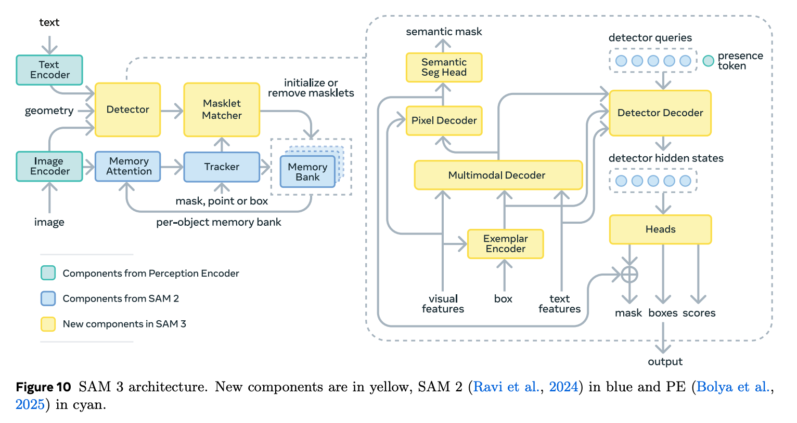

# SAM 3 学習ノート

<p align="center"></p>

## §C.2 Image and Text Encoders

### 役割
SAM3の**最下層の知覚レイヤー**。画像と言語を共通の意味空間に投影し、DetectorとTrackerが共有する基盤特徴を出力する。

---

### 起源：Perception Encoder (PE)

- ベース論文：Bolya et al. 2025 の Perception Encoder
- 学習方法：**CLIP式の対照学習**(画像とテキストを共通空間に埋め込む)
- 学習データ：**54億 image-text ペア**
- 意義：訓練時に未見の概念でも、テキスト⇔画像の意味的近さが学習済み → **open-vocabulary 検出が成立する根拠**

---

### Image Encoder の構造

ViTベース。32層Transformer。約 **450M パラメータ**。

#### 入力
- 解像度：**1008 × 1008** ピクセル(正方形固定)
- パッチサイズ16×16と仮定すると、画像全体で **63×63 = 3,969 トークン**

#### Attention の使い分け(計算量削減の工夫)
- 32層中 **4層だけ global attention**(全3,969トークンが互いにattention)
- 残り **28層は windowed attention**
  - 画像を **3×3 の非重複ウィンドウ**に分割
  - 各ウィンドウ：336×336 ピクセル = **21×21 = 441 トークン**
  - 各ウィンドウ内でだけ attention(他ウィンドウとは交流しない)

#### なぜこの設計か
| パターン | 問題 |
|---|---|
| 全部 global | 計算量が 3,969² で爆発、高解像度を扱えない |
| 全部 windowed | 長距離関係を捉えられない、大きな物体に弱い |
| **少数層だけ global** | 普段はローカル処理、要所で全体を混ぜる(ViTDet/Hiera 系) |

→ Global と Windowed で **attention 計算量は約 10 倍違う**(1,580万 vs 170万エントリ)

#### 位置埋め込み
- **RoPE** (Rotary Position Embedding):各層で相対位置を回転行列で埋め込む
- **Windowed absolute positional embedding**:ウィンドウ内の絶対位置も併用

---

### Text Encoder の構造

- **Causal** Transformer(左→右の一方向 attention、GPT系と同じ)
- **最大コンテキスト長:32 トークン** ← SAM3 が「短い名詞句しか扱えない」物理的根拠
- 約 **300M パラメータ**

---

### Streaming 動作(動画での重要ポイント)

- 動画では **PE backbone はフレームあたり 1 回だけ実行**
- そこから出る **unconditioned tokens**(プロンプトの条件付け前の素の特徴)を後段が使い回す
- ユーザーがプロンプトを変えても、重い画像エンコーダの再実行は不要

---

### "Unconditioned" がキーワード
 
PE の出力は **テキストや exemplar に依存しない、生の視覚表現**。これを 2 つの下流が別経路で消費:
 
- **Fusion encoder** → テキスト/exemplar で条件付け(Detector 用)
- **Memory attention** → 過去フレームの記憶で条件付け(Tracker 用)
→ **1 つの画像表現を 2 つのタスクで共有**できる設計。

---
 
## §C.2 Geometry and Exemplar Encoder
 
### 役割
**テキスト以外のプロンプト**(画像exemplar、点、box、mask)を扱う入り口。
これらを text encoder の出力と同じ「prompt token」形式に統一する変換器。
 
---
 
### 2つの用途
 
| 用途 | タスク | 内容 |
|---|---|---|
| Image Exemplar | PCS(SAM3 新機能) | bbox + 正/負ラベル → 同概念のものを全部検出 |
| Visual Prompt | PVS(SAM1/2 機能) | 点/box/mask → 単一オブジェクトの対話的セグメント |
 
PVS用は主に stage 2/3 の事前学習で混ぜる補助機能。
 
---
 
### エンコーディングの中身
 
各 exemplar/prompt を以下の3要素の concat でトークン化:
 
| 要素 | 中身 | 役割 |
|---|---|---|
| **位置埋め込み** | bbox 座標から生成 | どこにあるか |
| **ラベル埋め込み** | 正/負ラベルを学習可能ベクトルに変換 | 正例か反例か |
| **ROI-pooled 視覚特徴** | bbox 内の特徴マップを切り出してプール | 何が写っているか |
 
**ラベル埋め込み**は、"positive"/"negative" の 2 つの学習可能ベクトルを辞書として持ち、ラベルに応じて取り出す仕組み(離散カテゴリ→連続ベクトルの変換)。
 
---
 
### 2段階の画像情報取り込み(重要)
 
PE の画像エンコーダ出力(unconditioned frame embeddings = 画像全体の特徴マップ)を **2 通りの粒度で 2 回使う**:
 
#### ステップ1: ROI-pooled 特徴(局所情報)
- bbox 領域だけを特徴マップから切り出してプール
- → 「**箱の中身の要約**」を初期 token に組み込む
#### ステップ2: 小 Transformer 内で cross-attention(大局情報)
- 初期 exemplar token が query
- unconditioned frame embeddings 全体が key/value
- → 画像全体の **文脈**を取り込む
```
画像全体の特徴マップ(unconditioned frame embeddings)
        │                │
        │ ROI Pool       │ cross-attention(小Transformer内)
        ↓                ↑
   [箱内の要約] ──── 小Transformer ──→ exemplar token
   + 位置埋め込み
   + ラベル埋め込み
```
 
→ 「局所で何があるか」+「大局で文脈」の両方を1つのトークンに統合。
 
---
 
### Prompt Token への統合
 
```
prompt tokens = [text tokens] + [exemplar tokens] + [geometry tokens]
                            ↓
                    Fusion Encoder へ
```
 
- テキスト/画像exemplar/幾何プロンプトが **同一フォーマットの prompt token** に統一される
- 下流(Fusion Encoder、Decoder)はプロンプトの種類を区別せず一様に扱える
- どれか1種類だけ(例:text のみ)でも成立する

## §C.2 Fusion Encoder

### 役割
**画像特徴をプロンプトで「色付け」する**コンポーネント。
unconditioned 画像特徴を conditioned 画像特徴に変換する。

---

### 入出力

| | 内容 |
|---|---|
| 入力1 | unconditioned frame embeddings(PE Image Encoder 出力) |
| 入力2 | prompt tokens = text + exemplar + geometry tokens |
| 出力 | conditioned frame embeddings(プロンプト情報を織り込んだ画像特徴) |

---

### 構造

**Transformer 6 層**。各層の中身:

1. **Self-attention**: 画像特徴トークン同士で attention(画像内構造を整理)
2. **Cross-attention**: 画像特徴(query) ← prompt token(key/value) → プロンプト情報を取り込む
3. **MLP**: 非線形変換

→ 「画像トークン側が query で、プロンプトを問い合わせる」向き。

---

### 直感的な働き

プロンプト「a striped cat」の場合:
- **Before(unconditioned)**: 画像内の動物・椅子・窓...が均等に表現されている
- **After(conditioned)**: cross-attention により「縞猫らしい」領域の特徴が強調、無関係領域は相対的に抑制

→ 画像表現が **プロンプトに対して相対化される**。後段の Decoder が候補を探しやすくなる下ごしらえ。

---

### 設計上のポイント:Vanilla Attention

> "We use vanilla self-attention operations."

- 近年の DETR 系は **deformable attention** で計算量削減するのが主流
- SAM3 はあえて **素の Transformer attention** を採用
- 理由: 実装がシンプル、PE との整合性、特定パターンへの過剰最適化を避ける

---

### ストリーミング動作との分業

```
動画推論時:
PE backbone:    フレーム1, フレーム2, ...     (各フレーム1回・重い)
                    ↓
   [unconditioned frame embeddings をキャッシュ]
                    ↓
Fusion Encoder: プロンプト変更のたびに再実行(軽い)
```

- 重い処理(PE)はフレームあたり 1 回だけ
- 軽い処理(Fusion)はプロンプトが変わるたびに動かせる
- → 対話的な操作が現実的な速度で可能になる

---

### 後段との接続

Fusion Encoder の出力 **conditioned frame embeddings** は 2 箇所で消費:

1. **Detector Decoder**: object queries が cross-attention で問い合わせる相手
2. **Semantic Segmentation Head**: ピクセル単位のマスク予測の入力

---

### 全体での位置づけ

```
[画像] → Image Encoder → unconditioned features ─┐
                                                   │
                                                   ├→ Fusion → conditioned features
[text] → Text Encoder      ─┐                     │              ↓
[exemplar] → Exem. Encoder  ├→ prompt tokens ─────┘     Decoder / Mask Head
[geometry] → Geom. Encoder ─┘
```