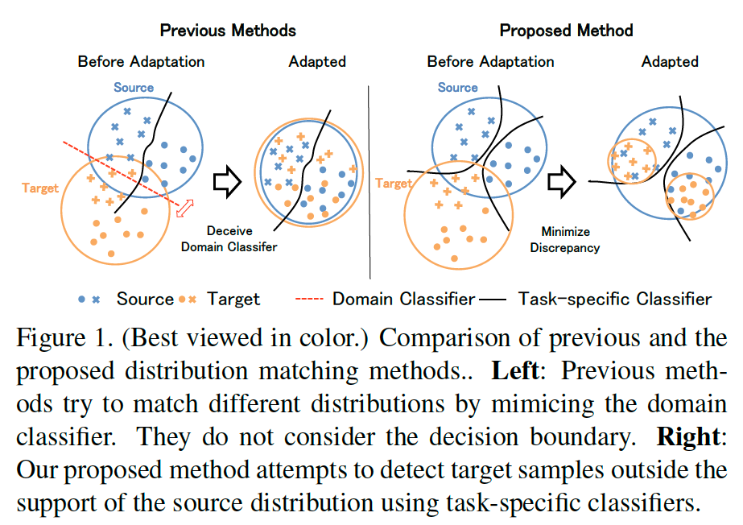
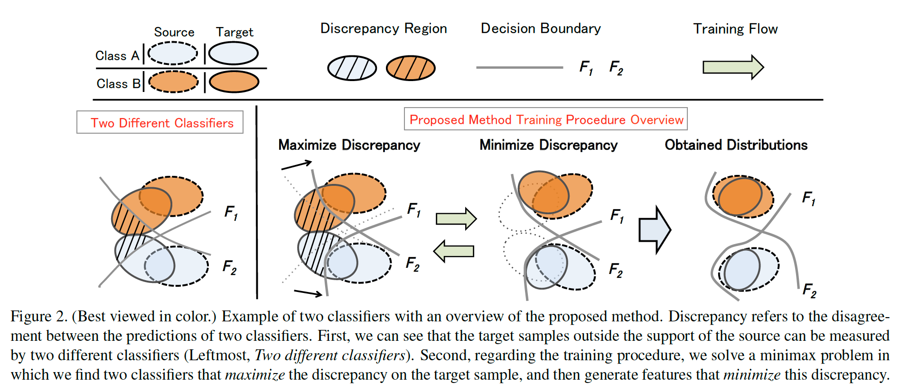
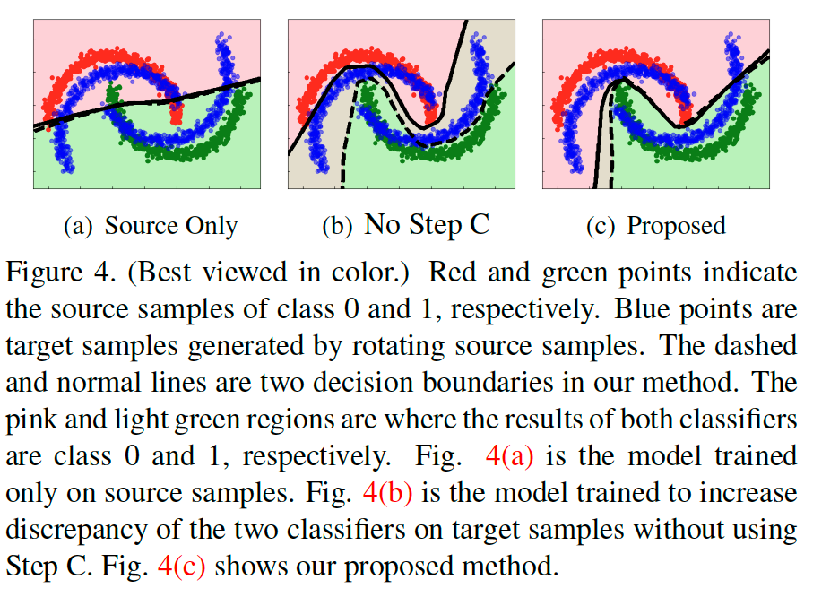
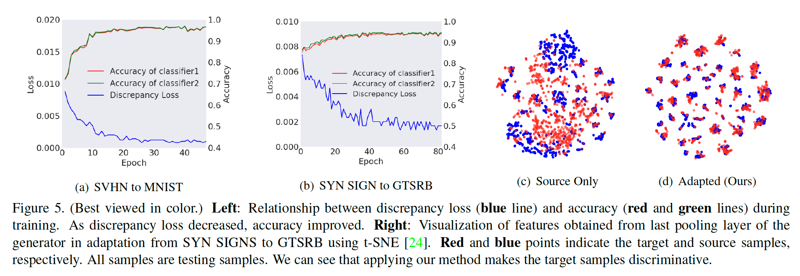

# Maximum Classifier Discrepancy for Unsupervised Domain Adaptation

**著者**: Kuniaki Saito, Kohei Watanabe, Yoshitaka Ushiku, Tatsuya Harada  
**所属**: University of Tokyo, RIKEN  
**出版**: CVPR2018

---

## 1. 論文の目的または目標は何ですか？

本論文は，**教師なしドメイン適応（Unsupervised Domain Adaptation; UDA）** における特徴分布のアライメント問題に取り組む．

UDAとは，ラベルが付いたソースドメインのデータと，ラベルのないターゲットドメインのデータを用いて，ターゲットドメインで高精度に機能するモデルを学習する問題設定である．

従来の敵対的学習ベースの手法（DANN等）はドメイン識別器を用いてソース・ターゲットの特徴分布を一致させようとするが，以下の**2つの問題点**があった：

1. **決定境界を考慮しない**：ドメイン識別器はドメインラベルの識別のみを行うため，クラス間の決定境界を考慮しない．結果として，生成された特徴がクラス境界付近に曖昧に分布してしまう（図1左）．
2. **完全な分布一致は困難**：各ドメインが固有の特性を持つため，2つのドメインの特徴分布を完全に一致させることは本質的に難しい．

これらの問題を解決するため，本論文は**タスク固有の決定境界を利用してソース・ターゲット分布をアライメントする新しい手法**を提案する（図1右）．

> **図1参照**：左が従来手法（境界を無視して分布を一致させようとする），右が提案手法（タスク固有の分類器でサポート外サンプルを検出する）．

---

## 2. トピックを探求するために使用された方法またはアプローチは何ですか？

### 基本アイデア

提案手法の核心は，**2つのタスク固有分類器の予測の不一致（Discrepancy）を最大化・最小化する敵対的学習**である（図2参照）．

> **図2参照**：左から「2つの異なる分類器」「Discrepancy最大化」「Discrepancy最小化」「得られた分布」の流れを示す．

ネットワークは以下の3つのモジュールで構成される：

- **特徴抽出器 $G$**：入力画像から特徴量を抽出する
- **分類器 $F_1$, $F_2$**：$G$ の出力を受け取り，$K$ クラスの確率分布を出力する．2つは独立して初期化される

### Discrepancy損失

2つの分類器の出力確率のL1距離をDiscrepancy損失として定義する：

$$d(p_1, p_2) = \frac{1}{K} \sum_{k=1}^{K} |p_{1k} - p_{2k}|$$

### 3ステップの学習手順（図3参照）

> **図3参照**：Step BとStep Cの敵対的学習の構造を示す．

| ステップ | 更新対象 | 目的 |
|---------|---------|------|
| **Step A** | $G, F_1, F_2$ 全て | ソースサンプルをクロスエントロピー損失で正しく分類する $\min_{G,F_1,F_2} \mathcal{L}(X_s, Y_s)$ |
| **Step B** | $F_1, F_2$（$G$は固定） | ターゲットサンプルに対するDiscrepancyを**最大化**する $\min_{F_1,F_2} \mathcal{L}(X_s,Y_s) - \mathcal{L}_{\text{adv}}(X_t)$ |
| **Step C** | $G$（$F_1, F_2$は固定） | ターゲットサンプルに対するDiscrepancyを**最小化**する $\min_{G} \mathcal{L}_{\text{adv}}(X_t)$ |

Step Bでは $F_1, F_2$ がソース分布のサポート外にあるターゲットサンプルを積極的に検出する識別器として機能し，Step Cでは $G$ がそのような識別器を騙すよう（＝ターゲット特徴をソースのサポート内に引き込むよう）学習する．この3ステップを繰り返すことで適応が進む．

なお，Step Cにおけるジェネレータ更新回数 $n$ はハイパーパラメータとして設定される（実験では $n=2,3,4$ を検証）．

### 理論的背景

本手法はBen-Davidら（2010）のドメイン適応理論に基づく．ターゲットドメインの誤差は以下の上界を持つ：

$$R_T(h) \leq R_S(h) + \frac{1}{2} d_{\mathcal{H} \Delta \mathcal{H}}(\mathcal{S}, \mathcal{T}) + \lambda$$

ここで $d_{\mathcal{H}\Delta\mathcal{H}}$ は2つの仮説の予測の不一致の上限を表す．本手法のStep B・CのミニマックスはこのH∆H距離の最小化と対応しており，理論的な裏付けを持つ．

---

## 3. 主要な結果または発見は何でしたか？

### 3.1 Toy Problem（図4参照）

> **図4参照**：(a) ソースのみ学習，(b) Step Cなし，(c) 提案手法，の3条件での決定境界の比較．

インタートワイニングムーン問題で手法の挙動を確認した：
- **ソースのみ**：ターゲットを考慮しない境界
- **Step Cなし（最大化のみ）**：2分類器が大きく乖離，ターゲット精度は低い
- **提案手法（Step A+B+C）**：2分類器の境界がターゲットを考慮した一致した境界に収束，ターゲットサンプルのほとんどを正確に分類

### 3.2 数字・交通標識データセット（表1参照）

> **表1参照**：SVHN→MNIST 等のドメイン適応精度の比較．

ラベル付きターゲットサンプルを検証に使う手法（†）と比較しても競争力があり，分布マッチングベースの手法を全設定で上回った．また，$n$ を増やすほど精度が向上する傾向が確認された（図5(a)(b)参照）．

### 3.3 VisDA大規模物体分類データセット（表2参照）

> **表2参照**：12クラスに対するResNet101のクラス別精度．

280K超の画像を含む大規模合成→実画像の適応タスクでも，提案手法は平均 **71.9%** を達成し，DANN（57.4%）やMMD（61.1%）を大幅に上回った．さらに，比較手法（MMD・DANN）が一部のクラスではソースのみモデルより精度が低下する一方，提案手法は全クラスでソースのみモデルを上回った．

### 3.4 意味的セグメンテーション（表3・4・図6参照）

> **図6参照**：GTA5→Cityscapesのセグメンテーション結果の定性比較（RGB・Ground Truth・ソースのみ・DANN・提案手法）．

GTA5→Cityscapes・Synthia→CityscapesのmIoUの主な結果：

| 設定 | ソースのみ | DANN | 提案手法（DRN-105） |
|------|-----------|------|-------------------|
| GTA5 → Cityscapes | 22.2 | 32.8 | **39.7** |
| Synthia → Cityscapes | 23.4 | 32.5 | **37.3** |

定性的にも，提案手法は道路・建物等の大クラスで明確な改善を示した．

---

## 4. 結論は何であり，なぜそれが重要なのですか？

### 結論

本論文は，**タスク固有の分類器をドメイン識別器として活用することで，決定境界を考慮した分布アライメントを実現するMCD（Maximum Classifier Discrepancy）**を提案した．

提案手法の本質的な貢献は：

- **ドメインラベルを一切使わない**ことで，ドメイン識別器が不要
- **クラス境界を意識した適応**が可能となり，従来手法の「境界付近に曖昧な特徴が生成される」問題を解消
- 理論（H∆H距離の最小化）と実践が一致した枠組み

### なぜ重要か

1. **汎用性の高さ**：画像分類・交通標識認識・大規模物体認識・意味的セグメンテーションと，異なるタスク・スケールで一貫して有効性を示した．
2. **シンプルな実装**：追加ネットワーク（ドメイン識別器）を必要とせず，既存の分類器を流用できるため，実装コストが低い．
3. **後続研究への影響**：本論文の枠組みはSliced Wasserstein Discrepancy（SWD, CVPR 2019）などの後続研究に直接発展しており，UDA分野における基盤手法として広く参照されている．
