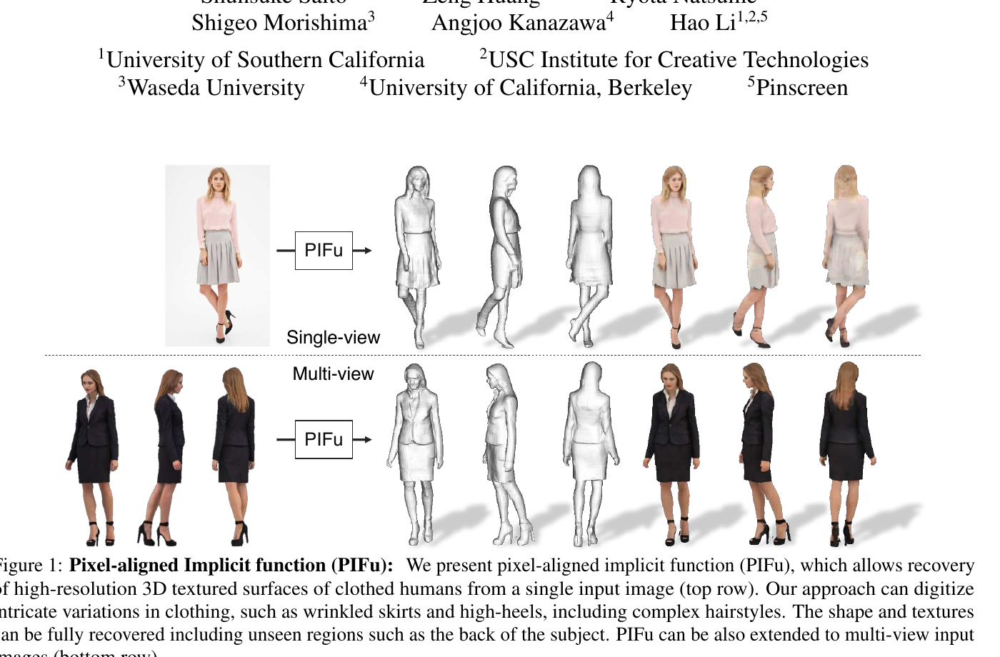
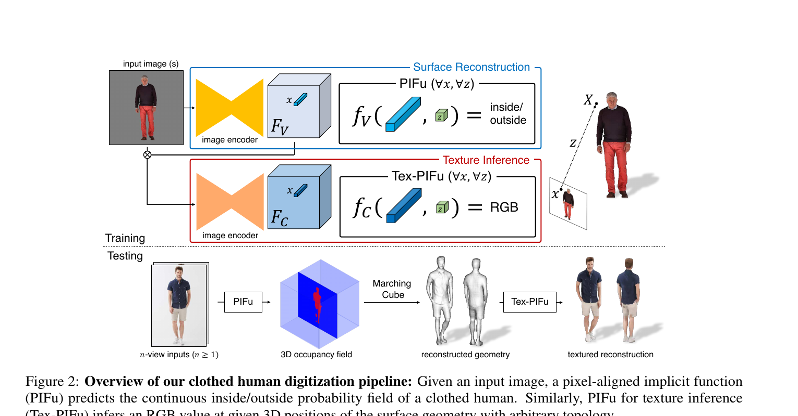
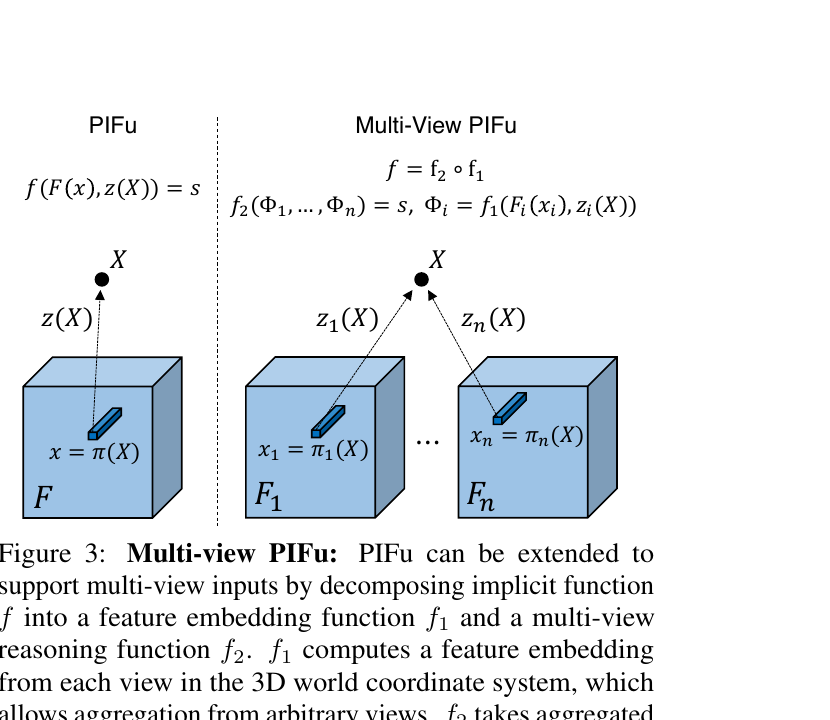
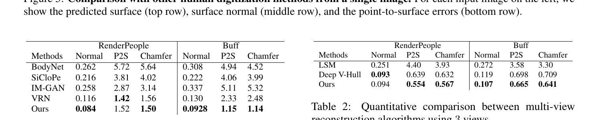
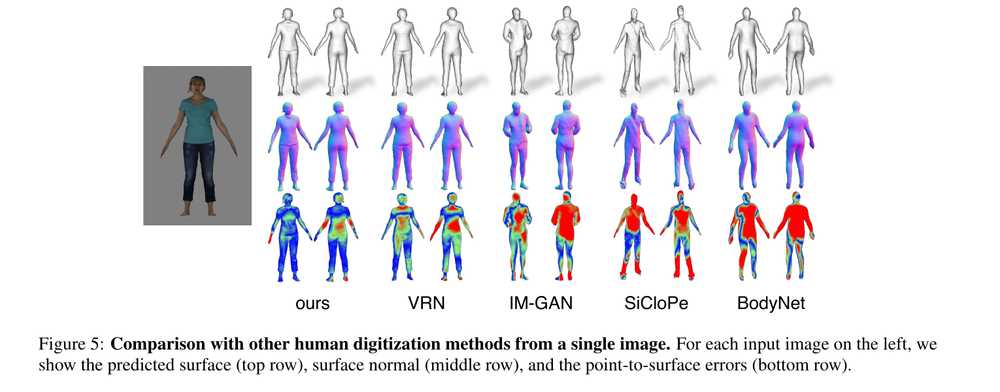
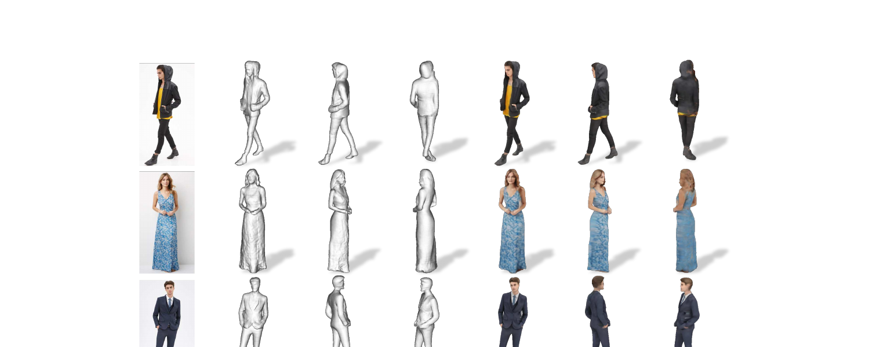
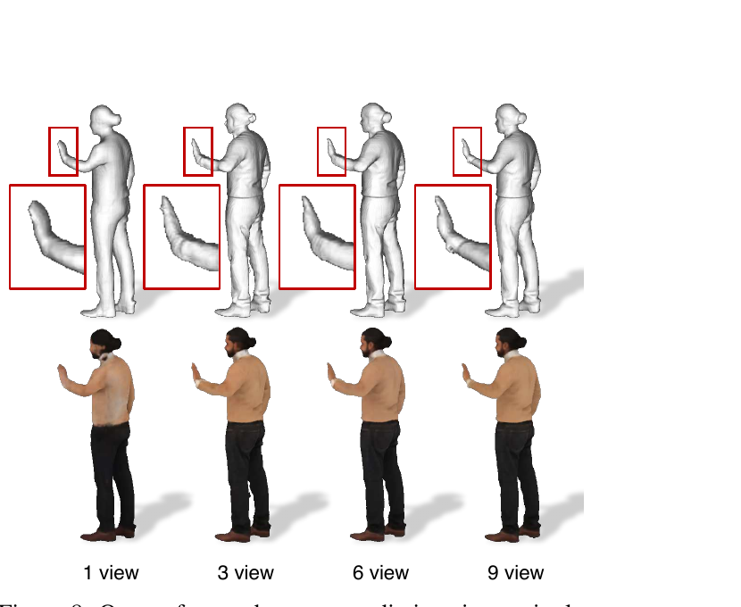

# PIFu: Pixel-Aligned Implicit Function for High-Resolution Clothed Human Digitization

**著者**: Shunsuke Saito, Zeng Huang, Ryota Natsume, Shigeo Morishima, Angjoo Kanazawa, Hao Li.  
**所属**: USC / USC ICT / Waseda University / UC Berkeley / Pinscreen.  
**出版**: ICCV 2019.  

---

## 1. 論文の目的または目標は何ですか？

服を着た人物（clothed human）を**1枚のRGB画像から、衣服のしわ・髪型・スカートやヒールなど任意のトポロジーを保ったまま、テクスチャ付き高解像度3Dメッシュとして再構成**することが目的。さらに同じ枠組みで複数枚入力にも自然に拡張できることを示す。

既存の3D表現はそれぞれ深刻な制約を抱えていた:

- **Voxel**（VRN, BodyNet等）: 全空間を離散化するためメモリ消費が立方オーダーで、高解像度の細部（しわ・髪）が出せない
- **Parametric body model**（SMPL系）: 裸の体形パラメータを推定するだけで、服やアクセサリは扱えない
- **Global feature + Implicit function**（IM-GAN, OccNet等）: 1枚の画像を1本のグローバル特徴ベクトルに圧縮するため、入力画像とピクセル単位で整合した3D形状が得られない
- **View-synthesis 型のテクスチャ推論**（SiCloPe等）: 背面画像を生成して貼り合わせる方式は投影歪みやシルエット周辺のアーティファクトが避けられない

論文の中心アイデアは、**「ピクセルに揃えた局所特徴」と「3D空間上の連続な陰関数（implicit function）」を結合**した表現 *Pixel-Aligned Implicit Function (PIFu)* の提案。これにより memory-efficient・任意トポロジー対応・ピクセル単位で入力画像と整合する3D表現が同時に得られる。

---

## 2. トピックを探求するために使用された方法またはアプローチは何ですか？

### PIFu の定式化

3D点 $X$ に対し、その2D投影 $x = \pi(X)$（弱透視カメラ）と深度 $z(X)$ を計算する。画像エンコーダ $g$ から得たピクセル位置の特徴 $F(x) = g(I(x))$（バイリニアサンプリングで連続化）を入力に、MLPベースの陰関数 $f$ が:

$$f(F(x), z(X)) = s \in \mathbb{R}$$

を出力する。$s$ は surface reconstruction なら inside/outside 確率、texture inference なら RGB値。**「グローバル特徴ではなくピクセル特徴で条件付けする」点**が、入力画像との pixel alignment を保ちながら任意トポロジーを表現できる鍵。

### パイプライン全体（Figure 2）

- **Surface PIFu (`f_v`)**: stacked hourglass エンコーダ + MLP → inside/outside の連続確率場
- **Tex-PIFu (`f_c`)**: CycleGAN 系 residual エンコーダ + MLP → RGB値
- 推論時は3D空間で確率場を密にサンプリングし、threshold 0.5 で **Marching Cubes** を適用してメッシュを抽出

### Surface 学習: Spatial Sampling 戦略

GTメッシュから3D点を**オンザフライでサンプリング**するためボクセル化が不要（ground truth は water-tight メッシュ前提、必要なら水密化）。学習で重要なサンプリング設計:

- 一様サンプルだけだと点の大半が表面から離れすぎて、ネットワークが「外側」と予測しやすくなる
- 表面のみのサンプルだと過学習する
- → **表面上の点に正規分布ノイズ N(0, σ=5cm) を加えたもの : 一様 = 16 : 1** で混合（ablationあり）

損失: 平均二乗誤差（inside/outside 0/1ターゲット）

### Texture 学習の工夫

単純に表面点上で RGB を回帰すると、テスト時の未知形状に対してテクスチャが汎化しない（形状も同時に学ぶ羽目になる）。本手法では:

1. **Surface PIFu の特徴 $F_V$ を Tex-PIFu の入力に追加**して条件付け、形状学習を分離
2. **表面法線方向に小さなオフセット $\epsilon \sim N(0, d=1\text{cm})$** を加えてサンプリング → 表面そのものでなく "表面近傍" でも色を定義可能にし、汎化を改善

損失: L1 誤差。

### Multi-View への自然な拡張（Figure 3）

陰関数を $f = f_2 \circ f_1$ に分解:

- $f_1$: 各ビュー $i$ で $\pi_i, z_i$ により対応する3D点 $X$ から特徴埋め込み $\Phi_i = f_1(F_i(x_i), z_i(X))$ を計算
- 同じ3D世界座標を共有するため、任意視点を **average pooling** で集約: $\bar{\Phi} = \text{mean}(\{\Phi_i\})$
- $f_2$: 集約済み特徴から最終的な occupancy / RGB を予測

学習時は3視点ランダム入力。推論時は1視点〜任意数の視点で動作（average pooling は単一入力でもそのまま機能）。

### データセットとベースライン

- **学習**: 著者らが構築した *High-Fidelity Clothed Human Dataset*（高品質の人体3Dスキャンデータセット、詳細はsupplementary）
- **評価**: RenderPeople・BUFF（GT 3Dスキャンを持つ評価セット、定量評価）/ DeepFashion（実画像、定性評価）
- **比較**: BodyNet (voxel), SiCloPe (back-view synthesis), IM-GAN (global implicit), VRN (voxel regression), LSM, Deep Visual Hull (multi-view)
- **指標**: Point-to-Surface (P2S, cm) / Chamfer 距離 / **Normal reprojection error**（入力視点の法線マップL2、細部の忠実さを測る独自指標）

---

## 3. 主要な結果または発見は何でしたか？

### 単一視点（Table 1, Figure 4, Figure 5）

定量評価では、Normal error で全手法を上回り（RenderPeople: ours 0.084 vs 次点VRN 0.116、BUFF: ours 0.0928 vs 次点VRN 0.130）、**BUFF では P2S 1.15 / Chamfer 1.14 と他指標も含めて全指標で SOTA**。RenderPeople では Chamfer (1.50) で SOTA、P2S (1.52) は VRN (1.42) に僅差で次点。voxel 表現の VRN とエンコーダを共有しているため、**同一エンコーダでも陰関数表現に変えるだけで細部の忠実度（Normal）が改善する**ことを著者らは表現力の差として強調している。

定性的には IM-GAN（global implicit）はピクセル整合せず、VRN は voxel の格子ノイズが残る一方、PIFu は **髪型・スカートのしわ・服のテクスチャ境界が入力画像と pixel-perfect に整合**する。

DeepFashion の実画像入力でも、ジャケット・ドレス・スカートなど多様な服飾でPIFuが頑健に動作することを定性的に示している。

### テクスチャ推論

view-synthesis ベースの SiCloPe は背面画像を貼り合わせるため、シルエット境界・自己遮蔽部分でアーティファクトが顕著。Tex-PIFu は表面上で直接 RGB を回帰するため**自己遮蔽部分や凹領域でも投影歪みなし**で360度のテクスチャを生成できる（任意トポロジー対応も同時に実現）。

### 多視点（Table 2, Figure 8）

3視点入力での比較では、**P2S と Chamfer で全指標 SOTA**（RenderPeople: 0.554/0.567、BUFF: 0.665/0.641）。Normal も BUFF（0.107）では Deep V-Hull（0.119）を上回り、RenderPeople（0.094 vs V-Hull 0.093）でも同等水準。さらに **学習時は3視点だが推論時は 1/3/6/9 視点と任意に増減でき、視点が増えると細部が単調に改善**することを Figure 8 で示している（特に手の周辺や凹領域）。

著者らは Huang et al. (Deep Visual Hull) を「z条件付けを除いた PIFu のablation」として位置付け、**深度 z による条件付けが多視点融合の精度に効いている**ことも示している。

---

## 4. 結論は何であり，なぜそれが重要なのですか？

PIFu は **「ピクセルに揃えた局所特徴 × 連続な3D陰関数」** という単純で本質的な組合せにより、(a) メモリ効率、(b) 任意トポロジー、(c) 入力画像との pixel alignment、(d) 表面再構成とテクスチャ推論の統一、(e) 単視点〜多視点の任意拡張、を**すべて同時に**達成した。

論文中で著者らが強調している貢献:

- **メモリ効率の高い表現**: voxel と異なり3D空間の体積を明示的に保持しないため、高解像度の細部（しわ・髪型）を出力できる
- **任意トポロジー対応**: 衣服・髪・小物のような topology が一意でない対象を扱える
- **Pixel-aligned な表現**: グローバル特徴依存の既存陰関数法と異なり、入力画像と pixel 単位で整合した形状を保つ
- **表面とテクスチャを統一フレームで扱える**: 同じ陰関数定義のまま codomain を二値→RGBに変えるだけで texture 推論にも適用でき、view synthesis 系（SiCloPe等）の投影アーティファクトを構造的に回避
- **単視点〜多視点に自然に拡張**: 学習時の視点数に縛られず推論時に任意数の視点を加算できる
- **動画からの動的 clothed human 復元への第一歩**: 単一RGBカメラから dynamic な clothed human を再構成できることを実証し、"a step closer toward monocular reconstructions of dynamic scenes" と位置づけている

**Future Work（論文 Discussion 節より）**:
1. テクスチャ解像度はまだ向上余地あり（GAN等の利用や入力解像度の引き上げ）
2. 単視点ではスケール因子が曖昧で事前正規化が必要、未解決
3. 学習・評価では遮蔽のない切り抜き済み被写体しか扱っておらず、occlusion・部分写りの状況には未対応

プロジェクトページ: https://shunsukesaito.github.io/PIFu/

---

## 補足メモ（論文外）

以下は論文本体には書かれていない情報を、文献的に裏付けたうえで補足する。論文本体の主張とは切り分けて読まれたい。

### 補足1: PIFu以前の「画像から3D人物を復元する」手法の系譜

PIFu (2019) 以前にも、単一画像から人物の3Dを得ようとする研究は段階的に積み重ねられていた。大きく4系統に整理できる:

**(A) パラメトリック身体モデル系（"裸の体"を当てはめる）**

- **SMPL** (Loper+, SIGGRAPH Asia 2015): 人体形状を「形状ベクトル β + ポーズベクトル θ」の低次元線形空間で表す代表的なパラメトリックモデル。以後ほぼ全ての人体3D研究の基盤
- **SMPLify** (Bogo+, ECCV 2016): 単一画像から検出した2D関節をSMPLにフィッティングする最適化手法。**最初の自動・単画像→3D体形 推定パイプライン**
- **HMR (Human Mesh Recovery)** (Kanazawa+, CVPR 2018): SMPLパラメータをCNNで end-to-end 直接推定。共著者 Angjoo Kanazawa は本論文 PIFu の共著者でもある
- 限界: SMPLは**裸の体しか表現できず**、服・髪・スカート・小物は構造的に扱えない。skin-tight な服に変位ベクトルを足す拡張（CAPE, ClothCap 系）はあったが、ドレスや長髪のような大きく逸脱するトポロジーには無力

**(B) Voxel系（離散化した3D格子で表現）**

- **BodyNet** (Varol+, ECCV 2018): 3D体形を**ボクセル占有マップ**で直接出力。template-free でスカートも表現できるのが革新だったが、**メモリ制約から128³程度**が上限で、しわや細部は出せない
- **VRN (Voxel Regression Network)** (Jackson+, ICCV 2017 → CVPR 2018拡張): 顔→体形へとvoxel回帰の流れ
- 限界: 体積表現の**メモリ消費が解像度の3乗で爆発**し、衣服のディテールに到達不能。PIFuが正面から否定した最大の競合

**(C) Multi-view / Visual Hull + 学習ハイブリッド**

- **Visual Hull** (Laurentini, 1994〜の古典): 複数視点シルエットの交差で形状を彫り出す。スタジオ環境前提・凹面が苦手
- **Deep Visual Hull** (Huang+, ECCV 2018): visual hullに学習を組み合わせて多視点から clothed human を復元
- **LSM (Learnt Stereo Machines)** (Kar+, NeurIPS 2017): differentiable unprojection で多視点から3D voxelを出力
- 限界: いずれも**3視点以上が必須**で単画像には適用不能、出力解像度も voxel の制約を受ける

**(D) View-Synthesis + Texture系**

- **SiCloPe** (Natsume+, CVPR 2019): 入力正面画像から**背面画像を生成**して、フロント+バック2枚を3Dテクスチャに貼り合わせる方式。共著者 Natsume / Saito / Morishima / Li は PIFu と重複しており、**SiCloPe の問題点（投影アーティファクト・自己遮蔽部分のテクスチャ欠落）への解として PIFu が出てきた**という直接の系譜がある
- 限界: シルエット境界での歪み、概念的に表面上のRGBを直接扱えない

**(E) Global feature + Implicit function**（同時期の3D暗黙表現の流れ）

- **OccNet** (Mescheder+ CVPR 2019), **DeepSDF** (Park+ CVPR 2019), **IM-Net/IM-GAN** (Chen & Zhang, CVPR 2019) — 3D暗黙関数表現が爆発的に流行した年。ただしこれらは**画像を1本のglobal feature**に圧縮するため、入力画像とのpixel整合は保証されない

PIFu の独自性は (E) の波を受けつつ、「**ピクセル単位の局所特徴で陰関数を条件付ける**」ことで (A)-(D) の各々の弱点を同時に解消した点にある。直接的には [DeepHuman (Zheng+, ICCV 2019)](https://openaccess.thecvf.com/content_ICCV_2019/papers/Zheng_DeepHuman_3D_Human_Reconstruction_From_a_Single_Image_ICCV_2019_paper.pdf) も同会議で似たモチベーションを提示したが、PIFu のほうが表現の汎用性で広く受容された。

### 補足2: PIFu の実応用

PIFu自体およびその直系派生は、**研究の比較baselineとしてだけでなく、商業・産業応用にも継続的に到達している**。代表的な実応用:

**研究→製品化（共著者 Hao Li の Pinscreen 経由）**

- [Pinscreen](https://www.pinscreen.com/) は Hao Li 共同創業の avatar 会社で、**PIFu の技術を base に "Avatar Neo" — 単一写真から高忠実度3Dアバターを生成するクリエータApp + Unity/Unreal SDK** を提供している
- 顧客には **Netflix, Amazon Studios, Warner Bros, Apple, Google, Adobe, DARPA** が公表されており（[fxguide記事](https://www.fxguide.com/fxfeatured/pinscreens-advanced-face-ai-neural-rendering/), [Pinscreen LinkedIn](https://www.linkedin.com/company/pinscreen)）、映画・配信向けデジタルダブル、CM、ゲーム素材などに使われている

**Volumetric Teleportation（リアルタイム遠隔会議）**

- [SIGGRAPH 2020 Real-Time Live](https://blog.siggraph.org/2020/10/were-one-step-closer-to-consumer-accessible-immersive-teleportation.html/) で、Saito 自身が筆頭の "Volumetric Human Teleportation" がデモされた。PIFuの加速版（多GPU推論 + アルゴリズム最適化）でリアルタイム化し、単一カメラの相手をホログラム的に遠隔投影
- これは Meta（旧Facebook）の Codec Avatars 系研究や、Google の Project Starline などの**消費者向けホログラム通話の流れ**に直接接続する

**ゲーム・XR・バーチャルファッション**

- [PIFuHD (Facebook AI Research, CVPR 2020)](https://github.com/facebookresearch/pifuhd): 公式実装が GitHub で広く使われ、UE/Unityプラグインや**ゲームのモブ大量生成、VTuber向けアバター作成、バーチャル試着**などのコミュニティ用途が多数
- [Awesome Digital Human リポジトリ](https://github.com/weihaox/awesome-digital-human) では PIFu 系派生が "Clothed People Digitalization" の主要手法群として整理されている

**研究の継続的派生**

- **PIFuHD** (Saito+ CVPR 2020, FacebookAI): coarse-to-fine の2段階で1024×1024入力に対応、しわ・指まで再現
- **ARCH / ARCH++** (Huang+ CVPR 2020 / ICCV 2021): canonical pose で PIFu を学習し、**アニメーション可能なアバター**を生成
- **PaMIR** (Zheng+ TPAMI 2021): SMPL prior を統合し loose clothing を安定化
- **ICON (CVPR 2022) / ECON (CVPR 2023)** (Xiu+, MPI): 法線+body prior でin-the-wild 画像でも頑健
- **TeCH / SiTH / HumanLRM 系** (2023–2024): 拡散モデルと組み合わせて未観測領域のテクスチャ生成
- **3D Gaussian Splatting系（GaussianAvatar 等, 2024–）**: 表現を陰関数からGaussianに置換し**桁違いに高速**化、ただしpixel-alignedで2D特徴を3Dに持ち上げる**設計パターン自体はPIFu由来**

**産業横断的な広がり**

- 映画VFX（Volucap, Wild Capture などのvolumetric captureパイプライン内に組み込み）
- バーチャル試着（[MDPI Virtual Try-On systematic review, 2024](https://www.mdpi.com/2076-3417/14/24/11839)）でPIFu系再構成は試着ARミラー・EC試着の重要技術
- 軍事/政府用途（DARPAがPinscreenの顧客）

要するに PIFu は「論文の引用回数が多い」だけでなく、**clothed human を扱う必要があるあらゆる商業領域（映画・XR・ゲーム・遠隔会議・eコマース）の基盤技術**として2026年時点で生きている。Saito+2019 がこれほど長く影響力を保っているのは、提案された設計（pixel-aligned + implicit + multi-view aggregation）が**表現の選択（implicit field / Gaussian / mesh）に依存しない汎用的な設計パターン**であるためだと考えられる。
