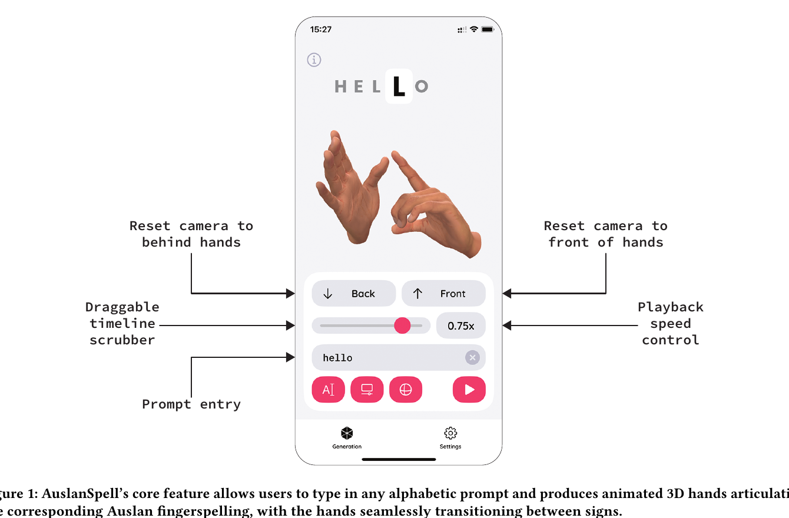
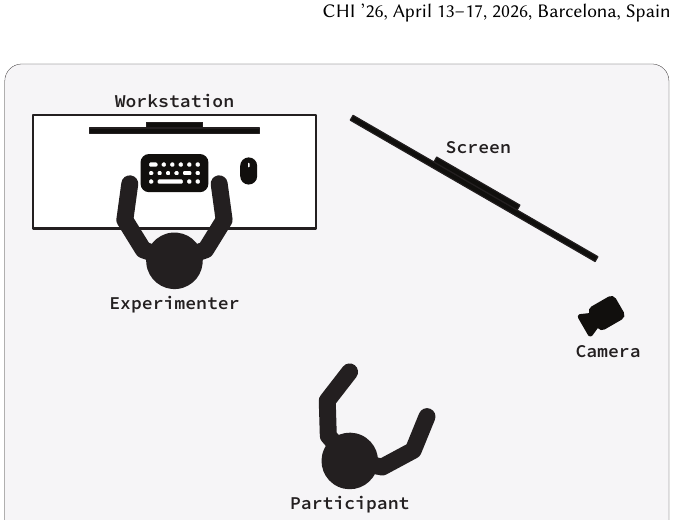
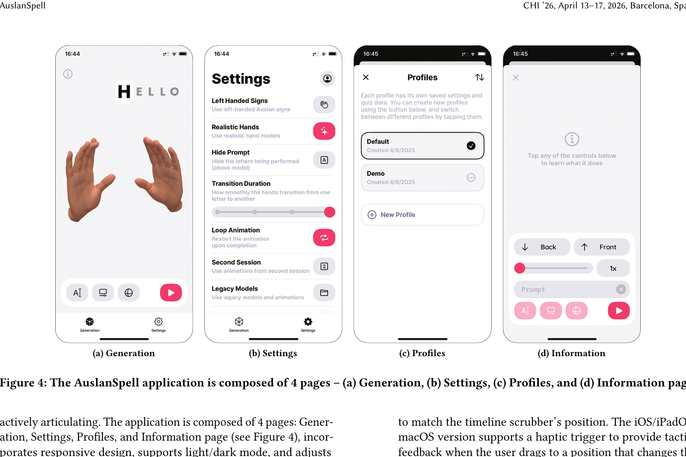
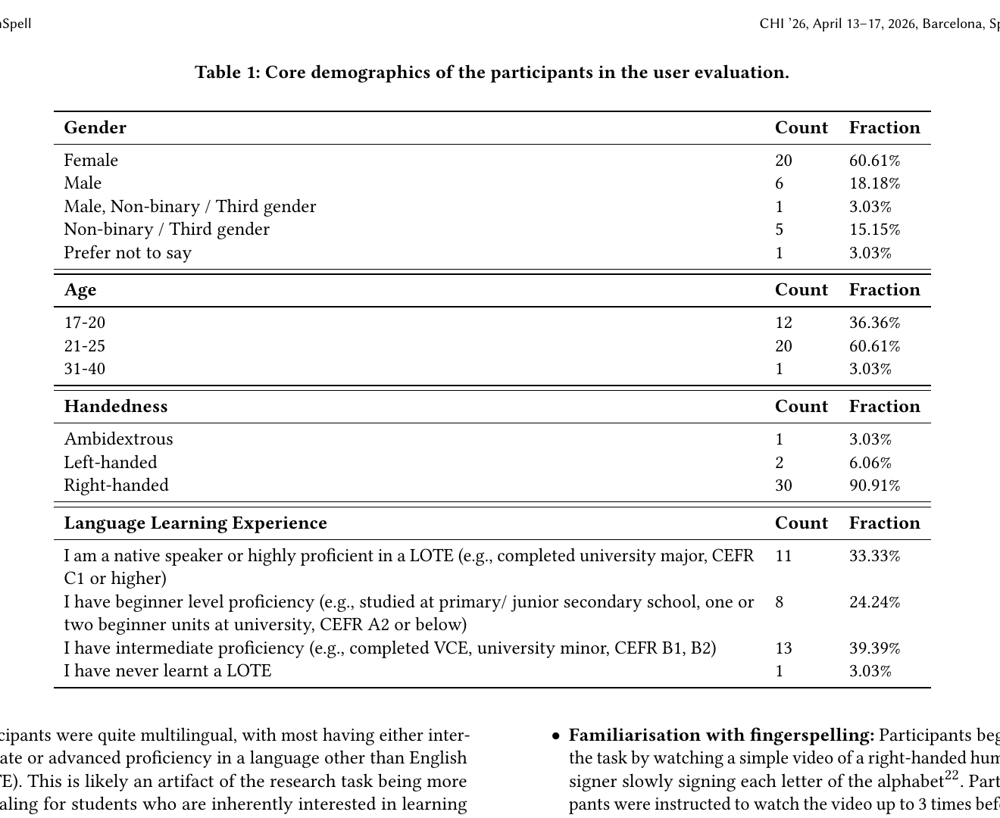
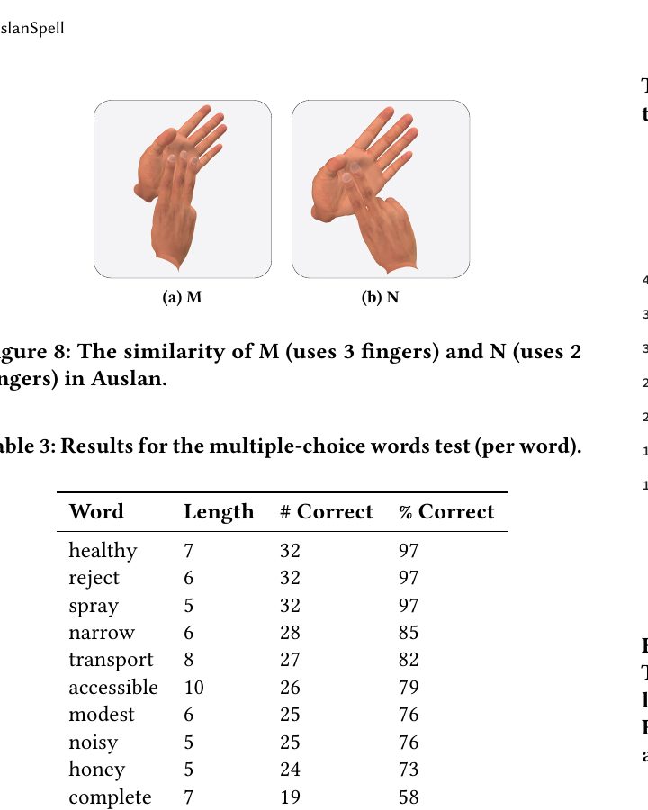
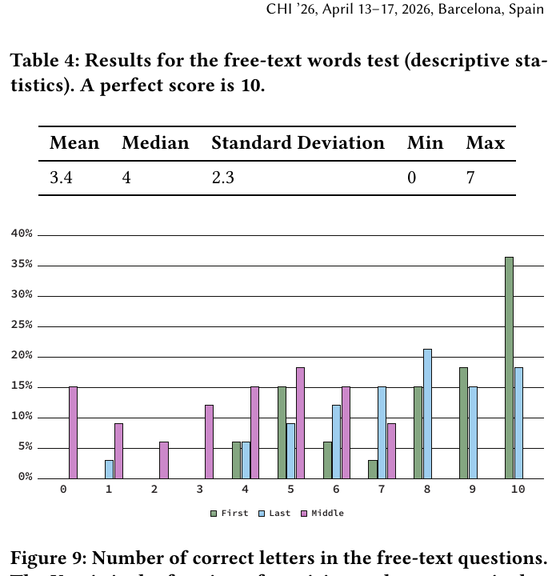
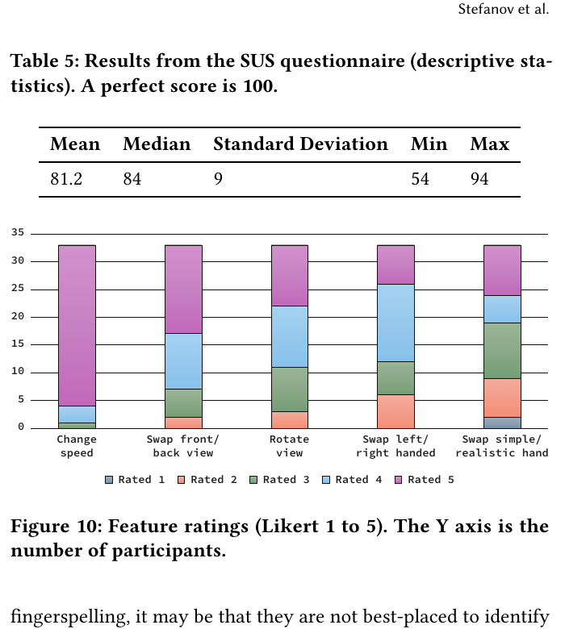

# AuslanSpell: An Interactive Technology for Improving Auslan Fingerspelling Comprehension

**著者**: Kalin Stefanov, Andre Ky Pham, Antony Smith Loose, Lucy M Robertson-Bell, Louisa Jane Vaughan Willoughby  
**所属**: Monash University, Melbourne, Australia  
**出版**: CHI '26 (ACM Conference on Human Factors in Computing Systems), April 13–17, 2026, Barcelona, Spain  
**プレゼン動画**: [YouTube](https://www.youtube.com/watch?v=qquQeZhcRYM)

---

## 1. 論文の目的または目標は何ですか？

本論文は，**オーストラリア手話 (Auslan: Australian Sign Language)** の **指文字 (fingerspelling)** の **読み取り (readback)** 学習を支援する初のインタラクティブな3Dアニメーション技術 **AuslanSpell** を提案することを目的としている．

オーストラリアでは認定Auslan通訳者が全国的に不足しており，Deaf（手話を母語とする聾者）コミュニティが教育・医療など必須サービスにアクセスできない状況が続いている．指文字はAuslanの中核要素であり，多くの語彙化サインの構成要素や，固有名詞や標準サインのない英単語の表現に用いられる．しかし指文字の読み取りは手話学習で最難関のスキルとされ，主な原因は **練習機会の不足** にある．既存のオンラインリソース（Auslan Signbankの静止画など）は，文字間の **遷移 (transitions)** や **共調音 (co-articulation)** を含む自然な指文字の動的な性質を捉えられず，速度・視点・単語の選択も固定されている．加えて，アメリカ手話（ASL）向けの資源はAuslanとアルファベット体系が完全に異なるため転用できない．

本研究の目標は，以下の3点を満たす技術基盤を構築することである：

- **任意の英文字列入力**から，対応するAuslan指文字を **3D アニメーションで生成** すること（文字間の自然な遷移を含む）
- 学習者が速度・視点・利き手・遷移時間などを自在に調整できる **完全インタラクティブ** な操作性を提供すること
- iOS/iPadOS/macOS/Web というマルチプラットフォームで **無償公開** し，Auslan学習者全体への普及を目指すこと

加えて，本技術が初学者の指文字読み取り能力を実際に向上させるかを，33名の novice signer によるユーザ評価で検証することを目的としている．

---

## 2. トピックを探求するために使用された方法またはアプローチは何ですか？

### コ・デザインプロセス

5名の経験豊かなDeaf Auslan教師（Auslanの主要教育機関とDeaf Australiaの代表を含む）と共同開発を進めた．Deafコミュニティが手話学習者向けの本物の教材として受け入れられる品質を達成するため，アプリケーションの反復ごとにDeaf共同設計者からのフィードバックを取り入れた．これは「Deaf当事者のためのDeaf技術」ではなく，**Auslanを学びたい聴者向けの fit-for-purpose アプリケーション** という位置づけを明確化するためでもある．

### AuslanSpell データセット構築

8名のDeaf署名者により31セッションを収録し，**Manus Prime 3 Mocap グローブ** （手の関節角度・指の開き具合）と **Vicon Motion Capture** （上半身の身体動作）を併用してデータを収集．スコープは英語で頻出する文字組み合わせをカバーするよう設計され，計93単語（接頭辞・接尾辞を含む単語，名前，地名）を収録．1単語あたり平均5秒のキャプチャ速度を達成．

**Post-production** では，本プロジェクトに参加する2名のDeafリサーチアシスタントが各文字アニメーションを反復的に検証し，誤りのない文字発話を保証．アプリケーションで使用されるデータサブセットは，**全26文字を左利き1名・右利き1名の計2名のDeaf署名者が各2セッションずつ収録** した構成．Manusグローブから取得したハンドシェイプデータを **Rokoko** プラグイン（Blender）で人間型リグにリターゲティングし，COLLADA (.dae) と glTF (.glb) 形式でエクスポート．データセットのこのサブセットは CC BY-NC-SA 4.0 で公開予定．

### AuslanSpell アプリケーション

iOS 15.0以上, iPadOS 15.0以上, macOS 12.0以上 (Apple M1+), Web (JS ES2016以上) に対応．アプリは4ページ構成（**Generation, Settings, Profiles, Information**）で，レスポンシブデザイン・ライト/ダークモード・端末サイズ自動調整を備える．

**Generation Page の主要機能：**
- **Prompt input**: 任意のアルファベット文字列を入力（非対応文字は自動的にサニタイズ）
- **Timeline scrubber**: アニメーション進行を任意の位置に手動移動可能
- **Speed controls**: 0.25x / 0.5x / 0.75x / 1x（録画時の速度，1.49文字/秒）/ 1.5x のプリセット
- **Reset controls**: カメラを手の前面/背面のデフォルト視点に戻す
- **3Dシーン操作**: 1本指/左クリックでオービット，2本指/右クリックで平行移動，ピンチ/スクロールでズーム

**Settings Page の主要機能：**
- 利き手切り替え（左/右）
- 写実的な手モデル と シンプルな手モデル の切替
- プロンプト表示の表示/非表示
- 遷移時間（最小：1文字ずつ独立 / 最大：シームレスにブレンド）の調整
- ループ再生のON/OFF

### 開発の3マイルストーン

1. **Minimum Viable Product (MVP)**: コア機能とiOS/iPadOS/macOS/Web実装．新しいアニメーションエンジンを設計し，文字間の単純な線形補間ではなく **滑らかなブレンド** を実現．
2. **Visual Realism and Fidelity**: 写実的な手モデル，シーンライティング（影），可変遷移時間に加え，**key intervals** という概念の導入により，各サインのコア動作（例: 親指と人差し指の接触）を確実に保持（次のサインへの遷移で接触動作がスキップされる問題を解決）．
3. **Profiles and Refinements**: 複数ユーザがデバイスを共有可能なプロファイル機能，アニメーションエンジンの全面再設計（任意位置でのスクラビング・mid-blend対応），全画面サイズへのレスポンシブ対応．

### ユーザ評価

Monash University Linguistics の学部生・院生 33名を対象に評価を実施（過去にAuslanや他の手話を学んだ経験のない novice signers）．評価セッションは1回約45分で，以下の4ステップで構成：

1. **Familiarisation**: 右利きの人間署名者によるアルファベット動画を最大3回視聴
2. **Free exploration**: AuslanSpellアプリを15分間自由に試用
3. **Fingerspelling readback test**: 20問のカスタムテスト（10問はMC選択式，10問はフリーテキスト記述）．各問題で人間署名者の動画を最大3回再生可能
4. **UX questionnaire**: 16項目のUX/人口統計質問紙（System Usability Scale含む，Cronbach's α = .76）

評価指標は，フリーテキスト問題で（1）最初の文字，（2）最後の文字，（3）中間文字，（4）単語全体の正答率に分けて記録．

---

## 3. 主要な結果または発見は何でしたか？

### 多肢選択式読み取りテスト

参加者の指文字読み取り能力は **偶然の確率（2/10）を大きく上回り**，平均8.2/10を達成した（標準偏差1.7，最小3，最大10，9名が満点）．15分のアプリ操作のみで基本的な読み取りスキルを獲得できることを示している．

単語ごとの正答率（**表3**）では，*healthy*, *reject*, *spray* で97% を達成する一方，中央の文字構成が複雑な *complete*（58%）や *honey*（73%）で低い結果となり，**中間文字の識別困難性** が明確に現れた．

### 類似サインの誤認パターン

誤回答の分析から，参加者の誤りは **ランダムではなく類似サインの混同** であることが判明．例えば *narrow* の誤答6件中5件が *marrow*（M↔N の混同），*complete* の誤答14件中12件が *compete*（L の脱落），*noisy* の誤答8件中7件が *nosey*（母音と S の順序を入れ替え）であった．*honey* の9件の誤答は全て *heavy* または *hokey* を選択しており，中間文字（特に母音）の識別困難性を再度示している．**Figure 8** に示す通り，AuslanのMサイン（3本指）とNサイン（2本指）は知覚的に区別が困難である．

### フリーテキスト読み取りテスト

書き起こし課題の平均は3.4/10（標準偏差2.3）と低く，読み取り能力が発展途上であることを示すが，初学者にとっては想定通りの難度である．**Figure 9** に示す通り，**最初の文字**（M=8.06）と **最後の文字**（M=7.39）の正答率は **中間文字**（M=3.42）を有意に上回った（paired-samples t-test: t(32)=17.56, p<.001 および t(32)=16.80, p<.001）．これは指文字における第一・最終文字の高い顕著性 (salience) を裏付ける既知の知見と整合する．

### ユーザ満足度評価

**System Usability Scale (SUS)** の平均スコアは **81.2/100**（標準偏差9，中央値84，範囲54-94）で **高い使いやすさ** を示した．特に「一貫性」（4.3）と「学習速度」（4.4）が高評価．唯一の例外は「頻繁な使用意向」（3.5）であり，参加者がアプリ自体ではなくAuslan学習者でないこと自体に起因すると著者らは推測．

機能別評価（**Figure 10**）では，**速度調整** と **視点回転** が圧倒的に高評価．アニメーションのリアリティ（平均3.9）と学習効果（平均4.1）も高く評価された．参加者からのコメントには "If a vocabulary list and quiz feature could be added in the future, this app could become the Duolingo of sign language. It's fantastic." といった肯定的な意見が多く寄せられた．

### 速度設定への意見

5段階の速度（0.25x〜1.5x）のうち，最遅 (0.37 letters/sec) については **1名のみが「速すぎる」と回答，3名のみが「遅すぎる」と回答** し，残り全員が「適切」と評価した．一方，最速 (2.23 letters/sec) については **42% が「速すぎる」** と感じた一方，**9% は「まだ遅い」** と回答．著者らは，参加者がAuslan初学者であるため，アプリの最速設定の上限を判断するに最適な立場ではない可能性を指摘し，熟練署名者でのさらなる検証で 2x を超える速度ニーズが特定される可能性を示唆している．

---

## 4. 結論は何であり，なぜそれが重要なのですか？

### 結論

本論文は，Auslan指文字読み取り学習を支援する **初の高品質3Dアニメーション・インタラクティブ技術** AuslanSpell を提案し，反復的なコ・デザインプロセスとユーザ評価を通じてその有効性を実証した．33名のnovice signerによる評価では，わずか15分の操作で：

- 多肢選択読み取りテストで偶然以上のスコア（平均82%）
- フリーテキスト読み取りで最初と最後の文字を正確に識別
- SUS 81.2の高い使いやすさと満足度

を達成し，AuslanSpellが効果的な学習補助ツールとして機能することが示された．

### 重要性

**学術的貢献：**

- **AuslanSpellデータセット**: 複数の署名者と複数のサイン版を持つ，初の公開可能な高品質3D Auslan指文字データセット．データドリブンな指文字認識・生成モデルの発展に貢献．従来のビデオデータセットと異なり，モーションキャプチャは署名者の視覚的アイデンティティを暴露せず，**プライバシー保護** にも優れる．
- **コ・デザイン手法の実例**: Angelini や de Meulder らが提唱する「手話言語技術研究におけるDeafコミュニティとの能動的協働」を具体的に実装した事例として，以後の関連研究に方法論的指針を提供．

**教育的・社会的貢献：**

- **Auslan通訳者不足の解消への寄与**: 訓練生・Deaf児童の親・後天性失聴成人など，Auslanを学びたい多様な学習者に対し，**iOS/iPadOS/macOS/Web** で無償アクセス可能な学習基盤を提供（Auslan Signbank および Apple App Store 経由で配布）．
- **Disability dongle ではない設計**: Deaf教師との共同設計を通じ，Deafコミュニティの実需要に応える教育ツールとして位置づけた点が，類似プロジェクトに対する重要な示唆となる．
- **言語多様性の尊重**: ASL中心のリソースが広く存在するなかで，アルファベット体系・両手使用・co-articulation規則がASLと完全に異なるAuslanに専用設計したことで，**マイノリティ手話言語のための技術** という新しい研究方向を切り拓いた．

**実用的貢献：**

- **オープンソース公開**: ソースコードはGitHub（monash-assistive-tech/auslan-spell-ios, auslan-spell-web）で公開予定．Web版はTypeScriptとフレームワーク非依存設計により，他のWebアプリへの統合が容易．
- **拡張可能性**: 将来的にDuolingo型のAuslan指文字コースへ拡張する計画が示されており，Profilesページはこの拡張を見越して既に実装済み．MANO・SMPL-X等のキーポイント・メッシュ表現と組み合わせた生成モデルの統合も今後の研究方向として明示．

**残された課題：**

- 現状はAuslan単独の対応であり，BSL（同じ両手アルファベット）やASL（片手アルファベット）への拡張は未実装
- 文字レベルの正確性に注力しているため，co-articulation や lexicalized fingerspelling（例: I-N-G, H-O-W）の自然な再現は今後の課題
- より多様な学習者層（TAFE学生，経験豊富な署名者，長期使用ユーザ）でのフォローアップ評価が必要

著者らは，本技術がAuslan教育の質を実質的に向上させる礎となり，最終的にDeafコミュニティのアクセシビリティ改善に貢献することを期待している．
