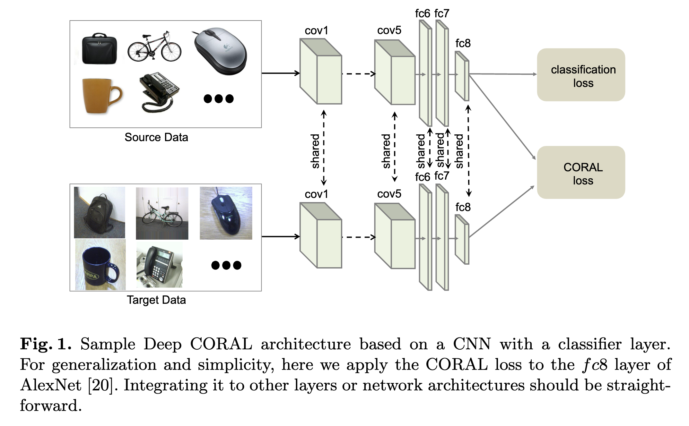
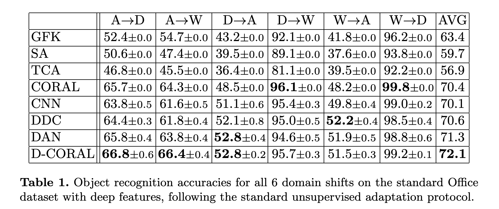
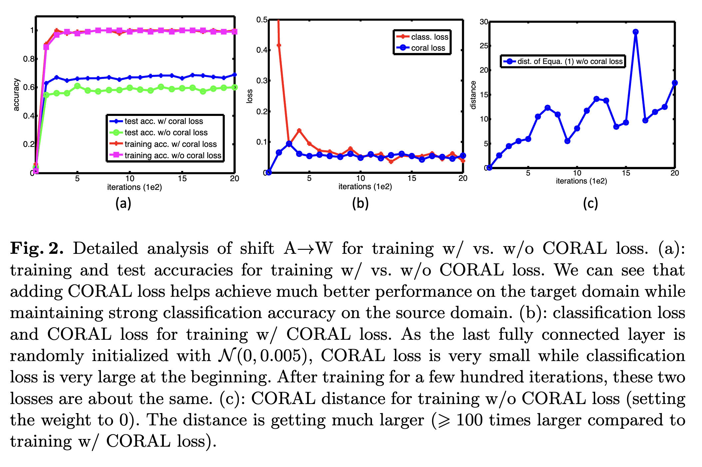

# Deep CORAL: Correlation Alignment for Deep Domain Adaptation

**著者**: Baochen Sun, Kate Saenko.  
**所属**: University of Massachusetts Lowell, Boston University.  
**出版**: arXiv preprint (cs.CV) 2016 / ECCV 2016 Workshop

---

## 1. 論文の目的または目標は何ですか？

本論文は、**教師なしドメイン適応（unsupervised domain adaptation）** を深層ニューラルネットワークの枠組みで効率的かつ end-to-end に実現することを目的としている。

機械学習の多くのアルゴリズムは訓練データとテストデータが独立同一分布（i.i.d.）であることを前提とするが、現実にはこの仮定はほとんど成り立たない。最先端の深層 CNN 特徴量であっても、Donahue らが示したように **ドメインシフト**（訓練ドメインと運用ドメインの分布のずれ）に対しては脆弱であり、性能が低下することが知られている。たとえば Amazon の白背景商品画像で訓練したモデルを Webcam で撮影された雑然とした実環境画像に適用すると精度が落ちる、という典型的な問題が生じる。

このような問題に対し、ラベル付きの新規データを毎回収集して再学習することは現実的ではない。そこで、ラベル付きの **ソースドメイン** から、ラベルなしの **ターゲットドメイン** へと知識を転移する教師なしドメイン適応手法が必要とされる。

著者らは先行研究として、ソースとターゲットの **2次統計量（共分散行列）を線形変換で揃える** という極めて単純な手法 **CORAL** を提案していた。CORAL は "frustratingly easy"（呆れるほど簡単）でありながら高精度を出すが、以下の限界があった：

- 線形変換しか扱えない
- end-to-end ではない（特徴抽出 → 変換 → SVM 学習という3段階構成）

本論文の目標は、CORAL の考え方を深層ネットワークに直接組み込み、**微分可能な CORAL 損失** を設計することで、非線形変換による分布整合と end-to-end 学習を同時に達成することである。これにより、深層 CNN の表現力を最大限活用しながら、ドメイン不変な特徴を学習することを目指す。

---

## 2. トピックを探求するために使用された方法またはアプローチは何ですか？

### Deep CORAL の概要

Deep CORAL は、CNN（本論文では AlexNet をベースに使用）の特定の層に対して、**ソースとターゲットの特徴の共分散行列の差** を測る損失項を追加し、通常の分類損失と同時に最小化する手法である。アーキテクチャは図1に示されており、ソースとターゲットそれぞれで重み共有された CNN を通し、最終層 fc8 の出力に対して CORAL 損失を計算する。

**図1**：Deep CORAL アーキテクチャ。重み共有された 2 つの CNN（AlexNet ベース）にソース・ターゲットを通し、ソース側には分類損失、両者には CORAL 損失を適用する。

### CORAL 損失の定式化

特徴次元を $d$、ソース・ターゲットの特徴行列を $D_S, D_T$、それぞれの共分散行列を $C_S, C_T$ とすると、CORAL 損失は以下で定義される：

$$
\ell_{CORAL} = \frac{1}{4d^2} \| C_S - C_T \|_F^2
$$

ここで $\| \cdot \|_F$ は行列のフロベニウスノルムである。共分散行列は標準的な不偏推定で計算され、損失は入力特徴に対して微分可能なため、誤差逆伝播でネットワーク重みまで勾配を伝えることができる。

### Joint Training（式6）

最終的な学習目的は、分類損失と CORAL 損失の重み付き和である：

$$
\ell = \ell_{CLASS.} + \sum_{i=1}^{t} \lambda_i \ell_{CORAL}
$$

- 分類損失だけだと **ソースドメインに過学習**
- CORAL 損失だけだと特徴が **退化**（全データを 1 点に潰せば自明に 0）

両者を同時最小化することで、**識別的かつドメイン不変な特徴** が学習される、というのが本手法の中核的な発想である。

### 実験設定

- **データセット**：Office データセット（Amazon, DSLR, Webcam の 3 ドメイン × 31 物体カテゴリ）
- **プロトコル**：6 通りのドメイン対（A→D, A→W, D→A, D→W, W→A, W→D）すべてで評価
- **ベースモデル**：AlexNet（ImageNet 事前学習済み）、最終層 fc8 を 31 次元に変更
- **比較手法**：CNN（適応なし）, GFK, SA, TCA, CORAL, DDC, DAN の 7 手法
- **学習設定**：バッチサイズ 128、学習率 $10^{-3}$、weight decay $5 \times 10^{-4}$、momentum 0.9
- **$\lambda$ の設定方針**：訓練終了時に分類損失と CORAL 損失がほぼ同程度の大きさになるように調整
- **実装**：Caffe（BVLC Reference CaffeNet）

---

## 3. 主要な結果または発見は何でしたか？

### Office データセットでの定量評価

6 つのドメインシフト全てにおける物体認識精度を比較した結果が表1に示されている。

**表1**：Office データセット 6 通りのドメインシフトにおける物体認識精度（%）の比較。Deep CORAL（D-CORAL）が平均 72.1% で最高性能を達成。

主な結果：

- **Deep CORAL（D-CORAL）の平均精度は 72.1%** で、比較した 7 手法すべてを上回る
- 6 つのシフトのうち **3 つで最高精度** を達成（A→D, A→W, D→A）
- 残り 3 つのシフトでも、最良ベースラインとの差は **0.7 ポイント以下** と僅差
- 元の CORAL（70.4%）から **+1.7 ポイント** の改善 → 非線形変換と end-to-end 学習の効果を実証
- 平均のみを揃える DDC（70.6%）、複数カーネル MMD を用いる DAN（71.3%）よりも高精度 → 共分散の整合がより強力

### 学習ダイナミクスの分析（A→W シフト）

著者らは A→W シフトにおける学習過程を 3 つのプロットで詳細に分析している。

**図2**：A→W シフトにおける詳細分析。(a) 訓練・テスト精度の比較、(b) 分類損失と CORAL 損失の推移、(c) CORAL 損失なしの場合のドメイン間距離の推移。

**(a) 精度の比較**：CORAL 損失あり/なしを比較すると、**ソース（訓練）精度はほぼ同等** だが、**ターゲット（テスト）精度には明確な差** が生じる。CORAL 損失を加えることで、ソースの識別性能を犠牲にせずにターゲット性能を大きく向上できる。

**(b) 損失の均衡**：fc8 が $\mathcal{N}(0, 0.005)$ で初期化されているため、学習初期は分類損失が大きく CORAL 損失が小さい。数百イテレーション後、両者はほぼ同程度に収束し、**動的な均衡（equilibrium）** に達する。

**(c) 適応なしでの距離の暴走**：CORAL 損失を入れずに通常のファインチューニングだけを行うと、式(1)で測られるソース・ターゲット間の共分散距離は **学習を進めるほど大きくなり、CORAL 損失ありの場合と比べて 100 倍以上に膨張** する。これはソースに過学習することで特徴がターゲット分布から離れていく現象を定量的に裏付けている。

### 重要な発見

CORAL 損失は学習中に単調減少するわけではないが、**重みを 0 にするとドメイン間距離が暴走** することから、CORAL 損失が「綱引きの片方の力」としてソースへの過学習を抑え、ターゲットでも有効な特徴を保持する役割を果たしていることが示された。

---

## 4. 結論は何であり，なぜそれが重要なのですか？

### 結論

本論文では、線形手法であった CORAL を深層ネットワークに拡張し、**微分可能な CORAL 損失** を設計することで end-to-end のドメイン適応を実現した。標準ベンチマーク（Office データセット）において、既存の 7 手法を上回る state-of-the-art の性能を達成し、特に元の CORAL や、平均のみを揃える DDC、多カーネル MMD を用いる DAN を上回ることを示した。

### 重要性・貢献

**1. 手法的貢献**

CORAL の「2次統計量を揃える」という直感的アイデアを、線形変換から深層ネットワークの非線形変換へと拡張した。共分散行列の差に基づく損失は微分可能であり、誤差逆伝播でネットワーク全体を一括学習できる。これにより、特徴抽出と適応を切り離していた従来のCORAL の構造的制約を解消した。

**2. 実装の容易さ**

提案手法は **既存ネットワークに 1 つの損失項を追加するだけ** で実装可能であり、特定の層やアーキテクチャに依存しない。論文中でも「fc8 への適用は一例であり、他の層や別アーキテクチャへの統合は容易」と述べられており、汎用性が高い。DAN や ReverseGrad と比較しても **最適化が単純** であることが利点である。

**3. 理論的洞察**

分類損失と CORAL 損失の同時最小化が、識別性能とドメイン不変性のあいだで動的均衡を生み出すという観察は、ドメイン適応における損失設計の指針として重要である。「適応なしでは特徴がドメイン間で乖離していく」という現象を定量的に示した点も、深層ネットワークにおけるドメインシフトの理解に貢献している。

**4. 応用上の意義**

ラベル付きデータの収集が困難な実世界応用（医療画像、自動運転、ロボティクスなど）において、教師なしドメイン適応は不可欠な技術である。本手法は実装コストが低く、既存の深層モデルに容易に組み込めるため、実用面での波及効果が大きい。実際、本論文は後続のドメイン適応研究（特にモーメントマッチング系）の基盤となり、Deep CORAL は分布整合に基づく手法の代表例として広く参照されている。