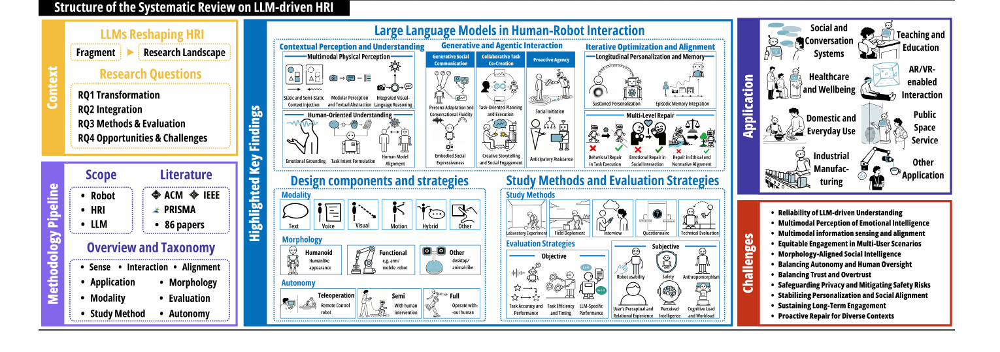
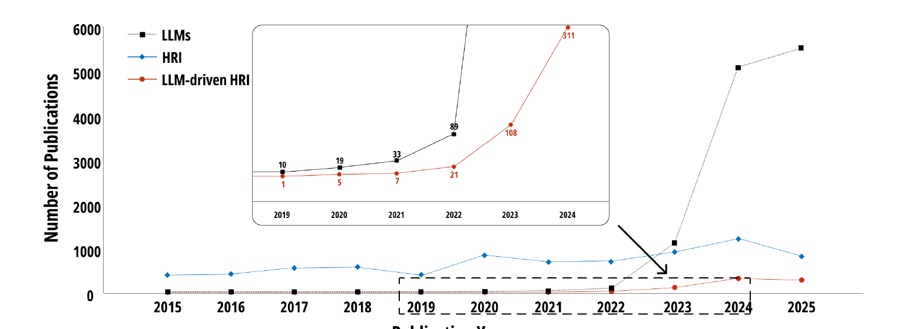
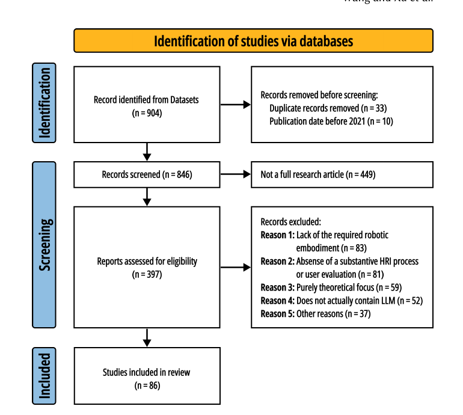
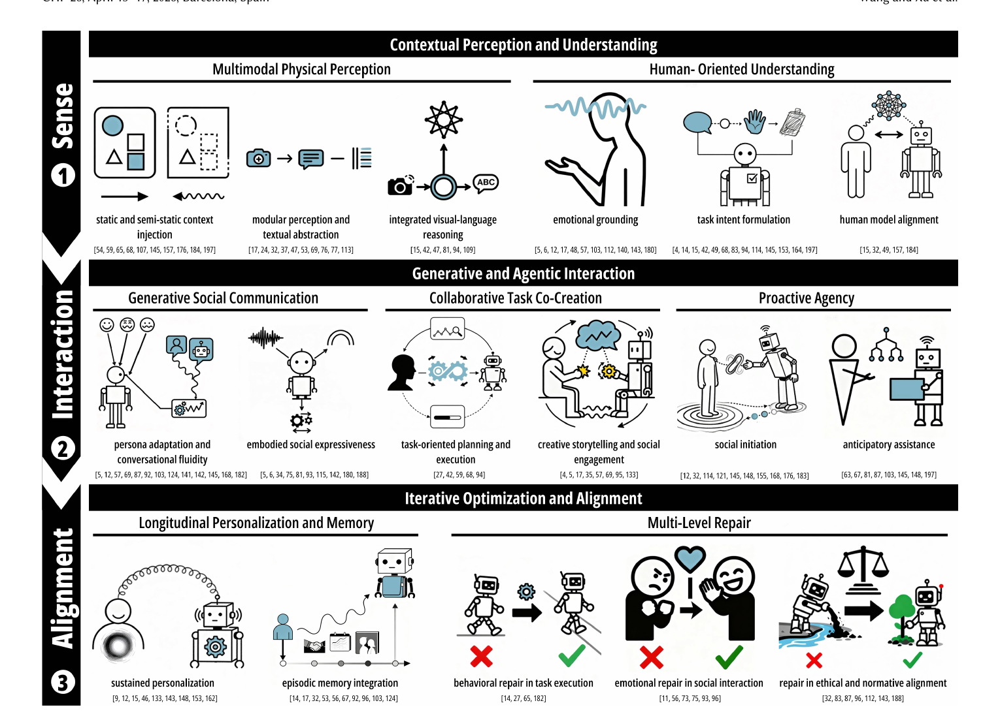
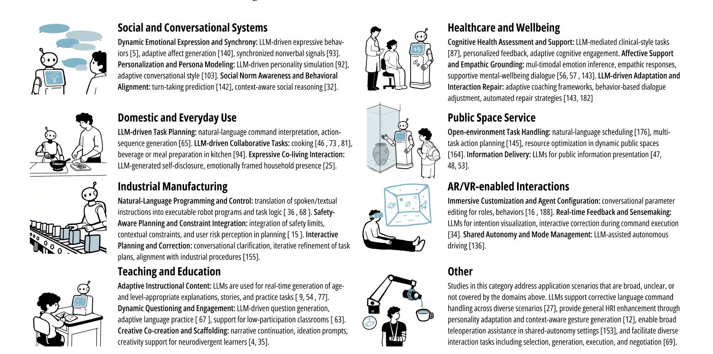

# How Do We Research Human-Robot Interaction in the Age of Large Language Models? A Systematic Review

**著者**: Yufeng Wang*, Yuan Xu*, Anastasia Nikolova, Yuxuan Wang, Jianyu Wang, Chongyang Wang†, Xin Tong†  (*: equal contribution / †: corresponding authors)
**所属**: The Hong Kong University of Science and Technology (Guangzhou), Zhejiang University, Savannah College of Art and Design, West China Hospital (Sichuan University), The Hong Kong University of Science and Technology
**出版**: CHI '26 (ACM CHI Conference on Human Factors in Computing Systems), April 13–17, 2026, Barcelona, Spain

---

## 1. 論文の目的または目標は何ですか？

<p align="center"></p>
<p align="center"><b>図1</b>: 本レビューの全体構造を可視化したビジュアルアブストラクト。Context(4 つの RQ)、Methodology Pipeline(scope / literature / overview / taxonomy)、Highlighted Key Findings(LLM の HRI 統合の 3 段階フレームワーク、設計コンポーネント、研究手法・評価戦略)、Application(8 領域)、Challenges(11 項目)が一望できる。</p>

本論文は、**LLM-driven HRI** 研究を体系的に整理した**初の PRISMA 準拠システマティックレビュー**である。2021 年から 2025 年に発表された 86 件の論文を対象に、LLM がどのように HRI を再構成しているかを統合的に明らかにすることを目的としている。

### 背景: 急増する LLM-driven HRI 研究と統合の不在

著者らは ACM Digital Library の公表トレンドを分析し、LLM-driven HRI が極めて短期間で爆発的に拡大していることを示す(図2 参照)。

<p align="center"></p>
<p align="center"><b>図2</b>: 2015–2025 年の ACM DL における LLM、HRI、LLM-driven HRI の出版件数。LLM-driven HRI は 2019 年わずか 1 件 → 2020 年 5 件 → 2021 年 7 件 → 2022 年 21 件 → 2023 年 108 件 → 2024 年 311 件(2025 年 268 件は途中集計値)と、5 年で 300 倍以上に増加した。</p>

しかし既存サーベイは、(1) 技術的潜在能力(モデル構造改良、データセット、fine-tuning パラダイム)に偏重し、(2) 人間中心観点(human-oriented understanding、user modeling、autonomy levels)が断片的に扱われ、(3) ISO 9241-210 [38, 61] のような HCD ガイドラインで橋渡しされる対象として体系化されていない。著者らは、LLM が HRI の **Sense-Plan-Act** や **Reason + Act** といった古典的パラダイム自体を書き換えつつあるという仮説のもとで、フィールド全体を**人間中心の視点**から統合する必要があると主張する。

### 4 つの研究質問 (RQ)

| RQ | 内容 | 対応セクション |
|---|---|---|
| **RQ1** | LLM はどのように HRI の foundational capabilities を変革しているか | §4 (Sense-Interaction-Alignment) |
| **RQ2** | LLM は HRI システム設計にどう統合されているか | §5 (modality / morphology / autonomy) |
| **RQ3** | LLM-driven HRI システムをどう評価すべきか | §6 (study methods / evaluation) |
| **RQ4** | 将来研究の機会と課題は何か | §7-8 (applications, challenges) |

最終的に著者らは、**Sense-Interaction-Alignment (S-I-A) フレームワーク**という新しい3段階タクソノミーを提案し、それに沿って 9 categories × 60 subcodes の構造化分析を行う。

---

## 2. トピックを探求するために使用された方法またはアプローチは何ですか？

### PRISMA 2020 ガイドラインに基づく文献検索

<p align="center"></p>
<p align="center"><b>図4</b>: PRISMA フロー図。データベース統合検索で得た 904 件から、重複と公表年 (<2021) 除外で 846 件、フルリサーチ記事に絞って 397 件、5 つの除外理由(ロボット embodiment 欠如、HRI/user evaluation 不十分、純理論、LLM 非中核、その他)で 311 件除外し、最終的に 86 件を分析対象とした。</p>

#### 検索クエリの設計
著者らは Google Scholar での予備検索で、(a) 非査読 arXiv が大量に混入、(b) "LLM" が "Master of Laws" を意味するノイズを生成、という 2 つの問題を発見した。これを受けて以下の最終クエリに精緻化:

```
("large language model" OR LLM OR ChatGPT OR GPT-3 OR GPT-4)
 AND (robot OR robotics OR "social robot" OR "humanoid robot")
 AND ("human-robot interaction" OR HRI OR "human-robot collaboration" OR HRC)
```

意図的な設計判断として:
- 「artificial intelligence」のような広範な語は HAI 文献を混入させるため除外
- Gemini や LLaMA など個別モデル名は列挙せず、特定モデルファミリーへの過適合を回避
- "social robot" "humanoid robot" を明示的に含め、HCD 視点で重要な interaction-oriented HRI を取りこぼさないようにした

#### データベース選定
ACM DL を主軸、IEEE Xplore を補完。さらに領域横断性を担保するため、**Nature, Science Robotics, International Journal of Social Robotics, Computers in Human Behavior** の 4 高インパクトベニューを追加検索した。

#### 包含・除外基準
包含: フルレングス査読論文、英語、empirical study、物理ロボットまたは VR/AR の高忠実度プロキシ、LLM がシステムの中核(言及程度ではない)、HRI 評価あり。
除外: literature review/survey、theoretical framework、技術改良のみで user interaction なし、disembodied chatbot 単独、ワークショップ・テクニカルレポート・抽象論文。

### コーディングと信頼性検証

9 categories × 60 subcodes のコードブックを構築し、2 名の主レビュアが独立にコード付与、不一致は 3 人目を加えて議論で解決。**Cohen's κ で Inter-Rater Reliability (IRR)** を測定し、すべての category で 0.684–0.904 の合意水準を達成した。

| Category | Mean IRR | 例 |
|---|---|---|
| Contextual Perception & Understanding | 0.720 | Static Context Injection / Modular Perception / Emotional Grounding / Human Model Alignment |
| Generative & Agentic Interaction | 0.796 | Persona Adaptation / Embodied Social Expressiveness / Task Planning / Social Initiation |
| Iterative Optimization & Alignment | 0.684 | Sustained Personalization / Episodic Memory / Multi-Level Repair |
| Modality | 0.768 | Text / Voice / Visuals / Motion / Hybrid / Tangible / Proximity |
| Morphology | 0.894 | Humanoid / Functional / Zoomorphic / Desktop / VR-AR |
| Autonomy | 0.846 | Full / Semi / Teleoperation |
| Methodology | 0.684 | Lab Experiment / Field Deployment / WoZ / Case Study / BodyStorming 等 |
| Evaluation Metrics | 0.832 | Task Efficiency / Accuracy / LLM-Specific / Perceptual / Anthropomorphism / Safety 等 |
| Application | 0.904 | 8 領域 |

低合意のカテゴリ (Contextual Perception, Methodology) では**校正ミーティングで操作的定義を磨き、2 回目のコーディングで合意を向上**させたという方法論的厳密さがある。

### 偽陰性チェック

スクリーニングで除外された 306 件から無作為に 100 件を再評価。3 件のみが「ボーダーライン」と特定され、うち 1 件はデータセット構築中心、2 件は実ロボット相互作用なしの video/image demonstration であったため、最終的には除外判断が妥当と確認された。

---

## 3. 主要な結果または発見は何でしたか？

### 3-1. Sense-Interaction-Alignment フレームワーク (RQ1 への回答)

<p align="center"></p>
<p align="center"><b>図6</b>: 提案する Sense-Interaction-Alignment フレームワーク。古典的な Sense-Plan-Act / Reason+Act パラダイムを embodied + 社会協調の要請に適応させた 3 段階モデル: (1) Sense でコンテキスト接地、(2) Interaction で生成的かつマルチエージェント協調、(3) Alignment で HITL を介した継続最適化。</p>

#### Sense — Contextual Perception and Understanding

LLM が **生のセンサデータを意味的に解釈**する段階。著者らは 2 つの方向を識別する。

- **Multimodal Physical Perception** (環境理解):
  - *Static / Semi-Static Context Injection*: 環境制約を手書きでシステムプロンプトに埋め込む素朴な手法(19 件)。動的環境では破綻する
  - *Modular Perception & Textual Abstraction* (32 件): YOLO/SAM のような専用視覚モジュールでオブジェクトラベル化、ARECA は温度・場所などの量的データをナラティブ表現に翻訳
  - *Integrated Visual-Language Reasoning* (16 件): VLM を直接統合し、affordance planning や real-time interaction captioning を実現

- **Human-Oriented Understanding** (社会理解):
  - *Emotional Grounding* (18 件): 表情・音声・テキストのマルチモーダル時間融合で、ノスタルジアや暗黙的後悔といったニュアンスを把握する "empathic grounding" の方向へ
  - *Task Intent Formulation* (39 件): 暗黙的な要求を明示的タスク仕様に翻訳。スケッチや身体言語からの目標推論まで拡張
  - *Human Model Alignment* (19 件): Theory-of-Mind 能力を備えた zero-shot 人間モデル化(Zhang & Soh 系列の流れ)。これにより複雑な社会動態への予測・整合が可能になる

#### Interaction — Generative and Agentic Interaction

LLM により、HRI は **コマンド-応答ループから流動的・生成的・能動的な協調**に変わる。

- **Generative Social Communication**:
  - *Persona Adaptation & Conversational Fluidity* (40 件): Big Five 等の心理特性で性格を条件付け、健康文脈向けの自己開示、皮肉や warmth の調整
  - *Embodied Social Expressiveness* (22 件): 発話 TTS と非言語キュー(頭部の頷き、視線回避、表情)を**同期**させ、empathic grounding を実現
- **Collaborative Task Co-Creation**:
  - *Task-Oriented Planning & Execution* (28 件): GenComUI による LLM 計画の事前検証、LILAC による自然言語のリアルタイム軌道修正
  - *Creative Storytelling & Social Engagement* (13 件): Jibo が子どもと発散的な物語アイデアを共創する、高齢者の認知ニーズに合わせた物語生成
- **Proactive Agency**: ロボットが「呼ばれる前に動く」段階
  - *Social Initiation* (24 件): SONAR が warm-up phase で small talk を主導する proactive social agency
  - *Anticipatory Assistance* (16 件): User personality に基づく positive state の予測、curiosity-driven exploration

#### Alignment — Iterative Optimization and Alignment

生成的相互作用は **hallucination・misalignment・drift** を必然的に含むため、**HITL の継続フィードバックループ**が必要となる。

- **Longitudinal Personalization & Memory**:
  - *Sustained Personalization* (15 件): ChatAdp が ChatGPT 生成の合成フィードバックで policy tuning を加速、LAMS は自然言語による新規ロジックの教示、VITA は性格特性に整合したユーザモデルの経時進化
  - *Episodic Memory Integration* (22 件): DSR グラフによる対話間文脈累積、二重 LLM のフィードバックループ
- **Multi-Level Repair**:
  - *Behavioral Repair in Task Execution* (13 件): LILAC 自然言語修正、UJI-Butler の人間検証、RobotGPT のシミュレーションベース修正
  - *Emotional Repair in Social Interaction* (10 件): politeness ダイナミクスを介した frustration 緩和、世代別 apology から複雑な empathic structure へ
  - *Repair in Ethical & Normative Alignment* (10 件): SONAR の形式ルールベース social appropriateness、validated interaction data を用いたオンライン norm 学習

### 3-2. 設計の3次元 (RQ2 への回答)

著者らは設計の核として **modality / morphology / autonomy** を抽出した。

- **Modality (7 種類)**: Text 53 件、Voice 71 件、Visuals 56 件、Motion 52 件、**Hybrid 53 件**、Tangible 9 件、Proximity 13 件。Hybrid (text-to-speech + 非言語動作の同期) が高度なシステムの標準形となっている。
- **Morphology**: Humanoid 39 件 (Pepper, Nao, Furhat が主)、**Functional 31 件** (TurtleBot, mobile platforms, robotic arms — task-centric)、Zoomorphic 2 件、Desktop 9 件 (Haru など)、VR/AR 5 件。
- **Autonomy**: **Full Autonomy 46 件**、Semi-Autonomy 37 件 (WoZ や online correction)、Teleoperation 3 件。Full → Semi → Teleop の順で頻度が高く、**LLM 統合はフル自律志向**を強める一方、安全クリティカル領域では Human-in-the-Loop が依然として重要。

### 3-3. 研究手法と評価戦略 (RQ3 への回答)

- **手法** (図10): Lab Experiment 58 件、**Questionnaire 70 件**、Technical Evaluation 52 件、Interview 29 件、Field Deployment 17 件、Simulation 14 件、Case Study 11 件、WoZ 8 件、Co-design workshop 6 件、BodyStorming 2 件、Think-aloud 2 件。
- **客観評価**: Task Efficiency & Timing 46 件、Task Accuracy & Performance 42 件、**LLM-Specific Performance** 30 件(predictive accuracy、生成出力の品質)。
- **主観評価**: **User's Perceptual & Relational Experience 65 件**(従来の Godspeed Likeability に加え、conversational competence、relational quality、dialogue-based interaction が新次元として加わる)、Perceived Intelligence 30 件、Anthropomorphism 19 件、Usability 31 件、**Safety 24 件**(LLM 由来の content safety, unpredictability も含む)、Cognitive Load 13 件。

注目すべきは **LLM-Specific Performance 評価**(predictive accuracy、生成品質、code generation Pylint score 等)が独立カテゴリとして登場した点で、これは従来 HRI には存在しなかった評価次元である。また Anthropomorphism は対話品質に依存する形に拡張され、conversational competence や personality consistency が新たな評価軸となった。

### 3-4. 8 つの応用領域 (RQ4 の一部)

<p align="center"></p>
<p align="center"><b>図12</b>: 8 つの応用領域と LLM 能力サブカテゴリ。各領域には LLM が提供する特徴的能力(例: Healthcare では Cognitive Health Assessment と Empathic Grounding、Industrial Manufacturing では Safety-Aware Planning など)が紐付けられている。</p>

1. **Social and Conversational Systems** (18 件): 同期非言語シグナル、persona modeling、社会規範認識
2. **Healthcare and Wellbeing** (12 件): 認知健康評価、感情支援、適応的 coaching
3. **Domestic and Everyday Use** (17 件): タスク計画、collaborative cooking、感情的 self-disclosure
4. **Public Spaces Service** (9 件): スケジューリング、マルチアクション計画、情報提供
5. **Industrial Manufacturing** (7 件): 自然言語プログラミング、安全制約統合、対話的計画修正
6. **AR/VR-enabled Interactions** (6 件): イマーシブ設定、リアルタイム feedback、shared autonomy
7. **Teaching and Education** (13 件): 適応的教材生成、動的質問生成、創造的共創
8. **Other** (4 件): 幅広いシナリオ、人格適応支援

---

## 4. 結論は何であり，なぜそれが重要なのですか？

### 11 個の Design Considerations & Challenges (RQ4 への回答)

著者らはレビュー全体から 11 個の課題を抽出し、S-I-A フレームワークの 3 区分に対応させて整理した。

#### Sense 系の課題 (1–4)
1. **Reliability of LLM-driven Understanding**: latency, inconsistency, unpredictability が表層的失敗を生み、社会的合図(ユーモアや空間推論)の解釈失敗が深層的問題を生む。多役検証や HITL は新たな複雑性を導入する
2. **Multimodal Perception of Emotional Intelligence**: prosody と onomatopoeia ("oh", "wow", "haha") への対応は進んだが、Theory-of-Mind ベースの真の感情知能は未達。**理解しているフリ**になりがちな点が縦断研究で問題化
3. **Multimodal Information Sensing and Alignment**: 言語的入力と物理的シグナル(冗談 vs 怒り顔・攻撃姿勢など)の衝突を**動的に重み付け**する cross-modal reasoning が必要。MARCER の知見では、ハイブリッドモダリティによる透明な feedback でも、繊細な social cue 差異の未解決はユーザ frustration を悪化させる。タイムスタンプ単純整列では不十分
4. **Equitable Engagement in Multi-User Scenarios**: マルチユーザ環境(café、教室、家庭)で公平な engagement を維持する課題。Skantze and Irfan [142] は、複数ユーザ環境では「ロボットに話しかけているのか相互に話しているのか」の判定が困難になることを指摘。VR で simulated emergency など倫理リスクや、ヒト-ヒト相互作用由来の implicit bias が ヒト-ロボット相互作用に持ち込まれる懸念もある

#### Interaction 系の課題 (5–8)
5. **Morphology-Aligned Social Intelligence**: 高度に流暢な言語と相対的に rudimentary な身体表現の**ミスマッチが「期待ギャップ」を生む** (Grassi et al. [49], Herath et al. [53] を引用)。さらにハルシネーションが trust rupture を、過剰な anthropomorphic 表現が uncanny valley を引き起こす
6. **Balancing Autonomy and Human Oversight**: 高粒度の end-user programming はロボットを「ツール」化し agency を減ずる。逆に socially proactive な振る舞いは意図せぬ社会的義務感をユーザに負わせる
7. **Balancing Trust and Overtrust**: LLM 流暢さがシステムの実信頼性を超える期待を喚起する。Attention Arbitration Ratio による客観的予測、apology だけでは取り戻せない「信頼破綻」の repair が課題
8. **Safeguarding Privacy and Mitigating Safety Risks**: 生データを越えた **semantic surveillance**(行動パターンの推論)、決定エンジン化による物理的リスク。reactive な prompt deletion を超える対策が必要

#### Alignment 系の課題 (9–11)
9. **Stabilizing Personalization and Social Alignment**: パーソナライズは novelty が薄れると信頼を侵食する。empathic calibration が誘発する**ロボット依存**は脆弱なユーザに害をなす
10. **Sustaining Long-Term Engagement**: SET-PAiREd など短期 deployment は roles/trust の経時変化を捉えられない。"snapshot" 観測から脱却した longitudinal validation が不足
11. **Proactive Repair for Diverse Contexts**: 反応的な repair から、対話履歴を用いた**事前的で適応的な**修復(エラー予測、grounded alternative の提案、限界の透明な説明)への移行が必要

### 限界と意義

#### 著者らが認める限界
- **学際領域カバレッジの限界**: 心理学・社会学・コミュニケーション系の研究が過小代表となった可能性。LLM-mediated 社会的相互作用や人間-機械境界を扱う研究は今後より広範に取り込む必要
- **明示的・暗黙的 LLM 使用の混在による heterogeneity**: 本レビューは LLM を「システム構成要素として明示的に使う」研究と、「実験設計のツールとして暗黙的に使う」研究の**両方を包含**した。Rosén ら [124] は GPT-3 で WoZ を置き換え人間アクターの期待を排除、Grassi ら [49] は応答変動性を増やすために LLM を活用——いずれも暗黙的使用例として含まれたが、こうした暗黙的用途は研究の中核ではなく厳密な評価を欠くため、cross-study comparability を低下させる。将来のレビューでは明示的 vs 暗黙的を区別した取り扱いが必要
- **境界線判断における解釈バイアス**: 概念的に曖昧な境界事例の扱いは著者らの解釈的立場を不可避に反映するため、他の研究者は異なる境界を設定し得る
- **LBR (Late-Breaking Reports) の意図的除外**: 厳密な archival 査読論文に絞ることで信頼性を確保したが、最先端の急速進化を取りこぼした可能性

#### 本レビューの意義

- **HRI × LLM 研究の最初の体系化**: 散発的に進む 86 件を統一的フレームワーク (S-I-A) で接続。著者らは古典的な **Sense-Plan-Act [101]** および **Reason+Act [177]** パラダイムを embodied 社会協調の要請に適応させた拡張として S-I-A を位置付けており、HCI/HRI コミュニティへの理論的貢献を主張している
- **PRISMA + 公開 DB**: 全 86 件と各メタ情報を `https://llms-hri.github.io/` で公開し、レビューの**再現性・透明性**を担保。LLM 時代のメタリサーチに求められる新しい標準を体現する
- **設計ガイドラインの基盤**: 11 challenges と 9 code categories は、新規 LLM-HRI システム設計時のチェックリストとして直接使える。本論文は Anthropomorphism 評価が**会話的能力(role-taking, 一貫した personality, 価値観の articulation)**として拡張され、Godspeed の伝統的次元(animacy, intelligence, likeability)に加えて dialogue 品質との結びつきが新たな評価軸になっていることを示した
- **応用ドメインの構造化**: 8 領域 × 各領域における LLM の固有貢献(例: Healthcare の「Cognitive Health Assessment」「Affective Support and Empathic Grounding」、Industrial Manufacturing の「Safety-Aware Planning」など)を明示。これは新規研究の位置付けに直接使えるマッピングとなっている

**本サマリ集での位置付け** (本レビュー外の補足): 同コーパスには Kim et al. 2024 (本レビューでは ref [68] として複数の modality・morphology 区分で言及) が含まれている。Kim et al. 2024 が単発実験で観察した「LLM の言語能力が非言語キューへの期待を引き上げる」という現象は、本レビュー Challenge 5「Morphology-Aligned Social Intelligence」として 86 論文規模で再観察されている形で接続する。総じて本研究は、**LLM が古典的 HRI パラダイムを書き換えつつあるという主張を、PRISMA に基づく再現可能な根拠で初めて提示した**マイルストーンと位置付けられる。
