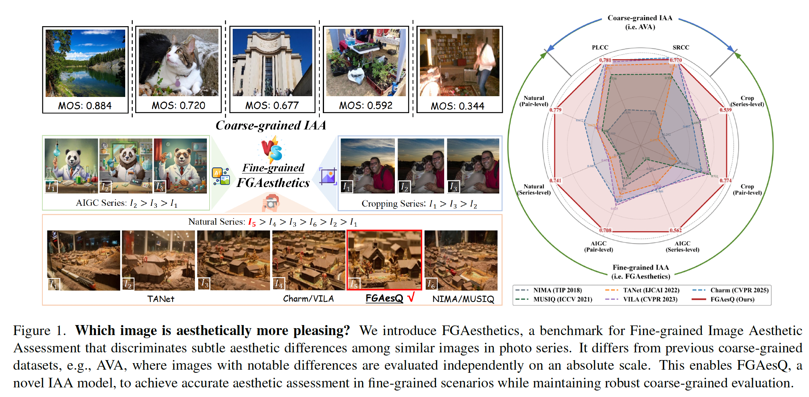
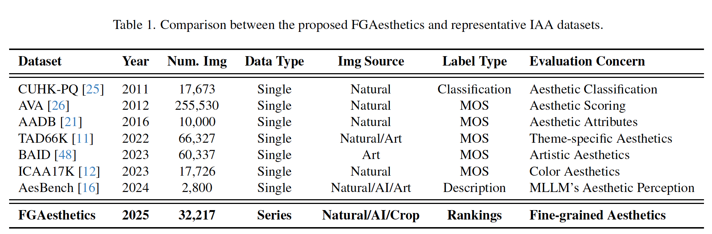
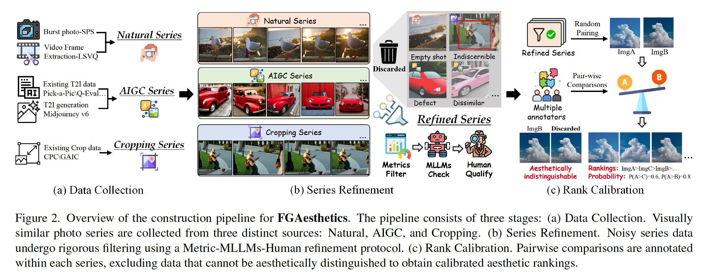
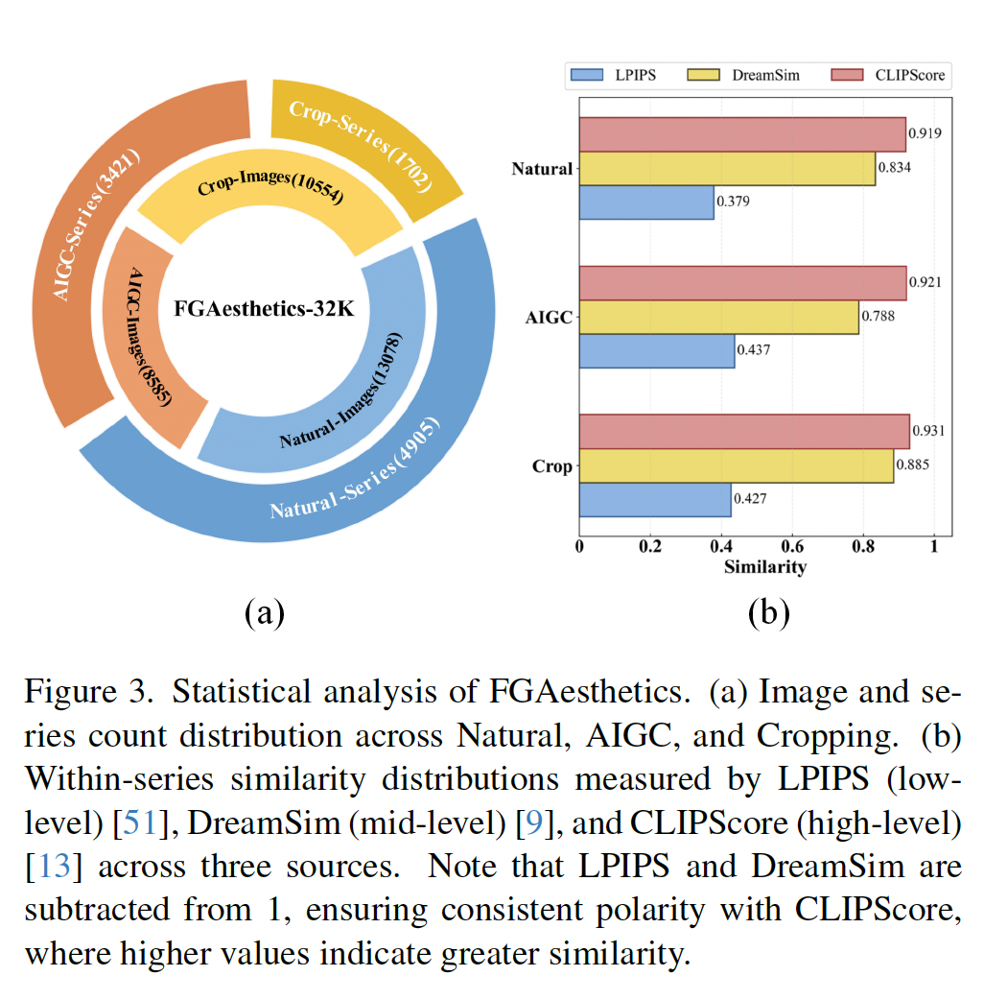
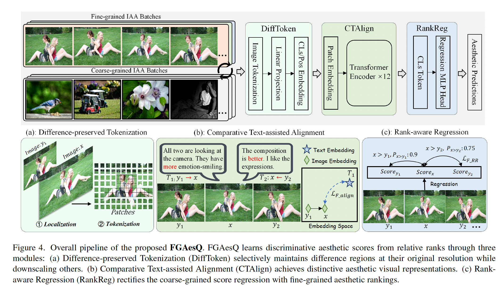
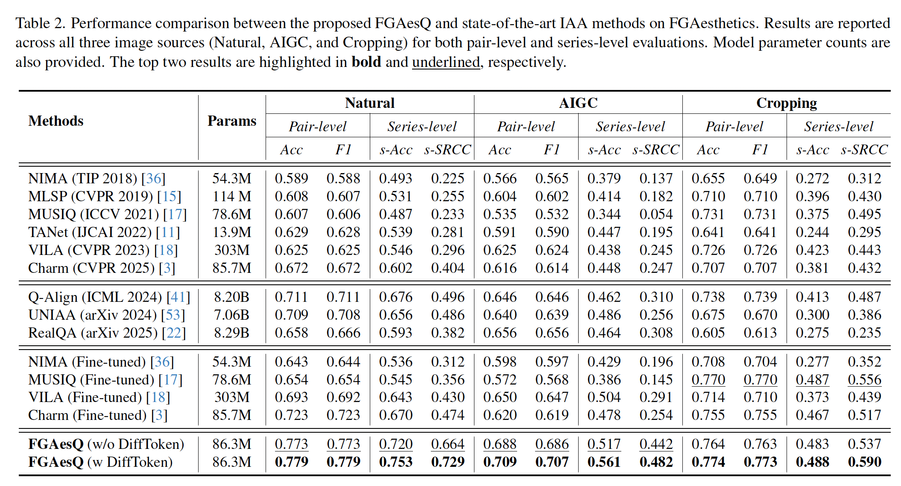
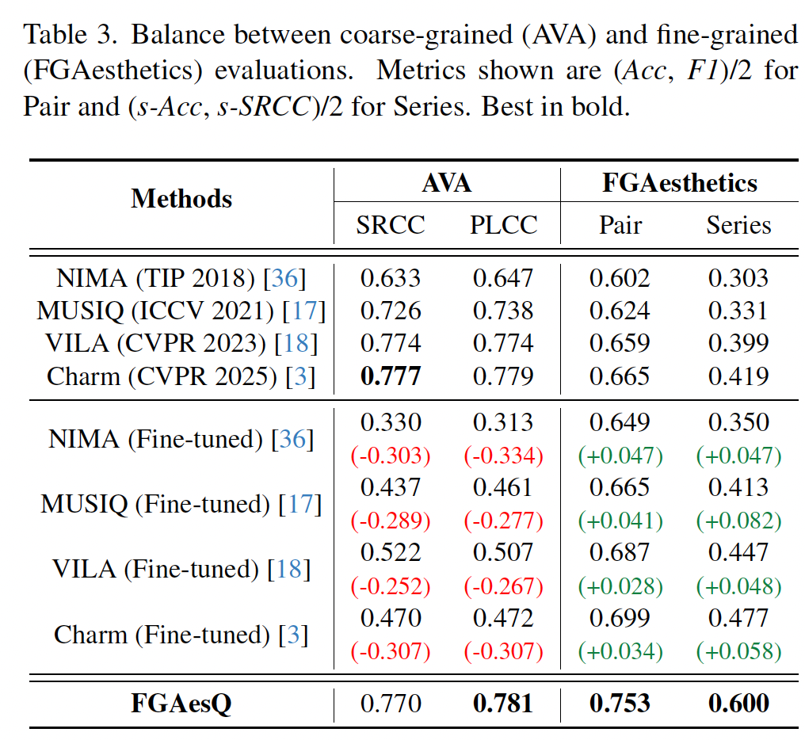
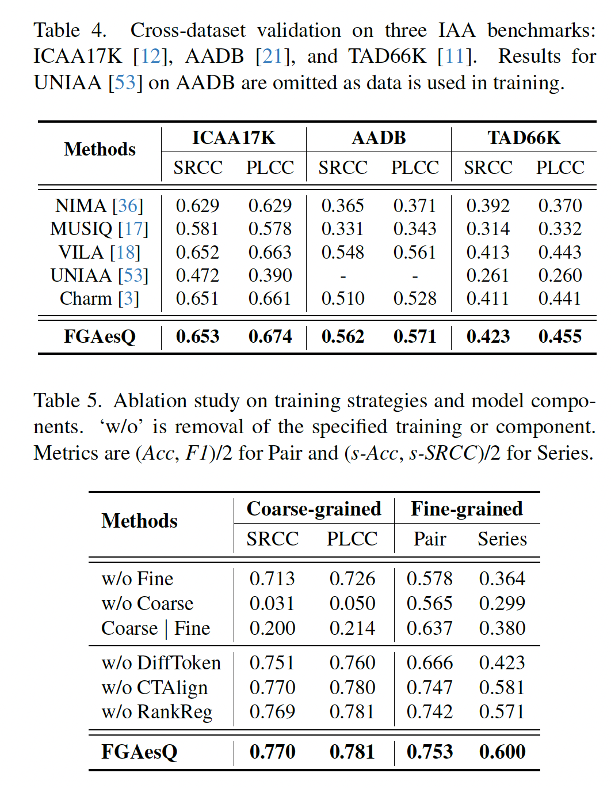
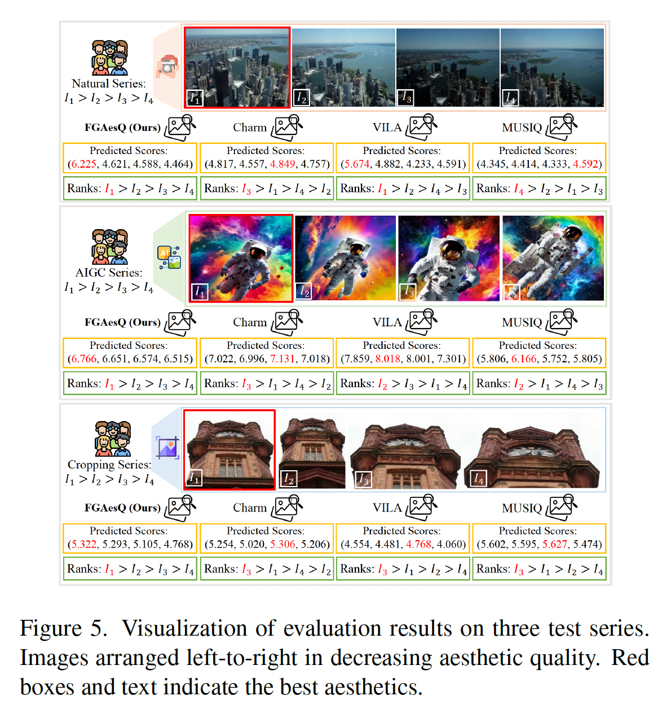

# Fine-grained Image Aesthetic Assessment: Learning Discriminative Scores from Relative Ranks

**著者**: Zhichao Yang†, Jianjie Wang†, Zhixianhe Zhang, Pangu Xie, Xiangfei Sheng, Pengfei Chen, Leida Li*  
**所属**: School of Artificial Intelligence, State Key Laboratory of EMIM, Xidian University  
**出版**: CVPR 2026

---

## 1. 論文の目的または目標は何ですか？

本論文の目的は、**Fine-grained Image Aesthetic Assessment (FG-IAA)**、すなわち「微細な美的差異を持つ類似画像群の中から、より美的に優れた画像を判別する」という新しい課題を定式化し、それを解決することである。

従来の画像美的評価(IAA)モデルは、AVAなどに代表される**粗粒度評価(coarse-grained)** を前提に設計されてきた。粗粒度評価では、明らかに美的差異がある独立した画像群を絶対スコアで評価する。しかし、現実のアプリケーション(コンテンツ制作、アルバム管理、推薦システム、連写写真からのベストショット選択など)では、**意味的にはほぼ同一だが美的に微妙に異なる画像群**から最良の1枚を選び出す必要があり、既存モデルではこの微細な判別が困難である。

FG-IAAには次の2つの本質的な課題がある:

- **Semantic Interference(意味的干渉)**: シリーズ内画像の強い意味的類似性が、微細な美的差異の抽出を妨げる。特に多くの深層モデルが意味タスクで事前学習されているため、この干渉が顕著になる。
- **Subtle Variations(微細な変動)**: わずかな色・構図変化など多様で微小な美的差異を捉えるには、頑健な識別的美的表現が必要となる。

本研究では、(1) FG-IAAのためのベンチマークデータセット **FGAesthetics** の構築、(2) 相対的ランクから識別的スコアを学習する新規モデル **FGAesQ** の提案、(3) 既存IAA手法の細粒度シナリオにおける限界の実証、を目標としている。

---

## 2. トピックを探求するために使用された方法またはアプローチは何ですか？

### 2.1 データセット構築:FGAesthetics

FGAesthetics は **32,217枚の画像を10,028シリーズに組織した**大規模ベンチマークである。データの多様性を確保するため、3つの異なるソースから収集している:

- **Natural系**: SPS(連写写真)、LSVQ(動画の連続フレーム)
- **AIGC系**: Pick-a-pic、Q-Eval-100K、NIGHTS、Midjourney v6(同一プロンプトからの生成画像群)
- **Cropping系**: CPC、GAIC(同一画像の様々なクロッピング)

構築パイプラインは Tab.1 と Fig.2 を参照。3段階で構成される:

**(a) Data Collection**: 8つの多様なソースから 106,632 枚を収集

**(b) Series Refinement**: Metrics-MLLMs-Humanの3段階フィルタリング
- Metrics: SSIM/SIFT(汎用)、IoU(Cropping)、T2Iアラインメントスコア(AIGC)
- MLLMs: Gemini-2.5-proによる文脈的妥当性チェック
- Human: 5名の専門アノテータによる最終品質確認

**(c) Rank Calibration**: 各シリーズ内の全ペア($\binom{n}{2}$ペア)について、10名の訓練済みアノテータが対比較を実施。Bradley-Terryモデルで確率を測定可能にし、合意のないペア(P≈0.5)を除外して大域的ランキングを導出。

最終的に 32,217 枚 / 10,028 シリーズ(平均4.47ペア/シリーズ)が得られた。シリーズ内類似性をLPIPS、DreamSim、CLIPScoreで定量化し、**高い意味的類似性(CLIPScore>0.91)と中程度のパッチレベル差異(LPIPS 0.379〜0.437)** を持つことを確認している(Fig.3)。

### 2.2 提案モデル:FGAesQ

FGAesQ は CLIP の ViT-B/16 をバックボーンに、粗粒度データ(AVA)で基礎的美的知覚を確立した上で、細粒度データ(FGAesthetics)で識別性を精緻化する。**相対的ランクから識別的スコアを学習する**フレームワークである(Fig.4参照)。3つの主要モジュールから構成される:

**(a) Difference-preserved Tokenization (DiffToken)**

シリーズ内画像のペア $(x, y_1)$ について、対応する32×32パッチ間のSSIM類似度を計算し、下位 $p$ パーセンタイル($p=0.5$)を「美的判断を左右する領域 $D$」として特定する。

$$D = \{(i,j) \mid s_{i,j} < \tau,\ \tau = \text{percentile}(s, p)\}$$

$D$ に含まれるパッチは標準ViTパッチサイズ(16×16)で細かく分割して詳細を保持し、残りは粗いまま縮小・ランダムドロップしてトークン数制約に収める。**重要領域に計算資源を集中させる**仕組みである。

**(b) Comparative Text-assisted Alignment (CTAlign)**

GPT-4oに人間アノテーション済みのランキング情報を与え、「far more refined」「lacks the depth」など比較的語彙を含む対比テキスト $T_1$ を生成させる。CLIPのテキストエンコーダで埋め込み、画像埋め込みの**差分ベクトル**と方向を揃える:

$$L_{F\_align} = \cos(E_v(x) - E_v(y_1),\ E_t(T_1))$$

学習時のみ使用し、推論時は画像エンコーダのみで動作する。

**(c) Rank-aware Regression (RankReg)**

回帰ヘッドが出力する絶対スコアから、Bradley-Terryモデルで優越確率を計算:

$$P_{(x \succ y_1)} = \frac{e^{\text{Score}_x}}{e^{\text{Score}_x} + e^{\text{Score}_{y_1}}}$$

シリーズ内全ペアの予測確率分布 $P'$ を、ListMLE損失で正解分布 $P$ と一致させる:

$$L_{F\_RR}(P', P) = -\sum_{j=1}^{n} \log \frac{e^{P'(r_i)}}{\sum_{j=i}^{n} e^{P'(r_j)}}$$

**絶対スコアを保ったままシリーズ内順序を較正**できる点が肝要である。

### 2.3 学習戦略

二段階学習を採用:(1) AVAでEMD損失による事前学習、(2) 粗粒度・細粒度バッチを交互に最適化する共同学習:

$$L = \delta \cdot (\lambda L_{F\_align} + L_{F\_RR}) + (1-\delta) \cdot L_{C\_EMD}$$

ここで $\delta$ は2値交互指標、$\lambda=10$ は平衡係数である。

---

## 3. 主要な結果または発見は何でしたか？

### 3.1 FGAesthetics上での性能比較

Tab.2 に主要結果を示す。Pair-level(局所識別) と Series-level(順位相関) の両方で評価:

- **既存IAAモデルは細粒度シナリオで顕著な性能劣化**を示し、特にSeries-level評価で顕著
- MLLM-based手法(Q-Align、UNIAA)は大規模パラメータの恩恵で従来手法より優位
- 入力スケール重視の手法(MUSIQ、MLSP)はCroppingデータで強い
- **FGAesQ は全評価プロトコルで最高性能**を達成
- 推論時にDiffTokenを除外した場合(参照画像不要)でも競争力を維持

### 3.2 粗粒度と細粒度のバランス

Tab.3 は両タスクのバランスを示す重要な結果である:

- 既存SOTAをランキング損失でファインチューニングすると、**AVAでSRCC/PLCCが0.25〜0.31大幅低下**(粗粒度性能の崩壊)
- **FGAesQはAVAでSRCC 0.770/PLCC 0.781を維持しつつ細粒度でも最高性能**
- これにより「相対ランクから識別的スコアを学習する」アプローチの有効性が実証された

### 3.3 クロスデータセット汎化性

Tab.4 では ICAA17K(色)、AADB(属性)、TAD66K(テーマ)の3ベンチマークで評価。FGAesQ は**全データセットで最高性能**を達成し、特にAADB(美的属性)で大きな優位性を示した。細粒度比較学習が美的属性の知覚を強化することが示唆される。

### 3.4 アブレーション研究

Tab.5(上図右側)の結果:
- **学習戦略**:Fine単独/Coarse単独/逐次学習はいずれも大幅劣化 → 二段階共同学習の必要性
- **コンポーネント**:DiffToken、CTAlign、RankRegいずれの除外も性能低下を引き起こす
- 特にCTAlign除外時のテキストの価値、RankReg除外時(=直接ランキング学習)の劣化が顕著

補足資料の追加検証:
- **バックボーン**:ViT-B/16がViT-B/32より一貫して優位(細かいパッチが微細差異検出に有利)
- **OOD汎化**:除外したカテゴリでの性能低下が最大だが、粗粒度性能は安定維持
- **DiffToken設定**:32×32 + $p=0.5$ が最適。$p$ に対して逆U字型の性能曲線を示す

### 3.5 視覚的検証

Fig.5 および補足の Fig.11 では、Natural・AIGC・Cropping各カテゴリのテストシリーズで、FGAesQ が最美的画像の識別と全体的順位予測の両方で他手法を凌駕することが視覚的に確認されている。

---

## 4. 結論は何であり,なぜそれが重要なのですか?

### 結論

本論文は **Fine-grained Image Aesthetic Assessment (FG-IAA)** という新しい課題を定式化し、3つの貢献を行った:

1. Natural・AIGC・Croppingの多様なソースを含む 32,217 枚・10,028 シリーズの大規模細粒度ベンチマーク **FGAesthetics** の構築
2. DiffToken・CTAlign・RankReg の3モジュールから成る新規IAAモデル **FGAesQ** の提案。相対ランクから識別的スコアを学習することで、細粒度・粗粒度の両シナリオで頑健に動作
3. 既存IAA手法が細粒度美的差異の捕捉に**根本的に限界**を持つことを実験的に解明

### 重要性と意義

**学術的意義**:
- 画像美的評価という長年研究されてきた分野に、「微細な差を識別する」という未開拓の重要な視点を持ち込んだ
- 「絶対スコアの維持」と「相対ランキングの精緻化」を両立する設計原則を示し、IAA研究の新たな方向性を提示
- 既存ベンチマークが粗粒度評価に偏っていた問題に対する解決策を提供

**実用的意義**:
- 連写写真からのベストショット選択、AI生成画像の品質選別、自動クロッピングなど、現実の応用シナリオに直結
- アルバム管理、コンテンツ推薦、AI生成ガイダンス、スマートフォトグラフィなど多領域への展開可能性

**今後の課題**:
- 人間アノテーションへの依存(スケーラビリティと主観的バイアスの問題)
- モデル予測の解釈性と具体的フィードバック生成(構図上の欠点指摘や改善提案など)

著者らは「FG-IAA は依然として挑戦的な課題であり、本研究がコミュニティに技術的・観点的により広い再考を促すことを期待する」と結んでいる。