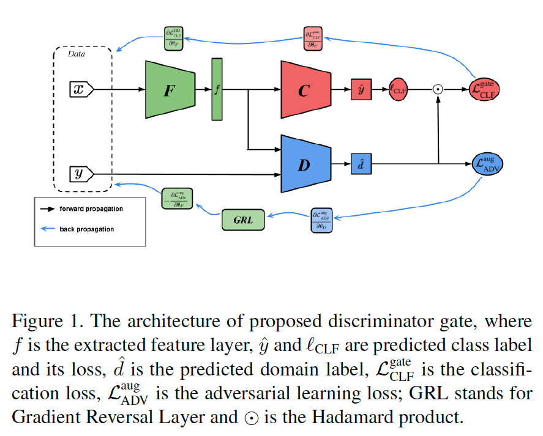
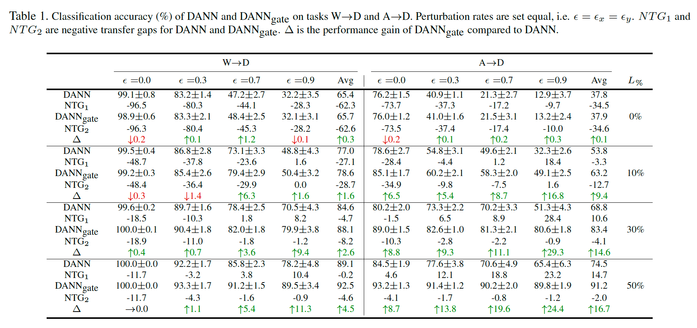
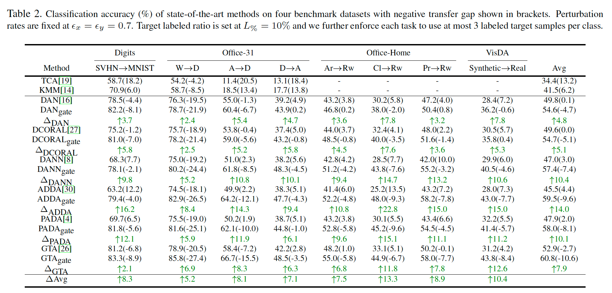
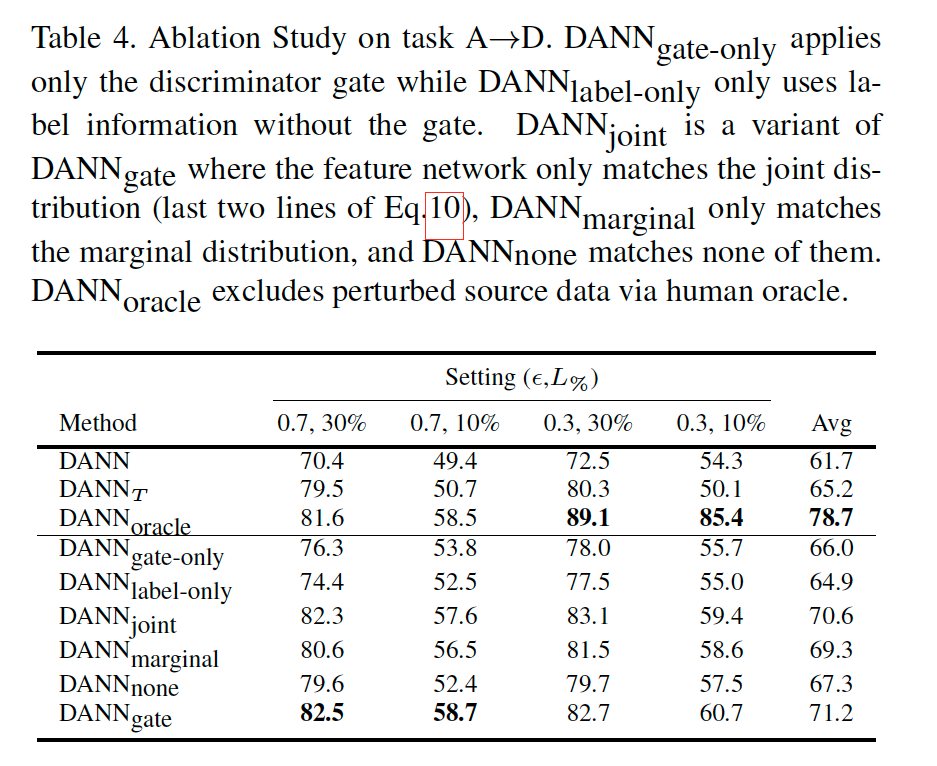
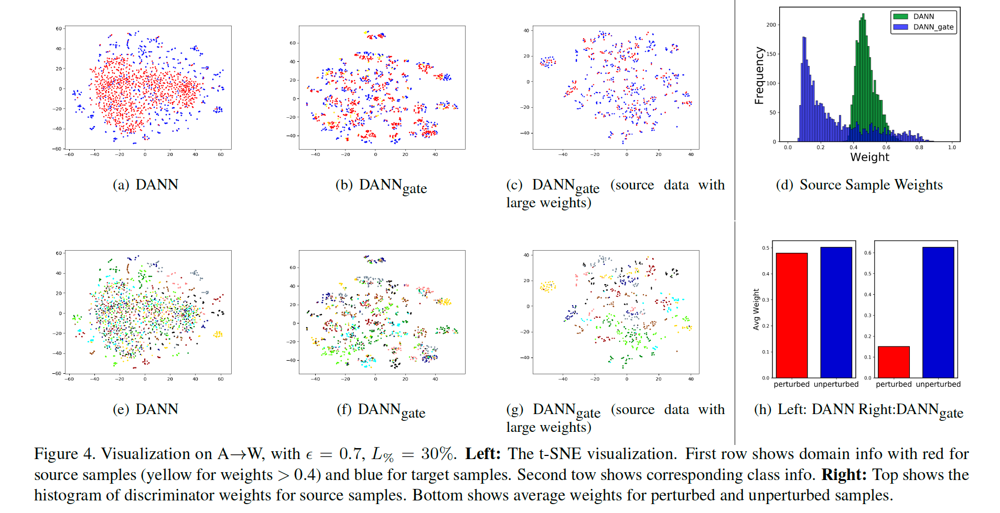

# Characterizing and Avoiding Negative Transfer

**著者**: Zirui Wang, Zihang Dai, Barnabas Póczos, Jaime Carbonell  
**所属**: Carnegie Mellon University  
**出版**: arXiv:1811.09751v4 [cs.LG] 2019

---

## 1. 論文の目的または目標は何ですか？

転移学習はラベルデータが少ないターゲットタスクに対して有効な手法だが，ソースとターゲットの分布が乖離している場合，転移によってむしろ性能が低下する**ネガティブトランスファー**が生じる．この現象は広く知られていたにもかかわらず，厳密な定義や体系的な分析が欠如していた．

本論文の目的は以下の3点である．

1. ネガティブトランスファーの**厳密な定義**を与える
2. ネガティブトランスファーを引き起こす**3つの要因を特定・分析**する
3. 有害なソースデータを自動的に除外する**Discriminator Gate**を提案し，ネガティブトランスファーを回避する

---

## 2. トピックを探求するために使用された方法またはアプローチは何ですか？

### 2.1 ネガティブトランスファーの定義

従来の直感的な説明に代わり，以下の**Negative Transfer Condition (NTC)** を定義した．

$$R_{P_T}(A(S, T)) > R_{P_T}(A(\emptyset, T))$$

すなわち，同一アルゴリズム$A$において「ソースありの場合」が「ソースなしの場合」よりも期待リスクが大きい状態をネガティブトランスファーと定義する．また，その差をNegative Transfer Gap (NTG) として定量的に測定する．

### 2.2 ネガティブトランスファーの3要因

理論分析から，ネガティブトランスファーの発生は以下の3要因に依存することを示した．

| 要因 | 内容 |
|---|---|
| Algorithm factor | アルゴリズムの種類によって頑健性が異なる |
| Divergence factor | ソース・ターゲット間の結合分布$P(X,Y)$のズレが根本原因 |
| Target factor | ラベルありターゲットデータ量によって発生しやすさが変わる |

### 2.3 Discriminator Gate

DANNをベースに，有害なソースサンプルを重み付けで除外する手法を提案した．

**重要度重み付けの理論的根拠**

教師あり学習の損失を重要度重み付きの形式に書き換えると，

$$\mathcal{L}_{\text{SUP}} = \mathbb{E}_{x,y \sim P_S}\left[\frac{P_T(x,y)}{P_S(x,y)} \cdot \ell(C(F(x)), y)\right]$$

となり，密度比$\omega = P_T(x,y)/P_S(x,y)$が自然に重みとして現れる．

**GANによる密度比推定**

GANの最適判別器$D^*$は理論的に以下を満たすことから，

$$D^*(x,y) = \frac{P_T(x,y)}{P_T(x,y) + P_S(x,y)}$$

密度比を以下のように推定できる．

$$\omega(x_s, y_s) = \text{SG}\left(\frac{D(x_s, y_s)}{1 - D(x_s, y_s)}\right)$$

**Gated分類損失と拡張敵対的損失**

<em>Figure 1: Discriminator Gateのアーキテクチャ</em>

$$\mathcal{L}^{\text{gate}}_{\text{CLF}} = \mathbb{E}_{x_l,y_l \sim T_L}[\ell] + \lambda\mathbb{E}_{x_s,y_s \sim S}[\omega(x_s,y_s)\cdot\ell]$$

判別器は周辺分布と結合分布の両方をマッチングするよう拡張され，クラスラベル情報を活用してより精度の高い重みを推定する．

### 2.4 実験設定

**データセット**：Digits（SVHN→MNIST），Office-31，Office-Home，VisDA の4種類（難易度順）

**比較手法**：TCA，KMM，DAN，DCORAL，DANN，ADDA，PADA，GTA の8手法

**制御変数**：ネガティブトランスファーの3要因を独立に検証するため，以下を人工的に操作した．

- 摂動率$\varepsilon_x$：入力画像へのノイズ付加確率（周辺分布ズレを制御）
- 摂動率$\varepsilon_y$：ラベルのランダム置換確率（条件付き分布ズレを制御）
- $L\%$：ラベルありターゲットデータの割合

---

## 3. 主要な結果または発見は何でしたか？

### 3.1 3要因の実証

<em>Table 1: 3要因（Algorithm / Divergence / Target）の制御実験結果</em>

Table 1より以下が確認された．

- **Divergence factor**：摂動率$\varepsilon$の増加に伴いNTGが増加し，高い摂動率ではNTGが正（ネガティブトランスファー発生）に転じる
- **Target factor**：同じ$\varepsilon$でも$L\%$が大きいほどNTGが大きくなり，ネガティブトランスファーが相対的に発生しやすくなる
- **Algorithm factor**：MMDベースの手法（DAN）は敵対的手法（DANN）よりNTGが小さく，アルゴリズムの種類によって頑健性が異なる

なお，Covariate Shift条件下（$\varepsilon_y=0$）では高い$\varepsilon_x$でもネガティブトランスファーが発生しないことを確認しており，**結合分布のズレが根本原因**であることを支持する結果となっている．

### 3.2 Discriminator Gateの有効性

<em>Table 2: Discriminator Gateを各手法に適用した際の精度・NTG比較</em>

Table 2より，$\varepsilon_x = \varepsilon_y = 0.7$，$L\% = 10\%$の条件下で以下が確認された．

- 提案手法（gate付き）は**全6手法・全データセットで一貫して性能向上**
- 平均精度向上は+4.8〜+14.0ポイント（手法により異なる）
- DANN（NTG=+3.0）に対しDANNgate（NTG=−7.4）と，NTGの符号が反転しネガティブトランスファーをほぼ回避
- 特にSynthetic→Realのような難易度の高いタスクで大きな改善（VisDAで最大+15.0ポイント）

### 3.3 アブレーション研究

<em>Table 4: Discriminator Gate / 結合分布マッチングのアブレーション</em>

Table 4より，Discriminator Gateと結合分布マッチングはそれぞれ単独でも有効だが，**組み合わせることで最大の効果**が得られることが示された．また，人手でノイズサンプルを除外したDANNoracleよりもDANNgateが高性能なケースがあり，これはgateが有害サンプルを完全除外するのではなく**有用な情報を保ちながら重み付けする**ためと解釈される．

### 3.4 特徴空間の可視化

<em>Figure 4: t-SNEによる特徴空間の可視化（DANN vs DANNgate）</em>

t-SNE可視化（Figure 4）より，DANNgateはDANNと比較してターゲットクラスのクラスタリングが明確に改善されており，無関係なソースサンプルに小さな重みが割り当てられていることが確認された．

---

## 4. 結論は何であり，なぜそれが重要なのですか？

### 結論

本論文はネガティブトランスファーの厳密な定義を初めて与え，その発生がアルゴリズム・分布ズレ・ターゲットデータ量の3要因に依存することを理論と実験の両面から示した．提案するDiscriminator GateはGANの判別器を用いた密度比推定によってソースサンプルを重み付けし，有害な知識の転移を自動的に抑制する．手法は既存の転移学習アルゴリズムへのプラグイン式拡張として実装可能であり，6手法・4データセットで一貫した改善を達成した．

### 学術的意義

- **問題定義の貢献**：直感的にのみ語られていたネガティブトランスファーに厳密な定義と定量的指標（NTG）を与えた点は，後続研究の基盤となる
- **理論と実験の整合性**：3要因という理論的枠組みを，制御可能な摂動率を用いた実験で直接検証した設計の厳密さが高い
- **汎用性**：手法が特定のアーキテクチャに依存せず，広範な転移学習アルゴリズムに適用可能な点が実用上の価値を高めている
- **実用的示唆**：タスク特化型モデルを設計する際，ソースデータの関連性を事前に保証できない状況（合成→実世界適応など）での信頼性向上に直接貢献する