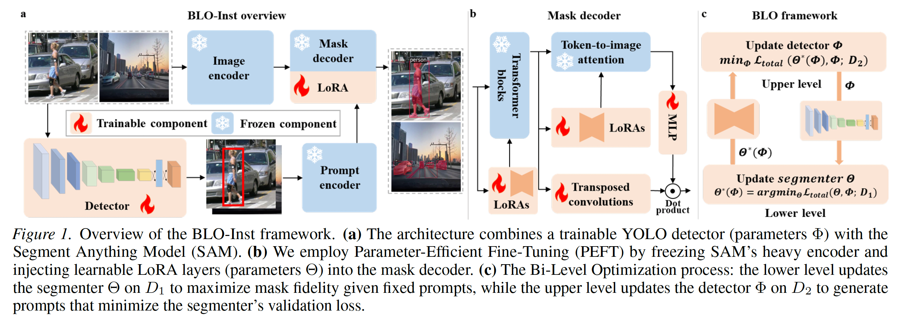
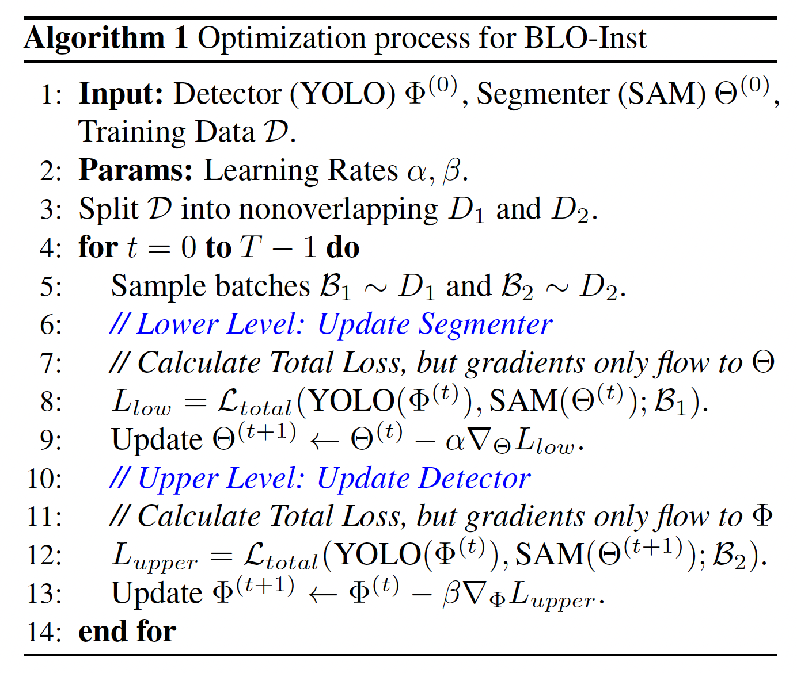
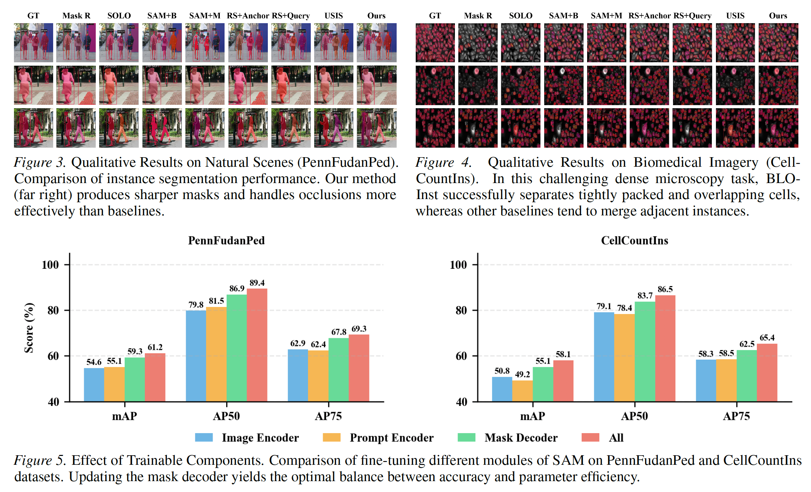

# BLO-Inst: Bi-Level Optimization Based Alignment of YOLO and SAM for Robust Instance Segmentation

**著者**: Li Zhang, Pengtao Xie  
**所属**: Electrical and Computer Engineering, University of California San Diego, CA, US  
**出版**: Preprint (arXiv:2601.22061v1) [2026年1月]

---

## 1. 論文の目的または目標は何ですか？

本論文は，**Segment Anything Model (SAM)** を用いた**自動インスタンスセグメンテーション**における2つの根本的な課題を解決することを目的としている．

SAMは11M枚の画像で学習されたゼロショット能力を持つ強力な基盤モデルだが，マスク生成にはポイントやボックスなどの**手動プロンプト**を必要とするため，完全自動化されたパイプラインへの展開が困難である．これを解決するためにオブジェクト検出器（YOLOなど）をプロンプト生成器として組み合わせる方法が一般的だが，以下の2つの限界が存在する：

- **目的の不一致 (Objective mismatch)**：検出器は幾何学的な位置特定（バウンディングボックスの正確な回帰）に最適化されているが，SAMが高品質なマスクを生成するために必要な「最適なプロンプト」とは必ずしも一致しない．例えば図2に示すように，歩行者には背景ノイズを除去するため**より小さいボックス**が必要な一方，細胞には構造を捉えるため**より大きなボックス**が必要となる．
- **アライメントの過学習 (Alignment overfitting)**：標準的な共同学習では検出器とSAMが同じデータで訓練されるため，検出器が特定の訓練サンプルに対するボックス調整を**単に記憶**してしまい，一般化可能なプロンプティング規則を学習できない．

本研究の目標は，**バイレベル最適化（BLO）** に基づく統合フレームワーク **BLO-Inst** を提案し，検出器を「動的なハイパーパラメータ」として扱うことで，これら2つの課題を同時に解決し，ロバストで一般化可能なプロンプティングポリシーを学習することである．

---

## 2. トピックを探求するために使用された方法またはアプローチは何ですか？

### BLO-Instフレームワークの概要

BLO-Instは，YOLO検出器（パラメータΦ）とSAM（パラメータΘ）を統合し，訓練データDを2つの**互いに素な部分集合 D₁ と D₂** に分割した上で，**ネストされた最適化問題**として学習を定式化する（図1参照）．

**バイレベル最適化の構造：**

- **下位レベル（セグメンテーション適応）**：検出器Φを固定し，現在のプロンプトに基づいてSAM（Θ）をD₁上でファインチューニング．目的は統合損失 *L_total* の最小化．
  
  Θ*(Φ) = arg min_Θ L_total(Θ, Φ; D₁)

- **上位レベル（プロンプトアライメント）**：ファインチューニングされたSAM Θ*(Φ)をD₂上で評価し，検出器Φを更新．目的は検出器が**未知のデータに対しても**良いプロンプトを生成するよう学習させること．
  
  Φ* = arg min_Φ L_total(Θ*(Φ), Φ; D₂)

これにより，検出器を**メタパラメータ（ハイパーパラメータ）** として扱い，検証データでの汎化性能を最大化するように訓練することで，アライメント過学習を防止する．

### パラメータ効率的なファインチューニング (PEFT)

計算コストを抑えるため，SAMの重い画像エンコーダは凍結し，マスクデコーダにのみ**LoRA層（rank=4）** を注入して学習する（図1(b)）．

### 統合目的関数

両レベルとも以下の重み付き和を用いる（詳細はAppendix A）：

L_total = λ₁L_box + λ₂L_obj + λ₃L_cls + λ₄L_seg

ここで λ₁=0.3, λ₂=0.7, λ₃=0.3, λ₄=0.7 と設定し，物体発見とマスク忠実度を優先する．

### 最適化アルゴリズム

完全な収束計算は計算量的に困難なため，Liu et al. (2018a) のDARTSに着想を得た**1ステップ勾配降下による近似**を採用（Algorithm 1）．有限差分法によりHessian-vectorプロダクトを近似し，1次最適化（α=0）と2次最適化を切り替え可能とした．

### 評価データセット

一般物体ドメインと生物医療ドメインを含む **6種のデータセット** で検証：
- **一般物体（単一クラス）**：PennFudanPed（歩行者），WheatIns（密集した小麦）
- **一般物体（複数クラス）**：TransIns（車両/車線），CarPartsIns（車両部品）
- **生物医療**：CellCountIns（細胞カウント），RWCellIns（赤血球/白血球）

### ベースライン

専門モデル（Mask R-CNN, SOLO）と自動プロンプティング手法（SAM+Mask R-CNN, SAM+Mask2Former, RSPrompter, USIS）と比較．評価指標は **mAP, AP50, AP75**．

---

## 3. 主要な結果または発見は何でしたか？

### 定量的性能の優位性

BLO-Instは**全6つのベンチマーク**で最高性能を達成した：

- **単一クラス一般物体（表1参照）**：PennFudanPedで mAP 59.3%（次点55.1%），WheatInsで mAP 68.4%（次点比 **+4.7%**）を達成．
- **複数クラス一般物体（表2参照）**：CarPartsInsで AP75 67.2%（次点RS+Queryの64.7%を大きく上回る），TransInsでも AP50 90.2% を達成．これは検出器が**クラスを識別可能なプロンプト**を生成できるようになったことを示す．
- **生物医療（表3参照）**：RWCellInsで AP50 94.6%, AP75 89.8% を達成し，自然画像と顕微鏡画像のドメインギャップを橋渡しできることを実証．

### パラメータ効率と訓練コスト

BLO-Instは **38.66Mの訓練可能パラメータ** のみで最高性能を達成し，USIS（57M）やRSPrompter（100M+）より大幅に少ない．訓練時間も **0.51 GPU時間**（PennFudanPed）と効率的．

### 質的結果

- **PennFudanPed（図3）**：BLO-Instはオクルージョン下でもシャープで一貫したマスクを生成．他の手法に見られるマスクの断片化が発生しない．
- **CellCountIns（図4）**：高密度環境でも隣接細胞の「インスタンス融合（instance merging）」を回避し，密集した細胞を高精度に分離．

### Ablation Study

- **訓練可能なコンポーネント（図5）**：マスクデコーダのみのファインチューニングが精度とパラメータ効率の最適なトレードオフ．画像エンコーダ全体を更新しても限界的な向上のみで，計算コストが激増．
- **最適化戦略（図6）**：バイレベル最適化（D₂）は単一レベル学習（D₁+D₂, 56.0% mAP）を一貫して上回り，**過学習の抑制効果**が明確に確認された．2次近似は最高性能（62.2%）だが計算コストが高いため，1次近似をデフォルトとして採用．
- **データ分割比（図7）**：γ=|D₁|/|D₂|=1（均等分割）が最適（59.3% mAP）．γ=4ではプロンプト生成が貧弱化（55.6%），γ=0.25ではドメイン適応が不十分となる．
- **End-to-End vs 分離訓練（図8）**：エンドツーエンドの共同最適化が分離訓練より **+6.2% mAP** 改善．これは検出器が「単に物体を検出する」のではなく「SAM向けに最適なプロンプトを生成する方法」を学習していることを示す．

---

## 4. 結論は何であり，なぜそれが重要なのですか？

本論文は，**バイレベル最適化に基づく検出器とSAMのアライメント手法 BLO-Inst** を提案し，自動インスタンスセグメンテーションパイプラインの **目的の不一致** および **アライメント過学習** という根本的課題を解決した．プロンプト生成器（YOLO）を「学習可能なハイパーパラメータ」として定式化し，SAMの**検証性能を最大化する**よう最適化することで，検出器とセグメンタの間に協調的なフィードバックループを確立した．

**研究の意義と貢献：**

1. **方法論的革新**：バイレベル最適化を基盤モデルのプロンプトアライメントに応用するという新しいパラダイムを提示．従来のハイパーパラメータチューニングの考え方を，動的なバウンディングボックス生成に拡張した．

2. **実用的価値**：パラメータ効率（38.66M訓練可能パラメータ）と高精度（6ベンチマーク全てでSOTA）を両立し，専門モデルや既存の自動プロンプティング手法を凌駕．訓練コストも低く，現実的な展開が可能．

3. **ドメイン汎用性**：自動運転や農業から生物医療顕微鏡まで幅広い領域で有効性を実証．特に生物医療分野（顕微鏡画像）への適応性は，自動診断や細胞カウントなど社会的インパクトの大きい応用への道を開く．

4. **持続可能なAI**：基盤モデル全体を再訓練せず，軽量なLoRAと検出器のみを更新することで，**エネルギー消費を削減**し持続可能なAI開発に貢献．

5. **将来研究への示唆**：基盤モデルを下流タスクへ適応させる際の堅牢なパラダイムとしてバイレベル最適化を確立し，自動プロンプト学習の今後の研究方向性を示した．

著者らは社会的影響として，本技術が監視技術にも応用され得ることを認めつつ，主要な貢献は基盤モデルのより効率的・的確な活用を可能にすることにあると述べている．